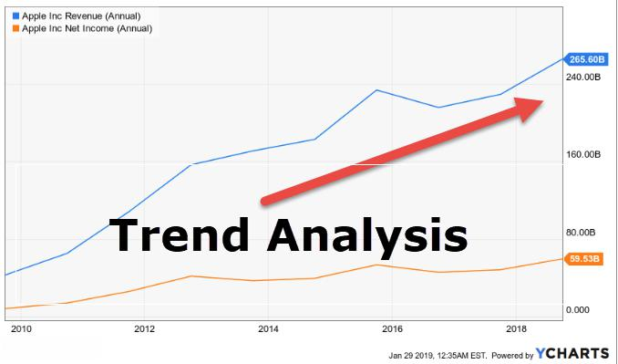

Algorithmic trading, commonly known as algo trading, relies on sophisticated computer programs to execute trades according to specific, pre-defined parameters. This technological approach is redefining financial markets by enhancing the precision and efficiency of trade executions.

Algo trading focuses on identifying and leveraging patterns and trends within the market to make strategic trading decisions. These patterns and trends are instrumental in predicting future market movements. The careful analysis of historical data enables traders to forecast potential price changes, thus identifying market opportunities that can be automated for optimal execution. Algorithmic strategies play a vital role in helping traders navigate these opportunities by employing methods ranging from trend following to statistical arbitrage.



The importance of understanding these patterns and trends cannot be overstated for traders. Both novice and experienced traders can benefit from these insights, allowing for more informed decision-making processes in the constantly evolving landscape of financial markets. By integrating these analytical methods, traders can develop diverse trading strategies tailored to their objectives and market conditions.

Incorporating these algorithmic elements into trading strategies enables precise execution and offers the potential for increased profitability. As a result, algorithmic trading is an essential tool for modern traders aiming to optimize their performance and capitalize on market opportunities in an automated and efficient manner.

## Table of Contents

## Patterns and Trends in Algo Trading

Patterns and trends play an essential role in algorithmic trading as tools for predicting future market movements. These elements, rooted in technical analysis, are leveraged to forecast potential price changes by analyzing historical data. Understanding these components is crucial for traders employing algorithmic strategies to take advantage of market trends and price patterns.

A trend in trading is defined as the general movement direction of a market or a security's price. Trends can be upward (bullish), downward (bearish), or sideways (neutral), and they form the basis for trend-following strategies. These strategies aim to capitalize on the continuation of a market's direction, employing algorithms to systematically buy in an uptrend or sell short in a downtrend. Traders often utilize moving averages, such as the simple moving average (SMA) or the exponential moving average (EMA), to identify these trends. For example, a basic Python implementation using pandas for calculating a moving average might look like this:

```python
import pandas as pd

# Assume 'data' is a pandas DataFrame containing historical price data with a 'Close' column
data['SMA_20'] = data['Close'].rolling(window=20).mean()
data['EMA_20'] = data['Close'].ewm(span=20, adjust=False).mean()
```

Patterns, conversely, refer to recurring formations on price charts that often signal potential reversals or continuations. Recognizable patterns include head and shoulders, double tops and bottoms, and flags, among others. When algorithms detect these formations, they can swiftly execute trades, optimizing timing and precision. These patterns are identified using technical indicators like the Relative Strength Index (RSI) or the Moving Average Convergence Divergence (MACD).

Technical indicators and algorithms automate the detection of both patterns and trends. Advanced algorithms might employ [machine learning](/wiki/machine-learning) techniques to discern more complex patterns within market data, offering predictive insights that are not immediately evident through traditional methods. For example, pattern recognition in stock prices can be enhanced using classification algorithms such as support vector machines (SVM) or neural networks.

Understanding the differences between trends and patterns and their respective roles enables traders to develop more effective trading strategies. Trends help in gauging market [momentum](/wiki/momentum), while patterns provide insight into possible future movements based on past behaviors. By leveraging these elements, algorithmic traders can both anticipate shifts in market direction and identify opportune moments for trade execution, thereby enhancing strategy optimization.

## Common Algorithmic Trading Strategies

Several [algorithmic trading](/wiki/algorithmic-trading) strategies are designed to harness market patterns and trends, providing traders with systematic approaches to decision-making based on predefined criteria. Here's an overview of some key strategies:

1. **Trend Following**: This strategy aims to capitalize on long-term market movements by identifying and following existing market trends. Traders who employ trend following focus on instruments exhibiting strong directional movements, anticipating that these trends will continue. The central idea is captured using moving averages or technical indicators, such as the Moving Average Convergence Divergence (MACD), to generate buy or sell signals.

2. **Momentum Trading**: In this strategy, traders seek to profit from stocks showing significant price movements. The strategy relies on the assumption that securities maintaining momentum in price will continue to move upward or downward. A momentum trading strategy often involves technical indicators such as the Relative Strength Index (RSI) or the Stochastic Oscillator, allowing traders to identify securities that are overbought or oversold.

3. **Mean Reversion**: This strategy is predicated on the belief that prices and other financial metrics eventually tend to return to their historical average or mean. The mean reversion approach involves identifying assets with prices deviating significantly from their historical average and assuming that these prices will revert back. Quantitative tools like Bollinger Bands can aid in determining when assets are over-extended, providing entry and exit points.

4. **Statistical Arbitrage**: This strategy involves complex mathematical models to identify pricing inefficiencies between related financial instruments. Statistical arbitrage relies on statistical and econometric techniques to exploit the temporary mispricing of securities. Pair trading is a common example, where a trader takes positions in two correlated securities, betting that the historical or statistical price relationship will revert to the mean.

5. **High-Frequency Trading (HFT)**: High-frequency trading leverages sophisticated algorithms and powerful computational resources to execute large volumes of orders at extremely high speeds. HFT seeks to exploit minute price discrepancies in the market by using co-location practices and low latency data feeds, evaluating numerous micro-movements in market prices in milliseconds. This strategy demands significant resources and infrastructure, often using the latest machine learning models to predict short-term market movements.

These algorithmic trading strategies illustrate the diverse methodologies traders can use, relying on technology and historical patterns to make decisions in milliseconds, optimizing their effectiveness in varying market conditions. When implementing any of these strategies, traders often use [backtesting](/wiki/backtesting) to assess and refine their approaches based on past market data, ensuring they have a robust framework for future trading.

## Differences in Algo Trading Approaches

Algorithmic trading encompasses a variety of approaches, primarily differentiated by how traders engage with patterns and trends in the market. These approaches hinge on two main strategies: trend-following and pattern recognition.

Trend-following strategies operate by identifying and capitalizing on prolonged movements in the market. This approach predicts that once a trend is established, prices are likely to continue moving in that direction. Algorithms designed for trend-following might use indicators like moving averages, which help smooth out price data, thereby making trends more discernible. For instance, a moving average crossover strategy triggers buy or sell signals when a short-term moving average crosses above or below a long-term moving average, suggesting the onset of a new trend.

Pattern recognition strategies, in contrast, focus on identifying specific formations or patterns within price charts that suggest a specific outcome. These patterns, such as head and shoulders or cup and handle, often indicate either a reversal or continuation in price movement. Algorithms for pattern recognition are typically more complex, involving intricate rule sets to detect patterns accurately. This approach requires robust backtesting to ensure the patterns identified historically align with anticipated market outcomes.

Moreover, machine learning is increasingly influencing algorithmic trading, blurring traditional boundaries between different trading strategies. Machine learning models can process vast quantities of data to detect sophisticated patterns that are not immediately apparent to human traders. By training on historical price data and other relevant variables, these models develop predictive capabilities that enhance decision-making in uncertain market conditions. For example, neural networks and decision trees can be employed to refine strategy outputs over time, adjusting to new market information as it becomes available.

Choosing between these approaches involves consideration of several factors, including current market conditions, risk tolerance, and specific trading objectives. Market conditions may favor one strategy over another. For instance, in a stable market environment with recognizable trends, trend-following might outperform pattern recognition. Conversely, in volatile markets with frequent reversals, pattern recognition methodologies could be more effective.

The adaptability of algorithmic strategies also plays a crucial role in their success. As markets and technologies evolve, so must the algorithms employed by traders. Constant evaluation and adjustment of strategies ensure they remain aligned with dynamic market conditions and achieve their intended objectives.

In conclusion, the choice of a trading strategy in algorithmic trading involves aligning strategic decisions with market realities and trader goals. By integrating machine learning and constantly optimizing strategies based on real-time data, traders enhance their ability to navigate complex financial markets successfully.

## Benefits and Challenges of Algorithmic Trading

Algorithmic trading provides significant advantages to traders and financial institutions by enhancing the execution speed and accuracy of trades. One of its primary benefits is the capability to process and analyze vast datasets efficiently, allowing for real-time decision-making that increases trading efficiency and precision. By automating trading processes, algo trading minimizes human error and exploits market opportunities that may be missed by manual trading.

However, algorithmic trading is not without its challenges. One major concern is the necessity for continuous strategy evaluation to keep pace with the ever-changing market conditions. Algorithms must be periodically reassessed and optimized to ensure that they remain effective in live markets. This dynamic nature of financial markets means that what worked in the past may not necessarily work in the future, making it crucial for traders to adjust their strategies accordingly.

Another significant challenge is the risk of overfitting. Overfitting occurs when a trading model becomes too complex, fitting its parameters too closely to historical data. Although such strategies perform exceptionally well in backtesting, they may fail to deliver expected results in real-time trading as they cannot adapt to new, unseen market conditions. To mitigate this risk, traders need to develop more generalized models and conduct robustness checks using out-of-sample data.

Understanding transaction costs and slippage is also crucial. Transaction costs include commissions and fees that can erode profit margins if not managed effectively. Slippage refers to the difference between the expected price of a trade and the actual price at which it is executed, often caused by high market [volatility](/wiki/volatility-trading-strategies) or delayed execution. These factors must be accounted for when designing and implementing algorithmic strategies to ensure that they are profitable after all incidental costs.

Backtesting and optimization play pivotal roles in the development of reliable algorithmic trading systems. By backtesting, traders can simulate their strategies against historical data to evaluate performance and tweak parameters for better outcomes. Continuous optimization ensures that these strategies remain robust and adaptive to evolving market landscapes. This involves using techniques like walk-forward optimization where the strategy is trained on historical data and tested on a subsequent out-of-sample dataset to validate its effectiveness.

Advancements in technology also enable traders to incorporate more sophisticated methods, including machine learning algorithms, which can boost predictive capabilities by recognizing complex patterns beyond the reach of traditional analytical techniques. These methods help in refining trading strategies and potentially increasing their profitability and adaptability in fast-paced financial markets. 

In conclusion, while algorithmic trading provides immense benefits by increasing efficiency and accuracy, it requires careful consideration of its inherent challenges. Successful algorithmic trading demands thorough understanding and management of strategy evaluation, overfitting risks, transaction costs, and continuous optimization to ensure sustained profitability and reliability in ever-evolving market environments.

## Conclusion

Algorithmic trading has significantly reshaped the trading environment through its capabilities in pattern recognition and trend analysis. As financial markets continually evolve, adapting algorithmic strategies to remain pertinent and profitable is imperative. The synergy of technical analysis with advanced computational tools equips traders to pinpoint and leverage new market opportunities effectively. By comprehending patterns, trends, and the distinct approaches in algorithmic trading, traders are better prepared to navigate the complexities of the market successfully. 

To ensure continued success, traders must engage in lifelong learning and consistently adapt as technology progresses. The integration of machine learning and [artificial intelligence](/wiki/ai-artificial-intelligence) into trading systems offers enhanced predictive capabilities, allowing traders to detect sophisticated patterns that may not be apparent through traditional methods. As a result, developing a robust understanding of these advanced technologies and their application in trading is crucial.

Moreover, the continuous refinement and backtesting of trading strategies help mitigate the risks associated with algorithmic trading. Implementing rigorous performance evaluation and adjustment protocols ensures traders can respond efficiently to changing market conditions. By doing so, they can minimize transaction costs and slippage, factors that can considerably influence the profitability of trades.

The future of algorithmic trading lies in the seamless integration of sophisticated analytics and adaptive strategies, enabling traders to stay ahead in an increasingly competitive market landscape. Embracing these technological advancements will be key to unlocking new possibilities and maintaining a competitive edge in the financial markets.

## References & Further Reading

[1]: Bergstra, J., Bardenet, R., Bengio, Y., & Kégl, B. (2011). ["Algorithms for Hyper-Parameter Optimization."](https://papers.nips.cc/paper/4443-algorithms-for-hyper-parameter-optimization) Advances in Neural Information Processing Systems 24.

[2]: ["Advances in Financial Machine Learning"](https://www.amazon.com/Advances-Financial-Machine-Learning-Marcos/dp/1119482089) by Marcos Lopez de Prado

[3]: ["Evidence-Based Technical Analysis: Applying the Scientific Method and Statistical Inference to Trading Signals"](https://www.amazon.com/Evidence-Based-Technical-Analysis-Scientific-Statistical/dp/0470008741) by David Aronson

[4]: ["Machine Learning for Algorithmic Trading"](https://github.com/stefan-jansen/machine-learning-for-trading) by Stefan Jansen

[5]: ["Quantitative Trading: How to Build Your Own Algorithmic Trading Business"](https://www.amazon.com/Quantitative-Trading-Build-Algorithmic-Business/dp/1119800064) by Ernest P. Chan