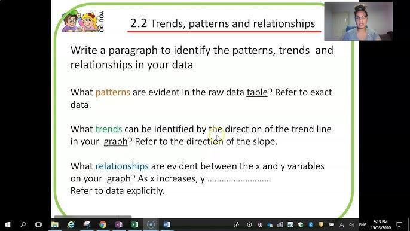

## Table of Contents

## What is a pattern?

A pattern is something that repeats in a certain way. It can be shapes, colors, numbers, or even sounds. You can see patterns in things like the tiles on a floor, the way leaves grow on a tree, or the rhythm in a song.

Patterns help us understand and predict things. For example, if you see a pattern in the weather, you can guess if it will rain tomorrow. Patterns are everywhere in nature and in things people make. They make the world around us easier to understand and enjoy.

## What is a trend?

A trend is something that becomes popular and lots of people start doing it or liking it. It can be about clothes, music, games, or anything else. For example, if many people start wearing a certain type of hat, that hat is a trend. Trends can start quickly and change often, so what is popular today might not be popular next month.

Trends can be seen in many places, like on social media, in stores, or on TV. They can start because of celebrities, new technology, or just because a lot of people think something is cool. Understanding trends can help you know what people like and what might happen next in fashion, technology, or other areas.

## Can you give examples of patterns in everyday life?

Patterns are all around us in everyday life. One common place to see patterns is in the clothes we wear. For example, a shirt might have stripes that go up and down or a dress might have flowers that repeat all over it. These patterns make the clothes look nice and help us choose what to wear. Another place to see patterns is in the tiles on a bathroom or kitchen floor. The tiles might be arranged in a square pattern or a diamond pattern, making the room look neat and organized.

Another everyday pattern is in the way we do things, like our routines. For example, every morning you might wake up, brush your teeth, eat breakfast, and then go to school or work. This is a pattern because you do the same things in the same order every day. Patterns can also be found in nature, like the way leaves grow on a tree. Some trees have leaves that grow in a spiral pattern around the branches, which helps them get more sunlight.

These examples show that patterns are everywhere, from the things we use to the way we live our lives. Noticing patterns can help us understand the world better and make our lives easier and more interesting.

## Can you provide examples of trends in different industries?

In the fashion industry, trends can change really fast. One year, everyone might be wearing bright colors and big patterns. Then, the next year, people might start wearing more plain clothes in soft colors. A recent trend has been wearing comfortable clothes, like sweatpants and hoodies, even when you're not at home. This started because more people were working from home and wanted to be comfy. Now, you see these comfy clothes in stores and on social media a lot.

In the technology industry, trends can be about new gadgets or ways to use them. A big trend right now is smart devices, like smart speakers and watches that connect to the internet. These devices can do things like play music, tell you the weather, or even turn on your lights at home. Another trend is using apps on your phone to do things like order food or pay for things without using cash. These trends make life easier and show how technology keeps changing and improving.

In the entertainment industry, trends can be about what movies, TV shows, or music people like. Right now, a big trend is watching shows on streaming services like Netflix or Disney+. People like these services because they can watch shows whenever they want, without waiting for a certain time on TV. Another trend is listening to music through apps like Spotify, where you can find new songs and make your own playlists. These trends show how people's tastes in entertainment are changing and how they like to enjoy it in new ways.

## How do patterns and trends differ in terms of duration?

Patterns tend to last longer than trends. A pattern is something that repeats over and over, like the way leaves grow on a tree or the tiles on a floor. These patterns stay the same for a long time because they are part of how things are made or how nature works. For example, the pattern of seasons - winter, spring, summer, and fall - repeats every year and has been doing so for a very long time.

Trends, on the other hand, usually don't last as long. A trend is something that becomes popular for a while but then might go away. For example, a certain type of shoe might be really popular one year, but then people might start wearing a different type of shoe the next year. Trends can change quickly because they depend on what people like at that moment, and people's tastes can change fast.

So, while patterns are more stable and last longer, trends are more like a wave that comes and goes. Patterns help us understand how things work, while trends show us what people are interested in right now.

## What role does data play in identifying patterns versus trends?

Data is really important for finding patterns. When we collect a lot of information about something, like the weather or how people use a website, we can start to see if there are any patterns. For example, if we look at the weather data for a whole year, we might see that it rains more in certain months. This helps us understand that there's a pattern to the rain. By looking at data over a long time, we can find these repeating things and use them to make predictions or understand how things work.

Data also helps us spot trends, but in a different way. Trends are about what's popular right now, so we need to look at data that's more recent. For example, if we see that more and more people are buying a certain type of phone over the last few months, that might be a trend. We can use data to see if this popularity is growing fast and if it's likely to keep going. So, while data helps us find long-lasting patterns, it also helps us see short-term changes that show us what's trending.

## How can patterns be used to predict future trends?

Patterns can help us guess what might become a trend in the future by showing us what has happened before. If we see a pattern in something, like how people start liking a certain type of music every few years, we can use that to predict when it might happen again. For example, if every five years people start wearing bright colors, we can guess that in another five years, bright colors might become popular again. This helps businesses and people plan for the future.

But, patterns aren't always perfect for predicting trends because trends can change quickly. Sometimes a new trend can start because of something unexpected, like a new movie or a famous person wearing something different. Even though patterns give us a good idea of what might happen, we need to keep watching new data to see if a trend is really starting. By using patterns and staying up to date with new information, we can make better guesses about future trends.

## What statistical methods are used to analyze patterns?

One common way to analyze patterns is by using something called time series analysis. This method looks at data over time to find repeating patterns or trends. For example, if you want to see if there's a pattern in how much it rains each month, you would use time series analysis to look at the rain data from many years. This can help you see if it usually rains more in certain months and predict what might happen in the future. Time series analysis uses special math to find these patterns, like moving averages or seasonal adjustments, which help smooth out the data and make the patterns clearer.

Another way to analyze patterns is with regression analysis. This method looks at how different things are related to each other. For example, if you want to see if there's a pattern between how much people study and their test scores, you would use regression analysis. It helps you see if studying more usually leads to higher scores. Regression analysis can show you if there's a strong pattern or if the relationship is weak. It uses math to draw a line through the data points that best shows the pattern, making it easier to understand and use for predictions.

Cluster analysis is another useful method for finding patterns. It groups similar things together based on their characteristics. For example, if you want to find patterns in how people shop, you might use cluster analysis to group people who buy similar things. This can help you see if there are different types of shoppers and what patterns they follow. Cluster analysis uses math to decide which things are most alike and groups them together, making it easier to see the patterns in the data.

## What statistical methods are used to analyze trends?

To analyze trends, one common method is trend analysis. This method looks at data over time to see if there is a clear direction or change happening. For example, if you want to see if more people are buying smartphones each year, you would use trend analysis to look at the sales data from different years. Trend analysis can use simple math, like drawing a line through the data points to show the overall direction. This helps businesses and people understand if something is becoming more or less popular and plan for the future.

Another method is regression analysis, which can also be used to analyze trends. This method looks at how different things are related to each other and if one thing changes, does the other change too? For example, if you want to see if spending more on ads leads to more sales, you would use regression analysis. It uses math to draw a line through the data points that best shows the trend, making it easier to see if there's a strong relationship between the two things. Regression analysis helps you understand if the trend is likely to continue and how strong it is.

## How do patterns and trends influence decision-making in business?

Patterns and trends help businesses make smart choices. When a business sees a pattern in what customers like or buy, they can use that information to plan what to sell or how to make their customers happy. For example, if a store sees that people buy more ice cream in the summer every year, they can make sure to have plenty of ice cream ready for those months. Patterns give businesses a clear picture of what happens over time, so they can be ready for what might come next.

Trends also play a big role in business decisions. If a business notices a trend, like more people wanting to buy eco-friendly products, they can decide to start selling those kinds of products. Trends can change quickly, so businesses need to keep an eye on what's new and popular. By understanding trends, a business can stay ahead of the competition and meet what customers want right now. Both patterns and trends help businesses make choices that can lead to more sales and happy customers.

## What are the challenges in distinguishing between short-term patterns and long-term trends?

Telling the difference between short-term patterns and long-term trends can be tricky because they can look similar at first. A short-term pattern might be something that happens for a few weeks or months, like a new dance going viral on social media. It can seem like a big deal at the time, but it might not last long. On the other hand, a long-term trend is something that keeps happening over many years, like more people using smartphones. The challenge is figuring out if something that seems popular now is just a short-term pattern or if it's the start of a long-term trend that will keep going.

Another challenge is that data can be confusing. Sometimes, short-term patterns can make it hard to see the bigger picture of long-term trends. For example, if sales of a product go up suddenly because of a holiday, that might look like the start of a trend. But if the sales drop back down after the holiday, it was probably just a short-term pattern. Businesses and people need to look at a lot of data over a long time to make sure they're not mistaking a short-term pattern for a long-term trend. It's important to keep watching and analyzing the data to understand what's really happening.

## How do advanced technologies like AI and machine learning enhance the analysis of patterns and trends?

Advanced technologies like AI and [machine learning](/wiki/machine-learning) help us find patterns and trends in data much faster and better than before. These technologies can look at huge amounts of information and spot patterns that might be hard for people to see. For example, AI can analyze sales data from a store and find out that certain products sell more on weekends. It can also notice if there's a trend where more people are buying eco-friendly products over time. By using AI, businesses can understand their data better and make smarter decisions.

Machine learning makes this even better because it can learn from the data it sees. As it looks at more information, it gets better at finding patterns and predicting trends. For example, machine learning can predict what customers might want to buy next based on what they've bought before. This helps businesses plan what to sell and when. With AI and machine learning, we can see patterns and trends more clearly and use them to make our lives easier and our businesses more successful.

## References & Further Reading

[1]: Bergstra, J., Bardenet, R., Bengio, Y., & Kégl, B. (2011). ["Algorithms for Hyper-Parameter Optimization."](https://papers.nips.cc/paper/4443-algorithms-for-hyper-parameter-optimization) Advances in Neural Information Processing Systems 24.

[2]: ["Advances in Financial Machine Learning"](https://www.amazon.com/Advances-Financial-Machine-Learning-Marcos/dp/1119482089) by Marcos Lopez de Prado

[3]: ["Evidence-Based Technical Analysis: Applying the Scientific Method and Statistical Inference to Trading Signals"](https://www.amazon.com/Evidence-Based-Technical-Analysis-Scientific-Statistical/dp/0470008741) by David Aronson

[4]: ["Machine Learning for Algorithmic Trading"](https://github.com/stefan-jansen/machine-learning-for-trading) by Stefan Jansen

[5]: ["Quantitative Trading: How to Build Your Own Algorithmic Trading Business"](https://www.amazon.com/Quantitative-Trading-Build-Algorithmic-Business/dp/1119800064) by Ernest P. Chan