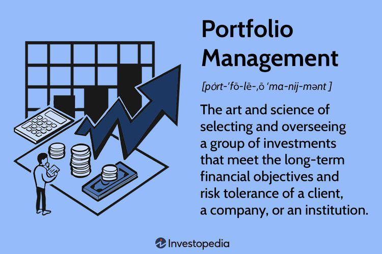

Investment strategies, financial planning, portfolio management, and algorithmic trading are integral components in finance. These elements are crucial in the development and implementation of effective wealth management systems. By understanding their interconnections, investors can optimize their financial outcomes and improve their overall financial health.

Investment strategies provide the foundational framework for making informed financial decisions, tailored to individual risk tolerance and goals. They serve as a guideline for selecting securities and determining the best mix of asset classes, whether it be stocks, bonds, real estate, or commodities. Financial planning, on the other hand, emphasizes the importance of a structured approach to achieving long-term financial objectives. This includes creating and managing budgets, saving, investing, and risk management. Integrating sound investment strategies within an effective financial plan ensures alignment and maximization of financial goals.

Portfolio management is the process of constructing and maintaining a collection of investments that aims to balance risk against performance. Through effective portfolio management, investors learn to allocate their assets efficiently, diversify to mitigate risks, and rebalance their portfolios to adapt to market changes and personal financial goals. It is a dynamic process that requires continuous monitoring and adjustments.

Algorithmic trading introduces a layer of automation and precision by leveraging computer algorithms to make trading decisions. By utilizing predefined instructions, algorithmic trading can execute trades at speeds and frequencies that are impractical for traditional human trading. This not only reduces human error but also increases market efficiency and liquidity.

The integration of investment strategies, financial planning, portfolio management, and algorithmic trading creates a comprehensive financial strategy that is robust and adaptable. By coordinating these components, investors can navigate the complexities of financial markets more effectively, achieving greater operational efficiency and enhanced financial results.

In the following sections, we explore how each of these elements functions individually and how their integration can enhance wealth management practices in the context of emerging trends and technologies.

## Table of Contents

## Investment Strategies

Investment strategies are systematic plans designed to help investors achieve specific financial goals. These strategies are tailored to an individual's risk tolerance, investment timeline, and financial objectives. They can range from aggressive approaches, aimed at maximizing returns, to more conservative approaches focused on capital preservation. 

One common aggressive investment strategy is growth investing, which targets companies expected to experience significant revenue or earnings growth. Investors typically focus on high-growth sectors such as technology, healthcare, or renewable energy. These sectors often present opportunities for substantial returns but come with higher [volatility](/wiki/volatility-trading-strategies) and risk. By investing in [growth stocks](/wiki/growth-stocks), which might trade at higher valuations, investors aim for capital appreciation. For instance, investing in rapidly expanding tech firms like those in the [artificial intelligence](/wiki/ai-artificial-intelligence) or cloud computing space can potentially offer large returns.

Conversely, a conservative strategy might involve investing in stable assets that offer reliable returns with lower risk. This includes sectors such as utilities or consumer staples, which tend to perform steadily despite economic downturns. Moreover, fixed income securities, such as government bonds or high-grade corporate bonds, are often part of a capital-preserving approach. They provide predictable income and lower exposure to market fluctuations. For example, Treasury bonds in the United States are considered one of the safest investments as they are backed by the government.

A balanced strategy exists between these extremes, known as value investing. This strategy involves selecting undervalued stocks that the market may be overlooking. Investors utilizing value investing seek to capitalize on market inefficiencies by identifying stocks trading below their intrinsic value.

Investment strategies must consider asset allocation, which involves distributing investments across various asset classes to manage risk and return. A diversified portfolio that includes a mix of stocks, bonds, real estate, and cash can help mitigate risks inherent in any single asset class or market sector.

Ultimately, successful investment strategies align with the investor’s financial goals and risk appetite. They require continual evaluation and adjustment in response to market conditions, ensuring long-term financial success and resilience in achieving desired financial outcomes.

## Financial Planning

Financial planning serves as a comprehensive roadmap for achieving long-term financial objectives, offering a structured approach to managing personal finances and investments effectively. At its core, financial planning encompasses key components such as budgeting, saving, investing, and managing risks, each crucial for ensuring financial stability and growth over time.

Budgeting is the foundational component of financial planning, involving the careful allocation of income across various expenditures. By systematically tracking income and expenses, individuals can identify opportunities for savings and ensure that spending aligns with financial goals. This process often involves setting short-term and long-term financial targets and monitoring progress regularly.

Saving is another critical component, facilitating the accumulation of wealth over time. It provides a buffer against unforeseen events and acts as a financial reserve for future investments. Effective saving strategies often require setting specific goals, such as creating an emergency fund or saving for retirement, and leveraging appropriate savings vehicles like high-yield savings accounts or certificates of deposit (CDs).

Investing, a key pillar of financial planning, involves allocating resources to various asset classes like stocks, bonds, or real estate with the objective of generating returns. Investing helps counter inflationary pressures and contributes significantly towards building wealth over the long term. An integrated investment strategy, tailored to an individual's risk tolerance and financial goals, ensures that investment activities are aligned and optimized. For instance, younger investors might focus on growth-oriented strategies, while those approaching retirement might opt for more conservative, income-generating investments.

Risk management is an essential aspect of safeguarding financial plans against potential adversities. This involves identifying financial risks—such as market volatility, inflation, and life uncertainties—and implementing strategies to mitigate them. Insurance products, diversification of assets, and hedging techniques are common methods employed to manage risk effectively.

Integrating these components ensures that financial goals are aligned and optimized, helping individuals make informed financial decisions. This integration often involves continuous review and adjustment of financial plans to adapt to changing circumstances and goals. For example, major life events like marriage, childbirth, or career changes could necessitate a revision of budgeting, saving, and investment strategies.

In summary, financial planning is an iterative process that helps individuals navigate their financial journeys with clarity and purpose. By effectively budgeting, saving, investing, and managing risks, individuals can achieve a harmonious balance between current financial needs and future aspirations, leading to sustained financial success.

## Portfolio Management

Portfolio management is a critical element in the investment process, focusing on the selection and supervision of a diversified array of investments to achieve specific financial objectives. Its primary aim is to strike a balance between risk and performance, tailored to the investor's risk tolerance, time horizon, and financial goals. This balance is achieved through the adoption of active or passive management strategies.

In active portfolio management, the portfolio manager makes specific investments with the aim of outperforming an investment benchmark index. This approach relies on the manager's skill in selecting undervalued or overvalued securities, timing market entry and [exit](/wiki/exit-strategy), and adjusting the asset mix in response to market conditions. Techniques often include [fundamental analysis](/wiki/fundamental-analysis), technical analysis, or a combination of methods to forecast security prices.

Conversely, passive management is based on the belief that markets are efficient and that it is difficult to consistently outperform market averages. Passive managers typically invest in a representative sample of the underlying index components or track asset benchmarks through index funds. This strategy limits managerial intervention, reducing fees and often resulting in lower capital gains taxes. 

Key tasks in portfolio management involve asset allocation, diversification, and rebalancing. Asset allocation refers to the process of dividing investments among different asset categories, such as stocks, bonds, and cash, based on the investor's financial goals, risk tolerance, and investment horizon. This allocation is fundamental to the portfolio's risk-return profile.

Diversification further mitigates risk by spreading investments within an asset class. The goal is to reduce the impact of any single asset's performance on the overall portfolio. Modern Portfolio Theory (MPT) suggests that optimal diversification can be achieved by combining assets whose returns are not perfectly correlated. The mathematical representation for calculating the expected return $E(R_p)$ of a portfolio can be expressed as:

$$
E(R_p) = \sum_{i=1}^{n} w_i E(R_i)
$$

where $w_i$ is the proportion of the portfolio invested in asset $i$, and $E(R_i)$ is the expected return of asset $i$.

Rebalancing is the systematic realignment of the portfolio's asset mix. This process involves adjusting the weightings of the portfolio's assets periodically to maintain the original or desired level of asset allocation, ensuring that the investment strategy remains aligned with the investor's risk tolerance. Regular rebalancing can help in maintaining the intended risk level and potentially improving returns due to a disciplined buy-low, sell-high approach.

The strategic integration of these tasks not only seeks to optimize returns but also to align with the investor’s risk profile, thus enhancing long-term financial outcomes.

## Algorithmic Trading

Algorithmic trading automates the process of executing trading decisions by leveraging computer algorithms. This form of trading enhances both speed and precision, allowing the execution of trades to occur in mere fractions of a second. Algorithms are predicated upon predefined criteria, such as timing, price, quantity, or any mathematical model, which makes the execution process swift and accurate.

For instance, consider a scenario where the algorithm is designed to execute a buy order when the price of a stock drops below its 20-day moving average. Such instructions are implemented without human intervention, minimizing the delay between the signal generation and trade execution, thereby capitalizing on market opportunities quickly.

One of the primary benefits of [algorithmic trading](/wiki/algorithmic-trading) is the reduction of human error. Human traders are susceptible to emotional biases and fatigue, which can influence trading decisions. In contrast, algorithms are immune to such pitfalls, ensuring that trades are executed as per the strategy without deviation. This automation leads to enhanced efficiency, with firms able to process large volumes of trades at speeds that are unattainable by human traders.

Despite these advantages, algorithmic trading is not without risks. Market conditions can change rapidly, and an algorithm that functions effectively under certain market conditions may not perform well under others. Moreover, the reliance on complex algorithms introduces the potential for software bugs and the risk of executing erroneous trades. These errors can have significant financial repercussions, especially when large volumes are involved.

Regulatory concerns also arise with algorithmic trading, particularly the fear of market manipulation and the flash crashes that can result from errant algorithms or feedback loops. Consequently, substantial emphasis is placed on testing and validating algorithms under various market scenarios before they are deployed live.

In summary, algorithmic trading offers numerous advantages in terms of speed, accuracy, and efficiency, but requires diligent oversight and continual refinement to adapt to the ever-evolving financial landscape.

## Integration and Synergy

The integration of investment strategies, financial planning, portfolio management, and algorithmic trading creates a cohesive financial strategy that enhances overall investment performance. At the core of this integration is the role of investment strategies as a guiding framework for portfolio management. These strategies determine asset allocation, risk exposure, and target returns, which are crucial in constructing a portfolio that aligns with the investor's goals and risk tolerance.

Portfolio management, in turn, involves making informed decisions about the selection, timing, and evaluation of investments. Algorithmic trading plays a pivotal role in executing the strategy-driven decisions made during portfolio management. By automating trades based on predefined criteria, algorithmic trading improves the precision and timing of transactions, reduces human errors, and ensures consistent adherence to the selected investment strategy. Algorithms can process large datasets at speeds unattainable by human traders, providing real-time market data analysis and execution capabilities.

The synergy between these elements enhances efficiency by enabling seamless execution of trades and continuous portfolio adjustments in response to market dynamics. This adaptability allows for a more agile response to market fluctuations and the opportunities they present. Moreover, the integration fosters effectiveness by ensuring that every decision across the investment process—from strategic planning to trade execution—is aligned with overarching financial objectives.

In changing markets, the synergy between these components strengthens an investor's ability to manage risk and capitalize on emerging trends, providing a competitive edge. This integrated approach encapsulates a dynamic and comprehensive method to achieve robust financial outcomes.

## Future Trends

Emerging technologies, particularly Artificial Intelligence (AI) and Machine Learning (ML), are significantly transforming portfolio management and trading, providing new opportunities for investors and financial institutions. AI-driven platforms leverage vast amounts of data, employing complex algorithms to identify patterns and make data-driven decisions. This enhanced data analysis is crucial for developing sophisticated investment strategies that prioritize precision and adaptability.

One of the critical advancements facilitated by AI and ML is increased personalization in financial services. By analyzing individual investor behavior, preferences, and risk profiles, AI systems can offer tailored investment advice and portfolio recommendations. This personalization not only improves client satisfaction but also enhances the alignment of investment strategies with long-term financial goals.

Additionally, the integration of advanced technologies in trading systems has facilitated the rise of automated and high-frequency trading. Algorithms optimized through [machine learning](/wiki/machine-learning) can execute trades at exponentially higher speeds and efficiencies than human traders, capitalizing on market opportunities almost instantaneously. These systems can continuously learn and improve, adapting to market fluctuations and identifying emerging trends.

Future trends in the financial sector are likely to include even deeper integration of AI and ML technologies. We can expect to see more AI-driven products and services that offer predictive analytics and risk assessment tools, enabling investors to preempt potential challenges and optimize their portfolios accordingly. The continuous evolution of these technologies promises not only to streamline financial operations but also to democratize access to sophisticated investment strategies, breaking down barriers traditionally faced by individual investors.

Overall, the influence of AI and ML in finance signifies a paradigm shift toward more intelligent, responsive, and personalized investment strategies. As these technologies mature, they will continue to redefine the landscape of portfolio management and trading, offering enhanced precision and greater opportunities for leveraging data in decision-making processes.

## Conclusion

A holistic approach that integrates investment strategies, financial planning, portfolio management, and algorithmic trading is paramount for successful investing. The intersection of these components forms a comprehensive framework that enables investors to effectively navigate the complexities of financial markets.

By strategically aligning investment strategies with financial planning, investors can ensure that their financial objectives are both realistic and achievable. This alignment allows for the development of a tailored investment approach that considers individual risk tolerance, time horizons, and financial goals. Furthermore, the disciplined selection and management of investment portfolios serve to balance risk and return, leveraging both active and passive management techniques to achieve optimal performance outcomes.

Algorithmic trading adds a layer of precision and efficiency to this framework by automating trading decisions based on predefined criteria. This automation minimizes human error and enhances the speed of trade executions, crucial for capturing fleeting market opportunities and achieving cost efficiencies.

The synergy created by integrating these elements not only enhances the effectiveness of wealth management but also fortifies an investor's ability to adapt to dynamic market conditions. As financial markets continue to evolve with technological advancements such as artificial intelligence and machine learning, investors who embrace a holistic approach are better positioned to capitalize on these innovations. This approach empowers investors to achieve sustained financial success by enabling them to make informed, strategic decisions in an increasingly complex financial landscape.

## References & Further Reading

Bergstra, James, et al., "Algorithms for Hyper-Parameter Optimization," 2011, explores methods to optimize hyper-parameters in machine learning models. Hyper-parameter optimization is critical in algorithmic trading and financial modeling to enhance predictive accuracy and efficiency. The paper provides insights into algorithms such as Random Search and Bayesian Optimization, which can be applied in developing financial algorithms to improve performance and robustness.

Marcos Lopez de Prado's "Advances in Financial Machine Learning" offers practical techniques for applying machine learning to finance. It covers methodologies and algorithms useful for developing adaptive models that can adjust to the ever-changing financial markets. Topics such as financial data structures, strategy evaluation, and back-testing are discussed, which are essential for creating reliable trading algorithms.

Ernest P. Chan's "Quantitative Trading: How to Build Your Own Algorithmic Trading Business" acts as a guide for aspiring quant traders. Chan illustrates the process of developing, testing, and deploying trading strategies using algorithmic approaches. The book emphasizes practical aspects including strategy formulation, risk management, and execution, along with programming examples primarily in Python, that are vital for building efficient and scalable algorithmic trading systems.