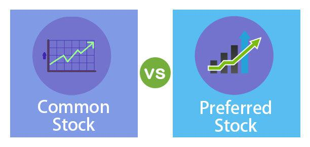

In the dynamic field of investment, understanding the fundamental differences between common stock and preferred stock is essential for investors aiming to diversify their portfolios or optimize their strategies. These two types of stocks cater to varying investor preferences, offering unique advantages and drawbacks that align with distinct financial goals and risk tolerance levels.

Common stock is typically associated with potential for capital appreciation and voting rights, granting shareholders influence over key corporate decisions, such as the election of the board of directors. However, dividends for common stocks are not guaranteed, as they depend on the company’s profitability and discretion. This stock type is generally more volatile, offering opportunities for higher long-term growth but also exposing investors to significant risks.



In contrast, preferred stock serves as a hybrid instrument, combining features of both equity and debt. It generally provides investors with a steady income through fixed dividends, making it attractive to those seeking income stability. While preferred shareholders usually do not have voting rights, they have a superior claim on assets and earnings in the event of liquidation. This type of stock is less volatile than common stock and can be more appealing to risk-averse investors focused on reliable returns.

The introduction of algorithmic trading (algo-trading) further enriches the landscape of stock investment. By utilizing sophisticated computer algorithms, investors can execute trades at unprecedented speed and precision, guided by pre-defined criteria. This technology enhances decision-making processes by analyzing large volumes of data and identifying market trends, offering opportunities to refine entry and exit strategies and manage risks more effectively. Algo-trading thus represents a crucial aspect of modern investing, improving efficiency and potentially yielding better outcomes in both common and preferred stock markets.

This article aims to detail the distinctions between common and preferred stocks, their respective benefits and drawbacks, and the roles they play in achieving a balanced investment portfolio. Additionally, it will explore how algo-trading can be leveraged to optimize stock choices, integrating technology into the core of investment strategy. Understanding these elements is vital for investors seeking to align their financial strategies with their specific goals and risk tolerance levels.

## Table of Contents

## Common Stock: Key Features

Common stock signifies a form of ownership in a corporation, granting investors the possibility of capital appreciation over time. This type of stock is the most prevalent among equity investors and comes with specific rights and characteristics that differentiate it from preferred stock.

Shareholders of common stock typically possess voting rights, which provide them a certain degree of influence over corporate governance. This includes the ability to vote on significant matters such as the election of the board of directors, mergers and acquisitions, and major corporate policy changes. The number of votes a shareholder receives generally corresponds to the number of shares they own, allowing larger shareholders a greater impact on decision-making processes.

When it comes to dividends, common stockholders do not receive guaranteed payouts. Unlike preferred stock, where dividends are often fixed and predetermined, common stock dividends are subject to the discretion of the company's board of directors and depend heavily on the corporation's financial performance. In times of economic prosperity, companies may reward shareholders with higher dividends or special dividends. Conversely, during downturns, dividend payouts might be reduced or suspended altogether to conserve cash.

Common stock is generally more volatile compared to preferred stock, reflecting a higher risk associated with the potential for capital gains. This [volatility](/wiki/volatility-trading-strategies) is driven by various factors, including market sentiment, economic indicators, and company performance. Despite its inherent volatility, common stock offers greater potential for long-term growth, which can be appealing to investors seeking substantial capital appreciation over extended periods.

In conclusion, common stock provides investors with the dual benefits of ownership and potential profits from share price increases while posing considerable risks due to its market volatility and non-guaranteed dividends.

## Preferred Stock: A Hybrid Instrument

Preferred stock is a unique financial instrument that shares characteristics of both equity and debt, offering investors certain advantages and challenges. Unlike common stock, preferred stock delivers a predictable income stream, primarily in the form of fixed dividends. These dividends are typically set at the time of issuance and paid regularly, which provides a degree of income stability for investors focused on yield.

In general, holders of preferred stock do not possess voting rights in corporate affairs, making them less influential in company decision-making compared to common shareholders. However, they benefit from a higher claim on the company's assets and earnings, particularly in scenarios of liquidation. This means that in the event of bankruptcy, preferred shareholders are prioritized over common shareholders when assets are distributed, though they are subordinate to debt holders.

Preferred stocks tend to display lower volatility than common stocks, attributed to their fixed dividend obligations and priority in asset claims. Additionally, preferred stocks can be issued with features such as callability and convertibility, which add layers of investment strategy. Callable preferred stocks allow the issuing company to redeem them at a predetermined price after a specified date. This can be advantageous for companies in a declining [interest rate](/wiki/interest-rate-trading-strategies) environment but introduces reinvestment risk for holders. Convertible preferred stocks give investors the option to convert their shares into a predetermined number of common shares, usually at any time after a specific date. This feature provides the potential for appreciation if the market price of the common shares rises significantly.

Due to their stability and consistent dividend payouts, preferred stocks are particularly attractive to investors who prioritize income over growth, such as retirees or institutional investors seeking to manage risk. These securities offer a compromise between the high-risk, high-reward dynamics of common stocks and the low-risk, fixed-return nature of bonds, making them versatile options within a diversified portfolio.

Preferred stocks have a significant role in corporate finance, appealing to both companies seeking capital and investors seeking a balanced risk-reward profile. By understanding the specific terms and features of preferred stock issuances, investors can align their portfolios with their financial objectives, maximizing income potential while managing risk exposure.

## Comparative Analysis: Common vs. Preferred Stock

Preferred stocks and common stocks represent different investment strategies, each with unique characteristics that cater to varying investor needs. Preferred stocks hold priority over common stocks regarding dividend payments and claims on assets in the event of liquidation. This priority makes preferred stocks an attractive option for investors seeking stable income, as they provide more reliable dividend payments. In contrast, common stocks typically outperform in terms of growth potential, as they offer the opportunity for capital appreciation.

The difference in growth potential and stability between these two types of stocks often guides investors' decisions based on their individual risk tolerance, income needs, and investment objectives. Common stocks, owing to their ability to provide substantial returns via market value appreciation, attract investors willing to accept higher volatility in exchange for potential long-term capital gains. Conversely, preferred stocks are less volatile and more suited to those prioritizing a steady revenue stream due to their fixed dividend nature.

A well-diversified portfolio benefits from including both common and preferred stocks, as they serve distinct strategic roles. Common stocks can drive portfolio growth and capitalize on market uptrends, while preferred stocks can offer stability and consistent income, acting as a buffer against market volatility. By balancing both stock types, investors can effectively tailor their portfolios to align with their financial goals and market outlook. This approach fosters a more comprehensive risk management strategy, accommodating both short-term income requirements and long-term growth aspirations.

## Incorporating Algo-Trading in Stock Strategies

Algorithmic trading, or algo-trading, employs computer algorithms to automate trading processes, enabling high-speed and precise execution of trades based on pre-established criteria. These algorithms analyze multiple variables, including stock prices, trading volumes, and market trends, allowing investors to make informed decisions rapidly. Algo-trading systems can handle vast datasets, providing insights that manual analysis might overlook.

An essential advantage of algo-trading is its ability to mitigate emotional biases in trading decisions. By relying on data analysis and predetermined strategies, algo-trading promotes disciplined and consistent decision-making. Investors can optimize their entry and [exit](/wiki/exit-strategy) strategies with these systems, thereby improving the timing of trades and enhancing profitability.

Algo-trading is particularly effective in managing risks within both common and preferred stock markets. The algorithms can be designed to monitor specific risk parameters and execute trades automatically when these parameters are breached, offering a robust risk management framework. For instance, algorithms can implement stop-loss orders or dynamic hedging techniques that adjust to market conditions in real-time.

The efficiency of algo-trading extends to reducing transaction costs. By automating trades, investors can capitalize on the smallest [arbitrage](/wiki/arbitrage) opportunities and execute orders at optimal prices, minimizing slippage and maximizing returns. Consequently, algo-trading has become an indispensable tool for institutional investors and hedge funds seeking to execute complex strategies swiftly within rapidly changing market environments.

Furthermore, the precision of algo-trading allows for back-testing on historical data to refine strategies before applying them in live markets. This ability to test and adjust strategies based on past performance data ensures that only the most promising approaches are implemented.

Incorporating algo-trading into stock strategies necessitates a comprehensive understanding of market behavior and algorithm design. While beneficial, the implementation of such systems can be complex, often requiring advanced programming skills and a deep knowledge of financial markets. Despite this complexity, the benefits, such as increased efficiency, reduced costs, and superior risk management capabilities, make algo-trading a pivotal component of contemporary investment strategies. 

Overall, while algo-trading significantly enhances the execution of stock strategies, it demands continuous development and monitoring to adapt to evolving market conditions, ensuring that the trading algorithms remain effective and aligned with an investor's strategic objectives.

## Conclusion: Optimizing Stock Choices

Investors must weigh the trade-offs between growth potential and income stability when choosing between common and preferred stocks. Choosing the right type of stock depends largely on an investor's financial goals and risk tolerance. Common stocks typically offer greater growth potential due to their association with a company's performance and market valuation. This potential for capital appreciation is attractive to investors who are willing to accept higher volatility in exchange for long-term gains.

Preferred stocks, on the other hand, provide a more stable income stream with fixed dividends, appealing to those who prioritize income stability over growth. Despite lacking voting rights, preferred shareholders benefit from a higher claim on assets and earnings, offering a safer option during liquidation scenarios. This lower volatility is beneficial during uncertain market conditions or for those relying on regular income streams.

Understanding the specific characteristics of each stock type is crucial for aligning investments with one's financial goals. For instance, investors seeking aggressive growth may allocate a higher proportion of their portfolio to common stocks, while those needing regular income might prefer preferred stocks.

Incorporating [algorithmic trading](/wiki/algorithmic-trading) can further enhance an investor's ability to navigate and exploit market movements. Algorithmic trading utilizes complex algorithms to analyze market data and execute trades at high speed, often capitalizing on micro-fluctuations in stock prices. This technology can be leveraged in both common and preferred stock markets to optimize entry and exit strategies. Python, being a preferred language for financial modeling, allows the implementation of algorithmic trading strategies with libraries such as NumPy and Pandas for data analysis and model building:

```python
import numpy as np
import pandas as pd

# Example function for moving average crossover strategy
def moving_average_crossover(df, short_window, long_window):
    df['Short_MA'] = df['Close'].rolling(window=short_window).mean()
    df['Long_MA'] = df['Close'].rolling(window=long_window).mean()
    df['Signal'] = np.where(df['Short_MA'] > df['Long_MA'], 1, 0)
    df['Position'] = df['Signal'].diff()
    return df

# Apply strategy to historical stock data
historical_data = pd.read_csv('historical_stock_data.csv')
strategy_results = moving_average_crossover(historical_data, short_window=40, long_window=100)
```

Through such strategies, algorithmic trading improves efficiency, reduces transaction costs, and allows the execution of complex trading strategies under dynamic market conditions.

A balanced investment approach, combining both common and preferred stocks, along with cutting-edge trading strategies like algorithmic trading, can lead to a robust, adaptive portfolio. This diversified strategy ensures that investors are well-positioned to capitalize on growth opportunities while maintaining income stability, thus optimizing stock choices according to individual market outlooks and financial objectives.

## References & Further Reading

[1]: ["The Intelligent Investor"](https://www.amazon.com/Intelligent-Investor-Definitive-Investing-Essentials/dp/0060555661) by Benjamin Graham

[2]: Fabozzi, F. J., & Peterson Drake, P. (2009). ["Finance: Capital Markets, Financial Management, and Investment Management."](https://books.google.com/books/about/Finance.html?id=mUBsAwAAQBAJ)

[3]: ["Common Stocks and Uncommon Profits"](https://www.amazon.com/Common-Stocks-Uncommon-Profits-Writings/dp/0471445509) by Philip Fisher

[4]: ["Algorithmic Trading: Winning Strategies and Their Rationale"](https://www.wiley.com/en-us/Algorithmic+Trading%3A+Winning+Strategies+and+Their+Rationale-p-9781118460146) by Ernest P. Chan

[5]: Hull, J. C. (2014). ["Options, Futures, and Other Derivatives."](https://books.google.com/books/about/Options_Futures_and_Other_Derivatives_eB.html?id=2iopDwAAQBAJ) 

[6]: Reilly, F. K., & Brown, K. C. (2011). ["Investment Analysis and Portfolio Management."](https://books.google.com/books/about/Investment_Analysis_and_Portfolio_Manage.html?id=CfB-qTXqRWEC)

[7]: ["Python for Finance: Analyze Big Financial Data"](https://books.google.com/books/about/Python_for_Finance.html?id=E93SBQAAQBAJ) by Yves Hilpisch

[8]: O'Hara, M. (1995). ["Market Microstructure Theory."](https://www.semanticscholar.org/paper/Market-Microstructure-Theory-O'Hara/2bd0833b023f3270a2a6bf301e86b8e02e2f28ed)