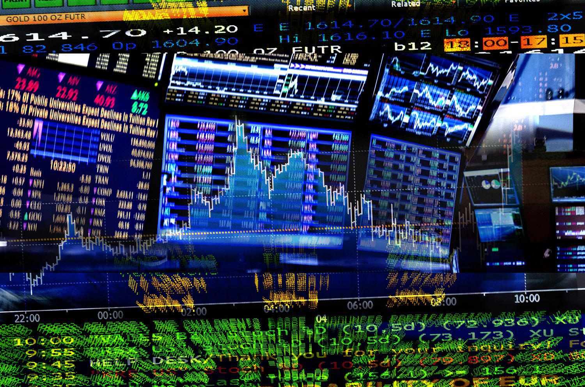

The world of trading is multifaceted, offering a range of strategies and trade types that cater to different investor and trader needs. Key among these are principal trading, agency trading, and algorithmic trading (algo trading), each characterized by distinct approaches and methodologies that appeal to diverse market participants. An informed understanding of these trading methods, their similarities, and their differences can enhance decision-making for investors navigating this complex environment.

Principal trading involves brokerage firms executing trades using their own inventory of securities. This offers potential benefits, including rapid trade execution and the ability for brokers to profit from the bid-ask spread. In contrast, agency trading positions the broker as an intermediary, connecting buyers with sellers and earning a commission for facilitating such trades. This model provides increased transparency, although it might come at the cost of slower execution times.

The emergence of algorithmic trading has dramatically influenced traditional trading strategies. Algo trading employs sophisticated algorithms that automate trades based on predefined criteria, allowing for swift execution and minimizing human error. The infusion of technology into these trading strategies reflects a broader trend of leveraging computational power to optimize trading operations.

This article seeks to provide a thorough overview of principal trading, agency trading, and algo trading, examining their benefits and limitations. It will also explore the technological evolution shaping these strategies, particularly focusing on the significant role of algorithms in contemporary trading practices. By understanding these dynamics, investors can better align their trading strategies with their financial goals.

## Table of Contents

## Understanding Principal Trading

Principal trading is a significant aspect of modern financial markets, where brokers engage in transactions directly with their clients by using their own inventory of securities. This trading method allows brokers to act as the principal in the transaction, effectively buying and selling securities from their own accounts, rather than merely facilitating trades between external buyers and sellers.

One of the primary advantages of principal trading is the potential for significant revenue generated through the bid-ask spread. The bid-ask spread is the difference between the price at which a broker is willing to buy a security (the bid) and the price at which they are willing to sell it (the ask). By capitalizing on this spread, brokers can earn substantial profits, especially in markets with high liquidity and volatility.

An additional advantage of principal trading is the efficiency in trade execution. Since the broker holds the securities, trades can be executed swiftly without the need for locating a counterparty to complete the transaction. This immediacy can be particularly beneficial during periods of rapid market movement, where time-sensitive opportunities arise. The ability of brokerages to execute trades quickly aligns with the interests of certain investors who prioritize execution speed over cost transparency.

Despite its advantages, principal trading comes with several drawbacks. Customers often have limited insight into the price formation process, as the broker controls the bid-ask spread and may not disclose the full market conditions. This opacity can lead to higher costs for the investor, who may not be aware of the potential savings that could be realized through alternative trading methods where transparency is a priority. Moreover, because the broker holds the securities within its inventory, there is an inherent conflict of interest, as the broker may prioritize transactions that serve its financial interests over those of the client.

In summary, while principal trading offers benefits such as quick trade execution and revenue potential through the bid-ask spread, it also poses challenges like higher costs and limited price transparency for the client. Understanding these dynamics is critical for investors seeking to navigate the complexities of securities trading effectively.

## Exploring Agency Trading

Agency trading is a widely utilized method where a broker serves as an intermediary, facilitating transactions between buyers and sellers in financial markets. In this role, the broker does not own the securities. Instead, the broker's responsibility is to effectively match a buyer with a seller, ensuring the transaction occurs seamlessly. One of the central aspects of agency trading is the broker's compensation, which is derived from a commission on each transaction.

A key advantage of agency trading is the transparency it offers clients. Brokers are mandated to act in the best interest of their clients, which means they are obligated to obtain the best possible price for a transaction. This duty is often referred to as the broker's fiduciary responsibility. Such transparency can foster trust between clients and brokers, as investors can be assured of fair treatment and competitive pricing.

However, there are notable drawbacks to this trading method. One primary concern is the potential for delayed transaction execution. Since brokers are finding suitable counterparties for each trade rather than executing from an existing inventory, this search may take extra time, particularly in less liquid markets. Additionally, the necessity of paying a broker's commission fee can increase the overall cost of the transaction for the investor.

Despite these challenges, agency trading remains a popular choice due to its transparency and the reduced conflict of interest, as brokers are not trading from their own accounts. Investors should weigh these benefits against potential downsides, such as slower execution times and additional fees, when choosing a trading method.

## Key Differences Between Principal and Agency Trading

A significant distinction between principal and agency trading lies in the broker's role within each transaction type. In principal trading, brokers act as sellers who use their own inventory of securities to execute trades directly with clients. This direct involvement allows brokers to benefit from the bid-ask spread, potentially generating revenue by buying securities at a lower price and selling them at a higher one. In contrast, agency trading sees brokers operating as intermediaries. They facilitate trades by matching buyers with sellers, without owning the securities themselves. Instead of profiting from price differences, brokers in agency trading earn through commission fees on each transaction.

The profit structures of principal and agency trading also differ considerably. Brokers engaging in principal trading gain from the spread between buying and selling prices—a model that promises higher revenues given favorable market conditions and efficient inventory management. Meanwhile, agency trading brokers rely on charging commission fees, which are typically a percentage of the trade value. This fee-based structure can sometimes be more predictable, yet may result in lower total income compared to the spreads garnered in principal trading, especially if the [volume](/wiki/volume-trading-strategy) of facilitated trades is insufficient.

Risk exposure is another crucial [factor](/wiki/factor-investing) separating these two trading methods. In principal trading, brokers inherently take on higher risk since they purchase and hold securities, which exposes them to market fluctuations and potential declines in asset value. This ownership of securities requires brokers to manage their portfolios actively to mitigate potential losses. In contrast, agency trading involves minimal risk exposure for the brokers, as they do not own the securities being traded. Instead, their revenue and potential risks are directly tied to their ability to successfully match buy and sell orders and the reliability of their commission-based income.

## The Role of Algo Trading

Algorithmic trading, commonly known as algo trading, utilizes computerized programs to execute trades based on pre-defined strategies. These strategies employ complex algorithms that incorporate statistical, mathematical, and quantitative analysis to determine optimal trading decisions. The computational power behind algo trading allows it to process vast amounts of data and execute trades at unprecedented speeds, far exceeding human capabilities.

One of the primary benefits of algo trading is its ability to efficiently manage and execute large volumes of trades with minimal latency. This speed is crucial in markets where price dynamics can change rapidly, allowing traders to capitalize on fleeting opportunities that may not be achievable through manual trading methods. Algo trading also improves market [liquidity](/wiki/liquidity-risk-premium) and price discovery by continuously providing buy and sell orders, thereby narrowing the bid-ask spread.

A significant advantage of algo trading is the reduction of human error. Manual trading decisions can be influenced by emotions, leading to irrational decision-making. Algorithms operate on logic and set parameters, ensuring consistency and discipline in trading practices. Moreover, the elimination of emotional factors can prevent common pitfalls like overtrading or hesitation in executing trades.

Algo trading is increasingly employed in both principal and agency trading frameworks. In principal trading, where brokers trade from their own inventory, algorithms can rapidly adjust holdings in response to market trends, managing inventory risks more effectively. In agency trading, brokers act as intermediaries, and algorithms can match buyers with sellers swiftly, ensuring better price execution and enhanced client satisfaction.

While algo trading offers numerous advantages, it requires meticulous attention to risk management. The reliance on algorithms necessitates robust infrastructure and rigorous testing to ensure accuracy and reliability. Technical failures or errors in algorithm coding can lead to significant financial losses, making the integrity of the software systems paramount. Moreover, data quality is essential, as algorithms depend heavily on accurate and timely information to execute trades correctly.

Despite these challenges, the integration of algo trading into traditional trading strategies continues to grow. The ability to automate complex trading decisions efficiently positions [algorithmic trading](/wiki/algorithmic-trading) as an essential component of modern financial markets, driving innovation and competitiveness.

## Comparing Algo Trading with Principal and Agency Trading

Algorithmic trading, or algo trading, is increasingly integrated into both principal and agency trading frameworks, significantly enhancing trade execution efficiency. By automating trades based on predefined criteria through complex algorithms, traders can achieve faster decision-making and cost reductions, which are crucial in high-frequency trading environments.

In principal trading, where brokers deal securities from their own inventories, algo trading can help optimize the timing and pricing of trades, thus maximizing the profit from the bid-ask spread. Automated systems can swiftly analyze market conditions and execute trades instantly, reducing the window of exposure to adverse market movements. This swift execution can be vital for capitalizing on short-lived trading opportunities.

In agency trading, where brokers act as intermediaries, algo trading similarly streamlines the process. Algorithms ensure that client orders achieve the best possible market price, adhering to regulatory requirements for best execution. This technology-driven approach not only augments the speed of transactions but also enables the handling of larger volumes of trades, minimizing market impact and transaction costs.

Nonetheless, the integration of algorithmic strategies into trading systems introduces certain challenges. Primarily, there is an increased dependency on the robustness and sophistication of technology. Faulty algorithms or technical glitches can lead to significant financial losses, exemplified by events like the 2010 Flash Crash. Additionally, poor data quality or inadequate data management can impair the effectiveness of algorithmic strategies, as these systems rely heavily on accurate, real-time data and historical information for generating trading signals.

Effective controls and oversight are essential to mitigate these risks. Regular stress testing, stringent compliance checks, and maintaining high data integrity levels can safeguard against potential pitfalls. As such, while algo trading offers remarkable benefits in enhancing traditional trading methods, it necessitates careful monitoring and a thorough understanding of the systems employed to harness its full potential.

## Choosing the Right Trading Strategy

Selecting an appropriate trading strategy is a critical decision for investors, heavily influenced by multiple factors such as investment goals, risk tolerance, and trading frequency. Each trading method—whether principal trading, agency trading, or algorithmic trading—offers unique benefits and challenges, aligning differently with these considerations.

Investment goals form the cornerstone of selecting a trading strategy. For example, an investor aiming for long-term growth might favor a strategy that offers stability and transparency, such as agency trading, where the broker acts as an intermediary, potentially providing price transparency and reducing counterparty risk. In contrast, a trader interested in capitalizing on short-term market movements might find principal trading more advantageous, where brokers can facilitate rapid executions using their securities inventory.

Risk tolerance is another crucial factor. Principal trading involves brokers trading from their own inventory, which can result in higher risk exposure but may also offer opportunities for profit through bid-ask spreads. Conversely, agency trading, which involves brokers facilitating trades between buyers and sellers, typically involves less risk for the broker but can entail commissions that may add to trading costs. Algo trading, with its reliance on automated, pre-set criteria for executing trades, can either mitigate or exacerbate risk, depending on how well the algorithms are designed and managed.

Trading frequency also influences the choice of strategy. High-frequency traders, who pursue rapid trades to capture fleeting market efficiencies, might benefit from algo trading due to its speed and precision. Algorithmic systems can execute hundreds of trades in the time it might take a human broker to execute a single one, enhancing efficiency and reducing latency.

Additionally, familiarity with technology and market conditions are important considerations. Algo trading, for instance, demands a solid understanding of technology and data analysis, as well as an ability to adapt to fast-changing market environments. Investors less comfortable with technology might favor more traditional approaches like agency trading, where their reliance on technology is minimal.

Potential fees should not be overlooked. Agency trading typically involves commission fees, whereas principal trading can lead to higher bid-ask spreads, impacting overall profitability. Algorithmic trading, while efficient, may involve costs related to developing, [backtesting](/wiki/backtesting), and maintaining sophisticated trading models.

Understanding the nuances of each method allows traders to align their strategies with their financial objectives. For instance, an investor comfortable with technology and high-frequency trading might choose to integrate algorithmic strategies within principal or agency frameworks to enhance performance. Conversely, a more conservative investor focused on transparency might prefer agency trading to mitigate risk.

By considering these factors, investors can make informed decisions that not only align with their financial objectives but also navigate the complexities of the trading landscape effectively.

## Conclusion

Principal trading, agency trading, and algorithmic (algo) trading present distinct advantages and considerations for investors and traders. Each strategy caters to different needs and preferences, thus offering a diverse range of options tailored to various trading goals and market conditions. Understanding these options is crucial for optimizing investment strategies.

Principal trading allows brokerage firms to leverage their securities inventories, offering potential for rapid trade execution and profit from bid-ask spreads. However, it comes with increased risk for the broker and possible less transparency for the client. Agency trading, in contrast, prioritizes transparency and fairness, as brokers match buyers and sellers while ensuring the best available price, though possibly at a slower pace and with additional commission fees.

Algo trading enhances both principal and agency trading by incorporating sophisticated algorithms that automate and accelerate trade execution. This technology-driven approach minimizes human error and can significantly reduce trading costs, though it does require meticulous oversight of technical risks and data integrity.

In a constantly changing financial environment, adaptability and a thorough understanding of these trading strategies are essential for maintaining a competitive edge. Investors should continuously seek education and updates regarding these methods to make well-informed decisions that align with their financial objectives and risk tolerance. This proactive approach can lead to more successful outcomes in an ever-evolving market landscape.

## References & Further Reading

[1]: O'Hara, M. (2015). ["High Frequency Trading and its Impact on Markets."](https://www.researchgate.net/publication/285213120_High-Frequency_Trading_and_Its_Impact_on_Markets) Financial Analysts Journal, 71(1).

[2]: Wallace, W. (2013). ["Algorithmic and High-Frequency Trading."](https://assets.cambridge.org/97811070/91146/frontmatter/9781107091146_frontmatter.pdf) Wiley Trading.

[3]: Aldridge, I. (2013). ["High-Frequency Trading: A Practical Guide to Algorithmic Strategies and Trading Systems,"](https://onlinelibrary.wiley.com/doi/pdf/10.1002/9781119203803.fmatter) 2nd Edition. Wiley Finance.

[4]: Hasbrouck, J. (2003). ["Intraday Price Formation in U.S. Equity Markets."](https://onlinelibrary.wiley.com/doi/10.1046/j.1540-6261.2003.00609.x) The Journal of Finance, 58(6).

[5]: Harris, L. (2003). ["Trading and Exchanges: Market Microstructure for Practitioners."](https://www.amazon.com/Trading-Exchanges-Market-Microstructure-Practitioners/dp/0195144708) Oxford University Press.