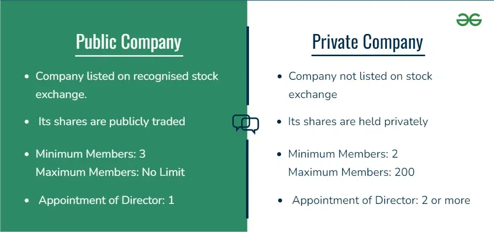

## Table of Contents

## What is a private company?

A private company is a business that is owned by individuals or a small group of people, and it is not traded on a public stock exchange. This means that the company's shares are not available for the general public to buy and sell. Instead, the ownership is usually limited to the founders, their families, or a select group of investors. Private companies can range from small family businesses to large corporations, but they all share the characteristic of having restricted ownership.

Because private companies are not subject to the same regulations as public companies, they have more flexibility in how they operate. They don't have to disclose as much financial information to the public, which allows them to keep their business strategies and financial performance more confidential. This can be an advantage for private companies, as it gives them more control over their business decisions and the ability to focus on long-term goals without the pressure of quarterly earnings reports. However, this also means that private companies might have a harder time raising capital compared to public companies, since they cannot issue stocks to the public.

## What is a public company?

A public company is a business that sells its shares on a stock exchange, so anyone can buy them. This means that the public can own part of the company. When a company becomes public, it usually does this through an initial public offering (IPO). This is when the company first sells its shares to the public. After the IPO, the shares can be bought and sold by anyone on the stock market.

Public companies have to follow strict rules set by the government and the stock exchange. They must share a lot of information about their money and business plans with everyone. This is so that people who might want to buy the shares can make smart choices. Being a public company can help a business get more money to grow, but it also means they have to be very open about what they are doing.

## How does ownership differ between private and public companies?

Ownership in a private company is limited to a small group of people, like the founders, their families, or a few investors. These people own all the shares of the company, and they don't sell them to the public. This means that only these owners can make big decisions about the company. They can keep their business plans and money details secret from everyone else.

In a public company, ownership is open to anyone who wants to buy shares on the stock market. When a company goes public, it sells shares to the public for the first time through an IPO. After that, anyone can buy and sell these shares. This means that many different people can own part of the company. Because of this, public companies have to share a lot of information about their money and plans with everyone, so people can decide if they want to buy the shares.

## What are the main sources of funding for private companies?

Private companies usually get their money from a few main places. One big source is the owners themselves. This can be the people who started the company or their families. They might use their own money to start the business or to help it grow. Another source is loans from banks. Banks can give private companies money that they have to pay back over time, with interest. Sometimes, private companies can also get money from friends or other people they know who believe in their business idea.

Another important source of funding for private companies is from private investors. These are people or groups who give money to the company in exchange for a part of the business. They might get shares in the company, which means they own a piece of it. This is called equity funding. Sometimes, private companies can also get money from what's called venture capital. These are special investors who look for new and growing companies to invest in. They give money to help the company grow fast, but they also expect to make a lot of money back if the company does well.

## How do public companies raise capital?

Public companies raise capital mainly by selling shares to the public through a stock exchange. When a company first becomes public, it does this through an Initial Public Offering (IPO). During an IPO, the company sells shares to investors for the first time. After the IPO, the shares can be bought and sold by anyone on the stock market. This way, the company can raise a lot of money quickly, which it can use to grow its business or pay off debts.

Another way public companies raise capital is by issuing more shares after the IPO. This is called a secondary offering. The company can sell these new shares to the public, and the money they get can be used for things like expanding the business or investing in new projects. Sometimes, public companies also raise money by borrowing from banks or issuing bonds. Bonds are like loans that the company promises to pay back with interest over time. This can be a good way to get money without giving away more ownership of the company.

## What are the regulatory requirements for public companies that do not apply to private companies?

Public companies have to follow many rules that private companies do not. One big rule is that public companies must share a lot of information about their money and business plans with everyone. They do this by filing regular reports with the government, like the Securities and Exchange Commission (SEC) in the United States. These reports tell people how much money the company is making, how much it owes, and what its plans are for the future. This is so that anyone thinking about buying the company's shares can make smart choices.

Another important rule for public companies is that they have to have their financial statements checked by an outside group called auditors. These auditors look at the company's books to make sure everything is correct and honest. Private companies can choose to have their finances checked too, but they don't have to. Public companies also have to follow rules about who can sit on their board of directors and how they make decisions. These rules are meant to make sure that the company is run fairly and in a way that is good for all the shareholders.

## How does the process of going public affect a company's operations and structure?

When a company decides to go public, it changes a lot about how it works and is set up. Going public means the company starts selling its shares on a stock market, so anyone can buy them. This can bring in a lot of money, which the company can use to grow bigger or pay off debts. But it also means the company has to follow strict rules from the government and the stock market. These rules say the company has to share a lot of information about its money and plans with everyone. This is so people can decide if they want to buy the shares.

The structure of the company also changes when it goes public. Before, maybe only a few people owned the company, like the people who started it or their families. But now, many different people can own part of it. This means the company might need new people to help run it, like a board of directors. These people help make big decisions and make sure the company is run fairly. Also, because the company now has to share so much information, it might need more people to work on things like reports and keeping track of the money. All these changes can make the company more organized, but they also mean more work and rules to follow.

## What are the advantages of remaining a private company?

Staying a private company has some big advantages. One of the biggest is that the owners can keep their business plans and money details secret. They don't have to share all this information with everyone like public companies do. This means they can make decisions and try new things without worrying about what other people think. It also lets them focus on what they think is best for the company in the long run, instead of trying to make money quickly to make shareholders happy.

Another advantage is that private companies can be more flexible in how they run their business. They don't have to follow the strict rules that public companies have to follow. This can make it easier for them to change direction quickly if they need to. Also, the owners usually have more control over the company. They don't have to answer to a board of directors or a lot of shareholders. This can make it easier for them to do what they think is best for the company, without having to ask a lot of people for permission first.

## What benefits does a company gain by going public?

When a company goes public, it can raise a lot of money by selling shares to the public. This money can help the company grow bigger, start new projects, or pay off debts. Going public can also make the company more well-known. More people know about the company because its shares are on the stock market, which can help it find new customers and partners. Plus, the company's shares can be used to pay employees or buy other companies, which can be a good way to keep growing.

Going public also helps a company seem more trustworthy. Since public companies have to follow strict rules and share a lot of information about their money and plans, people can feel more confident about investing in them. This can make it easier for the company to get loans or other types of money in the future. But going public also means the company has to follow these strict rules and share a lot of information, which can be a lot of work. Still, for many companies, the benefits of going public can be worth it.

## How do reporting and transparency requirements differ between private and public companies?

Private companies have fewer rules about what they have to share with the public. They can keep their business plans and money details secret. This means they only have to tell a few people, like their owners or private investors, about how the company is doing. Private companies don't have to file reports with the government or have their money checked by outside auditors. This gives them more freedom to make decisions without everyone knowing what they're doing.

Public companies, on the other hand, have to follow strict rules about sharing information. They must tell everyone about their money and plans by filing regular reports with the government, like the Securities and Exchange Commission (SEC) in the United States. These reports show how much money the company is making, how much it owes, and what it plans to do next. Public companies also have to have their financial statements checked by outside auditors to make sure everything is correct. This transparency helps people decide if they want to buy the company's shares, but it also means public companies have less privacy about their business.

## What impact does the stock market have on the decision to stay private or go public?

The stock market plays a big role in whether a company decides to stay private or go public. When a company goes public, it can sell its shares on the stock market. This means it can get a lot of money from people who want to buy those shares. The money can help the company grow bigger or pay off debts. But being on the stock market also means the company has to follow a lot of rules. It has to tell everyone about its money and plans, which can be hard work and take away some privacy.

Staying private means a company doesn't have to deal with the stock market at all. It can keep its business plans and money details secret. This can be good because the company can make decisions without worrying about what everyone else thinks. It can focus on what it thinks is best for the long run, not just trying to make money quickly. But staying private also means the company might not get as much money to grow, because it can't sell shares to the public. So, the stock market can make going public look attractive for the money, but staying private can be better for keeping control and privacy.

## How do strategic decisions and long-term planning differ in private versus public companies?

In private companies, the owners have more control over strategic decisions and long-term planning. They can focus on what they think is best for the company in the long run without worrying about what everyone else thinks. Since private companies don't have to share their plans and money details with the public, they can try new things and make big changes more easily. This flexibility lets them focus on building the company for the future, even if it means not making as much money right away.

In public companies, strategic decisions and long-term planning can be more complicated. Because the company's shares are sold on the stock market, it has to think about what the people who own those shares want. These shareholders often want the company to make money quickly, so the company might have to focus more on short-term goals. Public companies also have to follow strict rules and share a lot of information, which can make it harder to make big changes or try new things. This means they might have to balance what's best for the company in the long run with what shareholders want right now.

## References & Further Reading

[1]: Bergstra, J., Bardenet, R., Bengio, Y., & Kégl, B. (2011). ["Algorithms for Hyper-Parameter Optimization."](https://dl.acm.org/doi/10.5555/2986459.2986743) Advances in Neural Information Processing Systems 24.

[2]: ["Advances in Financial Machine Learning"](https://www.amazon.com/Advances-Financial-Machine-Learning-Marcos/dp/1119482089) by Marcos Lopez de Prado

[3]: ["Evidence-Based Technical Analysis: Applying the Scientific Method and Statistical Inference to Trading Signals"](https://www.semanticscholar.org/paper/Evidence-Based-Technical-Analysis%3A-Applying-the-and-Aronson/3b33df8737f1772e9e14d66a08c9696f140a2ee1) by David Aronson

[4]: ["Machine Learning for Algorithmic Trading"](https://github.com/stefan-jansen/machine-learning-for-trading) by Stefan Jansen

[5]: ["Quantitative Trading: How to Build Your Own Algorithmic Trading Business"](https://github.com/LucindaYa/quant-resources/blob/master/Quantitative%20Trading%20How%20to%20Build%20Your%20Own%20Algorithmic%20Trading%20Business.pdf) by Ernest P. Chan