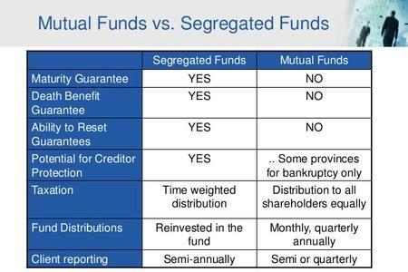

## Table of Contents

## What are segregated funds?

Segregated funds are a type of investment product offered by insurance companies. They are similar to mutual funds but come with an insurance feature that protects part of the money you invest. This means that if the market goes down, you are guaranteed to get back a certain percentage of your investment, usually between 75% and 100%, when the policy matures or if you die.

These funds are often used for long-term savings goals like retirement because of their safety features. They can hold different types of investments, like stocks and bonds, and are managed by professional investment managers. The insurance protection makes them attractive to people who want to invest but are worried about losing their money if the market performs poorly.

## What are mutual funds?

Mutual funds are a type of investment where many people pool their money together to buy a mix of stocks, bonds, or other assets. A professional manager runs the fund, deciding which investments to buy and sell. This makes it easier for people who don't have the time or knowledge to pick individual investments themselves. When you buy into a mutual fund, you get a share of the whole fund, and the value of your share goes up or down based on how well the fund's investments do.

One big advantage of mutual funds is that they help spread out risk. Instead of putting all your money into one company's stock, you can own a little bit of many different companies. This can protect you if one company does poorly. However, mutual funds also come with fees, which can eat into your returns. These fees pay for the fund's management and other costs. So, while mutual funds can be a good way to invest, it's important to understand the fees and how they might affect your money over time.

## How do the investment structures of segregated funds and mutual funds differ?

Segregated funds and mutual funds both let people invest in a mix of stocks, bonds, or other assets, but they have different structures. Segregated funds are offered by insurance companies and come with a special insurance feature. This means if you put money into a segregated fund, the insurance company promises to give you back a certain percentage of your money, usually between 75% and 100%, even if the market goes down. This makes segregated funds safer than mutual funds because they have this built-in protection.

Mutual funds, on the other hand, are managed by investment companies and do not have this insurance protection. When you invest in a mutual fund, the value of your investment goes up or down based on how well the fund's investments do. There's no guarantee that you'll get your money back if the market performs badly. Mutual funds are often cheaper than segregated funds because they don't have the extra cost of insurance, but they can be riskier because of this lack of protection.

## What are the key differences in terms of regulation between segregated funds and mutual funds?

Segregated funds and mutual funds are regulated differently because they are offered by different types of companies. Segregated funds are sold by insurance companies, so they are regulated by insurance regulators. In Canada, for example, this means they are overseen by the Office of the Superintendent of Financial Institutions (OSFI) at the federal level, and by provincial insurance regulators. These regulators make sure the insurance part of the segregated funds works properly, protecting investors by guaranteeing a part of their money.

Mutual funds, on the other hand, are managed by investment companies and are regulated by securities regulators. In Canada, this means they are overseen by the Canadian Securities Administrators (CSA), which is made up of provincial and territorial securities regulators. These regulators focus on making sure the funds are managed fairly and that investors get all the information they need to make good choices. So, while both types of funds are meant to help people invest, the different regulators focus on different parts of how the funds work.

## How does the level of investor protection vary between segregated funds and mutual funds?

Segregated funds give investors more protection than mutual funds. When you invest in a segregated fund, the insurance company promises to give you back a certain part of your money, usually between 75% and 100%, even if the market goes down. This makes segregated funds safer because they have this built-in guarantee. If something goes wrong with the fund or the market, you know you'll get at least some of your money back.

Mutual funds don't have this kind of protection. When you put money into a mutual fund, the value of your investment can go up or down based on how the market does. There's no promise that you'll get your money back if things go badly. So, while mutual funds can be a good way to invest, they are riskier because they don't have the same level of protection as segregated funds.

## What are the typical fees associated with segregated funds compared to mutual funds?

Segregated funds usually have higher fees than mutual funds. This is because they come with an insurance feature that guarantees you'll get back a certain part of your money. This extra protection costs money, so the fees for segregated funds are often higher. You might pay a management expense ratio (MER) that can be around 2% to 3% or even more. There might also be other fees like sales charges or early withdrawal fees.

Mutual funds, on the other hand, don't have this insurance protection, so their fees are usually lower. The management expense ratio for mutual funds can be anywhere from 0.5% to 2%, depending on the type of fund. There can also be other fees, like sales charges or trading fees, but overall, mutual funds tend to be cheaper than segregated funds. This makes them a more affordable option for people who don't need the extra protection of an insurance guarantee.

## How do the performance and returns of segregated funds compare to mutual funds?

The performance and returns of segregated funds and mutual funds can be similar because they both invest in the same kinds of things, like stocks and bonds. Both types of funds are managed by professionals who try to make the best choices to grow your money. The difference in returns usually comes from how the market does overall, not from the type of fund you choose. So, if the market goes up, both segregated funds and mutual funds might go up, and if the market goes down, both might go down.

However, there's a big difference when it comes to the safety of your money. Segregated funds have an insurance feature that promises to give you back a certain part of your money, usually between 75% and 100%, even if the market goes down. This means that while the overall performance might be similar, the actual returns you get from a segregated fund could be better in bad times because of this guarantee. Mutual funds don't have this protection, so if the market goes down, you could lose more money with a mutual fund than with a segregated fund.

## What are the tax implications of investing in segregated funds versus mutual funds?

Investing in segregated funds and mutual funds can have different tax effects. When you make money from a segregated fund, you might have to pay tax on it. This money can come from interest, dividends, or when you sell your investment for more than you paid for it. But, one good thing about segregated funds is that when you die, you can pass them on to someone else without them having to pay tax right away. This is called a "reset" of the cost, so the person who gets the fund only pays tax on the growth after they get it.

Mutual funds work a bit differently. Like segregated funds, you pay tax on the money you make from them, including interest, dividends, and capital gains. But when you die, the tax rules are not as friendly. The person who gets your mutual fund has to pay tax on the whole gain since you bought it. So, if you're thinking about what will happen to your investments after you're gone, segregated funds might be a better choice because of this tax advantage.

## In what ways can segregated funds be used for estate planning compared to mutual funds?

Segregated funds can be a helpful tool for estate planning because they have a special feature that mutual funds don't have. When you invest in a segregated fund, you can name a beneficiary to receive the money after you pass away. This means the money can go straight to your beneficiary without going through the probate process, which can save time and money. Also, the value of the segregated fund can be reset to its current value when you die, so your beneficiary only pays tax on any growth that happens after they get it. This can be a big tax advantage and makes it easier to pass on your wealth to your loved ones.

Mutual funds, on the other hand, don't have this reset feature. When you die, the person who gets your mutual fund has to pay tax on all the growth since you bought it, which can be a lot of money. Plus, mutual funds usually have to go through probate, which can take time and cost money. So, if you're thinking about how to plan your estate and want to make things easier and more tax-friendly for your loved ones, segregated funds might be a better choice than mutual funds.

## How does the liquidity of segregated funds differ from that of mutual funds?

Segregated funds and mutual funds both let you take your money out when you need it, but there are some differences. With segregated funds, you might have to wait a bit longer to get your money back. This is because they often have a set time you need to keep your money in the fund, called a maturity date. If you take your money out before this date, you might have to pay a fee. This means segregated funds can be less liquid, or less easy to turn into cash quickly, than mutual funds.

Mutual funds usually let you take your money out whenever you want without having to wait for a maturity date. This makes them more liquid because you can get your money back faster. But, if a lot of people want their money back at the same time, it might take a little longer to get it. Overall, mutual funds are generally easier to turn into cash quickly than segregated funds, which can be important if you need your money in a hurry.

## What are the advantages and disadvantages of investing in segregated funds over mutual funds for a novice investor?

For a novice investor, segregated funds offer some big advantages. One of the best things is that they come with a safety net. If the market goes down, the insurance company promises to give you back a certain part of your money, usually between 75% and 100%. This can make you feel safer when you're starting out because you know you won't lose everything. Also, segregated funds can be really helpful for planning what happens to your money after you're gone. You can name someone to get the money without it going through a long legal process, and they might pay less tax on it. This can make things easier for your family.

But, there are some downsides to think about too. Segregated funds usually cost more than mutual funds because of the extra insurance protection. This means you'll pay higher fees, which can eat into your returns over time. Also, if you need your money quickly, segregated funds might not be the best choice because you might have to wait until a certain date to get it back without paying a fee. For a beginner, mutual funds might be cheaper and easier to get your money out of when you need it, but they don't have the same safety net or help with planning for the future. So, it's important to think about what you need most when choosing between them.

## How do the advanced features and options available in segregated funds compare to those in mutual funds for expert investors?

For expert investors, segregated funds offer some advanced features that mutual funds don't have. One big feature is the ability to reset the value of your investment for tax purposes when you pass it on to someone else. This means the person who gets your money after you die only has to pay tax on any growth that happens after they get it, which can save them a lot of money. Another advanced option is the ability to set up guarantees that protect part of your investment, usually between 75% and 100%. This can be really helpful if you want to take more risks with your investments but still want some safety. Also, segregated funds let you name a beneficiary to get the money directly without going through a long legal process, which can make things easier for your family.

On the other hand, mutual funds might not have these advanced estate planning features, but they offer other options that can be useful for expert investors. Mutual funds often have a wider range of investment choices, so you can pick the exact type of fund that fits your strategy. You can also switch between different funds more easily without worrying about fees for taking your money out early. Mutual funds might be more liquid, meaning you can get your money out faster if you need it. So, while segregated funds have special features that can help with planning for the future and protecting your money, mutual funds give expert investors more flexibility and choices in how they invest.

## References & Further Reading

[1]: ["Segregated Funds vs. Mutual Funds: Understand the Differences"](https://www.investopedia.com/ask/answers/06/segfundsvsmutualfunds.asp) - Investopedia

[2]: ["Mutual Funds Explained"](https://www.investopedia.com/terms/m/mutualfund.asp) - U.S. Securities and Exchange Commission

[3]: ["Algorithmic Trading and DMA: An introduction to direct access trading strategies"](https://www.amazon.com/Algorithmic-Trading-DMA-introduction-strategies/dp/0956399207) by Barry Johnson

[4]: ["The Little Book of Common Sense Investing: The Only Way to Guarantee Your Fair Share of Stock Market Returns"](https://www.amazon.com/Little-Book-Common-Sense-Investing/dp/1119404509) by John C. Bogle

[5]: ["Trading and Exchanges: Market Microstructure for Practitioners"](https://www.amazon.com/Trading-Exchanges-Market-Microstructure-Practitioners/dp/0195144708) by Larry Harris