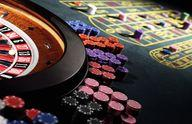

## Table of Contents

## What is speculation?

Speculation is when people make guesses about something without having all the facts. It's like trying to predict what will happen in the future based on what you know now, but you're not totally sure. People often speculate about things like the stock market, where they might buy or sell stocks hoping to make money, even though they can't be certain what will happen.

In everyday life, speculation happens a lot too. For example, if you see dark clouds in the sky, you might speculate that it will rain soon. You don't know for sure, but you make a guess based on what you see. Speculation can be useful because it helps us make decisions when we don't have all the information, but it can also lead to mistakes if our guesses are wrong.

## What is gambling?

Gambling is when people play games of chance or bet on uncertain outcomes, usually hoping to win money. It can include activities like playing cards, betting on sports, or using slot machines. People gamble because they think they might win, but there's always a risk they could lose their money instead.

Sometimes, gambling can be fun and harmless, like playing a friendly game of poker with friends. But it can also become a problem if someone can't stop gambling, even when they're losing a lot of money. This is called gambling addiction, and it can cause big problems in a person's life, like money troubles or hurting relationships with family and friends.

## How do speculation and gambling differ in terms of risk?

Speculation and gambling both involve risk, but the kind of risk is a bit different. When you speculate, you're trying to predict what might happen in the future, like guessing if a stock's price will go up or down. You use information and your best guess to make a decision. The risk in speculation comes from not knowing if your guess will be right, but you're often trying to make smart choices based on what you know.

Gambling, on the other hand, is usually more about luck. When you gamble, you're betting on things like cards, dice, or sports games where the outcome is mostly random. You might have some information, like knowing the odds, but a lot of it is just chance. The risk in gambling is higher because you have less control over what happens, and it's easier to lose money quickly.

In both speculation and gambling, you can lose money, but the way you approach the risk is different. Speculation might feel a bit safer because you're trying to use information to make a smart choice, while gambling often feels more like taking a chance on luck.

## What are the typical goals of speculation versus gambling?

When people speculate, their main goal is usually to make money by predicting how things will change in the future. They might buy stocks or other investments hoping their value will go up. Speculators use information and try to make smart guesses about what might happen. Their goal is to earn a profit by making good decisions based on what they know.

Gambling, on the other hand, is often about having fun and the thrill of winning money. People gamble because they enjoy the excitement of not knowing what will happen. While winning money is a goal, the chance of losing is high, and it's more about the experience and the rush of taking a risk. Gamblers are often looking for entertainment and the possibility of a big win, even if the odds are against them.

## Can you provide examples of speculation in financial markets?

In financial markets, speculation often happens when people buy and sell stocks. For example, if someone thinks a company's stock price will go up because the company is doing well, they might buy that stock. They are speculating that the price will rise in the future, so they can sell it later for more money than they paid. This kind of speculation is common in the stock market, where people try to make money by guessing how well companies will do.

Another example of speculation is in the commodity market, where people buy and sell things like oil, gold, or wheat. If someone believes the price of oil will go up because there's less oil available, they might buy oil now. They are speculating that they can sell it later at a higher price. This kind of speculation can affect the prices of everyday things we use, like gas or food, because it influences how much people are willing to pay for them.

## What are common examples of gambling?

Gambling often happens in casinos, where people play games like slot machines, blackjack, and roulette. In these games, people bet money hoping to win more. Slot machines are simple: you put in money, pull a lever or push a button, and wait to see if you win. In blackjack and roulette, you make bets and hope the cards or the wheel land in your favor. These games are mostly about luck, so people can lose money quickly if they're not careful.

Another common way to gamble is by betting on sports. People might bet on who will win a football game, a horse race, or a boxing match. They use what they know about the teams or athletes to make their bets, but it's still a lot about luck. If the team or horse they bet on wins, they can win money. If not, they lose their bet. This kind of gambling can be fun, but it can also lead to big losses if people bet too much.

Some people also gamble online, playing games like poker or bingo on the internet. They can play from home and bet real money. Online gambling is easy to do, but it can be risky because it's easy to keep playing and lose track of how much money you're spending. Like all forms of gambling, it's important to be careful and not bet more than you can afford to lose.

## How does the time horizon differ between speculation and gambling?

The time horizon for speculation is usually longer than for gambling. When people speculate, they often look at what might happen in the future, like months or even years away. They might buy a stock thinking it will go up in value over time. This means they need to wait and see if their guess about the future turns out to be right. Speculation involves patience because it can take a while to know if you made a good choice.

On the other hand, gambling usually has a shorter time horizon. When you gamble, you often find out if you win or lose pretty quickly. For example, if you play a slot machine, you know right away if you won or lost. Betting on a sports game also gives you results in a short time, like a few hours. Gambling is about getting quick results, which can make it exciting but also risky because you can lose money fast.

## What role does skill play in speculation compared to gambling?

In speculation, skill plays a big role. People who speculate use what they know about markets and the economy to make smart guesses about the future. They look at things like company reports, news, and trends to decide what to buy or sell. The more they know and the better they are at understanding this information, the better their chances of making money. It's not just about luck; it's about using skill to make good choices over time.

In gambling, skill can matter in some games, but luck is usually more important. For example, in poker, knowing how to play well can help you win more often. But even the best poker players can lose if they get bad cards. In games like slot machines or roulette, skill doesn't help at all because the results are totally random. So, while skill can make a difference in some types of gambling, luck is what really decides if you win or lose.

## How are the outcomes of speculation and gambling regulated?

Speculation in financial markets is regulated by government agencies and rules to keep things fair and safe. In the United States, groups like the Securities and Exchange Commission (SEC) make sure people follow the rules when they buy and sell stocks. They watch to stop fraud and make sure everyone has the same information. This helps keep the market honest and protects people who are speculating from being tricked or losing money unfairly.

Gambling is also regulated, but in different ways. Each country or state has its own rules about gambling. In the United States, some states allow casinos and betting, while others do not. There are special groups that check casinos to make sure they are fair and that the games are not rigged. Online gambling has even more rules to stop people from gambling too much and to protect them from fraud. Both speculation and gambling have rules to keep things safe, but the rules are set up differently because they are different activities.

## What psychological factors influence individuals to engage in speculation versus gambling?

People often get into speculation because they want to make more money. They think about the future and try to guess what will happen. This can be exciting because it feels like a smart game. People might also like the feeling of being in control, using what they know to make choices. But sometimes, people can get too caught up in the excitement and take big risks, hoping for a big win. This can lead to stress and worry if things don't go as planned.

Gambling can attract people for different reasons. It's often about the thrill and fun of not knowing what will happen. People enjoy the rush of adrenaline when they bet and wait to see if they win. Some might gamble to escape from everyday problems or to feel a sense of excitement. But gambling can also become a problem if people can't stop, even when they're losing a lot of money. This can lead to feelings of guilt, stress, and even addiction, where the need to gamble takes over other parts of their life.

## How do tax implications vary between profits from speculation and gambling?

When you make money from speculation, like buying and selling stocks, you usually have to pay taxes on your profits. In many places, these profits are called capital gains. How much tax you pay can depend on how long you held the investment. If you held it for a long time, you might pay a lower tax rate than if you sold it quickly. Governments have rules to make sure people report these gains and pay the right amount of tax.

When you win money from gambling, like at a casino or from betting on sports, you also have to pay taxes on your winnings. But the way you report gambling winnings can be different from speculation. In some places, you might get a form from the casino or betting site that shows how much you won, and you need to report that on your taxes. If you lose money gambling, you might be able to subtract those losses from your winnings to lower your tax bill, but there are rules about how much you can claim.

## What advanced strategies can be used to mitigate risks in speculation that are not applicable in gambling?

In speculation, one advanced strategy to lower risks is called diversification. This means spreading your money across different types of investments instead of putting it all in one place. If you buy stocks in many different companies or in different kinds of things like real estate or bonds, you can lower the chance of losing a lot of money if one investment does badly. Another strategy is called hedging, where you make another investment that could go up if your main investment goes down. This can help protect your money if things don't go as planned.

Another way to reduce risk in speculation is by doing a lot of research and using what's called technical analysis. This means looking at past prices and patterns to try to guess what might happen next. People who speculate also often use something called stop-loss orders, which automatically sell an investment if its price drops to a certain level. This helps limit how much money you could lose. These strategies need a lot of knowledge and careful planning, but they can help make speculation safer than just guessing.

## What is Understanding Gambling?

Gambling involves wagering money or value on an event with an uncertain outcome, primarily for entertainment and the potential of winning. This practice is fundamentally characterized by elements of chance, where statistical odds often favor the house or casino over the gambler. The underlying principle of gambling is the acceptance of risk in anticipation of a positive outcome, although the expected return is generally negative for the participant. In mathematical terms, the expected value (EV) of a gambling activity is typically less than zero for the gambler, meaning that, on average, the gambler will lose over time. 

The concept of a negative expected value can be illustrated with a simple formula:

$$

EV = \sum (p_i \times v_i) 
$$

where $p_i$ is the probability of outcome $i$, and $v_i$ is the value or payoff of outcome $i$. In most gambling scenarios, such as in casinos, the different payoffs are structured so that the sum of $EV$ forms a negative number for the gambler.

Popular forms of gambling include casino games like poker and roulette, lotteries where numbers are drawn randomly for a prize, and sports betting where money is wagered on the outcome of a sporting event. Each of these forms relies on different mechanisms of chance, whether through random number generation or unpredictable human performance, reinforcing the crucial aspect of luck involved.

In casinos, the term 'house edge' is commonly used to describe the casino's advantage in any given game. For example, in American roulette, the house edge is approximately 5.26%, meaning that for every dollar wagered, a player can statistically expect to lose around 5.26 cents to the house in the long run. This systemic advantage ensures that the house consistently profits over time, despite occasional large payouts. 

Sports betting introduces additional layers of complexity, as odds reflect not just chance but also market estimations and statistical modeling of teams' or players' performance. Nonetheless, the inherent unpredictability of sports events aligns with the gambling principle where uncertainty and the potential for loss are ever-present.

While gambling can lead to short-term financial gains and provides a recreational outlet for many, it is essential to recognize that the financial structure of gambling activities is designed to profit the organizers more than the participants. As always, understanding the odds, knowing the nature of the games, and being aware of one's limits are critical for those who choose to engage in gambling entertainment.

## What are the key differences between gambling, speculation, and algorithmic trading?

Gambling, speculation, and algorithmic trading each represent distinctive approaches to risk-taking and financial decision-making, primarily differing in their reliance on chance, informed analysis, and technological enhancement, respectively.

Gambling is fundamentally based on chance with outcomes largely outside the control of the participant. It does not necessitate any market analysis or strategic decision-making. The core premise involves wagering money or value on outcomes that are uncertain. The expected value ($E$) in gambling is generally negative, given mathematically by the equation:

$$
E = (P_{win} \times V_{win}) + (P_{lose} \times V_{lose})
$$

where $P_{win}$ and $P_{lose}$ are the probabilities of winning and losing, and $V_{win}$ and $V_{lose}$ are the values associated with winning and losing. Typically, $V_{lose}$ is negative, representing the money lost when the gambler does not win, and the sum reflects the house edge.

Speculation, by contrast, is driven by informed risk-taking. It involves the analysis of market trends and data to make decisions, with the intent of [earning](/wiki/earning-announcement) a positive return. Speculators engage with markets in a strategic manner, using methods of fundamental and technical analysis to guide their decisions. While speculation inherently includes a level of risk, it is often calculated and aims for a favorable outcome, in contrast to the predominantly negative expectation in gambling.

Algorithmic trading builds upon the foundations of speculation, incorporating sophisticated algorithms and computer technology to enhance trading efficiency and effectiveness. This approach optimizes the speculative process by leveraging data-driven decisions and high-speed trade execution to exploit market inefficiencies. By utilizing algorithms, traders seek to maximize returns and manage risk effectively. The advantage of algorithmic trading lies in its ability to process vast datasets and execute trades at speeds beyond human capability, making it a powerful tool for achieving systematic and strategic speculative objectives.

Overall, gambling does not involve the strategic depth that speculation and algorithmic trading do, as it lacks analysis and is purely dependent on chance. Speculation combines informed decision-making with calculated risk, while algorithmic trading leverages technology to advance speculative strategies further, aiming for systematic success. Although gambling typically results in expected negative returns, both speculation and algorithmic trading aspire to yield positive outcomes through structured and informed approaches.

## References & Further Reading

[1]: Bergstra, J., Bardenet, R., Bengio, Y., & Kégl, B. (2011). ["Algorithms for Hyper-Parameter Optimization."](https://dl.acm.org/doi/10.5555/2986459.2986743) Advances in Neural Information Processing Systems 24.

[2]: ["Advances in Financial Machine Learning"](https://www.amazon.com/Advances-Financial-Machine-Learning-Marcos/dp/1119482089) by Marcos Lopez de Prado

[3]: ["Evidence-Based Technical Analysis: Applying the Scientific Method and Statistical Inference to Trading Signals"](https://www.amazon.com/Evidence-Based-Technical-Analysis-Scientific-Statistical/dp/0470008741) by David Aronson

[4]: ["Machine Learning for Algorithmic Trading"](https://github.com/PacktPublishing/Machine-Learning-for-Algorithmic-Trading-Second-Edition) by Stefan Jansen

[5]: ["Quantitative Trading: How to Build Your Own Algorithmic Trading Business"](https://books.google.com/books/about/Quantitative_Trading.html?id=j70yEAAAQBAJ) by Ernest P. Chan