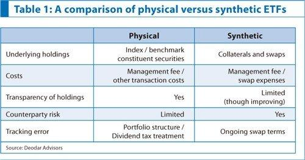

Exchange-traded funds (ETFs) are integral investment vehicles in financial markets, offering diverse and flexible options for investors. Predominantly, ETFs can be categorized into two types: physical ETFs and synthetic ETFs. These distinct forms differ fundamentally in how they track and replicate the performance of their underlying indices.

The article outlines the key differences between physical and synthetic ETFs, focusing on their structures, advantages, and potential risks. Physical ETFs achieve their objectives by purchasing and holding the actual securities constituting the target index, offering transparency and tangible asset ownership. Conversely, synthetic ETFs use derivatives, such as swaps, to replicate index performance, potentially providing cost efficiency and reduced tracking error, yet introducing counterparty risk.

Additionally, the influence of algorithmic trading on the ETF market merits exploration. This technology-driven approach has altered trading dynamics, affected liquidity, and introduced both efficiencies and risks. As algorithmic trading technologies advance, they continue to impact how ETFs are traded and managed.

Investors aiming to navigate the complexities of these financial instruments must grasp their distinct characteristics and adaptability. In this intricate financial landscape, understanding the nuances of ETF types alongside the transformative role of algorithmic trading is crucial for informed investing. This exploration seeks to illuminate these relationships and their implications for investors today and in the future.

## Table of Contents

## Understanding Physical ETFs

Physical ETFs, also known as "cash-based" or "direct replication" ETFs, are investment funds that acquire and hold the precise securities that constitute the index they seek to replicate. This method of investment ensures a high level of transparency, as investors can easily view and verify the individual stocks or bonds included in the ETF's portfolio. By directly owning the underlying assets, investors in physical ETFs have a clear understanding of their investments' composition, offering a straightforward approach to index tracking.

One of the primary benefits of physical ETFs is the diminished risk associated with counterparty exposure. Unlike synthetic ETFs, which rely on derivative instruments such as swaps, physical ETFs do not involve agreements with third parties, thereby eliminating the risk of counterparty default. This aspect makes physical ETFs appealing to risk-averse investors who prioritize security and reliability in their investment choices.

Physical ETFs generally adopt a "buy-and-hold" strategy, meticulously mirroring their benchmark index over time. This approach is particularly advantageous for long-term investors seeking consistent performance that aligns closely with market indices. By maintaining a passive management style, physical ETFs often incur lower operating costs compared to actively managed funds, enhancing their cost-effectiveness for investors.

Several physical ETFs have garnered popularity and widespread use in the investment community. Some well-known examples include the SPDR S&P 500 [ETF](/wiki/etf-trading-strategies) Trust (SPY), which tracks the S&P 500 Index, and the iShares Core MSCI Emerging Markets ETF (IEMG), following the MSCI Emerging Markets Index. These ETFs represent extensive global markets and industry sectors, offering investors diversified exposure alongside the transparency benefits inherent in physical ETFs. As a staple investment vehicle, physical ETFs continue to attract individuals seeking straightforward, long-term market participation without the complexities involved in derivatives-based strategies.

## Decoding Synthetic ETFs

Synthetic Exchange-Traded Funds (ETFs) employ derivatives to emulate the performance of a specific index, rather than owning the underlying assets that constitute the index. This unique approach involves complex financial instruments and structures that offer both benefits and challenges to investors.

### Structural Details

Synthetic ETFs primarily utilize financial derivatives such as swaps to replicate index performance. In a swap agreement, the ETF issuer enters into a contract with a counterparty—usually a financial institution—to exchange the returns of the index for a set fee over a specified period. This mechanism allows the ETF to deliver the required performance without physically holding the assets of the index. 

The swap’s value is derived from the performance of the agreed-upon index, allowing synthetic ETFs flexibility in achieving identical outcomes to their referenced indexes. These contracts can be structured in various forms, including total return swaps and other derivative contracts, depending on the issuer's strategy and market conditions. 

### Advantages

One of the primary advantages of synthetic ETFs is cost efficiency. By avoiding the direct purchase of securities, synthetic ETFs can reduce transaction costs and management fees. This cost-saving ability often results in lower expense ratios compared to physical ETFs. 

Moreover, synthetic ETFs typically offer superior tracking error. Tracking error is the divergence between an ETF’s return and the benchmark index it aims to replicate. As synthetic ETFs rely on swap agreements, they can provide precision in tracking an index without the practical challenges faced by physical funds, such as rebalancing and dividend collection.

### Risks and Mitigation

Despite their advantages, synthetic ETFs come with inherent risks, especially counterparty risk. This risk emerges from reliance on the financial institution involved in the swap agreement. If the counterparty defaults, the ETF may not achieve the desired returns or could incur a loss.

Issuers of synthetic ETFs often mitigate counterparty risk through the use of collateral. By holding collateral from the counterparty, the ETF can absorb losses if the counterparty fails to fulfill its obligations. This collateral is usually placed in a segregated account and is regularly marked to market to ensure it remains adequate.

### Examples and Market Presence

Synthetic ETFs have become popular in certain markets, especially in Europe where regulatory environments and investor preferences make them more viable. Some examples of synthetic ETFs include the WisdomTree Europe Equity Income UCITS ETF and the Lyxor MSCI Emerging Markets UCITS ETF. These ETFs use synthetic replication to efficiently mirror the performance of the MSCI Europe and MSCI Emerging Markets indices, respectively.

The market presence of synthetic ETFs, while notable, is subject to regional preferences and regulatory factors that influence investors’ choices. Their popularity demonstrates an appetite for the cost and efficiency benefits they offer over traditional physical ETFs. 

Overall, while synthetic ETFs provide a compelling option for investors seeking cost-effective and precise tracking of indices, the associated risks necessitate careful assessment and understanding, especially concerning counterparty reliability and collateral management practices.

## Differences Between Physical and Synthetic ETFs

Fundamental differences between physical and synthetic ETFs lie in their composition and management. Physical ETFs directly purchase and hold the actual securities of the index they replicate. This approach provides tangible ownership of assets, ensuring transparency and reduced risk through direct investments. In contrast, synthetic ETFs achieve index performance using derivatives such as swap agreements. These derivatives do not involve owning the underlying assets but rather entering contracts to mirror the index’s returns.

Cost implications vary significantly between the two types. Physical ETFs often incur higher management fees due to costs associated with buying and holding numerous securities, particularly in less liquid markets. Conversely, synthetic ETFs might offer lower management fees because they utilize derivatives instead of physical assets, reducing transaction and custody costs. However, synthetic ETFs may have additional expenses linked to derivative contracts.

Liquidity considerations also play a crucial role in distinguishing between physical and synthetic ETFs. Physical ETFs' [liquidity](/wiki/liquidity-risk-premium) is tied to the liquidity of their underlying assets. This means in times of market stress or in illiquid markets, physical ETFs might face liquidity challenges. Synthetic ETFs, using financial engineering, can maintain liquidity even in markets with less available physical assets. However, their reliance on counterparties introduces different liquidity risks.

Different scenarios suggest when one type might be preferred over the other. Long-term investors or those seeking transparency might favor physical ETFs due to their straightforward asset ownership. Meanwhile, synthetic ETFs could appeal to investors looking for precise tracking of indices with hard-to-trade assets, given their engineered flexibility and efficiency.

The regulatory landscape also differs, impacting investor safety. Physical ETFs are typically subject to stringent regulations due to their asset holdings, offering a layer of protection through oversight. Synthetic ETFs face additional scrutiny around counterparty risk, with regulators imposing collateral requirements to safeguard against defaults. This dual-layered landscape means investors must weigh the trade-offs between direct asset control and the financial innovations of derivatives.

## The Impact of Algorithmic Trading on ETFs

Algorithmic trading refers to the use of computer algorithms to automate the process of executing trading orders in the financial markets. These algorithms can analyze a vast array of market data, identify trading opportunities, and execute trades at speeds and frequencies that are impossible for human traders. Algorithmic trading plays a critical role in modern financial markets by enhancing the speed, efficiency, and accuracy of trading processes.

The influence of [algorithmic trading](/wiki/algorithmic-trading) on the trading [volume](/wiki/volume-trading-strategy) and liquidity of exchange-traded funds (ETFs) is considerable. Algorithms can execute large volumes of ETF trades quickly, contributing to increased market liquidity. This ensures that ETFs can be bought or sold seamlessly, even in large quantities, without significantly affecting their market price. The availability of high liquidity makes ETFs an attractive option for both institutional and retail investors.

Algorithmic trading provides several benefits for ETFs. It enhances market efficiency by ensuring prices reflect available information swiftly and accurately. As a result, discrepancies in ETF pricing due to inefficient markets are minimized. Moreover, algorithmic trading reduces transaction costs associated with trading ETFs. By automating the trading process, it eliminates the need for manual intervention, reducing the time and labor costs associated with executing transactions.

Despite these benefits, algorithmic trading is not without its downsides. One prominent risk is increased market [volatility](/wiki/volatility-trading-strategies). The high-speed nature of algorithmic trading can sometimes lead to sharp and rapid price movements, contributing to market instability. Additionally, algorithmic trading has been linked to 'flash crashes'—sudden, severe drops in security prices followed by a swift recovery, typically within minutes. These events can disrupt the market, leading to significant losses for investors.

Looking toward the future, algorithmic trading is expected to continue evolving, driven by advancements in technology and data analytics. The adoption of [machine learning](/wiki/machine-learning) and [artificial intelligence](/wiki/ai-artificial-intelligence) in algorithmic trading is likely to enhance its predictive capabilities, potentially offering more precise and accurate trade executions. Such advancements could further impact the ETF market by increasing efficiency and possibly reducing risks associated with volatility.

In conclusion, while algorithmic trading presents numerous advantages for the ETF market in terms of efficiency and cost reduction, it also poses significant challenges, such as heightened volatility. As technological innovations progress, the landscape of algorithmic trading is set to transform further, potentially altering the dynamics of the ETF market in unforeseen ways. Investors must continue to stay informed about these trends to make educated decisions about their ETF investments.

## Conclusion

In summarizing the distinctions between physical and synthetic ETFs, alongside the influence of algorithmic trading on the ETF market, several crucial insights emerge. Physical ETFs, characterized by their direct purchase and holding of actual securities, offer transparency and reduced counterparty risks, making them ideal for long-term investments. Conversely, synthetic ETFs employ financial derivatives like swaps to mimic index performance, which allows for cost efficiency and reduced tracking errors but also introduces counterparty risk.

Choosing between physical and synthetic ETFs requires informed decision-making. Investors must consider factors such as underlying risks, cost structures, and investment horizons. Additionally, understanding the regulatory frameworks governing these ETFs is crucial for safeguarding investments.

Algorithmic trading plays a pivotal role in modern investment strategies, influencing the ETF market by enhancing liquidity and trading volumes. It brings about greater market efficiency and lowers transaction costs, yet also poses risks, including increased volatility and the potential for market events like flash crashes. As investors leverage algorithmic trading, recognizing these dual aspects is vital for optimizing market participation and investment outcomes.

Looking ahead, the ETF market is poised for evolution, driven by technological advancements and the increasing sophistication of algorithmic strategies. Staying informed and flexible, and seeking professional guidance, will be key strategies for navigating this dynamic landscape. As the ETF ecosystem evolves, embracing emerging technologies and maintaining a keen awareness of market trends will be essential for capitalizing on new opportunities and ensuring investment success.

## References & Further Reading

[1]: Gastineau, G. L. (2010). ["The Exchange-Traded Funds Manual."](https://onlinelibrary.wiley.com/doi/book/10.1002/9781118266946) Wiley.

[2]: Feldman, B. E., & Roy, A. D. (2004). ["Passive Investment Strategies in Equity Markets."](https://guides.pm-research.com/content/iijetfind/2004/1/72) Financial Analysts Journal.

[3]: ["Exchange-Traded Funds and the New Dynamics of Investing"](https://academic.oup.com/book/3366) by Ananth N. Madhavan

[4]: BlackRock. (2020). ["iShares ETF Investments."](https://www.ishares.com/us/products/etf-investments)

[5]: Johnson, P. (2019). ["Synthetic ETFs: Challenging Further Growth?"](https://www.researchgate.net/publication/330952938_Cooperative_Learning_The_Foundation_for_Active_Learning) Research in International Business and Finance.