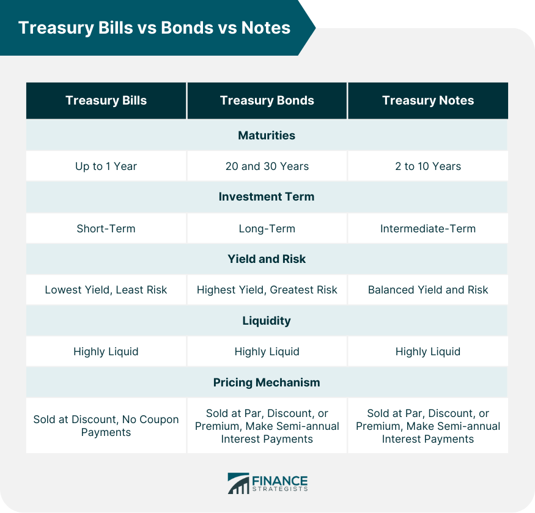

## Table of Contents

## What are U.S. Treasury securities?

U.S. Treasury securities are loans that people and organizations give to the U.S. government. When you buy a Treasury security, you are lending money to the government, and in return, the government promises to pay you back with interest over time. These securities are considered very safe because they are backed by the full faith and credit of the U.S. government, meaning the government will do everything it can to repay the money.

There are different types of Treasury securities, like Treasury bills, notes, and bonds. Treasury bills, or T-bills, are short-term securities that mature in a few days to a year. Treasury notes and bonds are longer-term, with notes maturing in 2 to 10 years and bonds maturing in 20 to 30 years. The interest rates on these securities can vary, but they are generally lower than other types of investments because of their safety. People often buy them to keep their money safe and to get a steady, if small, return on their investment.

## What is the difference between a bond, a bill, and a note?

A bond, a bill, and a note are all types of U.S. Treasury securities, but they differ mainly in how long they last and how they pay interest. A Treasury bill, or T-bill, is a short-term security that lasts from a few days up to one year. T-bills don't pay interest in the usual way; instead, you buy them at a discount and get the full face value back when they mature. For example, if you buy a $1,000 T-bill for $950, you'll get $1,000 back at the end, making your profit $50.

On the other hand, Treasury notes and bonds are longer-term securities. Notes last from 2 to 10 years, while bonds last from 20 to 30 years. Both notes and bonds pay interest every six months until they mature. The main difference between notes and bonds is the length of time they last; bonds are for longer periods. When they mature, you get the face value of the note or bond back. So, if you have a $1,000 note or bond, you'll get $1,000 at the end, plus the interest payments you received along the way.

## How do the maturity periods of U.S. bonds, bills, and notes differ?

U.S. Treasury securities come in different forms, each with its own maturity period. Treasury bills, often called T-bills, are the shortest-term securities. They can mature in as little as a few days or up to one year. When you buy a T-bill, you pay less than its face value and get the full amount back when it matures. For example, you might buy a $1,000 T-bill for $950, and after a few months or a year, you get back the full $1,000.

On the other hand, Treasury notes and bonds have longer maturity periods. Treasury notes last from 2 to 10 years. They pay interest every six months until they reach their maturity date. If you have a $1,000 note, you'll get $1,000 back at the end, plus the interest payments you received along the way. Treasury bonds are even longer-term, lasting from 20 to 30 years. Like notes, they pay interest every six months, and at the end of the term, you get the face value back. So, if you buy a $1,000 bond, you'll receive $1,000 at maturity plus the interest you earned over the years.

## What are the interest rates like for U.S. bonds, bills, and notes?

The interest rates for U.S. Treasury securities can change and depend on different things like how long the security lasts and what's happening with the economy. Treasury bills, or T-bills, don't pay interest like you might think. Instead, you buy them for less than what they're worth and get the full amount back when they're done. So, if you buy a $1,000 T-bill for $950, the difference, $50, is like your interest. The rate can be different for each auction, but T-bills usually have the lowest rates because they're short-term.

Treasury notes and bonds work a bit differently. They pay interest every six months until they reach their end date. The interest rate for notes and bonds can be higher than T-bills because they last longer. Notes last from 2 to 10 years, and bonds last from 20 to 30 years. The longer they last, the higher the interest rate usually is. But even though the rates are higher than T-bills, they're still pretty low compared to other kinds of investments because they're seen as very safe.

## How can someone purchase U.S. bonds, bills, and notes?

You can buy U.S. Treasury securities like bonds, bills, and notes in a few easy ways. One way is to use the TreasuryDirect website, which is run by the U.S. Department of the Treasury. You can set up an account for free, and then you can buy these securities directly from the government. This is a good option if you want to buy them yourself without going through a bank or a broker. When you buy through TreasuryDirect, you can choose exactly which securities you want and how much you want to spend.

Another way to buy Treasury securities is through a bank or a broker. Many banks and investment firms let you buy these securities as part of their services. This can be a good option if you already have an account with them and want to manage all your investments in one place. They might charge you a fee for buying the securities, but they can also help you understand your options and make choices that fit your needs. No matter which way you choose, buying U.S. Treasury securities is a safe way to invest your money.

## What is the minimum investment required for each type of U.S. Treasury security?

The minimum investment for U.S. Treasury securities depends on which type you want to buy. For Treasury bills, notes, and bonds bought through TreasuryDirect, the minimum amount you need to invest is $100. This means you can start investing with just $100 for any of these securities if you buy them directly from the government's website.

If you choose to buy through a bank or a broker, the minimum investment can be different. Some banks and brokers might let you buy for the same $100 minimum, but others might have higher minimums or charge fees. It's a good idea to check with your bank or broker to see what their rules are before you buy.

## How does the risk level vary between U.S. bonds, bills, and notes?

U.S. Treasury securities like bonds, bills, and notes are all considered very safe because they're backed by the U.S. government. This means the government promises to pay you back, so the risk of losing your money is very low. But even though they're all safe, there can be a tiny bit of difference in risk because of how long they last. Treasury bills, or T-bills, are the shortest, lasting up to a year. Because they're so short, they're seen as the safest of the three. If you need your money back quickly, T-bills are a good choice.

Treasury notes and bonds last longer, with notes going from 2 to 10 years and bonds from 20 to 30 years. Because they last longer, there's a tiny bit more risk that something could happen in the economy that might affect their value. But it's still very small. The main thing to think about with notes and bonds is that if you need to sell them before they're done, the price you get might be different from what you paid. This is called interest rate risk. But overall, all these securities are very safe ways to invest your money.

## What are the tax implications of investing in U.S. bonds, bills, and notes?

When you invest in U.S. Treasury securities like bonds, bills, and notes, you need to think about taxes. The interest you earn from these securities is usually not taxed by state or local governments. This is a big plus because it means you keep more of your money. But, the interest is still taxed by the federal government. So, you'll need to report the interest you earn on your federal tax return and pay federal income tax on it.

Another thing to know is that if you buy these securities at a discount and sell them before they mature, you might have to pay capital gains tax on the profit. This is different from the interest tax because it's based on how much the value of the security went up while you owned it. But if you hold onto the security until it matures, you won't have to worry about capital gains tax. Just remember, even though the tax rules can be a bit tricky, U.S. Treasury securities are still a safe and often tax-friendly way to invest your money.

## How do U.S. bonds, bills, and notes fit into a diversified investment portfolio?

U.S. bonds, bills, and notes are great for making your investment portfolio more diverse. They are very safe because they're backed by the U.S. government, which means they can help balance out riskier investments like stocks. If the stock market goes down, your Treasury securities might still be worth the same or even go up a little. This can help keep your overall investment from losing too much value. Plus, since they pay interest regularly, they can give you a steady income, which is nice if you need money coming in all the time.

These securities also help you spread out your investments over different times. T-bills are short-term and good if you need your money back soon. Notes and bonds last longer, so they're good if you can leave your money invested for a while. By having a mix of these, you can match your investments to when you'll need the money. This way, you're not putting all your eggs in one basket, and you can feel more secure about your financial future.

## What is the impact of inflation on U.S. bonds, bills, and notes?

Inflation can affect U.S. bonds, bills, and notes by making the money you get back worth less than when you invested it. When inflation goes up, the prices of things like food and gas go up too. If the interest you earn from your Treasury securities doesn't go up as fast as inflation, then the real value of your money goes down. For example, if you earn 2% interest but inflation is 3%, you're actually losing buying power even though you're getting interest.

To help with this, the U.S. government also offers Treasury Inflation-Protected Securities, or TIPS. TIPS are a special kind of bond that adjusts the interest you earn based on inflation. This means if inflation goes up, the value of your TIPS goes up too, so your money keeps its value better. Regular Treasury bonds, bills, and notes don't do this, so they can be more affected by inflation. But even with regular securities, they're still seen as safe investments, and many people use them as part of a plan to protect their money from inflation over time.

## How do secondary markets function for U.S. bonds, bills, and notes?

Secondary markets for U.S. bonds, bills, and notes are places where people can buy and sell these securities after they've been sold by the government. If you bought a Treasury security and need your money back before it matures, you can sell it to someone else on a secondary market. These markets are like big trading floors where lots of buyers and sellers come together. They can be run by banks, brokers, or special electronic systems that help match people who want to sell with people who want to buy. The price of the security can go up or down based on what's happening in the economy and how much people want to buy or sell it.

The price you get on a secondary market might be different from what you paid when you bought the security. If interest rates have gone up since you bought your bond, bill, or note, the price might go down because new securities with higher interest rates are more attractive to buyers. On the other hand, if interest rates have gone down, the price of your security might go up because people will want to buy it for its higher interest rate. This is something to think about if you need to sell your security before it matures. Even though the price might change, secondary markets give you a way to turn your investment into cash when you need it.

## What are TIPS (Treasury Inflation-Protected Securities) and how do they differ from regular bonds, bills, and notes?

TIPS, or Treasury Inflation-Protected Securities, are a special kind of bond that the U.S. government offers to help protect your money from inflation. Inflation is when prices for things like food and gas go up, making your money worth less over time. TIPS are different because they adjust the amount of interest you earn based on how much inflation goes up. So, if inflation goes up, the value of your TIPS goes up too, helping your money keep its buying power. You can buy TIPS in terms of 5, 10, or 30 years, and like other Treasury securities, they pay interest every six months.

Regular U.S. Treasury bonds, bills, and notes don't adjust for inflation. If you buy a regular bond, bill, or note, the interest you get stays the same no matter what happens with inflation. This means if inflation goes up a lot, the real value of the money you get back might be less than what you expected. T-bills last up to a year, notes last from 2 to 10 years, and bonds last from 20 to 30 years. They're all safe investments backed by the U.S. government, but they don't have the extra protection against inflation that TIPS provide.

## References & Further Reading

[1]: ["U.S. Treasury Securities"] (https://www.treasurydirect.gov/indiv/research/indepth/ibonds/res_ibonds.htm) - TreasuryDirect.gov

[2]: ["Advances in Financial Machine Learning"](https://www.amazon.com/Advances-Financial-Machine-Learning-Marcos/dp/1119482089) by Marcos Lopez de Prado

[3]: Hendershott, T., Jones, C. M., & Menkveld, A. J. (2011). ["Does Algorithmic Trading Improve Liquidity?"](https://onlinelibrary.wiley.com/doi/full/10.1111/j.1540-6261.2010.01624.x) The Journal of Finance.

[4]: ["Machine Learning for Algorithmic Trading"](https://github.com/stefan-jansen/machine-learning-for-trading) by Stefan Jansen

[5]: Kaminska, I. (2010). ["The Impact of High-Frequency Trading on the Markets."](https://link.springer.com/article/10.1007/s12599-022-00768-6) Financial Times

[6]: Securities Industry and Financial Markets Association (SIFMA). ["U.S. Treasury Securities Basics"](https://www.sifma.org/)

[7]: ["Quantitative Trading: How to Build Your Own Algorithmic Trading Business"](https://www.amazon.com/Quantitative-Trading-Build-Algorithmic-Business/dp/1119800064) by Ernest P. Chan

[8]: Aldridge, I. (2013). ["High-Frequency Trading: A Practical Guide to Algorithmic Strategies and Trading Systems."](https://www.ahmetbeyefendi.com/wp-content/uploads/2020/07/High-Frequency-Trading-Irene-Aldridge.pdf) Wiley Trading Series.