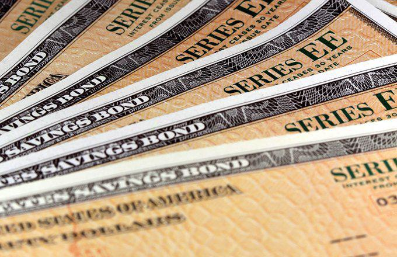

U.S. bonds, Treasury notes, and Treasury bills are fundamental components of the global financial landscape. They represent debt securities issued by the U.S. Department of the Treasury to help fund governmental expenditures. In particular, U.S. bonds typically refer to longer-term debt instruments with maturities exceeding ten years, whereas Treasury notes have maturities ranging from two to ten years, and Treasury bills have maturities of one year or less. Each of these instruments serves distinct functions and attracts various investors based on their financial goals and liquidity preferences.

These securities are crucial to the global economy, serving as benchmarks for risk-free rates and influencing a wide range of interest rates. They are a core component in monetary policy transmission, providing a platform for the Federal Reserve's open market operations, which are key in managing economic stability and inflation targets. Additionally, because they are considered some of the safest investments available, they are heavily favored by investors around the world, including foreign governments, as they offer a reliable store of value.



Algorithmic trading, defined as the use of computer algorithms to execute trading strategies with high efficiency and speed, has revolutionized financial markets over recent decades. Its rise has been fueled by advances in technology, increasing market complexity, and the demand for rapid trade execution. In U.S. Treasury securities, algorithmic trading plays a significant role, enabling market participants to navigate vast volumes of data to optimize their trading strategies and improve liquidity.

This article aims to explore the interplay between these financial instruments and the evolving practice of algorithmic trading. Readers can expect to gain a fundamental understanding of U.S. Treasury securities and their role in the financial system, insights into the mechanisms of algorithmic trading, and an analysis of how these elements come together in the modern market. The discussion will further highlight the advantages, challenges, and future prospects of algorithmic trading in U.S. Treasury markets, helping investors and financial professionals stay informed and strategically positioned.

## Table of Contents

## Understanding U.S. Bonds, Treasury Notes, and Treasury Bills

U.S. bonds, Treasury notes, and Treasury bills represent crucial elements of the country's financial structure, serving as fundamental investment instruments recognized worldwide. Each category plays a unique role in the market, reflecting distinct features and purposes that cater to various investor preferences and economic functions.

### Definition and Key Characteristics of U.S. Bonds

U.S. bonds are long-term fixed-income securities issued by the U.S. Department of the Treasury. They typically have maturities exceeding ten years and pay semi-annual interest to their holders. The principal is returned to the investors at maturity. The primary characteristic of U.S. bonds is their safety and reliability, as they are backed by the full faith and credit of the U.S. government. Consequently, they are considered a low-risk investment, appealing to risk-averse investors looking for stable returns over substantial periods.

### Treasury Notes and Their Distinctiveness

Treasury notes, often called T-notes, are government debt securities with maturities ranging from two to ten years. Like bonds, T-notes pay semi-annual interest at a fixed rate, determined at auction, and return the principal upon maturity. The key difference between Treasury notes and other bonds lies in their maturity period. T-notes offer a mid-term investment option, attracting those who prefer a balance between regular income and relatively liquid investment. The yield offered by T-notes is generally higher than that of Treasury bills but lower than long-term bonds, reflecting their position within the maturity spectrum.

### Insight into Treasury Bills and Their Economic Role

Treasury bills (T-bills) are short-term securities that mature within a year, sold at a discount from their face value. Unlike bonds and notes, T-bills do not pay periodic interest. Instead, the investor earns the difference between the purchase price and the value at maturity, effectively generating a return through capital appreciation. T-bills play a pivotal role in the financial economy by providing a secure, liquid, and easily transferable asset for investors seeking short-term commitment and minimal risk. Their yield is typically lower due to their short investment horizon and higher [liquidity](/wiki/liquidity-risk-premium).

### Comparison Between Treasury Notes and Treasury Bills

While both Treasury notes and bills are essential to the U.S. Treasury securities market, they offer different advantages based on their characteristics and investment objectives. Treasury notes cater to investors looking for a stable income over a medium-term horizon, with greater yields compared to the extremely low-risk, short-term Treasury bills. On the other hand, T-bills appeal to those prioritizing liquidity and minimal exposure to changing interest rates. 

In summary, U.S. bonds, Treasury notes, and Treasury bills each offer unique features and benefits, making them instrumental in maintaining economic stability and providing diverse investment opportunities. In understanding these instruments, investors can make informed decisions that align with their financial goals and risk tolerance.

## The Role of U.S. Treasury Securities in the Economy

U.S. Treasury securities, including bonds, notes, and bills, play a vital role in the economic framework of both the United States and the global economy. Their influence extends across various economic parameters, impacting stability, investor behavior, and the broader financial market.

U.S. government securities underpin economic stability primarily by providing a reliable source of funding for the federal government. When the government issues these securities, it effectively borrows money from investors with the promise to repay with interest. This borrowing is crucial for financing government spending without the immediate need to increase taxes. Such fiscal flexibility allows for economic stability, particularly during times of economic downturns or unexpected fiscal challenges.

Individual and institutional investors widely use Treasury securities as they are considered one of the safest investments. Backed by the full faith and credit of the U.S. government, these securities present minimal default risk, making them an attractive option for risk-averse investors. For individual investors, Treasury securities offer a secure means of [earning](/wiki/earning-announcement) predictable returns. Institutional investors, such as pension funds, insurance companies, and banks, leverage these securities for portfolio diversification, liquidity management, and as collateral in various financial transactions.

The influence of Treasury securities on interest rates and monetary policy is significant. The yield on these securities is often regarded as a benchmark for other interest rates in the economy, including mortgages, corporate bonds, and other loan products. When Treasury yields rise, borrowing costs for the private sector typically increase, which can dampen economic activity. Conversely, lower yields can stimulate borrowing and spending. Moreover, the Federal Reserve's monetary policy often involves the buying and selling of Treasury securities to control the money supply and exert influence over short-term interest rates. Through open market operations, the Fed targets a specific [interest rate](/wiki/interest-rate-trading-strategies), influencing economic growth and inflation.

The market size and liquidity of U.S. government securities are noteworthy. As one of the largest and most liquid financial markets globally, Treasury securities offer unparalleled liquidity. This liquidity allows for the ease of buying and selling without significantly impacting prices, which is beneficial for both investors and the government. According to the Securities Industry and Financial Markets Association (SIFMA), the U.S. Treasury market is the deepest and most liquid government securities market in the world. High liquidity further enhances the attractiveness of these securities, as investors are assured of their ability to quickly convert assets into cash.

In summary, U.S. Treasury securities are essential instruments in maintaining economic stability, influencing interest rates and monetary policy, and providing a secure haven for both individual and institutional investors. Their vast market and liquidity highlight their significance within both domestic and international financial systems.

 to Algorithmic Trading

**Algorithmic trading** refers to the use of computer programs and systems to execute a variety of trading strategies in financial markets. This form of trading leverages algorithms for making automated trading decisions, primarily relying on pre-defined rules and quantitative analysis. 

### Definition and Basic Principles

Algorithmic trading involves executing orders using automated pre-programmed trading instructions, accounting for variables such as timing, price, and [volume](/wiki/volume-trading-strategy). Its fundamental principle is to exploit tiny market inefficiencies at a speed and frequency that human traders cannot match. Key elements include data collection, strategy formulation, back-testing, and implementation.

- **Data Collection**: Algorithms analyze vast amounts of historical and real-time data to make informed trading decisions.
- **Strategy Formulation**: Traders develop mathematical models to create strategies which algorithms follow.
- **Back-Testing**: Algorithms are tested on historical data to ensure their viability and effectiveness in various market conditions.
- **Execution**: The strategy is executed in the market, often involving large-scale buying or selling activities.

### Evolution and Growth

The growth of [algorithmic trading](/wiki/algorithmic-trading) has been profound, tracing back to the 1970s after the introduction of electronic communication networks (ECNs) that allowed automated transactions. Over the decades, technological advancements have fueled its expansion, making it integral to modern financial markets. Today, algorithmic trading accounts for a considerable portion of the trading volume in many developed markets, including U.S. Treasury securities.

### Types of Algorithms Used in Trading U.S. Treasury Securities

Trading in U.S. Treasury securities employs several types of algorithmic strategies:

- **Execution Algorithms**: These are designed to execute large orders by breaking them into smaller chunks to minimize market impact and price slippage. Common examples include the Volume Weighted Average Price (VWAP) and Time Weighted Average Price (TWAP) algorithms.

- **Arbitrage Algorithms**: These exploit price differentials between related assets, such as different Treasury securities or Treasury securities and related interest rate derivatives.

- **Market Making Algorithms**: These algorithms provide liquidity to the market by continuously quoting buy and sell prices, benefiting from the bid-ask spread.

### Benefits Over Traditional Trading

Algorithmic trading offers numerous advantages compared to traditional methods:

1. **Speed**: Algorithms can analyze data and execute trades in milliseconds, far surpassing human capabilities.
2. **Accuracy**: Reduces the human error factor by adhering strictly to the pre-set conditions.
3. **Cost Efficiency**: By minimizing manual intervention, operational costs are reduced.
4. **Consistency**: Algorithms ensure consistent strategy execution, free from emotional and psychological biases.
5. **Market Reach**: Allows traders to execute strategies across various markets and instruments simultaneously.

In conclusion, algorithmic trading has revolutionized the approach to trading U.S. Treasury securities, making it faster, more precise, and more efficient. As the field continues to evolve, it's set to play an increasingly critical role in financial markets globally.

## Algorithmic Trading Strategies for U.S. Treasury Securities

Algorithmic trading has revolutionized the trading of U.S. Treasury securities, offering sophisticated strategies to capitalize on market inefficiencies. Various methodologies are deployed by traders to improve returns while managing risks effectively. This section outlines key algorithmic trading strategies used in the market for U.S. Treasury securities, including high-frequency trading, [momentum](/wiki/momentum) and reversion strategies, and statistical [arbitrage](/wiki/arbitrage).

### High-Frequency Trading in U.S. Treasury Markets

High-frequency trading ([HFT](/wiki/high-frequency-trading-strategies)) involves executing a large number of orders at extremely high speeds. In U.S. Treasury markets, HFT seeks to exploit minute price discrepancies, relying on complex algorithms to make rapid trading decisions. The primary advantage of HFT is its ability to process vast amounts of data almost instantaneously, making numerous trades within fractions of a second.

Key HFT techniques include market-making, where algorithms provide liquidity by continuously quoting buy (bid) and sell (ask) prices, and executing trades as market conditions change. Arbitrage opportunities between different Treasury securities or between Treasuries and related financial instruments are also prevalent in HFT. Implementing HFT requires significant technological infrastructure, emphasizing low-latency data transmission and execution speed.

### Momentum and Reversion Strategies

Momentum strategies in algorithmic trading assume that securities that have been performing well will continue to do so in the short term. Conversely, mean reversion strategies are based on the premise that securities will revert to their historical average prices. Applied to U.S. Treasury securities, these strategies involve analyzing the price trends and identifying patterns indicative of future price action.

Momentum traders might use moving averages to detect upward or downward trends. An algorithm might execute a buy order when a short-term moving average crosses above a long-term moving average, signaling upward momentum. For reversion strategies, algorithms would identify when Treasury securities prices deviate significantly from their historical mean, then initiate trades betting on a return to the mean.

Python example of a simple moving average crossover strategy:

```python
def moving_average(data, window_size):
    return data.rolling(window=window_size).mean()

def generate_signals(prices):
    short_ma = moving_average(prices, window_size=5)
    long_ma = moving_average(prices, window_size=20)
    buy_signals = (short_ma > long_ma) & (short_ma.shift(1) <= long_ma.shift(1))
    sell_signals = (short_ma < long_ma) & (short_ma.shift(1) >= long_ma.shift(1))
    return buy_signals, sell_signals

# 'prices' should be a pandas Series of Treasury security prices
buy_signals, sell_signals = generate_signals(prices)
```

### Statistical Arbitrage Concerning Treasury Securities

Statistical arbitrage relies on sophisticated mathematical models to identify and exploit short-term mispricings between related securities. This strategy assumes a certain statistical relationship between securities or market segments, which algorithms can model to detect anomalies.

For U.S. Treasury securities, [statistical arbitrage](/wiki/statistical-arbitrage) might involve pairs trading, where algorithms track the price relationship between two correlated Treasury issues. If the prices deviate from their historical correlation, an algorithm would simultaneously short the overvalued security and buy the undervalued one, betting on a convergence back to the norm.

Mathematically, statistical arbitrage often uses the concept of cointegration, a statistical property where two or more time series move together in the long run. A simple representation of a cointegration test in Python might utilize statistical packages such as `statsmodels`:

```python
from statsmodels.tsa.stattools import coint

def cointegration_test(series1, series2):
    score, p_value, _ = coint(series1, series2)
    return p_value < 0.05

# 'series1' and 'series2' are pandas Series of two Treasury security prices
is_cointegrated = cointegration_test(series1, series2)
```

These strategies illustrate the transformative role of algorithmic trading in efficiently managing and optimizing trades within the U.S. Treasury markets. As technology evolves, the sophistication and prevalence of these strategies are expected to grow, contributing to more dynamic and efficient financial markets.

## Challenges and Risks of Algo Trading in U.S. Treasury Markets

Algorithmic trading, while revolutionizing the speed and efficiency of markets, also brings with it notable challenges and risks, particularly in the U.S. Treasury markets. Understanding these is vital for both market participants and regulators to maintain market stability and integrity.

One of the foremost concerns is the regulatory landscape. Algorithmic trading blurs traditional boundaries, necessitating a robust framework to ensure compliance. The U.S. Securities and Exchange Commission (SEC) and the Commodity Futures Trading Commission (CFTC) are primary regulators overseeing these activities. They face the challenge of keeping regulations updated in the face of rapidly evolving technology. Compliance issues arise when firms fail to adhere to guidelines meant to prevent market abuse, such as those targeting spoofing and layering—strategies where traders place orders with no intention of executing them, to mislead other market participants.

Technical challenges also play a significant role. Latency, the delay before a transfer of data begins following an instruction, can severely impact algorithmic trading performance. In a market where milliseconds can determine the difference between profit and loss, reducing latency is crucial. High-frequency trading, a form of algorithmic trading, is particularly sensitive to variations in latency, necessitating cutting-edge infrastructure and technology.

Moreover, data accuracy is paramount. Algorithms rely on vast amounts of data to make trading decisions, and discrepancies or errors in this data can lead to incorrect trading signals, resulting in potential financial losses. Ensuring data integrity requires sophisticated systems capable of cross-verifying data streams in real time.

Market manipulation is another critical concern. Algorithmic trading systems can inadvertently or deliberately amplify market movements, potentially leading to flash crashes—sudden, severe market price declines followed by a rapid recovery. The flash crash on May 6, 2010, serves as a stark reminder of how algorithmic trading can exacerbate market [volatility](/wiki/volatility-trading-strategies). This event saw the Dow Jones Industrial Average plunge about 1,000 points within minutes, only to recover much of the loss shortly thereafter.

The complexity of these trading algorithms makes it challenging to predict their behavior under stress conditions, raising the risk of unintended consequences. To mitigate these risks, firms must implement rigorous testing and safeguards, including circuit breakers and kill switches, which halt trading under predefined conditions to prevent catastrophic outcomes.

In summary, algorithmic trading in U.S. Treasury markets offers significant benefits but also entails substantial risks and challenges. Addressing these through comprehensive regulations, cutting-edge technology, and robust risk management practices is essential to harness the potential of these powerful trading tools while safeguarding market stability.

## The Future of Algorithmic Trading in U.S. Treasury Markets

Algorithmic trading in U.S. Treasury markets is poised for significant transformation, driven by emerging trends and technological advancements. As financial markets continue to evolve, the integration of advanced technologies, such as [artificial intelligence](/wiki/ai-artificial-intelligence) (AI) and [machine learning](/wiki/machine-learning) (ML), plays an increasingly crucial role in enhancing trading strategies for Treasury securities.

Artificial intelligence and machine learning are at the forefront of this technological shift. These technologies enable the analysis of vast datasets to identify patterns and optimize trading strategies, which is particularly valuable in the highly liquid and fast-paced U.S. Treasury market. Machine learning algorithms can be employed to predict price movements and make real-time trading decisions, thereby increasing the efficiency and profitability of trading operations. For instance, supervised learning models, such as regression analysis and neural networks, can be used to predict future prices based on historical data, while unsupervised learning can help detect market anomalies and trends.

The integration of AI and ML also offers the potential for developing sophisticated risk management strategies. By analyzing historical data and market conditions, these technologies can assess the risk associated with specific trades and adapt trading strategies accordingly. Such applications are critical in ensuring the stability and profitability of algorithmic trading systems in dynamic market environments.

Regulations and market changes also have a significant impact on the future of algorithmic trading in Treasury markets. Regulatory bodies continue to scrutinize algorithmic trading practices to ensure market integrity and protect against potential risks, such as market manipulation and flash crashes. New regulations could impose stringent requirements on trading algorithms, mandating transparency and robustness checks. This regulatory backdrop necessitates that trading firms develop compliant trading systems that can operate within the evolving legal framework.

Moreover, market changes, such as the evolution of trading platforms and the introduction of new financial instruments, present both challenges and opportunities. For instance, the increasing adoption of electronic trading platforms enhances market accessibility and data availability, enabling more participants to engage in algorithmic trading. This expanded participation can lead to increased market liquidity and price efficiency for Treasury securities. However, it also intensifies competition among traders, underscoring the need for continuous innovation and adaptation of trading strategies.

Growth opportunities and innovations are on the horizon for algorithmic trading in U.S. Treasury markets. With ongoing advancements in technology, trading firms have the chance to harness big data analytics, cloud computing, and blockchain technology to further enhance their trading systems. Big data analytics allows for the processing and analysis of larger and more complex datasets, improving the precision of trading algorithms. Cloud-based solutions offer scalable and cost-effective infrastructure for managing trading operations, while blockchain technology ensures secure and transparent trade settlement processes.

Overall, the future of algorithmic trading in U.S. Treasury markets is largely shaped by technological advancements, regulatory developments, and evolving market conditions. While these factors present both challenges and opportunities, they collectively contribute to a more sophisticated and efficient trading ecosystem. Market participants who can effectively integrate these technologies and adapt to regulatory changes are likely to thrive in the future landscape of Treasury trading.

## Conclusion

The article has navigated through the intricacies of U.S. bonds, Treasury notes, and Treasury bills, elucidating their roles in supporting economic stability and functioning as vital components in monetary policy and investment strategies. These government securities are central to the global economy, providing a safe haven for investors and influencing interest rates worldwide. Concurrently, the rise of algorithmic trading has revolutionized how these securities are traded, offering enhanced speed, efficiency, and precision.

Algorithmic trading leverages advanced algorithms and technology to make faster and more informed trading decisions, optimizing the trade of Treasury securities. Its significance lies in the ability to execute large volumes of trades with reduced human error, thus improving liquidity and price efficiency in the markets. Various strategies, such as high-frequency trading, momentum, and statistical arbitrage, showcase the diverse approaches traders can employ to capitalize on market opportunities presented by Treasury securities.

However, with the opportunities brought forth by algorithmic trading, there are inherent risks and challenges. Market participants must navigate potential pitfalls such as technical failures, data inaccuracies, and the risk of market manipulation, which could lead to phenomena such as flash crashes. Regulatory frameworks are continually adapting to address these concerns, ensuring that the evolution of algorithmic trading is in tandem with market integrity and stability.

In conclusion, the balance between harnessing the opportunities presented by algorithmic trading and managing its associated risks is pivotal. As technology continues to advance, market participants are encouraged to stay informed and compliant with regulatory standards to leverage the benefits while safeguarding against potential disruptions. The integration of artificial intelligence and machine learning in trading presents a future landscape of innovation and efficiency, necessitating readiness and adaptability for success in the ever-evolving financial markets.

## References & Further Reading

[1]: ["U.S. Treasury Securities"] (https://www.treasurydirect.gov/indiv/research/indepth/ibonds/res_ibonds.htm) - TreasuryDirect.gov

[2]: ["Advances in Financial Machine Learning"](https://www.amazon.com/Advances-Financial-Machine-Learning-Marcos/dp/1119482089) by Marcos Lopez de Prado

[3]: Hendershott, T., Jones, C. M., & Menkveld, A. J. (2011). ["Does Algorithmic Trading Improve Liquidity?"](https://onlinelibrary.wiley.com/doi/full/10.1111/j.1540-6261.2010.01624.x) The Journal of Finance.

[4]: ["Machine Learning for Algorithmic Trading"](https://github.com/stefan-jansen/machine-learning-for-trading) by Stefan Jansen

[5]: Kaminska, I. (2010). ["The Impact of High-Frequency Trading on the Markets."](https://link.springer.com/article/10.1007/s12599-022-00768-6) Financial Times

[6]: Securities Industry and Financial Markets Association (SIFMA). ["U.S. Treasury Securities Basics"](https://www.sifma.org/)

[7]: ["Quantitative Trading: How to Build Your Own Algorithmic Trading Business"](https://www.amazon.com/Quantitative-Trading-Build-Algorithmic-Business/dp/1119800064) by Ernest P. Chan

[8]: Aldridge, I. (2013). ["High-Frequency Trading: A Practical Guide to Algorithmic Strategies and Trading Systems."](https://www.ahmetbeyefendi.com/wp-content/uploads/2020/07/High-Frequency-Trading-Irene-Aldridge.pdf) Wiley Trading Series.