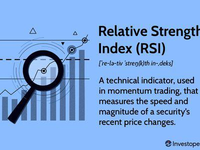

to Williams %R and RSI Indicators

Williams %R and Relative Strength Index (RSI) are prominent momentum indicators used in financial markets to assess the pace at which prices change. They provide traders with insights into potential market reversals by identifying overbought and oversold conditions. Williams %R, developed by Larry Williams in the 1970s, offers a measure of the current closing price in relation to the high and low of a specific historical range, typically 14 periods. Its formula is given by:



$$
\text{Williams \%R} = \frac{\text{Highest High} - \text{Close}}{\text{Highest High} - \text{Lowest Low}} \times -100
$$

where the "Highest High" and "Lowest Low" denote the highest and lowest prices over the defined period.

The RSI, on the other hand, was developed by J. Welles Wilder in 1978 and is designed to identify the strength and speed of price movements through the ratio of upward price changes to downward price changes over a specific time frame. The formula for RSI is:

$$
\text{RSI} = 100 - \left( \frac{100}{1 + \text{RS}}} \right)
$$

RS, or Relative Strength, is the average gain of up periods during the specified time frame divided by the average loss of down periods.

In the context of algorithmic trading, understanding these indicators is crucial as they aid in decision-making processes by providing signals for entry and exit points. Algorithmic trading refers to the use of automation to execute trades based on pre-defined strategies, often harnessing technical indicators such as Williams %R and RSI to generate buy or sell signals. The integration of these indicators into algorithmic frameworks can enhance the precision and objectivity of trading strategies, thereby optimizing financial outcomes.

The purpose of this article is to explore the practical applications of Williams %R and RSI in developing effective trading strategies. By understanding their calculation methods, interpretation, and contextual usage, traders can better navigate market dynamics and refine their trading approaches. Readers will learn the fundamental aspects of both indicators, their differences, how to incorporate them into trading systems, and see practical examples and case studies that demonstrate successful utilization.

## Table of Contents

## Understanding Williams %R Indicator

The Williams %R indicator, often referred to simply as %R, is a [momentum](/wiki/momentum) oscillator developed by Larry Williams. It measures the level of the close relative to the highest high for a specific look-back period, typically 14 days, and it is designed to detect overbought and oversold conditions in a financial market. Unlike other momentum indicators that move between 0 and 100, the range for Williams %R is between -100 and 0.

### Calculation Methodology

The calculation of the Williams %R indicator is based on the following formula:

$$
\text{Williams %R} = \left( \frac{\text{Highest High} - \text{Close}}{\text{Highest High} - \text{Lowest Low}} \right) \times -100
$$

Where:
- **Highest High** is the highest price over the look-back period.
- **Lowest Low** is the lowest price over the look-back period.
- **Close** is the most recent closing price.

For example, consider a 14-day time frame. If the highest high is 150, the lowest low is 120, and the latest closing price is 145, then the Williams %R is calculated as:

$$
\text{Williams %R} = \left( \frac{150 - 145}{150 - 120} \right) \times -100 = -16.67
$$

### Interpreting Williams %R Values

Williams %R values oscillate between -100 and 0, with specific levels used to identify overbought and oversold conditions. Values closer to 0 suggest the asset might be overbought, while those closer to -100 indicate potential oversold conditions. Typically, a reading above -20 suggests the asset is overbought, and below -80 indicates that it is oversold.

### Common Time Frames and Settings

Traders commonly use a 14-day period for calculating Williams %R, although this can be adjusted based on the individual asset being analyzed and the trader's strategy. Shorter periods might be used for more volatile assets to capture quicker shifts in momentum, whereas longer periods could be utilized for a smoother indicator line and fewer false signals.

### Advantages and Limitations

**Advantages:**
- Simplicity: Williams %R is simple to calculate and interpret, making it accessible even for novice traders.
- Timing: It can help traders pinpoint potential entry and exit points in a range-bound market.
- Flexibility: The indicator can be used across various asset classes, including stocks, currencies, and commodities.

**Limitations:**
- False Signals: Like many momentum-based indicators, Williams %R can produce false signals, especially in highly volatile markets.
- Context Dependency: The interpretation of overbought and oversold conditions might vary depending on the broader market context and trend direction. In strong trends, the indicator may remain in overbought or oversold territory for extended periods without a reversal.
- Need for Confirmation: It is often recommended to use Williams %R in conjunction with other indicators or technical patterns to confirm its signals.

Understanding the Williams %R indicator's calculation, interpretation, and practical application is crucial for effectively incorporating it into trading strategies and enhancing decision-making processes.

## Exploring the Relative Strength Index (RSI)

The Relative Strength Index (RSI) is a popular momentum oscillator developed by J. Welles Wilder, introduced in his seminal 1978 book, "New Concepts in Technical Trading Systems." RSI measures the speed and change of price movements and is commonly used to identify overbought or oversold conditions in a market.

### Calculation Process for RSI

RSI is calculated using the formula:

$$
RSI = 100 - \frac{100}{1 + RS}
$$

where $RS$ (Relative Strength) is the average of $x$ days' up closes divided by the average of $x$ days' down closes. The default and most commonly used period is 14 days. The steps to compute RSI are:

1. Calculate the daily price changes.
2. Separate the positive changes and negative changes.
3. Compute the average gain and average loss over the specified period.
4. Calculate the RS, which is the average gain divided by the average loss.
5. Use the RS value to compute the RSI.

For example, let's compute a 14-day RSI:

```python
import pandas as pd

# Sample data: A list of daily closing prices
prices = [45, 46, 47, 48, 49, 48, 47, 45, 44, 46, 47, 48, 49, 50, 51]

# Create a DataFrame
df = pd.DataFrame(prices, columns=['Close'])

# Calculate daily price changes
df['Change'] = df['Close'].diff()

# Separate positive and negative gains
df['Gain'] = df['Change'].apply(lambda x: x if x > 0 else 0)
df['Loss'] = df['Change'].apply(lambda x: abs(x) if x < 0 else 0)

# Calculate average gain and loss
period = 14
df['Avg Gain'] = df['Gain'].rolling(window=period, min_periods=1).mean()
df['Avg Loss'] = df['Loss'].rolling(window=period, min_periods=1).mean()

# Calculate RS and RSI
df['RS'] = df['Avg Gain'] / df['Avg Loss']
df['RSI'] = 100 - (100 / (1 + df['RS']))

# Display the RSI
print(df['RSI'])
```

### Understanding RSI Values

RSI values range from 0 to 100. Traditionally, an RSI above 70 is considered overbought, implying that the asset is potentially overvalued and may be due for a price correction or pullback. Conversely, an RSI below 30 is viewed as oversold, suggesting that the asset may be undervalued and primed for a potential price increase.

### Adjusting RSI Settings

While the default period of 14 days is widely used, traders often adjust the RSI period to fit different market conditions and trading styles. Shorter periods, such as 7 or 9 days, increase the sensitivity of the RSI, leading to more frequent trading signals. Longer periods, such as 20 or 30 days, reduce the number of signals, potentially resulting in more reliable but less frequent indications.

### Pros and Cons of RSI as a Standalone Indicator

#### Pros

- **Simplicity**: RSI is straightforward to calculate and interpret.
- **Versatility**: RSI can be applied to various asset classes and time frames.
- **Effectiveness**: It reliably identifies overbought and oversold conditions, helping traders make buy or sell decisions.

#### Cons

- **False Signals**: In strongly trending markets, RSI may signal overbought or oversold conditions prematurely.
- **Lagging Nature**: As RSI is based on past prices, it may lag behind the actual market conditions.
- **Limited Scope**: RSI does not account for other important market factors like volatility or volume.

In summary, while the RSI is a robust tool for evaluating momentum, traders often combine it with other indicators or analytical methods to confirm signals and create a more comprehensive trading strategy.

## Comparative Analysis: Williams %R vs RSI

Williams %R and the Relative Strength Index (RSI) are widely used momentum indicators in trading, each possessing unique methodologies and interpretations.

**Key Differences in Calculation Methodologies**

Williams %R, developed by Larry Williams, measures the level of the close relative to the high-low range over a specified period. The formula for Williams %R is:

$$
\text{Williams } \%R = \frac{\text{Highest High} - \text{Close}}{\text{Highest High} - \text{Lowest Low}} \times -100
$$

Typically calculated over 14 periods, Williams %R oscillates between -100 and 0. A reading closer to 0 indicates that the asset is trading near the high of its range, suggesting overbought conditions. Conversely, a reading closer to -100 implies oversold conditions.

The RSI, formulated by J. Welles Wilder, measures the speed and change of price movements. Its formula is:

$$
\text{RSI} = 100 - \left(\frac{100}{1 + RS}\right)
$$

where RS (Relative Strength) is the average of x periods' closes up divided by the average of x periods' closes down. RSI values range from 0 to 100, with a common interpretation that readings above 70 indicate overbought conditions and below 30 suggest oversold conditions.

**Contrast in Oscillation Ranges and Interpretation of Signals**

Williams %R and RSI both serve to identify potential reversal points but differ in their signal ranges. Williams %R's range is fixed between -100 and 0, straightforwardly indicating overbought (-20 or higher) and oversold (-80 or lower) states. RSI, on the other hand, uses a scale from 0 to 100, with threshold levels typically set at 70 for overbought and 30 for oversold.

**Scenarios Where One Might Be Preferred Over the Other**

Williams %R might be more suitable for traders looking for quick, short-term signals due to its sensitivity to price changes within a defined range. It's especially useful in volatile markets where rapid oscillations present frequent trading opportunities.

RSI, with its smoothed calculation of price changes, is often favored in trending markets as it filters out noise and provides more stable signals, making it advantageous for medium to long-term strategies.

**Application in Different Market Environments and Trading Styles**

In range-bound markets, traders may find Williams %R to be highly effective as it quickly identifies reversals at extreme levels. For trending environments, RSI is often preferred because it can confirm trend strength and suggest continuation or divergence when used alongside other indicators.

**Understanding the Correlation and Divergence**

While both indicators aim to capture momentum, they often diverge because of their different calculation methods. Williams %R, being more volatile, may signal a reversal earlier than RSI. However, the RSI can provide confirmation of trends that Williams %R signals might have falsely depicted as reversals due to its responsiveness to short-term price [volatility](/wiki/volatility-trading-strategies).

This nuanced analysis is critical for traders aiming to effectively incorporate these indicators into their trading strategies. Their divergence can highlight potential opportunities where one indicator may validate the signal from another, offering more robust trading insights when used in conjunction with additional market analysis.

## Implementing Williams %R and RSI in Algorithmic Trading

Integrating Williams %R and RSI into [algorithmic trading](/wiki/algorithmic-trading) systems involves leveraging their strengths as momentum indicators to automate trading decisions. These indicators can help identify overbought and oversold conditions, which are critical for timing entries and exits. Here's how these indicators can be effectively implemented:

### Integrating Williams %R and RSI into Algorithms

Williams %R and RSI can be integrated into trading algorithms through a systematic approach that employs pre-defined entry and [exit](/wiki/exit-strategy) rules based on the indicators' readings. For instance, a simple strategy could involve entering a long position when the Williams %R moves above the -80 level, indicating that a market is potentially oversold, and exiting when it crosses below the -20 level, signaling overbought conditions. Similarly, the RSI generated rules might involve entering a trade when the RSI crosses above the 30 threshold (indicating oversold) and exiting when it drops below the 70 threshold (indicating overbought).

### Example Algorithmic Trading Strategy

```python
import pandas as pd

def trading_strategy(data):
    data['Williams %R'] = (data['High'].rolling(window=14).max() - data['Close']) / (data['High'].rolling(window=14).max() - data['Low'].rolling(window=14).min()) * -100
    data['RSI'] = compute_rsi(data['Close'])

    for i in range(1, len(data)):
        if data['Williams %R'].iloc[i] < -80 and data['RSI'].iloc[i] < 30:
            data['Signal'].iloc[i] = 'Buy'
        elif data['Williams %R'].iloc[i] > -20 and data['RSI'].iloc[i] > 70:
            data['Signal'].iloc[i] = 'Sell'
        else:
            data['Signal'].iloc[i] = 'Hold'
    return data

def compute_rsi(series, period=14):
    delta = series.diff()
    gain = (delta.where(delta > 0, 0)).rolling(window=period).mean()
    loss = (-delta.where(delta < 0, 0)).rolling(window=period).mean()
    rs = gain / loss
    return 100 - (100 / (1 + rs))
```

### Automation and Execution

Automation plays a critical role in algorithmic trading by ensuring trades are executed in a timely and efficient manner. Trading platforms and libraries such as MetaTrader, TradingView's Pine Script, or Python's QuantConnect allow traders to automate these strategies. These tools execute trades based on predefined signals generated by Williams %R and RSI, reducing emotional bias and enhancing consistency.

### Backtesting and Performance Evaluation

Backtesting involves running the trading algorithm on historical data to evaluate its performance. By using libraries like `[backtrader](/wiki/backtrader)` or `zipline` in Python, traders can simulate how the strategy would have performed in the past, providing insights into potential profitability and risk. It is essential to validate the strategy over different market conditions to ensure robustness.

### Optimizing Indicator Parameters

Optimization involves adjusting the parameters of Williams %R and RSI to enhance strategy performance. Parameters such as the look-back period for calculating the indicators can significantly impact the results. Using optimization techniques like grid search or genetic algorithms, traders can find optimal settings that maximize profit while minimizing risk. This process should be approached with caution to avoid overfitting, where the strategy is too closely tailored to historical data and may not perform well on unseen data.

In conclusion, effective implementation of Williams %R and RSI in algorithmic trading requires a strategic approach encompassing system integration, automated execution, thorough [backtesting](/wiki/backtesting), and careful parameter optimization. These steps help create a robust trading system capable of achieving sustainable profitability in various market environments.

## Case Studies and Practical Examples

Case studies in trading often highlight the practical application and effectiveness of technical indicators like Williams %R and Relative Strength Index (RSI). This section presents analyses and examples of successful trading strategies using these indicators, sheds light on favorable market conditions and asset classes, and shares experiences from professional traders.

### Case Study Analysis

One notable case study involves a [forex](/wiki/forex-system) trading strategy utilizing both Williams %R and RSI to identify potential reversal points in the EUR/USD market. In this strategy, traders used Williams %R to spot overbought and oversold conditions, entering trades when the Williams %R value crossed above -20 or below -80. Complementing this, the RSI was employed to confirm these signals, with a threshold set at 70 and 30 for overbought and oversold conditions, respectively.

#### Strategy Implementation

The strategy was particularly effective in trending markets, where both indicators aligned to suggest a reversal. An example of this occurred in the following manner:
- Williams %R signaled an oversold condition with a reading of -85.
- Simultaneously, RSI confirmed the oversold scenario with a reading of 28.
- The trader then placed a buy order, subsequently riding the reversal trend for potential profit.

### Real-World Examples

Consider a scenario involving [day trading](/wiki/day-trading-spy) in the stock market. A trader might employ both Williams %R and RSI for short-term trades in volatile stocks like Tesla (TSLA). In a high-volatility period, the combined use of these indicators allowed the trader to execute quick intraday trades, capitalizing on short-term price swings.

#### Python Code for Signal Detection

Here's a basic Python snippet using the `pandas` library to compute these signals:

```python
import pandas as pd

# Assume 'data' is a pandas DataFrame with 'close' prices.
window = 14

# Calculate Williams %R
high_roll = data['High'].rolling(window=window).max()
low_roll = data['Low'].rolling(window=window).min()
williams_r = (high_roll - data['Close']) / (high_roll - low_roll) * -100

# Calculate RSI
delta = data['Close'].diff(1)
gain = (delta.where(delta > 0, 0)).rolling(window=window).mean()
loss = (-delta.where(delta < 0, 0)).rolling(window=window).mean()
rs = gain / loss
rsi = 100 - (100 / (1 + rs))

# Signal Generation
buy_signal = (williams_r < -80) & (rsi < 30)
sell_signal = (williams_r > -20) & (rsi > 70)

data['Buy Signal'] = buy_signal
data['Sell Signal'] = sell_signal
```

### Market Conditions and Asset Classes

These indicators excel in markets characterized by rhythmic price oscillations or established trends, such as certain commodities and major currency pairs. In commodities, the signals could aid in timing entries and exits during cyclical market periods.

### Lessons Learned and Common Pitfalls

Among the critical lessons learned from these case studies is the importance of using these indicators as part of a broader strategy. Over-reliance on Williams %R and RSI without additional confirmation from other technical analysis tools or [fundamental analysis](/wiki/fundamental-analysis) may lead to false signals. Another common pitfall is the inadequate adjustment of indicator parameters or thresholds for different market conditions, often resulting in suboptimal performance.

### Professional Insights

Professional traders often emphasize the adaptability of Williams %R and RSI. For example, Paul, a seasoned trader with over a decade of experience, notes that the versatility of these indicators lies in their ability to be fine-tuned based on volatility levels. He advises that traders should continuously backtest and tweak their strategies, considering changes in market dynamics.

In conclusion, the combination of Williams %R and RSI can be a potent tool in a trader's arsenal when applied judiciously and in the right contexts. However, successful implementation demands a holistic approach, comprehensive testing, and a keen awareness of market conditions.

## Conclusion and Final Thoughts

Williams %R and Relative Strength Index (RSI) are integral to algorithmic trading, serving as momentum indicators crucial for identifying potential trading opportunities. Both indicators offer distinct advantages and limitations, which traders must consider when integrating them into trading strategies.

Williams %R provides insights into overbought and oversold conditions by comparing a stock's closing price to its high-low range over a specific period. In contrast, RSI measures the speed and change of price movements, with values typically ranging between 0 and 100. Understanding these indicators allows traders to make informed decisions by recognizing market trends and potential reversals.

Selecting and customizing indicators is essential to effectively cater to individual trading preferences. While some traders may prefer the sensitivity of Williams %R, others might favor the smoother signals provided by RSI. Adjusting parameters such as look-back periods to fit specific assets or market conditions can significantly enhance the indicators' effectiveness.

Practicing and testing strategies on demo accounts is highly encouraged before deploying them in live markets. This approach allows traders to evaluate the performance of their strategies without risking capital. Platforms like MetaTrader and TradeStation provide robust environments for backtesting and refining strategies using historical data.

Continual learning is vital in algorithmic trading. Numerous online courses and resources are available for those interested in deepening their understanding of trading indicators and strategies. Websites like Coursera, Udemy, and Investopedia offer comprehensive courses on trading and technical analysis.

Engaging with other traders and participating in trading communities can provide valuable insights and foster knowledge sharing. Platforms such as TradingView, Reddit's r/algotrading, or specialized forums can offer support, tips, and collaboration opportunities among traders at different experience levels. This collaboration can lead to the discovery of novel strategies and optimization techniques.

In conclusion, Williams %R and RSI are powerful tools in the toolkit of algorithmic traders. By understanding their mechanics, customizing them to suit individual needs, and continually practicing and learning, traders can enhance their success and develop more robust trading strategies. Engaging with the trading community further enriches this process, fostering a supportive environment for growth and innovation.

## References & Further Reading

[1]: Wilder, J. W. (1978). *New Concepts in Technical Trading Systems*. Trend Research.

[2]: Williams, L. (1999). *Long-Term Secrets to Short-Term Trading*. Wiley.

[3]: [Jansen, S. (2020). *Machine Learning for Algorithmic Trading: Predictive models to extract signals from market and alternative data for systematic trading strategies with Python*](https://github.com/stefan-jansen/machine-learning-for-trading). Packt Publishing.

[4]: Lo, A. W., & Hasanhodzic, J. (2009). *The Heretics of Finance: Conversations with Leading Practitioners of Technical Analysis*. Bloomberg Press.

[5]: [Murphy, J. J. (1999). *Technical Analysis of the Financial Markets: A Comprehensive Guide to Trading Methods and Applications*](https://archive.org/details/technicalanalysi0000murp). New York Institute of Finance.

[6]: Aronson, D. R. (2007). *Evidence-Based Technical Analysis: Applying the Scientific Method and Statistical Inference to Trading Signals*. Wiley.