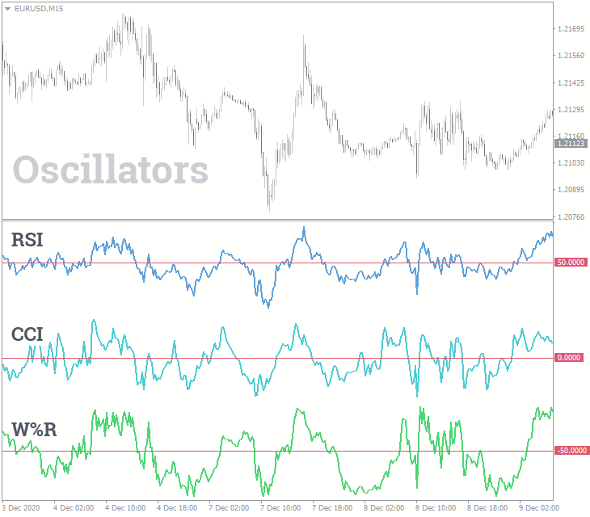

## Table of Contents

## What is the Williams %R Oscillator?

The Williams %R Oscillator is a technical indicator used in trading to help identify when a stock or other financial asset might be overbought or oversold. It was developed by Larry Williams and works by measuring where the current closing price is in relation to the high and low prices over a certain period, usually 14 days. The indicator ranges from 0 to -100, with values closer to 0 indicating that the asset might be overbought, and values closer to -100 suggesting it might be oversold.

Traders use the Williams %R to make decisions about buying or selling. If the %R value is above -20, it suggests the asset might be overbought and could be a good time to sell. On the other hand, if the %R value is below -80, it indicates the asset might be oversold, which could be a signal to buy. Like all indicators, it's not perfect and works best when used alongside other tools and analysis methods to confirm trading signals.

## What is the Relative Strength Index (RSI)?

The Relative Strength Index, or RSI, is a tool used by people who trade stocks or other financial things. It helps them figure out if something is being bought too much or sold too much. The RSI looks at how prices have changed over a certain time, usually 14 days, and gives a number between 0 and 100. If the RSI number is above 70, it means the thing might be bought too much and could go down in price soon. If it's below 30, it means it might be sold too much and could go up in price.

Traders use the RSI to help decide when to buy or sell. If the RSI goes from below 30 to above 30, it might be a good time to buy because the price could go up. If it goes from above 70 to below 70, it might be a good time to sell because the price could go down. But, the RSI is not perfect. It's best to use it with other tools to make better decisions about trading.

## How is the Williams %R calculated?

The Williams %R is calculated by looking at the highest price and the lowest price of something over a certain time, usually 14 days. You also need the closing price of the last day in that time. The formula is simple: Williams %R = (Highest High - Close) / (Highest High - Lowest Low) * -100. This formula gives you a number between 0 and -100.

After you calculate the Williams %R, you can use it to see if the thing you're looking at is overbought or oversold. If the number is close to 0, it means the closing price is near the highest price of the period, which might mean it's overbought. If the number is close to -100, it means the closing price is near the lowest price, which might mean it's oversold. Traders use these numbers to help decide when to buy or sell.

## How is the RSI calculated?

The Relative Strength Index, or RSI, is a tool used by traders to figure out if a stock or other thing is bought too much or sold too much. To calculate the RSI, you need to look at the average gain and the average loss over a certain time, usually 14 days. First, you find the difference between the closing prices of each day to see if there's a gain or a loss. Then, you add up all the gains and all the losses separately, and find the average of each. The relative strength (RS) is calculated by dividing the average gain by the average loss.

Once you have the RS, you can find the RSI using this formula: RSI = 100 - (100 / (1 + RS)). This gives you a number between 0 and 100. If the RSI is above 70, it means the thing might be bought too much and could go down in price soon. If it's below 30, it means it might be sold too much and could go up in price. Traders use this number to help decide when to buy or sell, but it's best to use it with other tools to make better decisions.

## What are the typical settings for the Williams %R?

The typical setting for the Williams %R is a period of 14 days. This means that the indicator looks at the highest high and the lowest low over the last 14 days to calculate its value. Traders often use this setting because it gives a good balance between being sensitive enough to market changes and not being too choppy or erratic.

Some traders might choose to use different periods, like 7 days or 21 days, depending on their trading style and the time frame they are looking at. A shorter period like 7 days can make the Williams %R react more quickly to price changes, which might be good for short-term trading. A longer period like 21 days can make it smoother and less reactive, which might be better for longer-term trading. But 14 days is the most common setting because it works well for many different trading strategies.

## What are the typical settings for the RSI?

The typical setting for the Relative Strength Index, or RSI, is a period of 14 days. This means the RSI looks at the average gains and losses over the last 14 days to figure out its value. Traders like this setting because it gives a good balance between being quick to notice changes in the market and not jumping around too much.

Some traders might choose to use different periods, like 7 days or 21 days, depending on what they're trying to do. A shorter period like 7 days makes the RSI react faster to price changes, which can be good if you're trading for a short time. A longer period like 21 days makes the RSI smoother and less jumpy, which might be better if you're looking at things over a longer time. But 14 days is the most common setting because it works well for a lot of different trading plans.

## How do you interpret overbought and oversold conditions using Williams %R?

When using the Williams %R to look at a stock or something else you might trade, you want to see if it's overbought or oversold. If the Williams %R number is above -20, it means the thing might be overbought. This means a lot of people have been buying it, and the price might be too high. It could be a good time to sell because the price might go down soon. 

On the other hand, if the Williams %R number is below -80, it means the thing might be oversold. This means a lot of people have been selling it, and the price might be too low. It could be a good time to buy because the price might go up soon. But remember, just because the Williams %R says something is overbought or oversold doesn't mean it will definitely go up or down right away. It's a good idea to use other tools and look at other information to make the best decision.

## How do you interpret overbought and oversold conditions using RSI?

When you use the Relative Strength Index, or RSI, to look at a stock or something else you might trade, you want to see if it's overbought or oversold. If the RSI number is above 70, it means the thing might be overbought. This means a lot of people have been buying it, and the price might be too high. It could be a good time to sell because the price might go down soon.

If the RSI number is below 30, it means the thing might be oversold. This means a lot of people have been selling it, and the price might be too low. It could be a good time to buy because the price might go up soon. But remember, just because the RSI says something is overbought or oversold doesn't mean it will definitely go up or down right away. It's a good idea to use other tools and look at other information to make the best decision.

## What are the common trading strategies involving Williams %R?

One common way to use the Williams %R for trading is by looking for overbought and oversold signals. If the Williams %R goes above -20, it means the thing you're looking at might be overbought. This could be a good time to sell because the price might go down soon. If the Williams %R goes below -80, it means the thing might be oversold. This could be a good time to buy because the price might go up soon. Traders often wait for the Williams %R to move back into the middle range, between -20 and -80, before making their move. This helps make sure the signal is strong and not just a quick change.

Another strategy is to use the Williams %R along with other indicators, like the RSI or moving averages, to make better trading decisions. For example, if the Williams %R shows something is oversold and the RSI also shows it's oversold, it might be a stronger sign to buy. Some traders also look for something called divergence. This happens when the price of the thing goes one way, but the Williams %R goes the other way. If the price is going up but the Williams %R is going down, it might mean the price will start to go down soon. Using the Williams %R with other tools can help traders feel more confident in their choices.

## What are the common trading strategies involving RSI?

One common way to use the RSI for trading is by looking for overbought and oversold signals. If the RSI goes above 70, it means the thing you're looking at might be overbought. This could be a good time to sell because the price might go down soon. If the RSI goes below 30, it means the thing might be oversold. This could be a good time to buy because the price might go up soon. Traders often wait for the RSI to move back into the middle range, between 30 and 70, before making their move. This helps make sure the signal is strong and not just a quick change.

Another strategy is to use the RSI along with other indicators, like moving averages or the Williams %R, to make better trading decisions. For example, if the RSI shows something is oversold and another indicator also shows it's oversold, it might be a stronger sign to buy. Some traders also look for something called divergence. This happens when the price of the thing goes one way, but the RSI goes the other way. If the price is going up but the RSI is going down, it might mean the price will start to go down soon. Using the RSI with other tools can help traders feel more confident in their choices.

## How does the sensitivity of Williams %R compare to RSI?

The Williams %R and the RSI are both used to see if something is overbought or oversold, but they work a bit differently. The Williams %R looks at where the closing price is compared to the highest and lowest prices over a certain time, usually 14 days. Because it uses the highest and lowest prices, it can be more sensitive to big price swings. This means it might show overbought or oversold signals more quickly than the RSI. If you're trading for a short time, this sensitivity can be good because it helps you catch quick changes in the market.

The RSI, on the other hand, looks at the average gains and losses over the same time, usually 14 days. It's a bit smoother because it averages out the price changes. This makes the RSI less sensitive to big price swings and might not show overbought or oversold signals as quickly as the Williams %R. If you're looking at things over a longer time, the RSI might be better because it gives a more steady picture of the market. Both indicators can be useful, but the Williams %R is more sensitive and might be better for short-term trading, while the RSI might be better for longer-term trading.

## Can Williams %R and RSI be used together in a trading system, and if so, how?

Yes, you can use both the Williams %R and the RSI together in a trading system to make better decisions. When you use them together, you can look for times when both indicators show the same thing. For example, if both the Williams %R and the RSI show that something is oversold, it might be a stronger sign to buy. This is because you're getting the same signal from two different ways of looking at the market. It's like getting a second opinion before making a big decision.

Using both indicators can also help you avoid making quick decisions based on just one signal. Sometimes, the Williams %R might show something is overbought, but the RSI might not be as sure. Waiting for both indicators to agree can make your trading more careful and less risky. By combining the quick sensitivity of the Williams %R with the smoother view of the RSI, you can get a more complete picture of what's happening in the market and make smarter trading choices.

## What is the Understanding of the Williams %R Indicator?

The Williams %R indicator, often referred to simply as %R, is a [momentum](/wiki/momentum) oscillator developed by Larry Williams. It measures the level of the close relative to the highest high for a specific look-back period, typically 14 days, and it is designed to detect overbought and oversold conditions in a financial market. Unlike other momentum indicators that move between 0 and 100, the range for Williams %R is between -100 and 0.

### Calculation Methodology

The calculation of the Williams %R indicator is based on the following formula:

$$
\text{Williams %R} = \left( \frac{\text{Highest High} - \text{Close}}{\text{Highest High} - \text{Lowest Low}} \right) \times -100
$$

Where:
- **Highest High** is the highest price over the look-back period.
- **Lowest Low** is the lowest price over the look-back period.
- **Close** is the most recent closing price.

For example, consider a 14-day time frame. If the highest high is 150, the lowest low is 120, and the latest closing price is 145, then the Williams %R is calculated as:

$$
\text{Williams %R} = \left( \frac{150 - 145}{150 - 120} \right) \times -100 = -16.67
$$

### Interpreting Williams %R Values

Williams %R values oscillate between -100 and 0, with specific levels used to identify overbought and oversold conditions. Values closer to 0 suggest the asset might be overbought, while those closer to -100 indicate potential oversold conditions. Typically, a reading above -20 suggests the asset is overbought, and below -80 indicates that it is oversold.

### Common Time Frames and Settings

Traders commonly use a 14-day period for calculating Williams %R, although this can be adjusted based on the individual asset being analyzed and the trader's strategy. Shorter periods might be used for more volatile assets to capture quicker shifts in momentum, whereas longer periods could be utilized for a smoother indicator line and fewer false signals.

### Advantages and Limitations

**Advantages:**
- Simplicity: Williams %R is simple to calculate and interpret, making it accessible even for novice traders.
- Timing: It can help traders pinpoint potential entry and exit points in a range-bound market.
- Flexibility: The indicator can be used across various asset classes, including stocks, currencies, and commodities.

**Limitations:**
- False Signals: Like many momentum-based indicators, Williams %R can produce false signals, especially in highly volatile markets.
- Context Dependency: The interpretation of overbought and oversold conditions might vary depending on the broader market context and trend direction. In strong trends, the indicator may remain in overbought or oversold territory for extended periods without a reversal.
- Need for Confirmation: It is often recommended to use Williams %R in conjunction with other indicators or technical patterns to confirm its signals.

Understanding the Williams %R indicator's calculation, interpretation, and practical application is crucial for effectively incorporating it into trading strategies and enhancing decision-making processes.

## What is the Relative Strength Index (RSI) and how can it be explored?

The Relative Strength Index (RSI) is a popular momentum oscillator developed by J. Welles Wilder, introduced in his seminal 1978 book, "New Concepts in Technical Trading Systems." RSI measures the speed and change of price movements and is commonly used to identify overbought or oversold conditions in a market.

### Calculation Process for RSI

RSI is calculated using the formula:

$$
RSI = 100 - \frac{100}{1 + RS}
$$

where $RS$ (Relative Strength) is the average of $x$ days' up closes divided by the average of $x$ days' down closes. The default and most commonly used period is 14 days. The steps to compute RSI are:

1. Calculate the daily price changes.
2. Separate the positive changes and negative changes.
3. Compute the average gain and average loss over the specified period.
4. Calculate the RS, which is the average gain divided by the average loss.
5. Use the RS value to compute the RSI.

For example, let's compute a 14-day RSI:

```python
import pandas as pd

# Sample data: A list of daily closing prices
prices = [45, 46, 47, 48, 49, 48, 47, 45, 44, 46, 47, 48, 49, 50, 51]

# Create a DataFrame
df = pd.DataFrame(prices, columns=['Close'])

# Calculate daily price changes
df['Change'] = df['Close'].diff()

# Separate positive and negative gains
df['Gain'] = df['Change'].apply(lambda x: x if x > 0 else 0)
df['Loss'] = df['Change'].apply(lambda x: abs(x) if x < 0 else 0)

# Calculate average gain and loss
period = 14
df['Avg Gain'] = df['Gain'].rolling(window=period, min_periods=1).mean()
df['Avg Loss'] = df['Loss'].rolling(window=period, min_periods=1).mean()

# Calculate RS and RSI
df['RS'] = df['Avg Gain'] / df['Avg Loss']
df['RSI'] = 100 - (100 / (1 + df['RS']))

# Display the RSI
print(df['RSI'])
```

### Understanding RSI Values

RSI values range from 0 to 100. Traditionally, an RSI above 70 is considered overbought, implying that the asset is potentially overvalued and may be due for a price correction or pullback. Conversely, an RSI below 30 is viewed as oversold, suggesting that the asset may be undervalued and primed for a potential price increase.

### Adjusting RSI Settings

While the default period of 14 days is widely used, traders often adjust the RSI period to fit different market conditions and trading styles. Shorter periods, such as 7 or 9 days, increase the sensitivity of the RSI, leading to more frequent trading signals. Longer periods, such as 20 or 30 days, reduce the number of signals, potentially resulting in more reliable but less frequent indications.

### Pros and Cons of RSI as a Standalone Indicator

#### Pros

- **Simplicity**: RSI is straightforward to calculate and interpret.
- **Versatility**: RSI can be applied to various asset classes and time frames.
- **Effectiveness**: It reliably identifies overbought and oversold conditions, helping traders make buy or sell decisions.

#### Cons

- **False Signals**: In strongly trending markets, RSI may signal overbought or oversold conditions prematurely.
- **Lagging Nature**: As RSI is based on past prices, it may lag behind the actual market conditions.
- **Limited Scope**: RSI does not account for other important market factors like volatility or volume.

In summary, while the RSI is a robust tool for evaluating momentum, traders often combine it with other indicators or analytical methods to confirm signals and create a more comprehensive trading strategy.

## What is the Comparative Analysis of Williams %R versus RSI?

Williams %R and the Relative Strength Index (RSI) are widely used momentum indicators in trading, each possessing unique methodologies and interpretations.

**Key Differences in Calculation Methodologies**

Williams %R, developed by Larry Williams, measures the level of the close relative to the high-low range over a specified period. The formula for Williams %R is:

$$
\text{Williams } \%R = \frac{\text{Highest High} - \text{Close}}{\text{Highest High} - \text{Lowest Low}} \times -100
$$

Typically calculated over 14 periods, Williams %R oscillates between -100 and 0. A reading closer to 0 indicates that the asset is trading near the high of its range, suggesting overbought conditions. Conversely, a reading closer to -100 implies oversold conditions.

The RSI, formulated by J. Welles Wilder, measures the speed and change of price movements. Its formula is:

$$
\text{RSI} = 100 - \left(\frac{100}{1 + RS}\right)
$$

where RS (Relative Strength) is the average of x periods' closes up divided by the average of x periods' closes down. RSI values range from 0 to 100, with a common interpretation that readings above 70 indicate overbought conditions and below 30 suggest oversold conditions.

**Contrast in Oscillation Ranges and Interpretation of Signals**

Williams %R and RSI both serve to identify potential reversal points but differ in their signal ranges. Williams %R's range is fixed between -100 and 0, straightforwardly indicating overbought (-20 or higher) and oversold (-80 or lower) states. RSI, on the other hand, uses a scale from 0 to 100, with threshold levels typically set at 70 for overbought and 30 for oversold.

**Scenarios Where One Might Be Preferred Over the Other**

Williams %R might be more suitable for traders looking for quick, short-term signals due to its sensitivity to price changes within a defined range. It's especially useful in volatile markets where rapid oscillations present frequent trading opportunities.

RSI, with its smoothed calculation of price changes, is often favored in trending markets as it filters out noise and provides more stable signals, making it advantageous for medium to long-term strategies.

**Application in Different Market Environments and Trading Styles**

In range-bound markets, traders may find Williams %R to be highly effective as it quickly identifies reversals at extreme levels. For trending environments, RSI is often preferred because it can confirm trend strength and suggest continuation or divergence when used alongside other indicators.

**Understanding the Correlation and Divergence**

While both indicators aim to capture momentum, they often diverge because of their different calculation methods. Williams %R, being more volatile, may signal a reversal earlier than RSI. However, the RSI can provide confirmation of trends that Williams %R signals might have falsely depicted as reversals due to its responsiveness to short-term price [volatility](/wiki/volatility-trading-strategies).

This nuanced analysis is critical for traders aiming to effectively incorporate these indicators into their trading strategies. Their divergence can highlight potential opportunities where one indicator may validate the signal from another, offering more robust trading insights when used in conjunction with additional market analysis.

## References & Further Reading

[1]: Wilder, J. W. (1978). *New Concepts in Technical Trading Systems*. Trend Research.

[2]: Williams, L. (1999). *Long-Term Secrets to Short-Term Trading*. Wiley.

[3]: [Jansen, S. (2020). *Machine Learning for Algorithmic Trading: Predictive models to extract signals from market and alternative data for systematic trading strategies with Python*](https://github.com/stefan-jansen/machine-learning-for-trading). Packt Publishing.

[4]: Lo, A. W., & Hasanhodzic, J. (2009). *The Heretics of Finance: Conversations with Leading Practitioners of Technical Analysis*. Bloomberg Press.

[5]: [Murphy, J. J. (1999). *Technical Analysis of the Financial Markets: A Comprehensive Guide to Trading Methods and Applications*](https://archive.org/details/technicalanalysi0000murp). New York Institute of Finance.

[6]: Aronson, D. R. (2007). *Evidence-Based Technical Analysis: Applying the Scientific Method and Statistical Inference to Trading Signals*. Wiley.