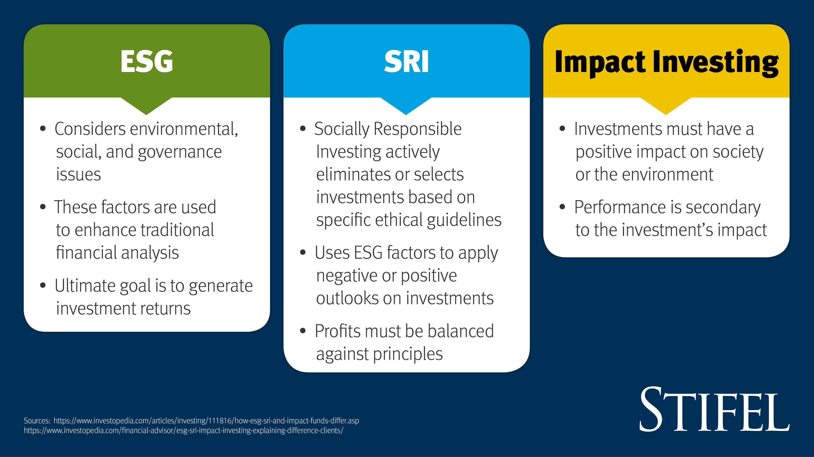

The investment landscape has significantly transformed, emphasizing not only financial returns but also the generation of positive social and environmental impacts. This evolution marks a shift towards investment strategies that incorporate ethical and sustainable considerations. At the forefront of this change are Socially Responsible Investments (SRI), Environmental, Social, and Governance (ESG) funds, and impact investing—all of which prioritize ethical standards within their investment frameworks.

SRI involves selecting investments based on a company's adherence to ethical practices concerning social justice, environmental sustainability, and corporate governance. Meanwhile, ESG funds evaluate potential investments through criteria that assess a company's environmental stewardship, social responsibility, and governance practices, providing investors with sustainable and ethical opportunities. Impact investing takes this commitment further by making investments with the explicit intention of generating measurable social and environmental benefits, often even prioritizing these goals over financial returns.

Moreover, algorithmic trading is increasingly influencing how these funds operate, optimizing outcomes through technology. This method utilizes complex algorithms to automate trading strategies, enabling more efficient and swift investment decisions. It is particularly advantageous for SRI, ESG, and impact funds, as algorithmic trading supports the swift identification and execution of trades that align with specific ethical and sustainability criteria. By handling vast volumes of data, algorithmic trading ensures that investments adhere to these stringent criteria and can respond to market changes with agility.

In this article, we examine the convergence of SRI funds, ESG funds, impact investing, and algorithmic trading, highlighting how they collectively shape sophisticated and socially conscious investment strategies. This integration of ethical investment solutions with technological advances represents a pivotal moment in the investment sector, catering to the growing demand for sustainable financial practices.

## Table of Contents

## Understanding SRI, ESG, and Impact Investing

Socially Responsible Investing (SRI), Environmental, Social, and Governance (ESG) criteria, and impact investing represent key strategies within the broader movement toward ethical and sustainable investing. These strategies vary in their focus and methodology but are united by an overarching commitment to promoting positive social and environmental change alongside financial returns.

### Socially Responsible Investing (SRI)
SRI refers to investment practices that consider ethical, social, and corporate governance criteria to contribute to positive societal outcomes. Traditionally, socially responsible investors avoid sectors or companies engaged in activities contrary to their values, such as tobacco, alcohol, or weapons. SRI encompasses positive and negative screening to select or exclude securities based on ethical guidelines.

### Environmental, Social, and Governance (ESG) Criteria
[ESG](/wiki/esg-investing) criteria are a set of standards for a company’s operations that responsible investors use to screen potential investments. Environmental criteria look at how a company performs as a steward of nature. Social criteria examine how it manages relationships with employees, suppliers, customers, and the communities where it operates. Governance deals with a company’s leadership, executive pay, audits, internal controls, and shareholder rights. ESG investing focuses on identifying companies that uphold strong environmental stewardship, social responsibility, and governance practices, integrating these factors into the investment decision-making process to identify long-term sustainable and ethical opportunities.

### Impact Investing
Impact investing is characterized by a proactive investment approach with a distinct intention to create positive, measurable social and environmental impacts. Unlike SRI and ESG, where financial returns remain a priority alongside ethical considerations, impact investing may prioritize maximizing social or environmental impact even at the potential expense of lower financial returns. Investments are often directed towards sectors such as renewable energy, healthcare, education, and microfinance.

Each approach—SRI, ESG, and impact investing—represents a different level of commitment to ethical and sustainable principles. SRI focuses on exclusionary screening based on pre-defined ethical criteria, ESG extends this by embedding specific environmental, social, and governance metrics into corporate evaluations, and impact investing explicitly targets outcomes with direct positive effects on society and the environment. This nuanced landscape offers investors diverse entry points to contribute to a more sustainable and equitable world.

## The Role of Algorithmic Trading in Sustainable Investments

Algorithmic trading, commonly known as 'algo trading', utilizes sophisticated algorithms to automate and optimize trading strategies, thereby significantly expediting investment decisions. This method is particularly advantageous in the landscape of Socially Responsible Investments (SRI), Environmental, Social, and Governance (ESG) funds, and impact investing. By incorporating [algorithmic trading](/wiki/algorithmic-trading), investors can efficiently identify and execute trades that closely align with specific social and environmental criteria that these funds target.

The core advantage of algorithmic trading lies in its capacity to handle vast amounts of data in real-time. This capability ensures that investments not only adhere to predefined sustainability criteria but also remain responsive to dynamic market conditions. The algorithms are designed to filter and analyze information related to environmental, social, and governance metrics, supporting decisions that match the investor's ethical and financial objectives. For example, an algorithm could be programmed to prioritize companies that achieve a certain threshold in their ESG rating or demonstrate tangible environmental benefits.

Moreover, the integration of algorithmic trading in sustainable investments enhances their financial viability. By rapidly processing and acting on data, algorithms contribute to more precise pricing and timing of transactions, potentially increasing returns while maintaining commitment to ethical standards. This is crucial in sustainable investing, where balancing ethical concerns with financial performance remains a primary challenge.

Algorithmic trading provides a means to achieve this balance by enabling the assimilation and analysis of complex data sets, providing investment managers with insights that align with both ethical and profit-maximizing goals. This approach minimizes human biases and errors, offering a consistent methodology for evaluating companies against sustainability benchmarks.

In summary, algorithmic trading serves as a pivotal tool in the realm of sustainable investing, harmonizing the pursuit of financial returns with the adherence to social and environmental principles. As algorithms become more advanced, their role in refining and implementing sophisticated investment strategies that reflect both ethical commitments and market performance will likely expand, rendering them indispensable in the pursuit of socially responsible financial practices.

## Current Trends and Challenges

The demand for ethical investment options has surged, particularly among younger investors who are keen on fostering socially responsible and sustainable portfolios. This generational shift reflects a growing awareness of the impact that investment choices can have on global social and environmental issues. However, one of the significant challenges in this domain is greenwashing. Greenwashing occurs when companies misleadingly present their products or practices as environmentally friendly without making genuine commitments to sustainability. This deception poses a considerable hurdle for investors aiming to align their portfolios with authentic ethical and environmental standards.

A critical aspect of overcoming this challenge is securing reliable and consistent data for ESG (Environmental, Social, and Governance) criteria and impact measurement. Accurate data is indispensable for evaluating whether companies genuinely adhere to the sustainable and ethical practices they profess. However, inconsistency and lack of transparency in data reporting can lead to significant obstacles in distinguishing genuine sustainable investments from those that merely pay lip service to ESG principles.

Algorithmic solutions are increasingly being developed to address these data challenges and enhance the integrity and transparency of ESG metrics. By employing sophisticated algorithms, investors and fund managers can process vast amounts of data to identify patterns and insights that might not be immediately apparent through traditional analysis. These technologies can help verify the authenticity of ESG claims, ensuring that investment decisions are based on sound and reliable information.

Despite these challenges, technological integration, particularly algorithmic trading, is proving instrumental in overcoming barriers within sustainable investing. Algorithmic trading enables the swift and efficient execution of trades based on specific ESG criteria, allowing for the dynamic management of investments that adhere to stringent ethical and environmental standards. This technological capability ensures that portfolios can be adjusted in real-time to respond to market changes and new information regarding companies' ESG performances.

As the landscape of sustainable investing continues to evolve, the role of algorithmic trading is set to expand. By effectively leveraging technology, investors can maintain a balance between upholding ethical considerations and achieving desirable financial returns. This approach not only enhances the credibility and impact of socially responsible investments but also aligns with the increasing demand for transparency and accountability in the investment process. The convergence of sustainability and technology in investment strategies signifies a pivotal movement towards a more ethical and effective financial future.

## The Future of Sustainable Investing and Algorithmic Trading

The future of sustainable investing is increasingly intertwined with technological advancements, particularly in the realm of algorithmic trading. As [artificial intelligence](/wiki/ai-artificial-intelligence) (AI) and [machine learning](/wiki/machine-learning) technologies continue to evolve, they offer promising opportunities to refine and enhance ethical investment strategies. These advanced systems are capable of processing vast datasets and identifying complex patterns, enabling investors to make informed decisions that align with both financial targets and sustainability goals.

Algorithmic trading frameworks are expected to become more sophisticated, integrating AI to enhance the precision and efficacy of sustainable investment strategies. This technological evolution allows algorithms to better evaluate environmental, social, and governance (ESG) criteria, ensuring investments are made with an informed understanding of a company's ethical practices. Machine learning models can continuously improve by learning from new data, adapting to market conditions, and optimizing investment outcomes in real-time.

Moreover, these advancements bring about the capability for more personalized and dynamic portfolio management. Investors can leverage technology to create portfolios that not only respond adeptly to market fluctuations but also steadfastly adhere to their ethical convictions. This adaptability is crucial as markets become more volatile and as investors seek to harmonize their financial objectives with social and environmental impact.

The anticipated trajectory suggests that the integration of sustainability with algorithmic trading will become more mainstream. Financial returns and positive societal impacts need not be mutually exclusive; rather, they can be jointly optimized through sophisticated technological solutions. As this trend gains [momentum](/wiki/momentum), investors are likely to witness more robust mechanisms that deliver both economic benefits and constructive societal outcomes, positioning sustainable investing not just as a niche strategy, but as a central tenet of future financial practices.

Thus, the fusion of sustainability with state-of-the-art trading algorithms heralds a paradigm shift in the investment landscape, fostering a more conscientious and effective approach to wealth management.

## Conclusion

Incorporating Socially Responsible Investments (SRI), Environmental, Social, and Governance (ESG) criteria, and impact funds into investment portfolios not only supports ethical standards but also caters to the growing demand for sustainable financial practices. As stakeholders increasingly prioritize investments that align financial objectives with social and environmental goals, these strategies become integral to the modern investment methodology.

Algorithmic trading acts as a catalyst in realizing these objectives, providing the mechanisms through which socially responsible investments can be effectively managed and executed. Through automating processes and enabling real-time data analysis, algorithmic trading ensures adherence to sustainability criteria while optimizing financial performance. Leveraging technology, algorithmic systems can efficiently sift through vast datasets to identify investment opportunities that meet ethical and financial benchmarks.

As the investment community becomes increasingly conscious of the importance of combining financial returns with social responsibility, the role of algorithmic trading in enhancing sustainable investment strategies is set to expand. Investors who recognize the potential of incorporating technological solutions with ethical investing are better positioned to navigate the evolving landscape.

This juncture presents a pivotal opportunity for investors to embrace these combined approaches, shaping the future of ethical investing. By merging traditional investment goals with advanced algorithmic capabilities, stakeholders can achieve a balance between economic gains and societal impact, paving the way for a more sustainable and responsible approach to investing.

## References & Further Reading

[1]: Bergstra, J., Bardenet, R., Bengio, Y., & Kégl, B. (2011). ["Algorithms for Hyper-Parameter Optimization."](https://dl.acm.org/doi/10.5555/2986459.2986743) Advances in Neural Information Processing Systems 24.

[2]: ["Advances in Financial Machine Learning"](https://www.amazon.com/Advances-Financial-Machine-Learning-Marcos/dp/1119482089) by Marcos Lopez de Prado

[3]: ["Sustainable Investing: Revolutions in Theory and Practice"](https://www.taylorfrancis.com/books/edit/10.4324/9781315558837/sustainable-investing-cary-krosinsky-sophie-purdom) by Cary Krosinsky and Sophie Purdom

[4]: "Algorithmic Trading 101" by Ernest P. Chan, available on [QuantInsti Blog](https://medium.com/@experfy.editor/the-top-resources-for-learning-algorithmic-trading-8048e558b380)

[5]: ["Machine Learning for Algorithmic Trading"](https://github.com/stefan-jansen/machine-learning-for-trading) by Stefan Jansen

[6]: Renneboog, L., Ter Horst, J., & Zhang, C. (2008). ["Socially responsible investments: Institutional aspects, performance, and investor behavior."](https://www.sciencedirect.com/science/article/pii/S0378426607004220) Journal of Banking & Finance, 32(9), 1723-1742.

[7]: Friede, G., Busch, T., & Bassen, A. (2015). ["ESG and Financial Performance: Aggregated Evidence from More than 2000 Empirical Studies"](https://www.tandfonline.com/doi/full/10.1080/20430795.2015.1118917). Journal of Sustainable Finance & Investment, 5(4), 210-233.