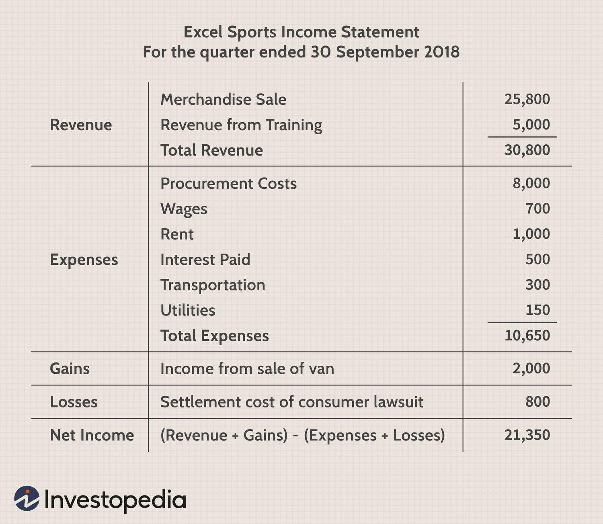

Algorithmic trading, commonly referred to as algo trading, has revolutionized the financial markets by automating the trading process using complex algorithms. These algorithms execute trades based on predefined criteria, aiming to optimize trade outcomes by maximizing gains and minimizing losses. The efficiency of algorithmic trading stems from its ability to process large volumes of data quickly and execute orders in real time, a feat nearly impossible for human traders without technological aid.

A key component of successful algo trading is a thorough understanding of financial terms such as revenue, expenses, gains, and losses. These terms are pivotal because they influence crucial trading strategies and decisions. Revenue, in this context, can be likened to the income generated from successful trades, while expenses encompass costs such as trading fees and infrastructure charges. Gains represent profits from beneficial market moves or asset sales, whereas losses result from adverse trading conditions or market fluctuations.



This article aims to clarify these financial concepts and underscore their importance in algorithmic trading. By examining how these terms fit into an algorithmic framework, traders and developers alike can better navigate the complexities of automated trading, ultimately leading to more informed decision-making and improved trade performance.

## Table of Contents

## Understanding Financial Terms: Revenue and Expenses

Revenue refers to the income generated by a company through its primary business activities, such as selling goods or providing services. In the context of trading, revenue is often equated with the income resulting from successful trades. This includes not only the income from transactions themselves but also income derived from associated financial instruments or derivative products.

Expenses, conversely, represent the costs that a business incurs to generate revenue. In trading, expenses can include transaction fees, brokerage commissions, and technological infrastructure costs necessary for executing trades. These costs must be carefully managed, as they directly impact the net profitability of trading activities. For example, an algorithmic trader must account for the costs associated with high-speed trading technologies and data feeds, which can be significant.

A thorough comprehension of revenue and expenses is critical for formulating effective trading strategies. To evaluate a trading strategy's profitability, one must calculate the net income, which is the difference between revenue and expenses. Mathematically, this can be expressed as:

$$
\text{Net Income} = \text{Revenue} - \text{Expenses}
$$

In [algorithmic trading](/wiki/algorithmic-trading), understanding these financial terms is crucial in designing algorithms that can maximize revenue while minimizing expenses. Proper cost management ensures that the trading strategy not only generates a high gross income but also delivers sustainable net gains over time. By continuously optimizing algorithms to enhance revenue and control expenses, traders can achieve a more efficient and profitable trading operation.

## Clarifying Gains and Losses

Gains in algorithmic trading refer to profits garnered from activities not central to the primary operations of a trading strategy, such as the appreciation of assets or advantageous market fluctuations. These profits are essential for traders as they often represent the upside in volatile or speculative markets. Conversely, losses occur when adverse market conditions or poor trading decisions reduce the value of assets, negatively impacting a trader's performance. Accurately distinguishing between gains and losses is crucial for developing effective trading algorithms that can dynamically adjust to changing market conditions.

In the context of algorithmic trading, gains and losses are not merely the outcome of individual trades but are also integral to the optimization of trading algorithms. Algorithms can be fine-tuned to minimize losses and enhance gains by employing sophisticated risk management techniques. These techniques may include stop-loss orders, where a trade is automatically closed when it reaches a predetermined loss threshold, or take-profit orders, closing a trade after achieving a target gain.

Risk management within algorithmic trading involves statistical and [machine learning](/wiki/machine-learning) models that predict potential price movements and assess their confidence levels. For instance, traders may use a Sharpe ratio, given by the formula:

$$
\text{Sharpe Ratio} = \frac{E[R - R_f]}{\sigma}
$$

where $E[R - R_f]$ represents the expected excess return over the risk-free rate, and $\sigma$ is the standard deviation of the excess return. This ratio helps in assessing how much excess return is received for the extra volatility endured by holding a riskier asset.

Optimizing algorithms for better risk management necessitates a robust understanding of how different market conditions might affect gains and losses. Utilizing historical data, traders can backtest their strategies, iterating on algorithms to improve performance by simulating various scenarios. This process helps in refining the predictive power of algorithms to navigate and potentially capitalize on market intricacies efficiently.

## The Interplay between Financial Terms and Algo Trading

Algorithmic trading integrates the key financial concepts of revenue, expenses, gains, and losses to automate the decision-making process, enhancing both the efficiency and precision of trades. These financial metrics serve as essential parameters within the algorithms, which guide trading actions in various market conditions.

Revenue and expense management plays a critical role in algorithmic trading. Algorithms, often based on complex mathematical models, help traders identify the most favorable financial conditions under which trades are executed. By continuously analyzing market data and historical trends, these algorithms can predict potential future outcomes, adjusting trading strategies to maximize revenue and minimize expenses. For example, algorithms can dynamically adjust trading volumes to take advantage of favorable market positions, aiming to increase the overall revenue while controlling associated costs such as transaction fees and infrastructure expenses.

Gains and losses are equally significant in algorithmic trading. Algorithms are designed to optimize these financial outcomes by precisely timing trades to take advantage of short-term market movements. The integration of risk management principles within the algorithm ensures that potential losses are minimized. For instance, when market conditions are unfavorable, an algorithm might reduce trading activity to prevent significant losses, thus preserving gains. This process involves a continuous loop of data analysis and decision-making, allowing the algorithm to respond swiftly to change.

Furthermore, algorithmic trading systems apply quantitative methods to manage revenue and expense ratios effectively. This includes leveraging statistical tools and machine learning techniques to refine predictive models and improve the accuracy of financial forecasts. By incorporating historical data and real-time analytics, trading algorithms can optimize both the timing and the quantity of trades, ensuring that financial transactions align with established revenue and gain targets while controlling for risk and expense.

The synergy between financial terms and algorithmic systems facilitates a high level of automation in trading. This automation results in quicker response times to market changes, reducing human error and allowing for the consistent application of trading strategies. The ultimate goal is to maximize profitability while adhering to predefined financial criteria, ensuring the sustainability and effectiveness of trading operations.

## Advantages of Algorithmic Trading with Financial Metrics

Algorithmic trading offers significant advantages in executing trades with precision, driven by clear financial targets for revenue and gains, while effectively managing expenses and losses. This precision is achieved by leveraging advanced computational algorithms that are designed to process vast amounts of financial data and execute trades at optimal times, far beyond human capacity.

One of the key benefits of algorithmic trading is its ability to optimize both the timing and quantity of trades. Algorithms can analyze market conditions in real-time and make split-second decisions, thus capitalizing on fleeting opportunities that may arise as stock prices fluctuate. This helps in achieving the financial targets set for revenues and gains while simultaneously minimizing the risk of losses and unnecessary expenses.

For instance, suppose a trading strategy aims for a certain revenue target $R_t$ while maintaining expenses $E$ under a specified limit. Algorithms can be coded to execute trades only when the projected profit from a trade $P$ satisfies $P = R_t - E$. This ensures that every trade executed contributes positively to the overall financial objectives of the trader.

In addition, algorithmic trading significantly reduces human errors associated with manual trading. By following predefined financial metrics, algorithms consistently execute trades with the intended level of precision. This consistency helps in adhering to the strategic goals, maintaining a balanced revenue to expense ratio, and managing gains effectively.

Python, a popular programming language in algorithmic trading, provides libraries such as Pandas and NumPy, which can be used to develop algorithms with financial performance metrics in mind. Below is an example of a simple Python code snippet that evaluates whether a trade should be executed based on projected revenue and expenses:

```python
def execute_trade(projected_revenue, expenses, revenue_target):
    profit = projected_revenue - expenses
    if profit >= revenue_target:
        return "Execute Trade"
    else:
        return "Do Not Execute Trade"

# Example usage:
projected_revenue = 10000
expenses = 2000
revenue_target = 7500

trade_decision = execute_trade(projected_revenue, expenses, revenue_target)
print(trade_decision)  # Output: Execute Trade
```

The ability of algorithms to rapidly adapt to changing market conditions and consistently follow financial guidelines ensures a high level of efficiency in trading operations, maximizing profitability while minimizing associated risks. This strategically informed trading not only enhances potential gains but also effectively curtails exposure to unexpected market downturns, ensuring an optimal return on investment.

## Risks and Challenges in Algorithmic Trading

Algorithmic trading has transformed financial markets by optimizing trading strategies through automation. However, its implementation carries inherent risks and challenges. One of the primary risks is over-reliance on technology. The automated nature of algorithmic trading systems means they depend heavily on technology to function efficiently. Any failure in communication networks, software glitches, or hardware malfunctions can lead to missed trading opportunities or unintended trades, potentially causing financial losses. 

Moreover, the misinterpretation or mishandling of data can lead to poor trading decisions. Algorithmic trading relies on vast amounts of data to generate accurate predictions and execute trades. If the data is incorrect or not handled properly, the algorithms may generate suboptimal trading strategies, resulting in financial losses.

Market [volatility](/wiki/volatility-trading-strategies) poses another significant challenge. Algorithms are often designed based on historical data under typical market conditions. In periods of high volatility, such as during financial crises or geopolitical events, market conditions can deviate significantly from historical norms, rendering these algorithms less effective. This can lead to incorrect assessments of when to enter or [exit](/wiki/exit-strategy) trades, which can distort intended financial outcomes like revenue and gains.

Algorithm failures, including coding errors and flawed logic, can likewise distort financial outcomes. An algorithm might unexpectedly react to market conditions in a way that exacerbates losses rather than mitigating them. Testing and validation phases are crucial to ensure algorithms can handle various market scenarios to minimize such risks.

Furthermore, there are regulatory and ethical considerations. Algorithmic trading can contribute to market volatility, such as flash crashes, where markets can plummet instantaneously due to automated sell-offs triggered by algorithms. Regulators may impose constraints on algorithmic trading activities, requiring traders to continually update and refine their strategies to remain compliant.

In conclusion, while algorithmic trading systems provide numerous advantages, awareness and management of potential risks such as technology reliance, data misinterpretation, market volatility, and algorithm failures are crucial to ensuring they deliver the expected financial outcomes.

## Conclusion

Algorithmic trading relies heavily on a solid understanding of financial terms such as revenue, expenses, gains, and losses. These concepts serve as the cornerstone for developing effective strategies that enhance profitability while minimizing risks. By accurately quantifying revenue, traders assess successful trade execution and evaluate the output of trading strategies. Similarly, tracking expenses, including transaction costs, commissions, and infrastructure expenses, provides crucial insights into cost management and overall trade sustainability. 

Gains and losses are vital for evaluating performance and refining trading systems. Recognizing gains assists traders in identifying profitable opportunities, while understanding losses guides improvements in risk management protocols. Integrating these financial metrics into trading algorithms allows for enhanced decision-making precision, enabling algorithms to react appropriately to market fluctuations and adjust trading strategies accordingly.

Moreover, by utilizing these metrics, algorithmic systems are designed to optimize transaction timing and [volume](/wiki/volume-trading-strategy) to achieve desired financial outcomes. This meticulous attention to financial details ensures trades are conducted under favorable conditions, aligning with an overarching goal of maximizing revenue and gains while adequately controlling expenses and losses.

Ultimately, an integrated approach, combining robust financial understanding with advanced algorithmic capabilities, equips traders with the tools needed to navigate complex market environments. This synergy helps in achieving the dual objectives that are critical in the financial trading ecosystem: increasing profitability and reducing risk exposure.

## References & Further Reading

[1]: Bergstra, J., Bardenet, R., Bengio, Y., & Kégl, B. (2011). ["Algorithms for Hyper-Parameter Optimization."](https://papers.nips.cc/paper/4443-algorithms-for-hyper-parameter-optimization) Advances in Neural Information Processing Systems 24.

[2]: ["Advances in Financial Machine Learning"](https://www.amazon.com/Advances-Financial-Machine-Learning-Marcos/dp/1119482089) by Marcos Lopez de Prado

[3]: ["Evidence-Based Technical Analysis: Applying the Scientific Method and Statistical Inference to Trading Signals"](https://www.amazon.com/Evidence-Based-Technical-Analysis-Scientific-Statistical/dp/0470008741) by David Aronson

[4]: ["Machine Learning for Algorithmic Trading"](https://github.com/stefan-jansen/machine-learning-for-trading) by Stefan Jansen

[5]: ["Quantitative Trading: How to Build Your Own Algorithmic Trading Business"](https://books.google.com/books/about/Quantitative_Trading.html?id=j70yEAAAQBAJ) by Ernest P. Chan