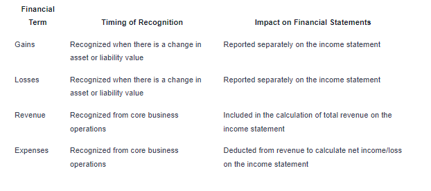

## Table of Contents

## What are gains and how do they differ from revenue?

Gains are the increases in a company's net worth that come from sources other than its main business activities. For example, if a company sells an old piece of equipment for more money than it's worth on the books, that extra money is a gain. Gains can also come from things like winning a lawsuit or selling investments at a profit. They are important because they can boost a company's overall financial health, but they are not part of the regular income from selling products or services.

Revenue, on the other hand, is the total amount of money a company earns from its main business activities. This is the money that comes in from selling goods or services to customers. For instance, if a bakery sells cakes, the money it gets from those sales is its revenue. Revenue is a key measure of how well a company is doing in its core business, and it's different from gains because it comes directly from the company's primary operations, not from other, secondary sources.

## What are losses and how do they differ from expenses?

Losses are decreases in a company's net worth that come from sources other than its main business activities. For example, if a company sells a piece of equipment for less than what it's worth on the books, that difference is a loss. Losses can also happen from things like losing a lawsuit or selling investments at a loss. They are important because they can hurt a company's overall financial health, but they are not part of the regular costs of running the business.

Expenses, on the other hand, are the costs a company has to pay to keep its main business activities going. This includes things like rent, salaries, and the cost of goods sold. For instance, if a bakery buys flour to make cakes, the cost of that flour is an expense. Expenses are different from losses because they are the normal costs of doing business, not from other, secondary sources.

## Can you provide examples of gains and losses in a business context?

Imagine a company that makes furniture. One day, they decide to sell an old delivery truck that they don't need anymore. They bought the truck for $10,000, but they manage to sell it for $12,000. The extra $2,000 they get from selling the truck is a gain. It's not from selling furniture, which is their main business, but it still helps the company make more money. Another example of a gain could be if the company had some extra money they invested in stocks, and those stocks went up in value. If they sell the stocks for more than they paid, that profit is also a gain.

Now, think about the same furniture company, but this time they have a different situation. They own a warehouse that got damaged in a storm, and they have to sell it. The warehouse was worth $50,000 on their [books](/wiki/algo-trading-books), but because of the damage, they can only sell it for $40,000. The $10,000 difference is a loss. It's not from making or selling furniture, but it still affects the company's finances. Another example of a loss could be if the company had invested in a different business that didn't do well. If they have to sell their investment for less than they paid, that loss affects their overall financial health, even though it's not part of their main furniture business.

## How are revenue and expenses defined in accounting?

Revenue in accounting is the total amount of money a business earns from its main activities. For example, if a store sells toys, the money it gets from selling those toys is its revenue. Revenue is important because it shows how much money the business is making from its regular work. It's different from other kinds of money the business might get, like from selling old equipment or investments.

Expenses in accounting are the costs a business has to pay to keep running its main activities. For example, if that same toy store has to pay rent for its building, buy more toys to sell, or pay its workers, all those costs are expenses. Expenses are important because they show how much money the business needs to spend to keep doing its regular work. They are different from other kinds of costs, like losing money on an investment or selling something for less than it's worth.

## What is the impact of gains and losses on a company's financial statements?

Gains and losses show up on a company's financial statements and can change how the company looks financially. When a company has a gain, like selling something for more money than they thought it was worth, it makes the company's net income look better. This is because gains add to the money the company has made overall. On the other hand, if a company has a loss, like selling something for less money than they thought it was worth, it makes the net income look worse. This is because losses take away from the money the company has made overall. Both gains and losses are shown on the income statement, which is a report that shows how much money the company made or lost over a certain time.

These gains and losses also affect the balance sheet, which is a report that shows what the company owns and owes at a specific time. When a company has a gain, it increases the company's equity, which is like the company's net worth. If a company has a loss, it decreases the company's equity. So, gains and losses can make a big difference in how healthy a company looks on paper. They are important to understand because they can show where the company's money is coming from or going, even if it's not from the main business activities.

## How do revenue and expenses affect a company's income statement?

Revenue and expenses are really important parts of a company's income statement. The income statement is like a report card that shows how much money a company made or lost over a certain time. Revenue is the money the company gets from selling its products or services. When a company has more revenue, it makes the income statement look better because it means the company is doing well in its main business. For example, if a bakery sells a lot of cakes, that money from cake sales is its revenue, and it helps the bakery show a profit on the income statement.

Expenses are the costs the company has to pay to keep doing its business. These can be things like rent, salaries, or the cost of making the products. When a company has a lot of expenses, it can make the income statement look worse because it means the company has to spend a lot of money to keep going. If the bakery has to pay a lot for ingredients and rent, those are expenses that take away from the money it made from selling cakes. The income statement shows if the company made more money than it spent, which is called net income, or if it spent more than it made, which is called a net loss.

## What are the key differences between recognizing gains/losses and revenue/expenses?

Recognizing gains and losses is different from recognizing revenue and expenses because gains and losses come from things outside a company's main business. For example, if a company sells an old computer for more money than it was worth on the books, that extra money is a gain. But if the company loses money on an investment, that's a loss. These gains and losses are important, but they don't show how well the company is doing in its main business, like selling products or services.

Revenue and expenses, on the other hand, come from the company's main business activities. Revenue is the money a company gets from selling its products or services. For instance, if a store sells toys, the money from those toy sales is its revenue. Expenses are the costs the company has to pay to keep running its main business, like rent, salaries, and the cost of goods sold. These show how much money the company needs to spend to keep doing its regular work. So, while gains and losses can affect a company's overall money, revenue and expenses are more about how well the company is doing in its main job.

## How do tax treatments differ for gains and losses compared to revenue and expenses?

Gains and losses are treated differently from revenue and expenses when it comes to taxes. For gains, like when a company sells something for more money than it's worth on the books, the extra money can be taxed. But how much tax the company has to pay can depend on things like how long they owned the thing they sold. If they owned it for a long time, the tax might be less than if they owned it for a short time. Losses, like when a company loses money on an investment, can sometimes help lower the amount of tax the company has to pay. This is because losses can be used to offset other income, making the company's taxable income smaller.

Revenue and expenses, on the other hand, are part of a company's regular business. Revenue is the money a company makes from selling its products or services, and it's usually taxed as part of the company's regular income. Expenses are the costs the company has to pay to keep running its business, like rent or salaries. These expenses can be subtracted from the company's revenue to figure out how much tax they owe. The more expenses a company has, the less tax they might have to pay because their profit, and therefore their taxable income, is smaller. So, while gains and losses can have special tax rules, revenue and expenses are more straightforward and are taxed as part of the company's regular business activities.

## In what scenarios might a business record a gain or loss as opposed to revenue or an expense?

A business might record a gain or loss when they are dealing with things that are not part of their everyday work. For example, if a company sells an old machine they don't need anymore, and they get more money for it than what it was worth on their books, that extra money is a gain. Or if they have to sell something for less than what it was worth, like a building that got damaged, that difference is a loss. These gains and losses don't come from selling the company's main products or services, so they are different from revenue or expenses.

Revenue and expenses are about the main things a business does every day. Revenue is the money a company gets from selling its products or services, like when a store sells toys or a bakery sells cakes. Expenses are the costs the company has to pay to keep doing its main work, like paying rent or buying ingredients. If a company is making money from its regular business, that's revenue, and if it's spending money to keep the business going, those are expenses. Gains and losses, on the other hand, come from other, less common activities, and they can affect the company's overall money but not its regular business performance.

## How do international accounting standards treat gains, losses, revenue, and expenses differently?

International accounting standards, like those set by the International Accounting Standards Board (IASB), have rules for how companies should record gains, losses, revenue, and expenses. These rules help make sure that financial statements from different countries can be compared more easily. For revenue, the IASB's standard says that a company should record it when they have done what they promised to do in a sale and they are sure they will get paid. For expenses, the rules say that a company should record them when they have used up the thing they bought, like when they use ingredients to make food. This helps show a true picture of how much money the company is making and spending from its main business.

For gains and losses, the rules are a bit different. Gains are recorded when a company gets more money from selling something that's not part of their main business than what it was worth on their books. For example, if a company sells an old truck for more money than they paid for it, that extra money is a gain. Losses are recorded when a company gets less money than what something was worth on their books, like if they have to sell a damaged building for less than what it was worth. These gains and losses are important because they can change how much money the company has overall, even if they don't come from the main business activities.

## What are the strategic implications of classifying financial events as gains/losses versus revenue/expenses?

When a business classifies financial events as gains or losses instead of revenue or expenses, it can change how the business looks on paper. This is important because it can affect decisions made by people who look at the business's financial statements, like investors or banks. If a company shows a lot of gains, it might look like it's doing really well, even if those gains come from things like selling old equipment and not from selling its main products. On the other hand, if a company shows a lot of losses, it might look like it's not doing well, even if those losses are from things that don't affect the main business. So, how a company classifies these events can make a big difference in how healthy it looks financially.

This classification also matters for planning and strategy. If a company knows that a big part of its money comes from gains, it might decide to focus more on selling assets or investing in things outside its main business. But if it relies too much on these gains, it might be risky because these gains can be unpredictable. On the other hand, if a company focuses on increasing its revenue and managing its expenses, it's working on making its main business stronger. This can be a safer strategy because it's more predictable and directly related to what the company does every day. So, understanding the difference between gains/losses and revenue/expenses can help a company make better choices about where to put its energy and resources.

## How can misclassification of gains/losses and revenue/expenses impact financial analysis and decision-making?

Misclassifying gains and losses as revenue and expenses can really mess up a company's financial picture. If a company treats a gain from selling an old truck as revenue, it might look like the company is making more money from its main business than it really is. This can trick investors or banks into thinking the company is doing better than it actually is. On the other hand, if a company treats a loss from a bad investment as an expense, it might look like the company's main business is doing worse than it really is. This can make it harder for the company to get loans or attract investors because it looks less healthy financially.

This misclassification can also lead to bad decisions. If a company thinks it's making a lot of money from its main business because of misclassified gains, it might spend too much on new projects or expansion. But if those gains stop coming, the company could be in trouble. And if a company thinks it's losing money in its main business because of misclassified losses, it might cut back on important things like marketing or hiring, even when it doesn't need to. This can hurt the company's ability to grow and compete. So, it's really important to classify gains and losses correctly to make good financial decisions.

## What is the meaning of financial terms like revenue and expenses?

Revenue refers to the income generated by a company through its primary business activities, such as selling goods or providing services. In the context of trading, revenue is often equated with the income resulting from successful trades. This includes not only the income from transactions themselves but also income derived from associated financial instruments or derivative products.

Expenses, conversely, represent the costs that a business incurs to generate revenue. In trading, expenses can include transaction fees, brokerage commissions, and technological infrastructure costs necessary for executing trades. These costs must be carefully managed, as they directly impact the net profitability of trading activities. For example, an algorithmic trader must account for the costs associated with high-speed trading technologies and data feeds, which can be significant.

A thorough comprehension of revenue and expenses is critical for formulating effective trading strategies. To evaluate a trading strategy's profitability, one must calculate the net income, which is the difference between revenue and expenses. Mathematically, this can be expressed as:

$$
\text{Net Income} = \text{Revenue} - \text{Expenses}
$$

In [algorithmic trading](/wiki/algorithmic-trading), understanding these financial terms is crucial in designing algorithms that can maximize revenue while minimizing expenses. Proper cost management ensures that the trading strategy not only generates a high gross income but also delivers sustainable net gains over time. By continuously optimizing algorithms to enhance revenue and control expenses, traders can achieve a more efficient and profitable trading operation.

## What are the gains and losses that need to be clarified?

Gains in algorithmic trading refer to profits garnered from activities not central to the primary operations of a trading strategy, such as the appreciation of assets or advantageous market fluctuations. These profits are essential for traders as they often represent the upside in volatile or speculative markets. Conversely, losses occur when adverse market conditions or poor trading decisions reduce the value of assets, negatively impacting a trader's performance. Accurately distinguishing between gains and losses is crucial for developing effective trading algorithms that can dynamically adjust to changing market conditions.

In the context of algorithmic trading, gains and losses are not merely the outcome of individual trades but are also integral to the optimization of trading algorithms. Algorithms can be fine-tuned to minimize losses and enhance gains by employing sophisticated risk management techniques. These techniques may include stop-loss orders, where a trade is automatically closed when it reaches a predetermined loss threshold, or take-profit orders, closing a trade after achieving a target gain.

Risk management within algorithmic trading involves statistical and [machine learning](/wiki/machine-learning) models that predict potential price movements and assess their confidence levels. For instance, traders may use a Sharpe ratio, given by the formula:

$$
\text{Sharpe Ratio} = \frac{E[R - R_f]}{\sigma}
$$

where $E[R - R_f]$ represents the expected excess return over the risk-free rate, and $\sigma$ is the standard deviation of the excess return. This ratio helps in assessing how much excess return is received for the extra volatility endured by holding a riskier asset.

Optimizing algorithms for better risk management necessitates a robust understanding of how different market conditions might affect gains and losses. Utilizing historical data, traders can backtest their strategies, iterating on algorithms to improve performance by simulating various scenarios. This process helps in refining the predictive power of algorithms to navigate and potentially capitalize on market intricacies efficiently.

## References & Further Reading

[1]: Bergstra, J., Bardenet, R., Bengio, Y., & Kégl, B. (2011). ["Algorithms for Hyper-Parameter Optimization."](https://papers.nips.cc/paper/4443-algorithms-for-hyper-parameter-optimization) Advances in Neural Information Processing Systems 24.

[2]: ["Advances in Financial Machine Learning"](https://www.amazon.com/Advances-Financial-Machine-Learning-Marcos/dp/1119482089) by Marcos Lopez de Prado

[3]: ["Evidence-Based Technical Analysis: Applying the Scientific Method and Statistical Inference to Trading Signals"](https://www.amazon.com/Evidence-Based-Technical-Analysis-Scientific-Statistical/dp/0470008741) by David Aronson

[4]: ["Machine Learning for Algorithmic Trading"](https://github.com/stefan-jansen/machine-learning-for-trading) by Stefan Jansen

[5]: ["Quantitative Trading: How to Build Your Own Algorithmic Trading Business"](https://books.google.com/books/about/Quantitative_Trading.html?id=j70yEAAAQBAJ) by Ernest P. Chan