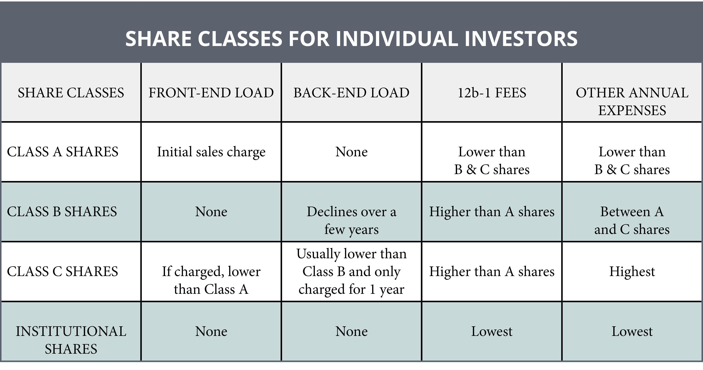

The world of mutual fund investments is marked by a wide array of options, each with its own unique fee structure and attributes. A fundamental aspect of these investments is the understanding of different share classes, specifically Class A, B, and C shares. These classes cater to diverse investor needs and preferences, influencing decisions based on factors like investment duration and initial capital. Class A shares are characterized by an upfront sales charge, beneficial for long-term investors. Class B shares, while diminishing in popularity, impose a back-end load and transition to Class A over time. Class C shares, with their level-load fee structure, suit short-term investors.

Navigating these options requires a clear understanding of each class's financial implications and strategic advantages. Many investors are increasingly considering algorithmic trading as a tool to optimize investment strategies. Algorithmic trading leverages computer algorithms to automate decision-making, potentially enhancing trading efficiency and outcomes by executing trades at opportune times. This integration presents new possibilities for improving investment returns and managing risks in mutual fund portfolios.



This article examines the nuances of Class A, B, and C mutual fund shares and discusses how algorithmic trading can play a vital role in refining investment strategies. By exploring these subjects, investors can gain insights into tailoring their investment choices to align with their financial goals and the ever-changing dynamics of the market.

## Table of Contents

## Understanding Mutual Fund Share Classes

Mutual funds are financial vehicles that pool capital from numerous investors to purchase a diversified portfolio of stocks, bonds, or other securities. To cater to the diverse requirements and preferences of investors, mutual funds are structured into several share classes, primarily Class A, B, and C shares. Each class embodies a distinct combination of fees and benefits, which helps investors align their investment goals with their financial resources and time horizons.

Class A shares are characterized by an upfront sales charge, commonly referred to as a front-end load. This fee is deducted from the initial investment amount, lowering the actual amount put to work in the market upon the initial purchase. Despite this initial cost, Class A shares often provide lower annual expense ratios compared to other share classes. These shares may also offer discounts known as breakpoints for larger investments. As such, Class A shares are typically advantageous for investors with significant capital who anticipate holding their investments over a longer term. The initial expense is offset by the reduced ongoing fees over time, making this class appealing to long-term investors looking to minimize annual costs.

Class B shares, while less prevalent in the current market, include a back-end load or contingent deferred sales charge (CDSC). This charge is incurred when shares are sold, but it diminishes over several years and often disappears completely after a specified period, after which the shares convert automatically into Class A shares. This conversion generally confers the benefit of lower annual fees typical of Class A shares. Class B shares might attract investors who either do not have substantial capital upfront or prefer not to pay an initial fee but are committed to maintaining their investment in the mutual fund for enough years to benefit from the potential conversion to Class A shares.

Class C shares structure fees differently as they do not include an upfront sales charge, thereby allowing the entire investment to be deployed from the outset. However, this comes with higher annual expense ratios and sometimes a modest back-end load if the shares are sold within a short period, often one year. This makes Class C shares appealing for investors with a short- to medium-term investment horizon who are willing to pay higher ongoing fees in exchange for the flexibility of not being locked into an investment for an extended period without significant fees.

Overall, each mutual fund share class is designed to balance the trade-offs between upfront costs, ongoing fees, and investor timelines. Understanding these nuances aids investors in choosing the share class that best complements their financial strategies and investment objectives.

## Advantages and Disadvantages of Class C Shares

Class C shares have unique characteristics that make them appealing to certain types of investors. One of the primary advantages of Class C shares is the absence of a front-end load. This means that the entire amount invested is allocated to purchasing shares, allowing investors to benefit immediately from any potential capital appreciation. This feature is particularly advantageous for short- to medium-term investors who seek to maximize their initial investment without incurring upfront costs.

Despite this beneficial aspect, Class C shares come with certain disadvantages. Notably, they are generally associated with higher annual expense ratios compared to other share classes. These ongoing fees can erode investment returns over time, potentially impacting the overall profitability of the investment. For example, if an investor holds Class C shares for an extended period, the cumulative effect of the higher annual fees may outweigh the benefit of having no initial sales charge.

Moreover, investors in Class C shares may face a back-end load if the shares are sold within a specific timeframe, often around one year. This contingent deferred sales charge (CDSC) serves as a penalty for early redemption, reducing the net proceeds from the sale of shares.

Given these characteristics, Class C shares are often better suited for investors with a short- to medium-term investment horizon. They provide flexibility and minimize initial barriers to entry, making them an attractive option for those who anticipate needing access to their funds sooner rather than later. However, for long-term investors, the persistent annual fees might render Class C shares a less cost-effective choice compared to Class A shares, which typically have lower ongoing expenses after the initial sales charge is paid.

In summary, Class C shares offer immediate investment potential by eliminating front-end loads but require careful consideration of their higher annual costs and potential for back-end fees. Investors must weigh these factors against their investment time frame and goals to determine the most appropriate share class for their needs.

## The Role of Algorithmic Trading

Algorithmic trading, commonly referred to as algo trading, involves using computer algorithms to automate trading decisions, allowing for more efficient and effective execution of trades. This method employs sophisticated mathematical models and strategies to decide on trade orders, timing, pricing, and quantity, often with minimal human intervention. 

One of the primary benefits of [algorithmic trading](/wiki/algorithmic-trading) is its ability to optimize the trading process by executing orders at the most opportune moments. By using historical data and predictive analytics, algorithms can recognize patterns and trends, enabling them to execute trades almost instantaneously when conditions are favorable. This capability is particularly advantageous in financial markets that are fast-paced and volatile, where quick decision-making can significantly impact investment returns.

In the context of mutual fund investments, algorithmic trading can be a valuable tool for navigating market dynamics. Mutual funds, by design, pool resources from various investors to invest in a diversified portfolio of assets. The ability to time the market effectively through algorithmic trading can enhance the fund's performance by maximizing returns and minimizing losses. For instance, an algorithm might be programmed to buy stocks when prices drop to a certain level or to sell them when a predefined profit target is reached.

Moreover, integrating algorithmic trading into mutual fund strategies can also help reduce risks. By automating the trading process, algo trading eliminates emotional biases and human errors that often lead to suboptimal trading decisions. It enables a systematic approach to investing, where decisions are based on data-driven insights rather than subjective judgment.

Overall, the inclusion of algorithmic trading in mutual fund investment strategies offers the potential to improve financial outcomes by optimizing trade execution, enhancing decision-making efficiency, and managing risks more effectively. However, it's crucial for investors to have a firm understanding of the algorithms' design and functionality to harness these advantages fully.

## Which Share Class is Right for You?

Choosing the appropriate mutual fund share class is contingent upon the investor's specific financial objectives, investment duration, and available capital. Each class possesses distinct characteristics tailored to varying investor needs.

Class A shares are particularly suitable for investors with significant capital planning to maintain long-term investments. The primary advantage lies in their reduced fees over time, as these shares involve a front-end load—a one-time charge paid when purchasing the shares. Consequently, larger investments benefit from breakpoints or [volume](/wiki/volume-trading-strategy) discounts, effectively lowering the percentage charged as the investment amount increases. This discount mechanism accrues significant cost savings for investors committed to holding shares for an extended period.

Investors with modest capital but long-term planning might consider Class B shares. Although their popularity has waned, these shares can still be advantageous under specific conditions. Class B shares often [carry](/wiki/carry-trading) a back-end load, also known as a contingent deferred sales charge, which diminishes the longer the shares are held, eventually converting to Class A shares after several years. This feature allows investors to start without an upfront fee, making initial entry easier, albeit with the understanding that selling before the conversion period incurs a charge.

For investors aiming at a short- to medium-term horizon, Class C shares offer a viable alternative. They are characterized by the absence of a front-end load, facilitating direct investment of all capital. Thus, these shares are attractive to investors who seek flexibility without initial barriers. However, Class C shares generally impose higher annual expense ratios, and sometimes a small back-end load if assets are sold within the first year. As such, they may become less cost-effective over a long-term holding period due to these ongoing fees.

In summary, selecting the appropriate mutual fund share class involves a careful evaluation of one's investment goals, timeframe, and financial resources. Class A shares favor long-term commitments with potential fee reductions, Class B shares accommodate those with less upfront capital but long-term plans, and Class C shares offer easy access and flexibility for shorter investment spans, offset by higher ongoing expenses.

## Incorporating Algorithmic Trading in Mutual Fund Strategies

Algorithmic trading, frequently employed by professional investors, is increasingly gaining traction among individual retail investors due to its potential to enhance mutual fund investment strategies. By utilizing computer algorithms, investors can efficiently automate their trading decisions, which facilitates the execution of trades at optimal times. This capability is especially advantageous in managing the intricacies associated with mutual funds, as it allows investors to strategically balance the nuances of various share classes and optimize their overall investment outcomes.

One of the primary advantages of algorithmic trading is its ability to minimize human error and reduce emotional decision-making, which can often adversely affect investment results. By consistently applying predefined criteria and strategies, investors can execute trades with precision and avoid the pitfalls of reactive trading. For mutual fund investments, where market conditions fluctuate frequently, this offers a unique advantage in maintaining a steady focus on long-term strategic goals while adeptly handling short-term market [volatility](/wiki/volatility-trading-strategies).

Algorithmic trading can be tailored to address the specific cost structures and timelines associated with each class of mutual fund shares. For instance, when investing in Class A shares, which typically incur a front-end load, algorithmic trading can be leveraged to time the market effectively, maximizing the potential entry points and minimizing load impacts over time. With Class C shares, which involve higher annual expenses, algorithms can assist in executing trades with higher frequency, ensuring that gains adequately offset the ongoing costs.

Moreover, through [backtesting](/wiki/backtesting)—analyzing how a trading strategy would have performed in historical markets—investors can refine their algorithms to align closely with their financial goals and risk appetite. This process involves using historical data to model hypothetical past trades, allowing for the adjustment of strategy parameters before deploying them in real-time markets.

The integration of algorithmic trading also facilitates the incorporation of complex quantitative models that evaluate multiple variables concurrently, such as price patterns, volume changes, and other market indicators. These models can be programmed to recognize market opportunities or risks that might not be immediately apparent through manual analysis, providing a distinct competitive edge.

To implement algorithmic trading, investors might employ platforms like QuantConnect or Alpaca, which offer powerful API tools to develop and test trading algorithms efficiently. For example, a simple moving average crossover strategy could be implemented using Python, as shown below:

```python
import pandas as pd
import numpy as np

# Sample data
data = pd.DataFrame({
    'price': [100, 102, 104, 103, 102, 101, 105, 107]
})

# Calculate moving averages
data['SMA_Short'] = data['price'].rolling(window=3).mean()
data['SMA_Long'] = data['price'].rolling(window=5).mean()

# Generate signals
data['Signal'] = np.where(data['SMA_Short'] > data['SMA_Long'], 1, -1)

print(data)
```

In conclusion, algorithmic trading presents a robust toolset for mutual fund investors aiming to augment their strategies across different share classes. By employing automated processes, investors can enhance their strategic execution, efficiently manage costs, and potentially improve returns, all while maintaining agility in response to market dynamics.

## The Bottom Line

Understanding the different mutual fund share classes is crucial for making informed investment decisions. Each class—A, B, and C—offers unique structures of fees and benefits tailored to different investment strategies and horizons. Class A shares, for example, involve a front-end load but often provide lower annual expenses over time, making them potentially more cost-effective for long-term investors with significant capital. Class B shares, although less common, may appeal to those with a longer investment horizon but less initial capital, due to their deferred sales charges. Class C shares, characterized by no front-end load but higher annual fees, suit short- to medium-term investors seeking immediate capital deployment without initial sales costs.

Algorithmic trading presents an innovative edge for optimizing investment outcomes and managing market volatility. By leveraging algorithmic trading, investors can automate trading strategies to execute orders at optimal times, potentially enhancing returns and minimizing risks. This method can be particularly beneficial when market conditions are volatile, as it allows for precise timing and swift execution of trades that manual intervention may not match.

When deciding on the appropriate share class, investors should weigh the costs and benefits of each option in relation to their financial objectives and investment horizons. Incorporating algorithmic trading into this decision-making process can provide additional benefits by enhancing trading efficiency and strategy effectiveness. Ultimately, a well-informed decision aligns investment choices with financial goals, risk tolerance, and market dynamics, ensuring that the selected share class and trading strategies contribute positively to the broader investment portfolio.

## References & Further Reading

[1]: ["Mutual Funds and Exchange-Traded Funds: Building Blocks to Wealth"](https://www.amazon.com/Mutual-Funds-Exchange-Traded-Financial-Investments/dp/0190207434) by H. Kent Baker and Greg Filbeck

[2]: Reilly, F. K., & Brown, K. C. (2012). ["Investment Analysis and Portfolio Management"](https://archive.org/details/investmentanalys0000reil_p1a6) Cengage Learning.

[3]: Keller, R. W., & Kot, H. W. (2013). ["Fundamentals of Mutual Funds"](https://psycnet.apa.org/record/2013-01003-002) American Management Association.

[4]: Aldridge, I. (2013). ["High-Frequency Trading: A Practical Guide to Algorithmic Strategies and Trading Systems"](https://www.ahmetbeyefendi.com/wp-content/uploads/2020/07/High-Frequency-Trading-Irene-Aldridge.pdf) Wiley.

[5]: Narang, R. (2009). ["Inside the Black Box: A Simple Guide to Quantitative and High Frequency Trading"](https://onlinelibrary.wiley.com/doi/book/10.1002/9781118267738) Wiley.