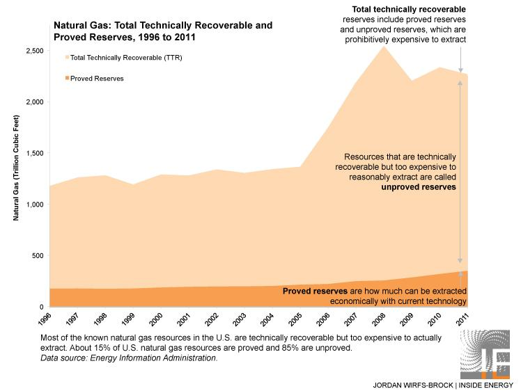

Understanding the complexities of oil reserves and advanced trading techniques is crucial in today's energy and finance sectors. Oil reserves play a vital role in the global economy, wielding influence over geopolitics and economic stability. As key determinants of a nation's energy security and economic strength, oil reserves impact everything from international relations to domestic policy. These reserves are categorically significant as they determine the future of energy availability and pricing, influencing national strategies and trade agreements.

Simultaneously, algorithmic trading is transforming financial markets, offering unprecedented levels of efficiency and speed. By utilizing sophisticated algorithms, traders can execute orders at speeds previously unattainable by human traders alone, analyzing vast datasets in real-time to capitalize on market opportunities. This method of trading has become particularly relevant in the energy sector where market conditions can be extremely volatile, dictating rapid decision-making and strategic execution. 

This article investigates into the intersections of oil reserves classification and the impacts of algorithmic trading within the energy sector, highlighting the dual influence these elements have on current and future market dynamics. As oil reserves affect global economic strategies, algorithmic trading continues to push the boundaries of market operations, creating a complex interplay that shapes the industry's landscape. Understanding this relationship is essential for navigating the evolving challenges and opportunities within the global energy market.

## Table of Contents

## Understanding Oil Reserves

Oil reserves are crucial to the global energy landscape, as they represent the amount of commercially viable oil that countries or companies can extract and use. These reserves are categorized into proven and unproven reserves, with each category representing different levels of certainty about the recoverability and economic viability of the oil.

**Proven Reserves**

Proven reserves, sometimes referred to as "1P" reserves, have at least a 90% probability of being recoverable under existing economic and operational conditions. This high level of certainty makes proven reserves a critical asset in the energy sector, as they provide a reliable supply of oil that can be extracted and utilized efficiently. Proven reserves are typically evaluated using extensive geological and engineering data, which reduces the uncertainty associated with their extraction.

**Unproven Reserves**

Unproven reserves encompass two subcategories: probable and possible reserves. These categories involve higher levels of uncertainty compared to proven reserves but still represent potential future oil supplies:

- **Probable Reserves (2P):** These reserves have a 50% probability of being recovered. While less certain than proven reserves, they are considered likely enough to merit further exploration and potential investment. Probable reserves are often included when companies or countries plan future production operations, as they offer a moderate level of confidence in recovery.

- **Possible Reserves (3P):** These reserves have a 10% probability of being recoverable. Possible reserves represent speculative opportunities for extraction and are commonly included in long-term strategic planning. However, because of their low certainty, these reserves are usually not included in short-term production forecasts unless there are significant advancements in extraction technology or favorable economic changes.

**Strategic Petroleum Reserves**

Strategic Petroleum Reserves (SPRs) are government-controlled stockpiles of [crude oil](/wiki/crude-oil) intended to provide a buffer against supply disruptions. Nations maintain SPRs to enhance their energy security, ensuring that they can manage sudden gaps in supply resulting from geopolitical conflicts, natural disasters, or sudden market fluctuations. By holding these strategic reserves, countries aim to stabilize the global oil market and protect their economies from the [volatility](/wiki/volatility-trading-strategies) associated with energy supply shortages.

The classification of oil reserves into proven and unproven categories offers a structured framework for evaluating potential energy supplies. This classification also plays a crucial role in the financial and geopolitical decisions made by countries and multinational corporations, impacting everything from investment strategies to energy policies.

## The Role of Algorithmic Trading in the Energy Sector

Algorithmic trading, also known as algo trading, employs sophisticated computer algorithms to make trading decisions, execute orders, and manage trading portfolios. These algorithms can process vast quantities of data at speeds far beyond human capabilities, making them particularly valuable in the energy sector, where market conditions can change rapidly.

In energy markets, [algorithmic trading](/wiki/algorithmic-trading) offers significant advantages in terms of speed and accuracy. Traditional trading practices often involve manual decision-making processes, which can be slow and prone to human error. By contrast, algorithms can analyze market data in real time, identify trends, and execute trades within milliseconds. This swift execution is crucial during periods of high market volatility, such as those caused by geopolitical events or sudden changes in supply and demand.

Real-time data analysis is a core component of algorithmic trading. Algorithms use a variety of data sources, including historical price movements, current market prices, news feeds, and even social media sentiment, to inform their trading strategies. By using techniques such as [machine learning](/wiki/machine-learning) and predictive analytics, these algorithms can forecast future price movements and capitalize on profitable trading opportunities almost instantaneously.

For instance, an algorithm might monitor the price of crude oil futures and detect patterns that suggest an upcoming price surge. It can then execute a buy order before the price increases, capturing potential profits for the trader. Furthermore, the use of natural language processing (NLP) enables algorithms to interpret unstructured data from news articles and reports, adding another layer of depth to their analytical capabilities.

Given the complexity and dynamic nature of energy markets, algo trading systems often include risk management protocols to mitigate potential losses. These protocols might involve setting stop-loss limits or using options strategies to hedge against adverse market movements.

Incorporating real-time data analysis, algorithmic trading enhances the accuracy and efficiency of market operations. This improvement contributes to a more organized and liquid market, reducing bid-ask spreads and ensuring that asset prices more accurately reflect underlying value. As algorithmic trading continues to evolve, its role in the energy sector is likely to expand, driving further advancements in trading efficiency and market transparency.

## Current Trends and Impacts of Algo Trading

Algorithmic trading is increasingly pivotal in the finance sector due to its capacity to process large volumes of data at high speeds, identifying profitable trading opportunities that are otherwise undetectable. This advancement has significantly improved market efficiency by ensuring [liquidity](/wiki/liquidity-risk-premium) and narrowing bid-ask spreads. As a result, it facilitates a smoother trading experience by minimizing discrepancies between buy and sell prices, thus benefiting investors through reduced transaction costs.

However, the speed and complexity inherent in algorithmic trading introduce risks such as market manipulation. Techniques like spoofing (placing fake orders to manipulate prices) or quote stuffing (submitting a large number of orders to clog the market) can create artificial volatility and disorient other traders. This capability for manipulation necessitates stringent oversight to ensure the integrity of financial markets.

Regulatory frameworks like the Markets in Financial Instruments Directive II (MiFID II) have been established to mitigate these risks. MiFID II, implemented in the European Union, enhances transparency across trading activities by mandating rigorous reporting of transactions and scrutinizing high-frequency trading practices. The directive requires firms to maintain detailed logs of all algorithmic trading decisions, thereby facilitating accountability and reducing the potential for abuse.

Moreover, the ongoing evolution of technology in algorithmic trading continues to revolutionize analytics in trading strategies. Machine learning algorithms are now being harnessed to adapt to rapid market changes, offering predictive insights that extend the frontiers of traditional trading methodologies. This evolution ensures that traders remain competitive by leveraging smarter, data-driven decisions, further shaping the dynamics of financial markets.

Ultimately, while algorithmic trading confers numerous benefits such as operational efficiency and enhanced market dynamics, it also calls for responsible implementation and robust regulatory frameworks to safeguard market integrity. This balance is crucial as the financial industry continues to innovate and adapt to new technological solutions.

## Conclusion

The intersection of oil reserves management and algorithmic trading represents a pivotal convergence within the energy sector, bringing both new opportunities and challenges. As these two areas intertwine, technological advancements stand at the forefront of reshaping energy market dynamics.

Algorithmic trading, with its reliance on sophisticated algorithms and real-time data analysis, has profoundly increased the efficiency and decision-making capability in markets historically characterized by their volatility. This technological capability allows traders to process large datasets rapidly, making informed decisions that can account for fluctuations in oil reserves and pricing in near real-time. The precision offered by algorithmic trading transforms trading operations, reducing the latency in executing trades and capitalizing on transient market opportunities.

In parallel, the management of oil reserves remains crucial due to their significant geopolitical and economic implications. Effective classification and management of these reserves ensure that extraction aligns with global economic demands, thereby stabilizing markets and ensuring energy security. The combination of precise oil reserves data with algorithmic trading strategies allows for a more responsive and adaptive market environment.

However, integrating these domains is fraught with challenges. The fast-paced nature of algorithmic trading might exacerbate market fluctuations if not properly regulated. There's a risk that the speed and efficiency of algorithms could lead to greater volatility, especially if the trading strategies are not aligned with robust regulatory standards. Moreover, the complexity involved in effectively managing vast oil reserves, coupled with the intricacies of real-time trading, demands a high level of expertise.

Ultimately, mastering the dual challenges of oil reserves management and algorithmic trading is essential for those operating within the energy sector. The continuous evolution of technology promises to innovate and transform these markets, but it also requires strategic oversight to harness these advancements responsibly. Success and competitiveness in this rapidly evolving industry hinge on the ability to seamlessly integrate these elements and navigate the associated risks and opportunities.

## References & Further Reading

BP Statistical Review of World Energy provides comprehensive data on global energy markets, offering insights into oil reserves, production, and consumption trends. This review is essential for understanding the macroeconomic factors influencing oil markets and the strategic use of resources like Strategic Petroleum Reserves (SPRs).

Yergin, D. in "The Quest: Energy, Security, and the Remaking of the Modern World", explores the geopolitical significance of energy resources, including oil reserves. Yergin's analysis highlights the strategic roles these reserves play in global politics and economic stability.

Geman, H. in "Commodities and Commodity Derivatives: Modelling and Pricing for Agriculturals, Metals, and Energy" provides a detailed examination of pricing models and strategies within the energy sector. Her work is crucial for understanding the financial instruments used in trading oil and other commodities.

The U.S. Energy Information Administration (EIA) Reports are pivotal resources for current [statistics](/wiki/bayesian-statistics) on U.S. and international energy production and consumption. These reports offer timely and relevant data that inform policy decisions and trading strategies within energy markets.

Aldridge, I. in "High-Frequency Trading: A Practical Guide to Algorithmic Strategies and Trading Systems" provides a comprehensive view of the advanced trading techniques revolutionizing financial markets. Her guide is invaluable for grasping the technical aspects and risks associated with algorithmic trading in energy markets.

