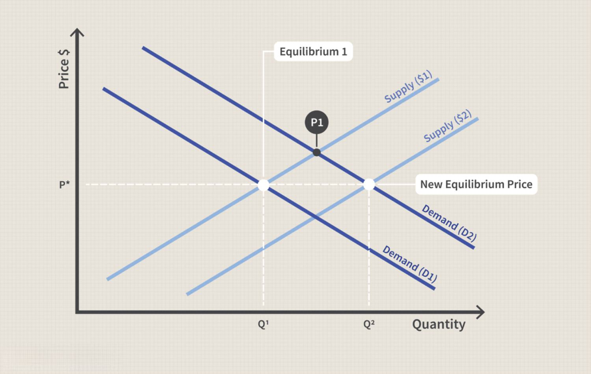

In the complex world of economics and trading, understanding core concepts like supply and demand, aggregate supply, economic theories, and algorithmic trading is crucial. This article explores these interconnected components, providing insights into their interactions and implications for modern markets. The dynamic interplay between supply and demand sets the fundamental framework of market economics. It dictates how goods and services are allocated and at what prices they are exchanged. This relationship forms the backbone of economic analysis, impacting decisions from policy making to personal investments.

Aggregate supply expands this foundational understanding by considering the total output of goods and services within an entire economy. It reflects the economy's production capabilities at varying price levels, influenced by factors such as workforce size, technological advancement, and government policies. Understanding aggregate supply is essential for analyzing the economy's health and anticipating changes in economic activity.



Economic theories offer diverse perspectives on how these elements interact within broader economic systems. From classical and Keynesian economics to supply-side theories, each provides unique insights into economic behaviors and policy implications.

Algorithmic trading, a product of technological advancement, has revolutionized financial markets by employing computer algorithms to execute trades at remarkable speeds. This innovation enhances market liquidity and efficiency but also introduces challenges such as increased volatility and regulatory concerns.

In this article, we will examine each of these topics to provide a comprehensive understanding necessary for practical applications in real-world economic settings. Understanding these elements is paramount for navigating today's complex economic landscape and leveraging them for strategic advantage.

## Table of Contents

## Understanding Supply and Demand

Supply and demand constitute the core of economic theory, representing the interaction between producers and consumers. Supply refers to the quantity of goods or services that producers are willing and able to offer at various price levels. Conversely, demand signifies the willingness and ability of consumers to purchase goods at different price points. These two forces interact dynamically to establish market prices and determine the equilibrium quantity exchanged in the market.

### Supply

The law of supply states that, ceteris paribus, an increase in the price of a good results in an increase in the quantity supplied. This is because higher prices provide an incentive for producers to supply more, as they can achieve higher revenue. The supply curve, therefore, typically slopes upwards from left to right. Factors affecting supply include production costs, technological advancements, and the number of sellers in the market.

For instance, a technological innovation that reduces production costs can increase supply. If the cost of producing smartphones decreases due to a new manufacturing technology, the supply of smartphones in the market will likely increase, shifting the supply curve to the right.

### Demand

The law of demand posits that, ceteris paribus, a decrease in the price of a good results in an increase in the quantity demanded. Consumers are generally more inclined to purchase more of a product when its price decreases due to increased affordability, representing a downward-sloping demand curve. Factors influencing demand include consumer income levels, tastes and preferences, and the prices of related goods.

Imagine a case where consumer preferences shift towards electric vehicles due to environmental concerns. This shift in preference would increase the demand for electric vehicles, moving the demand curve to the right.

### Market Equilibrium

Market equilibrium occurs at the point where the quantity supplied equals the quantity demanded, resulting in a stable market price. At this point, there is no inclination for price movement because the market effectively clears—the entire amount supplied is purchased by consumers. The equilibrium can be disrupted by changes in supply and demand factors, leading to shifts in the equilibrium price and quantity.

For example, if a popular new gadget is released, initially, demand might outpace supply, causing prices to rise. As prices increase, producers are motivated to supply more, and the equilibrium point may reach a new balance as supply catches up with demand.

Mathematically, market equilibrium can be expressed as:

$$
Q_s = Q_d
$$

Where:
- $Q_s$ is the quantity supplied
- $Q_d$ is the quantity demanded

This equation demonstrates that supply and demand functions adjust to maintain equilibrium. Understanding these principles is fundamental to comprehending how markets operate and how prices are set. This foundational concept is not only vital for economic theory but also for practical applications in market analysis and business strategy.

## Exploring Aggregate Supply: Economics in Depth

Aggregate supply (AS) is a fundamental concept in macroeconomics, representing the total quantity of goods and services that firms in an economy are willing to produce and sell at a given overall price level, during a specified period. Unlike individual supply, which pertains to a specific product or service, aggregate supply encompasses the entire economic output and is influenced by various macro-level factors.

### Factors Influencing Aggregate Supply

#### Labor Force Dynamics
The size and productivity of the labor force significantly impact aggregate supply. An increase in the labor force, often driven by demographic changes, immigration, or employment policies, can enhance production capabilities. Labor force participation and productivity are also shaped by education, training, and technological integration, which affect overall economic output.

#### Technological Advancements
Technology plays a crucial role in enhancing productive efficiency and capacity. Through innovation, economies can achieve higher levels of output with the same amount of input, thereby boosting aggregate supply. Technological improvements can streamline processes, reduce costs, and lead to the creation of new products, all of which contribute to an increase in aggregate supply.

#### Government Policies
Regulatory and fiscal policies established by governments can profoundly influence aggregate supply. Policies that focus on structural reforms, tax incentives, or subsidies for certain industries can encourage production. On the other hand, regulations that increase operational costs or restrict certain business activities can have a dampening effect on aggregate supply.

### The Aggregate Supply Curve

Economists often describe the relationship between aggregate supply and the overall price level using the aggregate supply curve. This curve can be divided into three distinct ranges:

- **Short-Run Aggregate Supply (SRAS):** In the short run, the curve is typically upward sloping, indicating that as price levels rise, firms are willing to produce more due to higher profit margins.

- **Long-Run Aggregate Supply (LRAS):** In the long run, the curve is vertical, reflecting the economy's maximum sustainable output, which is determined by available resources, technology, and institutions, and is unaffected by price level changes.

- **Medium-Run Aggregate Supply:** Economies may also consider a medium-run perspective where factors such as wage adjustments and capital investments gradually influence aggregate supply.

### Mathematical Representation

In mathematical terms, aggregate supply can be expressed as a function of various input factors and price levels. The aggregate production function can be represented as:

$$
Y = A \cdot F(K, L, H, N)
$$

Where:
- $Y$ is the total output (aggregate supply).
- $A$ represents the level of technology.
- $F$ is the function capturing the relationship between inputs and output.
- $K$, $L$, $H$, $N$ are inputs: capital, labor, human capital, and natural resources, respectively.

By understanding these factors and their interplay, economists and policymakers can better forecast economic performance and develop strategies to optimize aggregate supply, supporting sustainable growth and stability in the economy. The dynamics of aggregate supply and its significant indicators thus serve as critical components in macroeconomic policy and analysis.

## Economic Theories and Their Influence on Aggregate Supply

Various economic theories have provided different perspectives on the factors influencing aggregate supply, each offering a unique lens for understanding production dynamics in an economy.

**Supply-side Economics**

Supply-side economics emphasizes the role of producers and their ability to create goods and services. Proponents argue that reducing barriers to production, such as taxes and regulation, increases aggregate supply. This theory posits that more favorable conditions for businesses lead to increased investment in capital, technology, and labor, thereby expanding the economy's production capabilities. Policies inspired by supply-side economics, like tax cuts or deregulation, aim to stimulate production, thereby benefiting the economy through increased output and employment.

**Keynesian Theory**

Keynesian economics, named after John Maynard Keynes, offers a different approach by emphasizing aggregate demand rather than aggregate supply. However, Keynesian theory also impacts aggregate supply indirectly. According to Keynesians, a healthy level of demand leads to full utilization of resources and increased production. In scenarios where demand is insufficient, governments can intervene through fiscal policies, such as increased public spending, to boost demand. As demand recovers, firms respond by increasing production, which raises aggregate supply over time. Keynesians argue that demand can create its own supply through this mechanism, particularly in times of economic slack.

**Classical Economics**

Classical economics provides another foundational framework, suggesting that markets naturally move towards equilibrium where aggregate supply equals aggregate demand. The theory posits that prices, wages, and interest rates are flexible, enabling economies to self-correct and move resources efficiently. Classical economists argue that an excess supply or demand in the economy will be temporary, as market forces invariably restore balance. In this view, long-term changes in aggregate supply result from shifts in factors like technology, capital stock, and labor force size, rather than government intervention.

**Implications for Understanding Aggregate Supply**

These theories, while contrasting, collectively enhance the understanding of aggregate supply within the broader economic system. Supply-side economics focuses on empowering producers to enhance supply, Keynesian theory underscores the importance of demand in driving production, and classical economics relies on market self-regulation and adaptability. Each theory suggests different policy implications: supply-side policies might involve tax reforms, Keynesian policies might involve fiscal stimulus, and classical theories might discourage intervention, favoring natural market adjustments. Understanding these perspectives aids policymakers and economists in crafting strategies to optimize production, manage economic cycles, and bolster economic growth.

## Role of Algorithmic Trading in Modern Economics

Algorithmic trading, commonly referred to as algo trading, employs computer algorithms to facilitate the rapid execution of trades. This form of trading has transformed the landscape of financial markets by enabling high-speed transactions that human traders cannot match. The deployment of sophisticated algorithms allows for the automation of trading strategies, which are often based on complex mathematical models and historical market data.

One of the primary advantages of [algorithmic trading](/wiki/algorithmic-trading) is its contribution to market [liquidity](/wiki/liquidity-risk-premium). By executing numerous trades at high velocities, algo trading reduces bid-ask spreads and makes it easier for buyers and sellers to transact. This leads to a more efficient market where prices reflect available information more accurately and promptly.

However, the advent of algo trading also presents significant risks, such as increased market [volatility](/wiki/volatility-trading-strategies). Algorithms can execute large volumes of trades in mere milliseconds, potentially magnifying price fluctuations. For example, during the infamous Flash Crash of May 6, 2010, the Dow Jones Industrial Average experienced a dramatic drop of about 1,000 points within minutes, partly attributed to high-frequency trading algorithms acting in concert. Such events highlight the need for robust risk management systems within trading algorithms to prevent unintended consequences.

The impact of algo trading extends to price discovery processes as well. With algorithms designed to exploit even the slightest market inefficiencies, prices in financial markets are continually adjusted to align with new information. This constant recalibration can lead to more accurate pricing of securities, benefiting the overall financial system.

The benefits of algorithmic trading are accompanied by a host of regulatory considerations. Regulators must ensure that the deployment of such technology does not undermine market integrity. Measures like circuit breakers and order limits have been introduced in various markets to curb the effects of excessive high-frequency trading. These mechanisms are intended to temporarily halt trading in scenarios where prices move excessively and rapidly, providing a buffer against potential systemic risk.

Moreover, the opacity of certain algorithmic strategies poses a challenge for regulatory bodies tasked with monitoring financial markets. The complexity of these algorithms can obscure their trading objectives, making it difficult for regulators to fully understand and anticipate their impact on market dynamics. As a result, there is an ongoing dialogue between financial institutions and regulatory agencies to develop adaptive frameworks that balance innovation with market stability.

In conclusion, algorithmic trading undeniably reshapes modern economics by enhancing market liquidity and efficiency, augmenting both opportunities and challenges. As financial markets continue to evolve with technological advancements, the role of algo trading will likely expand, necessitating a careful approach to regulation and risk management.

## Integrating Economic Theory with Algorithmic Trading

The integration of economic theory and algorithmic trading creates a unique synergy that can revolutionize market operations. Economic models serve as a strategic foundation upon which algorithmic traders can build more sophisticated trading strategies. By using algorithms informed by economic principles, traders can better predict market trends, evaluate risks, and make informed decisions.

Economic models such as the Efficient Market Hypothesis (EMH) suggest that asset prices reflect all available information. Algorithmic trading systems use this theory to justify strategies like statistical [arbitrage](/wiki/arbitrage), exploiting momentary pricing inefficiencies in rapidly evolving markets. Algorithms can process vast amounts of data in real-time, making it possible to act on subtle market signals that might suggest deviations from a market's theoretical efficiency.

Key economic indicators, such as GDP growth rates, inflation, and unemployment figures, are often integrated into algorithmic models to forecast market movements. These variables can be quantified and fed into [machine learning](/wiki/machine-learning) models to predict asset price movements. For instance, algorithms can be programmed to buy or sell based on deviations from expected macroeconomic variables that are traditionally outlined in Keynesian or Classical economic theories.

Consider a simple Python script using machine learning for trading decisions:

```python
import numpy as np
from sklearn.linear_model import LinearRegression

# Hypothetical data for GDP growth rates and stock prices
gdp_growth = np.array([2.1, 2.4, 2.8, 3.1, 2.9]).reshape(-1, 1)
stock_prices = np.array([100, 105, 110, 112, 109])

# Linear regression model
model = LinearRegression().fit(gdp_growth, stock_prices)

# Predict stock price based on new GDP growth data
new_gdp_growth = np.array([[3.0]])
predicted_price = model.predict(new_gdp_growth)
print(f"Predicted stock price for 3.0% GDP growth: {predicted_price[0]}")
```

This code exemplifies how traditional economic data (GDP growth) can inform trading strategies using algorithmic approaches, highlighting the potential for more dynamic and nuanced market interactions.

However, integrating economic theory with algorithmic trading also poses challenges and risks, including heightened market volatility and systemic risks. High-frequency trading ([HFT](/wiki/high-frequency-trading-strategies)) has been associated with increased volatility because algorithms can execute a large number of orders in milliseconds, sometimes creating feedback loops that exacerbate price swings.

Regulatory measures are essential to ensure market stability in such a technologically driven environment. Agencies like the Securities and Exchange Commission (SEC) and the Commodity Futures Trading Commission (CFTC) have introduced regulations to manage the risks inherent in algorithmic trading. Measures include circuit breakers to halt trading during excessive volatility and transparency requirements for trading algorithms.

Balancing the power of algorithmic trading with economic theories and regulatory oversight can drive markets towards efficiency while mitigating risks. Ongoing advancements in technology and economics necessitate continuous adaptation and enhancement of trading strategies to maintain a stable financial ecosystem.

## Conclusion

Aggregate supply, economic theory, and algorithmic trading are critical components of contemporary economic systems, each playing a pivotal role in shaping market dynamics. A deep understanding of these elements allows policymakers, businesses, and investors to better manage risks and seize market opportunities. Aggregate supply influences macroeconomic stability by determining the total output of goods and services at different price levels. Economic theories, including Keynesian, classical, and supply-side economics, offer frameworks for interpreting how factors such as government policy, capital investment, and technological advancements impact aggregate supply. Algorithmic trading, which leverages computational algorithms for executing trades, significantly alters market liquidity and volatility, thereby affecting economic stability.

In today’s fast-paced global economy, the integration of traditional economic theory with innovative trading technologies introduces both opportunities and challenges. Economic models can inform algorithmic strategies, improving market prediction and enhancing the efficiency of trades. However, the adoption of algorithmic trading necessitates robust regulatory oversight to mitigate associated risks such as flash crashes and systemic instability.

Looking forward, the economic landscape will continue to evolve, driven by advancements in technology and shifts in economic policy. The interplay between aggregate supply, economic theories, and algorithmic trading will require continuous adaptation and research. This ongoing evolution will demand interdisciplinary collaboration between economists, data scientists, and financial analysts to develop sustainable strategies for managing economic growth and stability. As markets become more interconnected, understanding these complexities will be crucial for navigating future economic challenges and leveraging potential gains within the global market.

## References & Further Reading

Krugman, P. & Wells, R. *Macroeconomics.* This book provides an extensive examination of macroeconomic principles, emphasizing the interconnectedness of various economic factors, such as aggregate demand and supply. It is a valuable resource for understanding how macroeconomic concepts apply to real-world scenarios, providing illustrative examples and critical insights into the workings of economies.

Mankiw, N.G. *Principles of Economics.* This textbook offers a comprehensive introduction to economic theories, covering essential topics such as supply and demand, market structures, and the role of government in economic systems. Mankiw explains complex ideas using simple language, making it an excellent starter for those new to economics or those seeking to solidify their foundational knowledge.

Carlin, B.P., Gelfand, A.E., & Smith, A.F. *Hierarchical Bayesian Analysis of Change Point Problems.* This work discusses advanced statistical techniques, particularly focusing on Bayesian analysis. It is particularly relevant for those interested in the quantitative aspects of economics, providing a framework for understanding how structural shifts and changes in data patterns can be identified and analyzed. This resource is crucial for understanding the application of statistical models to economic data, contributing to better forecasting and decision-making in trading and economic planning.

These texts collectively offer a broad and insightful view of economic theory, supply and demand dynamics, and the application of statistical methods in economic analysis, serving both novices and experienced practitioners looking to deepen their understanding of complex economic systems.

