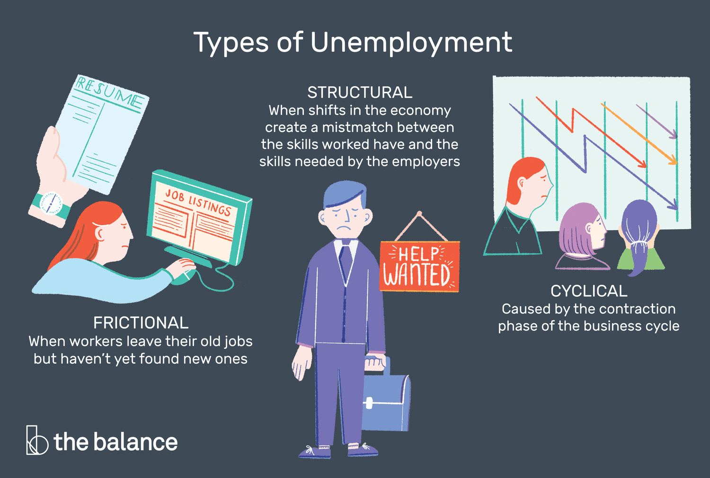

## Table of Contents

## What is unemployment?

Unemployment is when people who want to work cannot find a job. It happens for many reasons, like when companies do not need as many workers or when the economy is not doing well. People who are unemployed might look for jobs every day, but they still cannot find one that suits them.

Being unemployed can be hard. It can make people feel stressed and worried about money. Governments often try to help by creating programs to give people jobs or money while they look for work. Understanding unemployment is important because it affects many people and can change how a country's economy works.

## What is structural unemployment?

Structural unemployment happens when the skills that workers have do not match the skills that jobs need. This can happen because technology changes or because the economy shifts to different kinds of work. For example, if a lot of factories close down and more jobs are in computers, people who used to work in factories might not have the right skills for the new computer jobs.

This type of unemployment can last a long time because it takes a while for workers to learn new skills. Governments and schools often try to help by offering training programs. But it's not always easy to fix because the world of work keeps changing. Understanding structural unemployment is important because it helps us see why some people struggle to find jobs even when there are jobs available.

## What is cyclical unemployment?

Cyclical unemployment happens when the economy goes through ups and downs. When the economy is not doing well, like during a recession, businesses might not make as much money. They might need to let workers go because they can't afford to pay them. This is when cyclical unemployment goes up. When the economy gets better, businesses start making more money again and they hire more workers, so cyclical unemployment goes down.

This kind of unemployment is tied to the business cycle, which is the natural pattern of growth and slowdown in the economy. Governments try to help by spending more money or changing interest rates to make the economy better. But it can take time for these changes to help people find jobs again. Understanding cyclical unemployment helps us see why sometimes a lot of people are out of work at the same time, and why it can get better when the economy improves.

## What are the main causes of structural unemployment?

Structural unemployment happens when the skills that workers have don't match the skills that jobs need. This can happen because of big changes in the economy. For example, if a lot of jobs in one industry, like coal mining, go away because people start using less coal, the workers in that industry might not have the right skills for the new jobs that are available, like jobs in technology or renewable energy.

Another reason for structural unemployment is technology. When new machines or computers can do work that people used to do, those people might lose their jobs. They need to learn new skills to work with the new technology, but learning new skills can take a long time and cost money. If they can't learn fast enough, they might stay unemployed for a while.

Governments and schools try to help by offering training programs to teach people new skills. But it's not always easy to fix because the world of work keeps changing. Sometimes, even with training, it can be hard for people to find jobs that match their new skills. This is why structural unemployment can be a big problem that lasts a long time.

## What are the main causes of cyclical unemployment?

Cyclical unemployment happens when the economy goes through ups and downs. When the economy is not doing well, like during a recession, businesses make less money. Because they are making less money, they might need to let workers go. This is when cyclical unemployment goes up. It's all about the business cycle, which is the natural pattern of growth and slowdown in the economy.

When the economy gets better, businesses start making more money again. They need more workers to help them grow, so they start hiring again. This is when cyclical unemployment goes down. Governments try to help by spending more money or changing interest rates to make the economy better. But it can take time for these changes to help people find jobs again. Understanding cyclical unemployment helps us see why sometimes a lot of people are out of work at the same time, and why it can get better when the economy improves.

## How do structural and cyclical unemployment affect the economy differently?

Structural unemployment happens when the skills that workers have do not match the skills that jobs need. This can slow down the economy because it takes a long time for workers to learn new skills. When many people cannot find jobs because their skills are outdated, they do not spend as much money. This can make businesses struggle because they are not selling as much. Governments might spend money on training programs to help workers learn new skills, but it's not a quick fix. The economy can stay slow until the skills gap is fixed.

Cyclical unemployment happens when the economy goes through ups and downs. During a recession, when the economy is not doing well, businesses make less money and have to let workers go. This means people have less money to spend, which can make the economy even worse. But when the economy gets better, businesses start hiring again, and people start spending more money. This helps the economy grow. Governments can help by spending more money or changing interest rates to make the economy better faster, but it still takes time for people to find jobs again.

## Can you provide examples of structural unemployment?

One example of structural unemployment happened in the United States when many factories closed down. A lot of people used to work in these factories, making things like cars and steel. But then, companies started making these things in other countries where it was cheaper. The workers who lost their jobs in the factories did not have the skills needed for the new jobs that were available, like jobs in technology or service industries. They had to learn new skills, but it took a long time, and many of them stayed out of work for a while.

Another example is when new technology changes the way we work. For instance, when banks started using more computers and ATMs, they needed fewer people to work as tellers. The tellers who lost their jobs did not know how to work with the new technology. They needed to learn new skills, like how to work in IT or other fields, but it was hard for them to find new jobs quickly. This kind of unemployment happens because the skills people have do not match the skills that new jobs need.

## Can you provide examples of cyclical unemployment?

Cyclical unemployment happens when the economy goes up and down. During a recession, like the one in 2008, a lot of people lost their jobs. Many businesses were not making as much money, so they had to let workers go. For example, construction companies stopped building new houses because fewer people were buying them. The workers who used to build houses could not find new jobs easily because there were not many jobs available in the economy.

When the economy gets better, cyclical unemployment goes down. After the 2008 recession, the economy slowly started to grow again. Businesses began to make more money and started hiring again. For example, car companies that had to let workers go during the recession started making more cars and needed more workers. As more people found jobs, they started spending more money, which helped the economy grow even more.

## How can structural unemployment be addressed or reduced?

To address structural unemployment, one important way is to help people learn new skills. Governments and schools can offer training programs that teach people how to do the jobs that are available now. For example, if there are a lot of jobs in computers but not enough people know how to do them, training programs can teach people about computers. This can take time and money, but it helps people find new jobs that match their new skills.

Another way to reduce structural unemployment is to help businesses change the way they work. If businesses can find new ways to use the skills that workers already have, it can create more jobs. Governments can also help by making it easier for businesses to start up in new industries. This can create new kinds of jobs that people can do with their current skills. By working together, governments, schools, and businesses can help fix the problem of structural unemployment and help more people find work.

## How can cyclical unemployment be addressed or reduced?

Cyclical unemployment happens when the economy is not doing well, like during a recession. To help with this kind of unemployment, governments can spend more money on things like building roads or schools. This can create jobs and help the economy grow. Governments can also change interest rates to make it easier for people to borrow money and spend more. This can help businesses make more money and start hiring again.

It takes time for these changes to help people find jobs again. When the economy starts to get better, businesses will slowly start to hire more workers. As more people find jobs, they will spend more money, which helps the economy grow even more. By doing things like spending money and changing interest rates, governments can help reduce cyclical unemployment and make the economy better for everyone.

## What are the long-term implications of high levels of structural unemployment?

High levels of structural unemployment can have big effects on people and the economy over a long time. When a lot of people can't find jobs because their skills don't match the jobs that are available, they might feel sad and stressed. They might not have enough money to buy things they need, like food and a place to live. This can make them depend on help from the government, like money or food stamps, for a long time. It can also make them feel like they are not important to society, which can be hard on their minds and hearts.

When a lot of people are out of work because of structural unemployment, it can also hurt the economy. If people don't have jobs, they don't spend as much money. This can make businesses struggle because they are not selling as much. Over time, this can slow down the whole economy. Governments might have to spend more money to help people and to try to fix the problem, but it takes a long time to teach people new skills and create new jobs. If structural unemployment stays high for a long time, it can make it hard for the economy to grow and for people to feel hopeful about the future.

## How do policymakers distinguish between structural and cyclical unemployment when designing economic policies?

Policymakers need to know if unemployment is structural or cyclical to make good plans. Structural unemployment happens when people's skills don't match the jobs that are available. To figure this out, policymakers look at things like how fast technology is changing or if industries are moving to other countries. They might see that a lot of people used to work in factories, but now there are more jobs in computers. If this is the case, they know they need to help people learn new skills to get those new jobs. This can take a long time and needs a lot of planning.

Cyclical unemployment happens when the economy goes up and down. Policymakers can tell if unemployment is cyclical by looking at how the economy is doing. If there's a recession and businesses are not making as much money, they might have to let workers go. This means more people are out of work, but it's because of the economy, not because their skills are wrong. To help with cyclical unemployment, policymakers might spend more money on things like building roads or change interest rates to make it easier for people to borrow money. This can help the economy get better and businesses start hiring again.

## What is an overview of understanding unemployment?

Unemployment is defined as the situation where individuals who are capable of working and are actively seeking employment remain unengaged in paid work. This metric is crucial in economic analysis because it provides insights into the health of an economy. High unemployment can signal economic distress, while low unemployment may indicate a booming economy. However, understanding the nuances of different types of unemployment is essential for nuanced interpretations.

Economists identify several types of unemployment: structural, cyclical, frictional, and seasonal. Structural unemployment occurs when there is a mismatch between workers' skills and the demands of the job market, often due to technological advancements or shifts in the economy. Cyclical unemployment is associated with the ups and downs of economic cycles—rising during recessions and falling during periods of growth. Frictional unemployment refers to short-term joblessness experienced by individuals transitioning between jobs or entering the workforce. Lastly, seasonal unemployment occurs when industries slow or shut down due to seasonal variations, such as agriculture or tourism.

To measure unemployment rates, several indicators are used. The unemployment rate is typically calculated using the formula:

$$
\text{Unemployment Rate} = \left(\frac{\text{Number of Unemployed People}}{\text{Labor Force}}\right) \times 100
$$

where the labor force is the sum of employed and unemployed individuals actively seeking work. Other important indicators include the labor force participation rate and the employment-to-population ratio. These metrics inform policymakers about the labor market's overall health.

Unemployment data significantly influences monetary policy. Central banks, such as the Federal Reserve in the United States, analyze unemployment rates to guide decisions about setting interest rates and implementing measures to stimulate or cool down the economy. For example, high unemployment may prompt a central bank to lower interest rates to encourage borrowing and investment, thereby spurring job creation.

The impact of unemployment extends to economic stability and growth. Prolonged high unemployment can lead to decreased consumer spending, reducing overall economic output. It can also result in higher government spending on social support programs, increasing budget deficits. Conversely, low unemployment can contribute to economic growth by boosting consumer confidence and spending power.

In conclusion, understanding unemployment and its various forms is vital for assessing economic conditions. This knowledge aids policymakers and investors alike in making informed decisions, ultimately influencing economic strategies and outcomes.

## What is Cyclical Unemployment from an Economic Perspective?

Cyclical unemployment is fundamentally tied to the fluctuating nature of the economic cycle, encompassing periods of expansion and recession. During economic expansions, demand for goods and services rises, prompting companies to hire more workers, which in turn decreases the level of cyclical unemployment. Conversely, during economic recessions, demand contracts, leading firms to reduce their workforce and increase cyclical unemployment. 

The pattern of cyclical unemployment is intrinsically linked to the business cycle, which typically involves phases of growth (expansion), peak (boom), contraction (recession), and trough (recovery). The cyclical component of unemployment can be described mathematically by the gap between actual GDP and potential GDP, often represented as:

$$
\text{Cyclical Unemployment Rate} = \frac{\text{Actual GDP} - \text{Potential GDP}}{\text{Potential GDP}}
$$

Government interventions, such as fiscal and monetary policies, aim to smooth out these cycles and mitigate the effects of cyclical unemployment. Fiscal policies involve adjusting government spending and taxation to influence aggregate demand, while monetary policies include modifying interest rates and controlling money supply to maintain economic stability. For instance, during a recession, a government might implement a stimulus package to boost spending and cut taxes, thereby encouraging job creation and reducing unemployment.

Historically, significant economic downturns have illustrated the impact of cyclical unemployment. The Great Depression of the 1930s saw massive unemployment rates as demand plummeted. More recently, the 2008 financial crisis led to a sharp increase in cyclical unemployment as a result of a severe contraction in global economic activity. In both cases, extensive government interventions were necessary to revive growth and employment.

Cyclical unemployment also plays a crucial role in influencing consumer confidence and spending. High levels of unemployment generally lead to reduced consumer spending as individuals become uncertain about their financial future. This decline in spending further suppresses demand, exacerbating unemployment and slowing economic recovery. Conversely, during periods of low unemployment, increased consumer confidence typically leads to higher spending levels, bolstering economic growth.

Overall, cyclical unemployment is a dynamic reflection of the economic cycle, affecting individual livelihoods, consumer behavior, and broader economic performance. Understanding and addressing it is vital for economic stability and growth.

## References & Further Reading

[1]: Mankiw, N. G. (2014). ["Principles of Macroeconomics,"](https://books.google.com/books/about/Principles_of_Macroeconomics_9th_Edition.html?id=Hm22EAAAQBAJ) 7th Edition. Cengage Learning.

[2]: Krugman, P., & Wells, R. (2015). ["Macroeconomics,"](https://books.google.com/books/about/Macroeconomics.html?id=_d-lswEACAAJ) 4th Edition. Worth Publishers.

[3]: Smith, R. (2011). ["Unemployment as an Economic Indicator: Implications and Understanding."](https://onlinelibrary.wiley.com/doi/full/10.1111/j.1468-0297.2011.02428.x) The Journal of Economic Perspectives, 25(1), 157-177.

[4]: Stock, J. H., & Watson, M. W. (2015). ["Introduction to Econometrics,"](https://www.princeton.edu/~mwatson/Stock-Watson_4E/Stock-Watson-Resources-4e.html) 3rd Edition. Pearson Education.

[5]: Ajmani, V. (2011). ["Applied Econometrics Using the SAS System."](https://onlinelibrary.wiley.com/doi/book/10.1002/9780470377901) Wiley Series in Probability and Statistics.