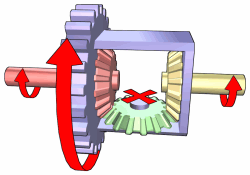

## Table of Contents

## What is a differential in a vehicle?

A differential in a vehicle is a part of the car's drivetrain that allows the wheels to turn at different speeds. This is important because when a car goes around a corner, the outside wheel has to travel a longer distance than the inside wheel. Without a differential, the wheels would have to turn at the same speed, which would make turning difficult and could cause the tires to wear out quickly.

There are different types of differentials, but the most common one is called an open differential. An open differential lets the wheels turn at different speeds easily, which is good for normal driving. However, it can have problems if one wheel loses traction, like on ice or mud, because all the power might go to the wheel that is slipping instead of the one that can grip the road. To solve this, some cars have limited-slip or locking differentials, which help distribute power more evenly between the wheels.

## How does a differential work?

A differential works by using gears to split the power from the engine between the two wheels on an axle. When a car goes straight, the power is split equally, and both wheels turn at the same speed. But when the car turns a corner, the outside wheel needs to go faster than the inside wheel. The differential lets this happen by allowing the wheels to turn at different speeds. Inside the differential, there are gears called the ring gear and pinion gear that work together to transfer power from the engine to the wheels.

The main part of the differential is something called the differential case, which holds a set of gears known as the spider gears and side gears. When the car turns, the spider gears let the side gears, which are connected to the wheels, turn at different speeds. This is how the outside wheel can go faster than the inside wheel without any problems. So, the differential makes sure the car can turn smoothly and that the tires don't wear out too quickly.

## What are the main components of a differential?

The main parts of a differential are the differential case, ring gear, pinion gear, spider gears, and side gears. The differential case is a strong container that holds all the gears together. The ring gear is a big gear that is attached to the differential case. The pinion gear is a smaller gear that connects to the drive shaft and meshes with the ring gear. This setup helps transfer power from the engine to the wheels.

Inside the differential case, there are spider gears and side gears. The spider gears are small gears that can move around inside the case. They connect to the side gears, which are attached to the axle shafts that go to the wheels. When the car turns, the spider gears let the side gears turn at different speeds. This way, the outside wheel can go faster than the inside wheel, making it easier for the car to turn smoothly.

## Why is a differential necessary in vehicles?

A differential is necessary in vehicles because it allows the wheels on the same axle to turn at different speeds. When a car goes around a corner, the outside wheel needs to travel a longer distance than the inside wheel. Without a differential, both wheels would have to turn at the same speed, which would make turning difficult and could cause the tires to wear out quickly. The differential solves this problem by letting the wheels turn at different speeds, which helps the car turn smoothly.

In addition to helping with turning, a differential also helps distribute power from the engine to the wheels. It does this using gears inside the differential. The main gears are the ring gear and the pinion gear, which work together to transfer power from the engine to the wheels. Inside the differential, there are also smaller gears called spider gears and side gears that allow the wheels to turn at different speeds when needed. This makes sure the car can move efficiently and safely, whether it's going straight or turning.

## What is the difference between an open differential and a limited-slip differential?

An open differential is the most common type of differential in cars. It lets the wheels on the same axle turn at different speeds easily, which is good for normal driving. But it has a problem when one wheel loses traction, like on ice or mud. If one wheel slips, all the power goes to that wheel, and the other wheel doesn't get any power. This can make the car get stuck because the wheel with traction isn't getting any power.

A limited-slip differential, or LSD, is different because it helps keep power going to both wheels, even if one wheel starts to slip. It does this by using special parts like clutches or gears that can lock the wheels together a bit. This means that if one wheel loses traction, the other wheel can still get power and help the car move. Limited-slip differentials are often used in cars that need better traction, like sports cars or off-road vehicles.

## How does a locking differential function?

A locking differential works by connecting the two wheels on an axle together so they turn at the same speed. When you lock the differential, it's like making the wheels work as one. This is really helpful when one wheel is on a slippery surface, like mud or ice, and the other wheel is on solid ground. Without a locking differential, all the power might go to the wheel that's slipping, and the car could get stuck. But with the differential locked, power goes to both wheels, helping the car move forward.

Locking differentials can be automatic or manual. An automatic locking differential senses when one wheel is slipping and locks itself to send power to both wheels. A manual locking differential needs the driver to flip a switch or press a button to lock it. Once locked, it stays that way until the driver unlocks it. Locking differentials are often used in off-road vehicles or trucks where traction is important, making it easier to get out of tough spots.

## What are the advantages and disadvantages of using a differential?

Using a differential in a vehicle has many advantages. It makes it easier for the car to turn corners smoothly. When a car turns, the outside wheel needs to go faster than the inside wheel. The differential lets this happen by letting the wheels turn at different speeds. This keeps the tires from wearing out too quickly and makes driving more comfortable. Differentials also help spread power from the engine to the wheels, making sure the car can move well on different kinds of roads.

However, there are also some disadvantages to using a differential. An open differential, which is the most common type, can have problems when one wheel loses traction. If one wheel slips on ice or mud, all the power goes to that wheel, and the car can get stuck. To solve this, people use limited-slip or locking differentials, but these can be more expensive and complex. They might also make the car a bit harder to handle on normal roads because they can lock the wheels together, which changes how the car turns.

## How does a differential affect vehicle performance and handling?

A differential helps a car go around corners smoothly. When a car turns, the outside wheel has to go faster than the inside wheel. The differential lets this happen by allowing the wheels to turn at different speeds. This makes the car easier to handle and keeps the tires from wearing out too quickly. It also helps the car move well on different types of roads by spreading power from the engine to the wheels.

However, the type of differential can change how the car performs. An open differential is simple and works well for normal driving, but it can have problems if one wheel slips on ice or mud. In those cases, all the power might go to the slipping wheel, and the car could get stuck. Limited-slip or locking differentials can help with this by sending power to both wheels, even if one is slipping. But these differentials can be more expensive and might make the car a bit harder to handle on normal roads because they can lock the wheels together, which changes how the car turns.

## What are the common types of differentials used in modern vehicles?

Modern vehicles use different types of differentials to help them turn and move well. The most common type is the open differential. It's simple and works well for normal driving. When a car goes around a corner, the open differential lets the outside wheel go faster than the inside wheel. This makes turning easier and keeps the tires from wearing out too quickly. But, if one wheel slips on ice or mud, all the power might go to that wheel, and the car could get stuck.

To solve this problem, some cars use a limited-slip differential (LSD). An LSD helps keep power going to both wheels, even if one starts to slip. It does this by using special parts like clutches or gears that can lock the wheels together a bit. This means that if one wheel loses traction, the other wheel can still get power and help the car move. Limited-slip differentials are often used in cars that need better traction, like sports cars or off-road vehicles.

Another type is the locking differential. A locking differential connects the two wheels on an axle together so they turn at the same speed. When you lock it, it's like making the wheels work as one. This is really helpful when one wheel is on a slippery surface, and the other is on solid ground. Locking differentials can be automatic or manual. They're often used in off-road vehicles or trucks where getting stuck is a big problem.

## How can one diagnose and troubleshoot differential problems?

If you think your car's differential might have a problem, there are a few signs to look for. You might hear strange noises like whining, clunking, or grinding sounds when you're driving, especially when turning or going around corners. Another sign is if your car feels like it's pulling to one side or if the wheels seem to be slipping or not gripping the road well. If you see fluid leaking from under your car, that could also mean there's a problem with the differential. To find out for sure, you can take your car to a mechanic who can check it and tell you what's wrong.

To fix differential problems, the mechanic might need to do a few things. They might need to change the differential fluid, which helps the gears inside the differential work smoothly. If the gears are worn out or broken, they might need to be replaced. Sometimes, the whole differential might need to be taken out and fixed or replaced. It's important to fix differential problems quickly because if you don't, it could make other parts of your car wear out faster or even break.

## What advancements have been made in differential technology?

New types of differentials have been made to help cars work better and handle tricky situations. One big change is the electronic limited-slip differential (eLSD). This type of differential uses computers and sensors to control how power is sent to the wheels. It can change how the car turns and moves in just a few seconds. This makes the car safer and more fun to drive, especially on twisty roads or when the weather is bad. The eLSD can help the car go faster around corners and keep it from sliding on slippery roads.

Another cool thing is the torque vectoring differential. This differential can send different amounts of power to each wheel, not just between the wheels on the same axle. It helps the car turn better and go faster around corners. Some cars even use electric motors at each wheel, which can act like a differential. These motors can change how much power goes to each wheel very quickly. This makes the car handle better and use less gas. These new types of differentials make cars more fun to drive and safer on the road.

## How do electronic differentials compare to mechanical differentials in terms of efficiency and control?

Electronic differentials, like electronic limited-slip differentials (eLSD), are more efficient and give better control than mechanical differentials. They use computers and sensors to quickly change how power goes to the wheels. This makes the car handle better, especially when turning or on slippery roads. Mechanical differentials, like open or limited-slip differentials, use gears to do this job. They can't change as fast as electronic ones, so the car might not handle as well in tricky situations. Electronic differentials can make the car safer and more fun to drive because they can react to what's happening on the road very quickly.

But, electronic differentials can be more complex and expensive than mechanical ones. They need special parts like computers and sensors, which can cost more and might need more fixing if something goes wrong. Mechanical differentials are simpler and usually cheaper to fix. They work well for normal driving and don't need fancy electronics. So, while electronic differentials give better control and efficiency, they might not be the best choice for everyone because of the cost and complexity.

## What are the differences in differentials within futures contracts?

A differential in the context of futures contracts is an adjustment made to account for variations in the quality or delivery location of the underlying asset. These adjustments are essential because futures contracts are standardized agreements that stipulate the sale or purchase of an asset at a pre-agreed price on a future date. However, the assets involved, such as commodities like [crude oil](/wiki/crude-oil) or agricultural products, can have differing qualities or may be delivered from various locations. To accommodate such discrepancies and ensure fairness in trading, differentials are applied.

Differentials influence the futures price by modifying the base price to reflect these variations. For example, if a delivery location is less desirable or the quality of the asset is lower than the standard specified in the contract, a negative differential might be applied, reducing the contract's price. Conversely, a positive differential might be added for an asset of superior quality or a more desirable delivery location. These adjustments can be quantified through mathematical expressions:

$$
\text{Adjusted Futures Price} = \text{Base Futures Price} + \text{Differential}
$$

Understanding how differentials affect pricing is crucial for effective risk management in futures trading. Accurate pricing helps traders evaluate the fair market value of a futures contract, which is vital for devising effective trading strategies. A thorough knowledge of differentials allows traders to hedge against potential losses and manage the risks associated with price fluctuations due to quality or location variations.

Further, differentials are an integral part of the risk assessment process in futures trading. By providing clear guidelines for the value adjustments based on asset differences, differentials minimize the risks associated with unexpected price changes. Traders and investors use these adjustments to make informed decisions and to optimize their portfolios in accordance with market conditions.

In practice, the calculation and application of differentials require a deep understanding of both the underlying asset and the market dynamics. Sophisticated algorithms and models are often employed to assess and apply the appropriate differentials efficiently, thus enabling more accurate and timely trading decisions. This understanding and application of differentials not only support enhanced trading strategies but also bolster overall profitability in futures trading.

## How can Reinforcement Learning be used in Trading System Optimization?

Reinforcement Learning (RL) represents a significant leap forward in the development of automated trading systems due to its capacity to handle the unpredictable and highly dynamic nature of financial markets. Unlike conventional analytical techniques, which often rely on static models, RL employs a learning approach that adapts through interactions with the environment. This process involves exploring different actions and refining strategies based on the rewards obtained, thereby enabling models to enhance decision-making over time.

In the context of trading, RL methodologies such as Deep Q-Learning (DQL) and Double Deep Q-Network (DDQN) have proven effective in optimizing trading strategies. Their ability to manage complex decision-making processes surpasses the capability of traditional algorithms. Deep Q-Learning integrates [deep learning](/wiki/deep-learning) with Q-learning, where a [neural network](/wiki/neural-network) is used to approximate the Q-value function, which estimates the expected utility of taking a given action in a particular state and following a specific policy thereafter.

For instance, the Q-value function, Q(s, a), represents the expected return of taking action $a$ in state $s$, and can be iteratively updated using the Bellman equation:

$$
Q(s, a) = Q(s, a) + \alpha \left( r + \gamma \max_{a'} Q(s', a') - Q(s, a) \right)
$$

where $r$ is the immediate reward received after transitioning to state $s'$, $\alpha$ is the learning rate, and $\gamma$ is the discount factor.

DDQN extends DQL by reducing the overestimation of action values through decoupling the selection and evaluation of actions. This mechanism makes learning more stable and consistent, which is crucial for creating reliable trading strategies.

Empirical case studies highlight the success of RL in optimizing trading endeavors. For example, a study demonstrated that an RL-based trading system could outperform conventional systems by dynamically optimizing trading decisions based on fluctuations in market conditions. The RL [agents](/wiki/agents), by simulating market interactions, learned to identify profitable opportunities and effectively manage risk, resulting in improved profitability and operational efficiency.

Furthermore, RL algorithms can accommodate the intricacies and stochastic behaviors inherent in financial markets. They are capable of factoring in extensive datasets, reacting to real-time market changes, and continuously refining trading models. This adaptability makes RL a robust solution for addressing the limitations of traditional approaches that often fail to capture the complexity and rapid shifts characteristic of financial environments.

In conclusion, by leveraging the adaptive nature of [reinforcement learning](/wiki/reinforcement-learning) algorithms, automated trading systems can achieve greater accuracy and efficiency, empowering traders to harness sophisticated market dynamics with improved strategic foresight.

## References & Further Reading

[1]: ["Advances in Financial Machine Learning"](https://www.amazon.com/Advances-Financial-Machine-Learning-Marcos/dp/1119482089) by Marcos Lopez de Prado

[2]: ["Evidence-Based Technical Analysis: Applying the Scientific Method and Statistical Inference to Trading Signals"](https://www.amazon.com/Evidence-Based-Technical-Analysis-Scientific-Statistical/dp/0470008741) by David Aronson

[3]: ["Machine Learning for Algorithmic Trading"](https://github.com/stefan-jansen/machine-learning-for-trading) by Stefan Jansen

[4]: ["Quantitative Trading: How to Build Your Own Algorithmic Trading Business"](https://www.amazon.com/Quantitative-Trading-Build-Algorithmic-Business/dp/1119800064) by Ernest P. Chan

[5]: Bucida, R. (2020). ["Reinforcement Learning in Financial Markets."](https://research.amanote.com/publication/b5_-3XMBKQvf0BhiBiXx/reinforcement-learning-in-financial-markets) IEEE Access

[6]: Dempster, M.A., & Leemans, V. (2006). ["An Automated FX Trading System using Adaptive Reinforcement Learning."](https://www.sciencedirect.com/science/article/pii/S0957417405003015) In Computational Finance

[7]: Sutton, R.S., & Barto, A.G. (2018). ["Reinforcement Learning: An Introduction."](https://web.stanford.edu/class/psych209/Readings/SuttonBartoIPRLBook2ndEd.pdf) MIT Press