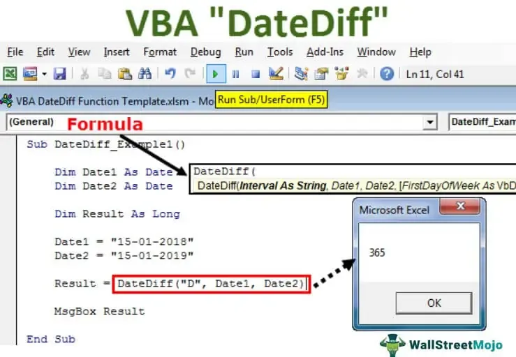

In recent years, algorithmic trading has become an essential component of financial markets, driven by its capacity to analyze massive datasets and execute transactions at velocities unattainable by human traders. These systems capitalize on sophisticated algorithms designed to optimize trading strategies, thereby enhancing efficiency and accuracy. A key aspect of this article is the examination of differentials within futures contracts. Understanding and leveraging these differentials is crucial for managing risk effectively and improving profitability in trading. Futures contracts are standardized agreements to buy or sell an asset at a future date, and the differential accounts for variations in asset quality or delivery logistics, impacting the contract's value.

Furthermore, the integration of reinforcement learning into automated trading systems represents a significant advancement. Reinforcement Learning (RL), a subset of artificial intelligence, is adept at handling the dynamic complexities of financial markets by learning optimal strategies through interaction and feedback. This ability allows RL to address the limitations inherent in traditional parameter optimization methods, which often struggle with the non-linear and stochastic nature of market environments. By employing RL, traders can develop systems that adapt and refine their strategies over time, potentially leading to more robust and profitable outcomes.



This article aims to provide a comprehensive overview of the methodologies employed in trading strategy optimization and their real-world applications in contemporary financial markets. Through a detailed analysis, we will explore how these sophisticated algorithms and advanced learning techniques contribute to the evolution of algorithmic trading, offering insights into managing risk and enhancing profitability effectively.

## Table of Contents

## Understanding Differentials in Futures Contracts

A differential in the context of futures contracts is an adjustment made to account for variations in the quality or delivery location of the underlying asset. These adjustments are essential because futures contracts are standardized agreements that stipulate the sale or purchase of an asset at a pre-agreed price on a future date. However, the assets involved, such as commodities like [crude oil](/wiki/crude-oil) or agricultural products, can have differing qualities or may be delivered from various locations. To accommodate such discrepancies and ensure fairness in trading, differentials are applied.

Differentials influence the futures price by modifying the base price to reflect these variations. For example, if a delivery location is less desirable or the quality of the asset is lower than the standard specified in the contract, a negative differential might be applied, reducing the contract's price. Conversely, a positive differential might be added for an asset of superior quality or a more desirable delivery location. These adjustments can be quantified through mathematical expressions:

$$
\text{Adjusted Futures Price} = \text{Base Futures Price} + \text{Differential}
$$

Understanding how differentials affect pricing is crucial for effective risk management in futures trading. Accurate pricing helps traders evaluate the fair market value of a futures contract, which is vital for devising effective trading strategies. A thorough knowledge of differentials allows traders to hedge against potential losses and manage the risks associated with price fluctuations due to quality or location variations.

Further, differentials are an integral part of the risk assessment process in futures trading. By providing clear guidelines for the value adjustments based on asset differences, differentials minimize the risks associated with unexpected price changes. Traders and investors use these adjustments to make informed decisions and to optimize their portfolios in accordance with market conditions.

In practice, the calculation and application of differentials require a deep understanding of both the underlying asset and the market dynamics. Sophisticated algorithms and models are often employed to assess and apply the appropriate differentials efficiently, thus enabling more accurate and timely trading decisions. This understanding and application of differentials not only support enhanced trading strategies but also bolster overall profitability in futures trading.

## Algorithmic Trading: Mechanisms and Strategies

Algorithmic trading relies on the application of algorithms to optimize the timing and execution of trades, effectively reducing human intervention and subjective biases. The integration of complex mathematical models and computational algorithms enables traders to enhance decision-making processes and improve precision in trade executions. This section highlights the pivotal mechanisms and strategies employed in [algorithmic trading](/wiki/algorithmic-trading), focusing on data analysis, trade signal generation, execution algorithms, and risk management techniques.

Central to algorithmic trading is the extensive use of data analysis. Traders analyze large volumes of historical and real-time market data to extract valuable insights and trends. This involves employing statistical techniques and [machine learning](/wiki/machine-learning) models to identify patterns that can inform trading decisions. Python libraries such as NumPy, pandas, and scikit-learn are widely used in these analyses. For example, a trader might use a moving average crossover strategy, where buy/sell signals are generated when a short-term moving average crosses above or below a long-term moving average:

```python
import pandas as pd

# Example of a simple moving average crossover strategy
data = pd.read_csv('market_data.csv')
data['SMA_short'] = data['Close'].rolling(window=10).mean()
data['SMA_long'] = data['Close'].rolling(window=50).mean()

data['Signal'] = 0
data.loc[data['SMA_short'] > data['SMA_long'], 'Signal'] = 1
data.loc[data['SMA_short'] < data['SMA_long'], 'Signal'] = -1
```

Trade signal generation is a critical aspect of algorithmic trading, where predefined rules are used to identify potential buy or sell opportunities. These signals are based on technical indicators, market patterns, or statistical anomalies observed in the analyzed data. The application of machine learning techniques, such as classification algorithms, can improve the accuracy of these signals by adapting to changing market conditions.

Execution algorithms are designed to optimize the process of executing trades, aiming to achieve the best possible terms in the context of speed, cost, and price impact. Common execution strategies include Volume Weighted Average Price (VWAP) and Time Weighted Average Price (TWAP). These algorithms manage the pace and quantity of orders sent to the market, thereby minimizing market impact and ensuring efficient execution.

Risk management remains a cornerstone of algorithmic trading strategies. Algorithms incorporate various risk management techniques to mitigate potential losses and manage exposure. Examples include Setting stop-loss orders, employing value-at-risk (VaR) models, and diversifying portfolios. The integration of quantitative risk measures ensures that trading strategies are not only optimized for returns but are also resilient to adverse market conditions.

Popular algorithmic trading strategies include statistical [arbitrage](/wiki/arbitrage), [market making](/wiki/market-making), and [trend following](/wiki/trend-following). Statistical arbitrage exploits price differentials of correlated financial instruments, employing statistical techniques to profit from short-term discrepancies. Market making involves providing [liquidity](/wiki/liquidity-risk-premium) to the market by simultaneously offering to buy and sell a financial instrument. Trend following attempts to capitalize on persistent market trends by entering positions in alignment with the dominant trend.

The core components of an automated trading system incorporate a comprehensive architecture that supports data intake, signal generation, execution, and risk management. The system is typically built on a robust technology stack that includes data feeds, analytical modules, order management systems, and brokerage interfaces. The automation of these components facilitates the execution of complex trading strategies with minimal human oversight, enhancing both efficiency and scalability in financial markets.

## Reinforcement Learning in Trading System Optimization

Reinforcement Learning (RL) represents a significant leap forward in the development of automated trading systems due to its capacity to handle the unpredictable and highly dynamic nature of financial markets. Unlike conventional analytical techniques, which often rely on static models, RL employs a learning approach that adapts through interactions with the environment. This process involves exploring different actions and refining strategies based on the rewards obtained, thereby enabling models to enhance decision-making over time.

In the context of trading, RL methodologies such as Deep Q-Learning (DQL) and Double Deep Q-Network (DDQN) have proven effective in optimizing trading strategies. Their ability to manage complex decision-making processes surpasses the capability of traditional algorithms. Deep Q-Learning integrates [deep learning](/wiki/deep-learning) with Q-learning, where a [neural network](/wiki/neural-network) is used to approximate the Q-value function, which estimates the expected utility of taking a given action in a particular state and following a specific policy thereafter.

For instance, the Q-value function, Q(s, a), represents the expected return of taking action $a$ in state $s$, and can be iteratively updated using the Bellman equation:

$$
Q(s, a) = Q(s, a) + \alpha \left( r + \gamma \max_{a'} Q(s', a') - Q(s, a) \right)
$$

where $r$ is the immediate reward received after transitioning to state $s'$, $\alpha$ is the learning rate, and $\gamma$ is the discount factor.

DDQN extends DQL by reducing the overestimation of action values through decoupling the selection and evaluation of actions. This mechanism makes learning more stable and consistent, which is crucial for creating reliable trading strategies.

Empirical case studies highlight the success of RL in optimizing trading endeavors. For example, a study demonstrated that an RL-based trading system could outperform conventional systems by dynamically optimizing trading decisions based on fluctuations in market conditions. The RL [agents](/wiki/agents), by simulating market interactions, learned to identify profitable opportunities and effectively manage risk, resulting in improved profitability and operational efficiency.

Furthermore, RL algorithms can accommodate the intricacies and stochastic behaviors inherent in financial markets. They are capable of factoring in extensive datasets, reacting to real-time market changes, and continuously refining trading models. This adaptability makes RL a robust solution for addressing the limitations of traditional approaches that often fail to capture the complexity and rapid shifts characteristic of financial environments.

In conclusion, by leveraging the adaptive nature of [reinforcement learning](/wiki/reinforcement-learning) algorithms, automated trading systems can achieve greater accuracy and efficiency, empowering traders to harness sophisticated market dynamics with improved strategic foresight.

## Challenges and Considerations in Algorithmic Trading

Algorithmic trading, while offering substantial benefits, is fraught with challenges that traders must address to ensure consistent performance and sustainability. The complexities of system design are paramount, as these systems need to integrate various components such as data feeds, price prediction algorithms, trade execution protocols, and risk management modules. Constructing a system that seamlessly amalgamates these elements requires meticulous architecture design and software engineering expertise.

A key consideration in algorithmic trading is the computational demands imposed by sophisticated algorithms, particularly those employing machine learning techniques. These models often require extensive computational resources to train and validate, necessitating robust hardware and efficient coding practices. For instance, optimizing algorithm performance might involve parallel processing techniques or the use of cloud-based computational platforms that offer scalability.

Moreover, the interpretability of models used in algorithmic trading presents another layer of complexity. Many modern models, especially those based on deep learning, act as black boxes with little transparency regarding their decision-making processes. Enhancing model interpretability is crucial for gaining insights into the rationale behind trading decisions, facilitating debugging and adjustment of strategies as market conditions evolve.

Regulatory concerns also occupy a central role in algorithmic trading. Financial authorities impose stringent regulations to prevent manipulative practices and ensure fair market operations. Consequently, traders must ensure that their systems comply with regulatory frameworks, such as those enforced by the Securities and Exchange Commission (SEC) in the United States or the Markets in Financial Instruments Directive II (MiFID II) in Europe. Compliance entails not only adhering to established standards but also maintaining comprehensive audit trails for trades executed by automated systems.

The robustness of trading systems against market anomalies is equally critical. Unforeseen events, such as flash crashes, can induce extreme [volatility](/wiki/volatility-trading-strategies), necessitating pre-programmed measures to mitigate risks. These may include circuit breakers that halt trading under specific conditions or dynamic adjustment of risk parameters based on real-time volatility assessments.

From an ethical standpoint, algorithmic traders face the responsibility to ensure transparency and accountability. The opacity associated with algorithmic decisions can hinder stakeholders from understanding the impact of automated trades on market dynamics. Measures such as periodic audits, transparency reports, and the implementation of ethical guidelines are imperative to uphold integrity and trust within financial markets.

Risk management strategies form the foundation of successful algorithmic trading operations. Techniques range from traditional methods like Value at Risk (VaR) and stress testing to more advanced approaches involving real-time analytics and adaptive algorithms that adjust risk exposure dynamically. These systems must not only react to immediate threats but also anticipate potential vulnerabilities in trading strategies.

In summary, while algorithmic trading offers significant advantages, it is imperative for traders to address the challenges associated with system design, computational demand, model interpretability, regulatory compliance, system robustness, and ethical considerations. By doing so, they can enhance the effectiveness and reliability of automated trading, paving the way for more sustainable and profitable operations.

## Future Directions and Developments

The future trajectory of algorithmic trading is characterized by the increasing integration of advanced technologies, notably [artificial intelligence](/wiki/ai-artificial-intelligence) (AI), machine learning (ML), and quantum computing. These technologies are set to redefine the landscape of financial markets by enabling traders to develop more sophisticated strategies and predictive models.

Among these, AI and ML are pivotal in enhancing prediction models and creating more adaptive trading strategies. Machine learning algorithms can process vast amounts of financial data to identify subtle patterns and correlations that are not immediately evident to human traders. For instance, technologies such as neural networks and ensemble methods can be employed to forecast price movements with higher accuracy. This is achieved by learning from historical data and continuously updating models as new data becomes available, facilitating a more dynamic approach to market conditions.

Moreover, enhanced data analytics capabilities are being facilitated by improvements in computational power and the availability of real-time data streams. The use of big data analytics allows traders to conduct more comprehensive analyses of market trends, sentiment, and events, which contribute to more informed trading decisions. Advanced analytical tools can process and analyze heterogeneous data sources, ranging from traditional financial metrics to [alternative data](/wiki/best-alternative-data) such as social media sentiment and news feeds.

Quantum computing is another frontier that holds the potential to revolutionize algorithmic trading. Quantum algorithms can solve complex optimization problems significantly faster than classical computers, potentially leading to substantial advancements in trading speed and efficiency. Although still in the experimental stage, quantum computing could offer unprecedented computational capabilities that might unlock new strategies and models not feasible with current technology.

As these technologies develop, their implications for the financial industry are profound. They promise not only to improve the efficiency and accuracy of trading systems but also to enhance risk management practices by providing more comprehensive assessments of market volatility and systemic risks. The potential for these technologies to disrupt traditional trading paradigms underscores the necessity for continuous innovation.

However, to maintain a competitive advantage, it is crucial for market participants to remain adaptive and receptive to technological advancements. The landscape of financial markets is ever-evolving, driven by regulatory changes, market dynamics, and technological progress. Firms engaged in algorithmic trading must consistently refine their strategies, integrate cutting-edge technologies, and foster a culture of innovation to sustain their position in the market. This ongoing evolution requires a commitment to research and development, as well as the agility to respond to shifts in market conditions and technological breakthroughs.

## References & Further Reading

[1]: ["Advances in Financial Machine Learning"](https://www.amazon.com/Advances-Financial-Machine-Learning-Marcos/dp/1119482089) by Marcos Lopez de Prado

[2]: ["Evidence-Based Technical Analysis: Applying the Scientific Method and Statistical Inference to Trading Signals"](https://www.amazon.com/Evidence-Based-Technical-Analysis-Scientific-Statistical/dp/0470008741) by David Aronson

[3]: ["Machine Learning for Algorithmic Trading"](https://github.com/stefan-jansen/machine-learning-for-trading) by Stefan Jansen

[4]: ["Quantitative Trading: How to Build Your Own Algorithmic Trading Business"](https://www.amazon.com/Quantitative-Trading-Build-Algorithmic-Business/dp/1119800064) by Ernest P. Chan

[5]: Bucida, R. (2020). ["Reinforcement Learning in Financial Markets."](https://research.amanote.com/publication/b5_-3XMBKQvf0BhiBiXx/reinforcement-learning-in-financial-markets) IEEE Access

[6]: Dempster, M.A., & Leemans, V. (2006). ["An Automated FX Trading System using Adaptive Reinforcement Learning."](https://www.sciencedirect.com/science/article/pii/S0957417405003015) In Computational Finance

[7]: Sutton, R.S., & Barto, A.G. (2018). ["Reinforcement Learning: An Introduction."](https://web.stanford.edu/class/psych209/Readings/SuttonBartoIPRLBook2ndEd.pdf) MIT Press