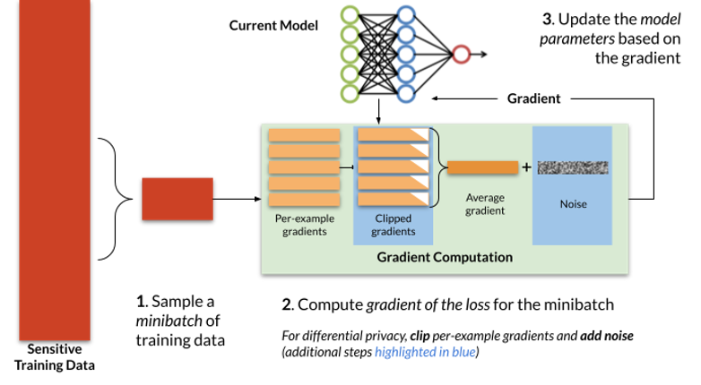

## Table of Contents

## What is differential privacy in the context of machine learning?

Differential privacy is a way to protect personal information when using data for machine learning. It adds a bit of randomness to the data, so it's hard to tell if any one person's information was used. This helps keep individual privacy safe while still allowing the data to be useful for learning patterns and making predictions.

Imagine you're trying to find out the average height of people in a room. If you know everyone's exact height, you might be able to guess someone's height just by knowing they were in the room. With differential privacy, you add a little bit of random noise to each height, so the average is still close to the real average, but you can't be sure about any one person's height. This way, the overall information is still useful, but individual privacy is protected.

## Why is differential privacy important for machine learning?

Differential privacy is important for machine learning because it helps protect people's private information. When machine learning models are trained on data that includes personal details, there's a risk that someone could figure out sensitive information about individuals. By using differential privacy, we add a little bit of randomness to the data, which makes it hard to identify any one person's information. This means we can still use the data to train models and learn useful patterns, but we don't compromise anyone's privacy.

This balance is crucial because it allows companies and researchers to use large datasets without worrying about breaking privacy laws or ethical guidelines. For example, if a hospital wants to use patient data to improve healthcare, differential privacy can help them do that without risking the privacy of the patients. This way, everyone benefits: the hospital can improve its services, and patients can trust that their personal information is safe.

## How does differential privacy protect individual data?

Differential privacy works by adding a bit of randomness, or "noise," to the data. This noise makes it hard to tell if any one person's information was used in the dataset. Imagine you have a jar of marbles, and you want to know the average color of the marbles without knowing the color of any specific marble. By adding a few extra marbles of random colors, you can still figure out the average color, but you can't be sure about any single marble's color. This is similar to how differential privacy works with data.

The key idea is that the results of queries or analyses on the data won't change much if you add or remove any single person's information. This is called the "privacy guarantee." For example, if you're looking at the average income of a group of people, adding or removing one person's income shouldn't change the average too much. By ensuring this, differential privacy makes sure that individual data points don't have a big impact on the overall results, which keeps personal information safe.

In the context of [machine learning](/wiki/machine-learning), this means that models can be trained on private data without revealing sensitive details about any individual. The added noise helps maintain the utility of the data for learning patterns and making predictions, but it also ensures that no one can reverse-engineer the model to find out specific details about people in the dataset. This way, machine learning can be used responsibly and ethically, protecting people's privacy while still benefiting from the data.

## What are the key components of differential privacy?

Differential privacy has two main parts: adding noise and setting a privacy budget. Adding noise means putting a little bit of randomness into the data. This makes it hard to figure out any one person's information. For example, if you're looking at how many people in a town like ice cream, you might add a few random numbers to the count. This way, you can still know if most people like ice cream, but you can't be sure about any one person's preference. The amount of noise added is carefully chosen to balance privacy and usefulness.

The other part is the privacy budget, which is like a limit on how much you can learn from the data without hurting privacy. It's measured by something called epsilon ($$ \epsilon $$), which is a small number. A smaller epsilon means more privacy but less useful data, and a bigger epsilon means less privacy but more useful data. You have to decide how much privacy you want to protect and how much usefulness you need. This helps make sure that even if you ask many questions about the data, you won't accidentally reveal too much about any one person.

## Can you explain the concept of epsilon (ε) in differential privacy?

Epsilon, or $$ \epsilon $$, is a number that helps measure how much privacy is protected in differential privacy. It's like a dial that you can turn to balance privacy and usefulness. A smaller $$ \epsilon $$ means more privacy because it adds more randomness to the data, making it harder to figure out any one person's information. On the other hand, a bigger $$ \epsilon $$ means less privacy but more useful data, as less randomness is added.

Think of $$ \epsilon $$ as a budget for how much you're allowed to learn from the data without hurting privacy. If you use up too much of your $$ \epsilon $$ budget by asking too many questions or making too many calculations, you might accidentally reveal more about individuals than you wanted. So, you have to be careful and decide how much privacy you want to protect and how much usefulness you need, and then set your $$ \epsilon $$ accordingly.

## What is the difference between local and global differential privacy?

Local differential privacy means adding randomness to each person's data before it's shared or collected. Imagine you're filling out a survey about your favorite food. Instead of telling the exact truth, you might flip a coin and change your answer if it lands on heads. This way, no one can be sure about your real favorite food, but the overall results can still be useful. Local differential privacy is great for protecting privacy right from the start, but it can make the data less accurate because so much noise is added.

Global differential privacy, on the other hand, adds randomness to the data after it's all collected in one place. Think of a big database where all the survey answers are stored. Instead of changing each person's answer, you add a little noise to the final results. This method can keep the data more accurate because less noise is needed overall, but it requires trusting the person or system that manages the database to handle the data responsibly. The choice between local and global differential privacy depends on how much you trust the data collectors and how much accuracy you need.

## How can differential privacy be implemented in machine learning algorithms?

Differential privacy can be implemented in machine learning algorithms by adding a bit of randomness, or noise, to the data before it's used for training. This can be done in two main ways: local and global differential privacy. In local differential privacy, each person's data is changed a little bit before it's shared. For example, if you're collecting data on how much people exercise, you might add or subtract a small random number to each person's reported exercise time. This makes it hard to figure out any one person's exact exercise habits. In global differential privacy, the noise is added after all the data is collected. For instance, if you're looking at the average exercise time, you might add a small random number to the final average. This way, the overall data is still useful for training machine learning models, but individual privacy is protected.

To implement differential privacy in machine learning, you need to decide on the privacy budget, which is measured by a number called epsilon ($$ \epsilon $$). A smaller $$ \epsilon $$ means more privacy because more noise is added, making it harder to identify any one person's data. A larger $$ \epsilon $$ means less privacy but more accurate data because less noise is added. You have to balance these two factors based on how much privacy you want to protect and how much accuracy you need in your machine learning model. For example, if you're training a model to predict health outcomes, you might choose a smaller $$ \epsilon $$ to protect sensitive health data, even if it means the model is a bit less accurate.

## What are some common techniques used to achieve differential privacy?

One common technique to achieve differential privacy is adding noise to the data. This means you add a little bit of randomness to each piece of information before using it. For example, if you're looking at how much money people earn, you might add or subtract a small random number to each person's income. This makes it hard to figure out any one person's exact income, but the overall data is still useful for analysis. The amount of noise added is carefully chosen based on the privacy budget, which is measured by a number called epsilon ($$ \epsilon $$). A smaller $$ \epsilon $$ means more noise and more privacy, while a bigger $$ \epsilon $$ means less noise and less privacy.

Another technique is called the Laplace mechanism. This involves adding noise from a special kind of random distribution called the Laplace distribution. The Laplace mechanism is often used when you want to add noise to the results of queries or calculations on the data. For example, if you're calculating the average age of a group of people, you might add a random number from the Laplace distribution to the final average. This helps protect the privacy of individuals while still allowing you to use the data for learning patterns and making predictions. The amount of noise added depends on the sensitivity of the data and the chosen $$ \epsilon $$ value, ensuring a balance between privacy and utility.

A third technique is the Exponential mechanism, which is used for selecting an output from a set of possible outputs. This method is helpful when you want to choose an answer that protects privacy but still gives useful information. For instance, if you're trying to find the most common hobby in a group, the Exponential mechanism might help you pick an answer that's close to the real most common hobby but adds enough randomness to protect individual privacy. Like the other methods, the Exponential mechanism uses the $$ \epsilon $$ value to control how much privacy is protected, ensuring that the selected output doesn't reveal too much about any one person.

## What are the trade-offs between privacy and model accuracy in differential privacy?

Differential privacy adds a bit of randomness, or noise, to the data to protect people's privacy. This means that when you use this data to train a machine learning model, the model might not be as accurate as it would be with the original data. The more noise you add to protect privacy, the less accurate the model becomes. This trade-off is controlled by something called epsilon ($$ \epsilon $$). A smaller $$ \epsilon $$ means more noise and more privacy, but it also means the model will be less accurate. A bigger $$ \epsilon $$ means less noise and less privacy, but the model will be more accurate.

Choosing the right balance between privacy and model accuracy is important. If you need a lot of privacy, like when working with sensitive health data, you might choose a smaller $$ \epsilon $$. This means the data will be more private, but the model might not predict things as well. On the other hand, if you need a very accurate model, like for a recommendation system, you might choose a bigger $$ \epsilon $$. This means the model will be more accurate, but you'll have to be okay with less privacy protection. It's all about finding the right balance for your specific situation.

## How does differential privacy affect the performance of machine learning models?

Differential privacy adds a bit of randomness, or noise, to the data used to train machine learning models. This noise helps protect the privacy of individuals by making it hard to figure out any one person's information. However, adding this noise can make the model less accurate. The more noise you add, the more privacy you protect, but the less accurate the model becomes. This trade-off is controlled by a number called epsilon ($$ \epsilon $$). A smaller $$ \epsilon $$ means more noise and more privacy, but it also means the model will be less accurate. A bigger $$ \epsilon $$ means less noise and less privacy, but the model will be more accurate.

Choosing the right balance between privacy and model accuracy is important. If you need a lot of privacy, like when working with sensitive health data, you might choose a smaller $$ \epsilon $$. This means the data will be more private, but the model might not predict things as well. On the other hand, if you need a very accurate model, like for a recommendation system, you might choose a bigger $$ \epsilon $$. This means the model will be more accurate, but you'll have to be okay with less privacy protection. It's all about finding the right balance for your specific situation.

## What are some real-world applications of differential privacy in machine learning?

Differential privacy is used in real life to protect people's information while still using data to learn and make predictions. One example is in healthcare, where hospitals can use patient data to train models that help doctors make better decisions. By adding a little bit of randomness to the data, the hospital can make sure that no one can figure out any single patient's information. This means they can improve healthcare without breaking privacy laws. For example, if they want to predict how likely someone is to get a certain disease, they can use a lot of patient data without worrying about revealing personal details.

Another example is in technology companies, like when they want to improve their products using user data. Companies like Apple and Google use differential privacy to collect data about how people use their phones or search the internet. They add noise to the data so that they can see overall trends without knowing what any one person is doing. This helps them make their products better while keeping users' information private. For instance, if they want to know what features people use the most, they can look at the noisy data to get a good idea without invading anyone's privacy.

## What are the current challenges and future directions in differential privacy research?

One of the main challenges in differential privacy research is finding the right balance between privacy and accuracy. When you add noise to protect privacy, it can make the data less useful for machine learning models. Researchers are working on new ways to add noise that keeps more of the data's usefulness while still protecting privacy. Another challenge is making differential privacy easier to use. Right now, it can be hard for people who aren't experts to understand and use differential privacy correctly. Researchers are trying to create tools and methods that make it simpler for everyone to use differential privacy in their work.

In the future, differential privacy research might focus on improving the techniques for adding noise. For example, researchers might look into better ways to use the privacy budget, which is measured by a number called epsilon ($$ \epsilon $$). They might also explore new methods for adding noise that work better with different types of data and machine learning models. Another direction could be developing better ways to measure how much privacy is protected and how accurate the results are. This could help people make better decisions about how much noise to add and how to balance privacy and accuracy in their specific situations.