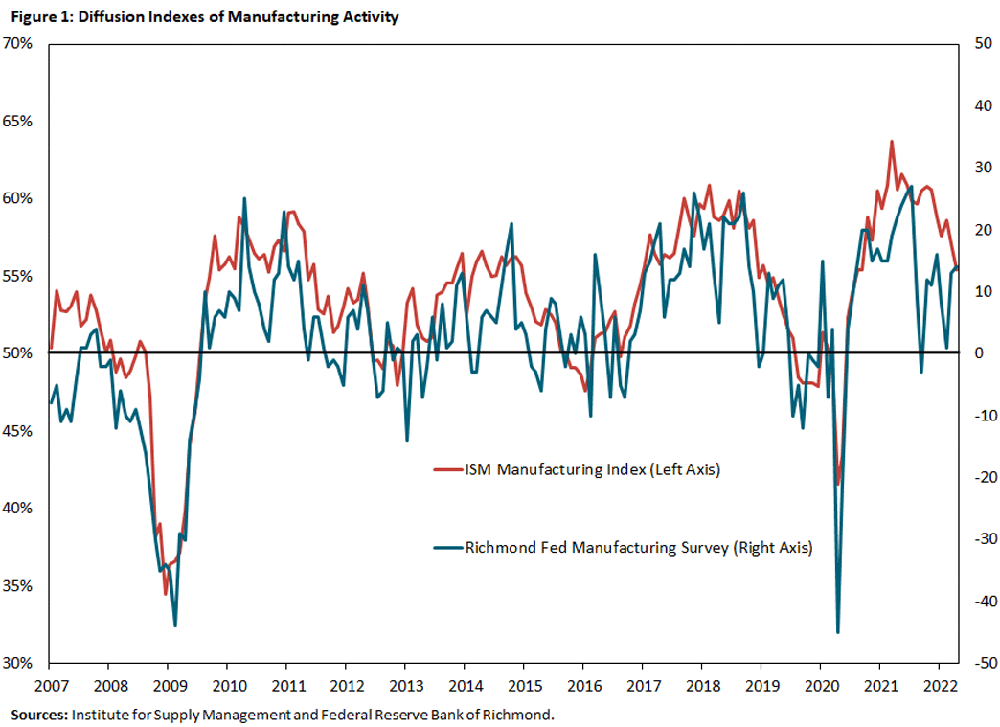

## Table of Contents

## What is a Diffusion Index?

A Diffusion Index is a way to measure how widespread changes are in a group of data. It looks at how many parts of the data are going up compared to how many are going down. For example, if you want to know if businesses are doing better or worse, you can use a Diffusion Index to see if more businesses are growing or shrinking.

This index is often used in economics to understand trends in things like employment or manufacturing. If the Diffusion Index is above 50, it means more parts of the data are improving than getting worse. If it's below 50, more parts are getting worse. It's a simple but powerful tool to get a quick sense of the overall direction of change in a large set of data.

## Why is the Diffusion Index important in economics?

The Diffusion Index is important in economics because it helps us understand if changes are happening everywhere or just in a few places. Imagine you want to know if the whole country's economy is getting better or worse. The Diffusion Index can tell you if most businesses or regions are doing well or if only a few are. This helps economists and policymakers see the big picture and make better decisions.

For example, if the Diffusion Index for employment is high, it means more companies are hiring than firing, which is a good sign for the economy. On the other hand, if the index is low, it might mean many companies are cutting jobs, which could signal tough times ahead. By using the Diffusion Index, people can spot trends early and take action to help the economy grow or fix problems before they get worse.

## How is the Diffusion Index calculated?

The Diffusion Index is calculated by looking at how many parts of the data are going up and how many are going down. First, you count how many items in your data set have increased since the last time you checked. Then, you count how many have decreased. If some stayed the same, you usually don't count them, but sometimes they can be split evenly between the increase and decrease groups.

Next, you add the number of items that increased to half the number of items that stayed the same, if you're counting them. You do the same for the items that decreased. After that, you find the percentage of the total that increased. You do this by dividing the number of items that increased (plus half of the unchanged items, if used) by the total number of items, then multiplying by 100. If this percentage is over 50, the Diffusion Index shows more items are improving than getting worse. If it's under 50, more items are getting worse.

## What data is typically used to compute the Diffusion Index?

The Diffusion Index is often used with economic data to see if things are getting better or worse. Common data used includes business activity, employment numbers, and manufacturing output. For example, if you want to know how the economy is doing, you might look at how many businesses are growing compared to how many are shrinking. Or, you might check how many people are getting jobs versus losing them.

Another type of data used is from surveys, like those asking businesses if they are seeing more or fewer orders. This helps economists understand if a trend is happening everywhere or just in some places. By looking at this data, they can see if more companies are doing better or worse and use that information to predict what might happen next in the economy.

## Can you explain the concept of a threshold in the Diffusion Index?

The threshold in the Diffusion Index is a key number that helps us understand if things are getting better or worse. In most cases, this threshold is set at 50. If the Diffusion Index is above 50, it means more parts of the data are improving than getting worse. For example, if more businesses are growing than shrinking, the index will be over 50, which is a good sign.

If the Diffusion Index is below 50, it means more parts of the data are getting worse. So, if more people are losing jobs than finding new ones, the index will be under 50, which could mean tough times ahead. The threshold of 50 is important because it gives a clear line to show whether the overall trend is positive or negative, helping people make decisions based on that information.

## What does a Diffusion Index value above 50 indicate?

A Diffusion Index value above 50 means that more things are getting better than getting worse. For example, if you're looking at businesses, a value above 50 would show that more businesses are growing than shrinking. This is a good sign because it means that overall, things are improving.

In simple terms, when the Diffusion Index is over 50, it's like more people are moving forward than backward. This can help people feel more confident about the future because it shows that positive changes are happening in more places than negative ones.

## How does the Diffusion Index differ from other economic indicators?

The Diffusion Index is different from other economic indicators because it tells us how widespread changes are, not just if things are getting better or worse. Other indicators, like the Gross Domestic Product (GDP) or unemployment rate, give us a single number to show how the whole economy is doing. But the Diffusion Index looks at many different parts of the economy and shows if most of them are going up or down. This helps us see if good or bad news is happening everywhere or just in a few places.

For example, if GDP goes up, it might mean the economy is doing well, but the Diffusion Index can tell us if that growth is happening in many businesses or just a few. This is useful because it gives us a better picture of how strong the economy really is. If the Diffusion Index is high, it means more businesses or regions are doing better, which makes the growth seem more solid. If it's low, even if GDP is up, it might mean the growth is not as strong as it looks because only a few places are doing well.

## What are some common applications of the Diffusion Index in economic analysis?

The Diffusion Index is often used to understand how widespread changes are in the economy. For example, economists use it to look at business activity. They might check how many businesses are getting more orders compared to those getting fewer. If the Diffusion Index for business activity is above 50, it means more businesses are doing better, which is a good sign for the economy. This helps people know if growth is happening everywhere or just in a few places.

Another common use is in employment data. The Diffusion Index can show if more companies are hiring than firing. If the index is high, it means more people are finding jobs, which is great news. Policymakers use this information to see if the job market is strong or if they need to do something to help more people find work. This helps them make better decisions to support the economy.

In manufacturing, the Diffusion Index is also very helpful. It can show if more factories are making more things or if they are making less. If the index is above 50, it means more factories are producing more, which can mean the economy is growing. This kind of information is important for businesses and governments to plan for the future and make sure they are ready for changes in demand.

## What are the limitations of using the Diffusion Index?

One limitation of using the Diffusion Index is that it doesn't tell you how big the changes are, just if they are happening in more places or not. For example, if the index is above 50, it means more businesses are growing, but it doesn't say if they are growing a lot or just a little. This can be a problem because small changes might not be as important as big ones, but the Diffusion Index treats them the same.

Another issue is that the Diffusion Index can be affected by how you decide to count things. If you count businesses that stayed the same as half growing and half shrinking, it can change the index a lot. Also, the index can be hard to understand if you don't know how it was calculated. This means people might not trust it if they don't know the details behind the numbers.

## How can the Diffusion Index be misleading in certain economic conditions?

The Diffusion Index can be misleading if people think it tells the whole story about the economy. It only shows if more things are getting better or worse, not by how much. For example, if the index is above 50, it means more businesses are growing, but it might not show that the growth is very small. This can make people think the economy is doing better than it really is because small changes are treated the same as big ones.

Also, the way the Diffusion Index is calculated can make it misleading. If businesses that stayed the same are counted as half growing and half shrinking, this can change the index a lot. This means the index can be different depending on how you decide to count things. People might not trust the index if they don't know how it was made, especially if the economy is in a tricky situation where small changes matter a lot.

## What advanced statistical methods can enhance the accuracy of the Diffusion Index?

To make the Diffusion Index more accurate, you can use a method called weighted averages. Instead of counting every change the same, you can give more importance to bigger changes. For example, if a big company grows a lot, it should affect the index more than if a small company grows a little. This helps the index show not just how many things are changing, but how much they are changing, making it a better picture of the economy.

Another way to improve the Diffusion Index is by using time series analysis. This method looks at how the index changes over time and can help predict what might happen next. By studying past patterns, you can see if the index is going up or down in a way that means something important. This can make the Diffusion Index more useful for understanding the economy and planning for the future.

## How does the Diffusion Index correlate with other leading economic indicators?

The Diffusion Index often goes hand-in-hand with other leading economic indicators like the Purchasing Managers' Index (PMI) and consumer confidence. When the Diffusion Index is high, it usually means more businesses are doing better, which can lead to a higher PMI because more factories are making more things. Also, when people see that more businesses are growing, they might feel more confident about their own money, which can push up consumer confidence numbers. So, a high Diffusion Index can be a good sign that other leading indicators will also be strong.

However, the Diffusion Index doesn't always match up perfectly with other indicators. For example, if the Diffusion Index is high but the growth in businesses is very small, the PMI might not go up as much because the actual increase in production isn't that big. Also, consumer confidence can be affected by things other than business growth, like news or big events. So, while the Diffusion Index can give a good idea of what other leading indicators might do, it's not always a perfect match because different parts of the economy can move in different ways.

## What is the Diffusion Index and how can it be explored?

The diffusion index is a statistical measure used to assess the breadth of change within a collection of numbers, often employed in analyzing stock markets and evaluating economic strength. This index is calculated by taking the percentage of items in a dataset, such as stocks or economic indicators, that are experiencing an increase, minus the percentage that are experiencing a decrease. The formula for the diffusion index can be expressed mathematically as:

$$

DI = \left(\frac{\text{Number of Increasing Items}}{\text{Total Number of Items}} - \frac{\text{Number of Decreasing Items}}{\text{Total Number of Items}}\right) \times 100
$$

A rising diffusion index signals that an increasing number of stocks or economic indicators are moving higher. This upward trend typically reflects an overall strengthening market or economic environment. For example, if more stocks in a stock market index are showing gains, the diffusion index would rise, indicating bullish market conditions.

Conversely, a declining diffusion index indicates that fewer stocks or economic indicators are advancing, suggesting potential market weakness. If the number of stocks experiencing declines outnumbers those that are gaining, the diffusion index would decrease, potentially signaling bearish market conditions.

The diffusion index is particularly valuable for identifying divergences, which can signal potential market reversals. Divergences occur when the diffusion index begins to move in the opposite direction of the overall market trend. For example, if the diffusion index starts to decline while the overall market continues to rise, it may indicate that fewer stocks are supporting the rise, hinting at an impending downturn.

By using the diffusion index, traders and economists can gain valuable insights into market trends and the underlying economic strength, enabling them to make more informed decisions. The capacity of the diffusion index to spot divergences and potential market reversals makes it a crucial tool for those looking to understand market dynamics better.

## References & Further Reading

[1]: Bergstra, J., Bardenet, R., Bengio, Y., & Kégl, B. (2011). ["Algorithms for Hyper-Parameter Optimization."](https://proceedings.neurips.cc/paper/2011/file/86e8f7ab32cfd12577bc2619bc635690-Paper.pdf) Advances in Neural Information Processing Systems 24.

[2]: ["Advances in Financial Machine Learning"](https://www.amazon.com/Advances-Financial-Machine-Learning-Marcos/dp/1119482089) by Marcos Lopez de Prado

[3]: ["Evidence-Based Technical Analysis: Applying the Scientific Method and Statistical Inference to Trading Signals"](https://www.amazon.com/Evidence-Based-Technical-Analysis-Scientific-Statistical/dp/0470008741) by David Aronson

[4]: ["Machine Learning for Algorithmic Trading"](https://github.com/stefan-jansen/machine-learning-for-trading) by Stefan Jansen

[5]: ["Quantitative Trading: How to Build Your Own Algorithmic Trading Business"](https://www.amazon.com/Quantitative-Trading-Build-Algorithmic-Business/dp/1119800064) by Ernest P. Chan