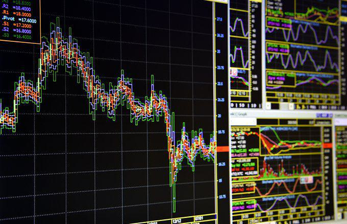

This article explores the relationship between economic indicators, statistical methods, diffusion indexes, and algorithmic trading. Economic indicators are fundamental tools for assessing the health of an economy. They provide critical insights that guide decision-making processes in algorithmic trading. These indicators, such as GDP, unemployment rates, and inflation, offer comprehensive snapshots of economic performance, making them indispensable for predicting market movements.

To extract meaningful conclusions from these indicators, statistical methods play a crucial role. These methods analyze the data to uncover patterns and predict future economic trends. By employing techniques such as descriptive statistics and inferential statistics, traders can interpret complex economic data, enabling more informed trading strategies. In recent years, advancements in artificial intelligence have significantly enhanced the accuracy of these statistical analyses, allowing for the development of more sophisticated predictive models.



One of the pivotal statistical measures in algorithmic trading is the diffusion index. This measure assesses the breadth of market changes over a specific period by evaluating the number of securities advancing versus declining. It signals shifts in market strength and can help identify potential reversals, providing valuable information for traders seeking to optimize their strategies.

Integrating economic indicators, statistical methods, and diffusion indexes enables the formulation of robust algorithmic trading strategies. These concepts come together to enhance traders' ability to predict and respond to market changes, ultimately improving their trading outcomes. As markets continue to evolve, the integration of these tools remains essential for navigating the complexities of financial trading.

## Table of Contents

## Understanding Economic Indicators

Economic indicators are vital quantitative measures that provide crucial insights into the current state and direction of an economy. They encompass a wide range of data points, predominantly including gross domestic product (GDP), unemployment rates, and inflation levels. These indicators serve as essential tools for economists, policymakers, and traders who seek to understand and anticipate economic trends and make informed decisions.

Economic indicators are generally classified into three main categories: leading, lagging, and coincident indicators. This classification is based on the timing of their changes relative to the overall economic cycle.

**Leading indicators** are predictive metrics that typically change before the economy as a whole begins to shift. These indicators are useful for forecasting future economic activity. Examples of leading indicators include stock market performance, new orders for durable goods, consumer sentiment indexes, and housing permits. These indicators are proactive tools that can signal an impending change in economic conditions, allowing businesses and investors to adjust their strategies accordingly.

**Lagging indicators**, on the other hand, are metrics that do not change until after the economy has already begun to follow a particular trend. They confirm patterns and serve as validation of economic shifts that have previously occurred. Unemployment rates are a prime example of a lagging indicator. Changes in the unemployment rate typically lag behind economic trends as businesses are cautious in adjusting their workforce arrangements. Other examples include corporate earnings and interest rates. 

Finally, **coincident indicators** change at approximately the same time as the overall economy and therefore provide a real-time snapshot of current economic conditions. Common coincident indicators include GDP, industrial production, and personal income levels. These measures can confirm current economic performance, helping to affirm the information that leading indicators might suggest.

Understanding these economic indicators and their classifications helps create a comprehensive view of the economic landscape, offering the granularity needed to analyze both macroeconomic trends and fine-tuned elements of the market. By interpreting these indicators effectively, traders and businesses can gain foresight into potential economic shifts and positions, adjusting their strategies accordingly to capitalize on emerging opportunities or mitigate risks.

## Statistical Methods in Economics

Statistical methods are essential tools in analyzing economic indicators and predicting trends. These methods enable the interpretation of complex economic data and significantly inform trading strategies, particularly in the context of [algorithmic trading](/wiki/algorithmic-trading).

Descriptive [statistics](/wiki/bayesian-statistics) are utilized to summarize and describe key features of data sets. These include measures such as the mean, median, and standard deviation, which succinctly present the central tendency and variability within a data set. By summarizing large volumes of data, descriptive statistics reveal patterns and facilitate initial insights into economic conditions. For instance, calculating the average unemployment rate over a decade can provide a clear picture of labor market trends.

Inferential statistics, on the other hand, extend the utility of data analysis by allowing economists to make predictions and generalizations about larger populations based on sample data. Techniques such as hypothesis testing, regression analysis, and confidence intervals fall under this category. For example, regression analysis can be employed to explore the relationship between consumer spending and GDP growth. By analyzing a representative sample, econometrics can predict future economic behaviors, aiding in formulating economic policies and strategies.

The integration of [artificial intelligence](/wiki/ai-artificial-intelligence) (AI) and [machine learning](/wiki/machine-learning) algorithms into statistical analysis has considerably enhanced the accuracy and efficacy of predictive models. AI enables the handling of vast data sets and the discovery of nonlinear patterns that traditional statistical methods might overlook. Machine learning models, such as random forests or neural networks, can process historical economic data and learn patterns that are crucial for forecasting future trends. In a Python setting, libraries such as scikit-learn and TensorFlow facilitate the development of these sophisticated models:

```python
from sklearn.ensemble import RandomForestRegressor
from sklearn.model_selection import train_test_split
from sklearn.metrics import mean_squared_error

# Sample code for applying a Random Forest Regressor
# X and y are the features and target variable from economic data set
X_train, X_test, y_train, y_test = train_test_split(X, y, test_size=0.2, random_state=42)

model = RandomForestRegressor(n_estimators=100, random_state=42)
model.fit(X_train, y_train)

predictions = model.predict(X_test)
mse = mean_squared_error(y_test, predictions)
print(f"Mean Squared Error: {mse}")
```

This sample code demonstrates building a random forest model to predict an economic indicator based on input features. The sophistication of AI's pattern recognition capabilities allows traders and economists to dissect complex economic phenomena more precisely, identifying trends and predictive signals that enhance trading strategies.

In sum, statistical methods, bolstered by advancements in technology, serve as vital instruments in the analysis of economic indicators. These methods guide the interpretation of data, facilitating informed forecasts and strategic decisions crucial in economic and trading contexts.

## Exploring the Diffusion Index

The diffusion index is a statistical measure used to assess the breadth of change within a collection of numbers, often employed in analyzing stock markets and evaluating economic strength. This index is calculated by taking the percentage of items in a dataset, such as stocks or economic indicators, that are experiencing an increase, minus the percentage that are experiencing a decrease. The formula for the diffusion index can be expressed mathematically as:

$$

DI = \left(\frac{\text{Number of Increasing Items}}{\text{Total Number of Items}} - \frac{\text{Number of Decreasing Items}}{\text{Total Number of Items}}\right) \times 100
$$

A rising diffusion index signals that an increasing number of stocks or economic indicators are moving higher. This upward trend typically reflects an overall strengthening market or economic environment. For example, if more stocks in a stock market index are showing gains, the diffusion index would rise, indicating bullish market conditions.

Conversely, a declining diffusion index indicates that fewer stocks or economic indicators are advancing, suggesting potential market weakness. If the number of stocks experiencing declines outnumbers those that are gaining, the diffusion index would decrease, potentially signaling bearish market conditions.

The diffusion index is particularly valuable for identifying divergences, which can signal potential market reversals. Divergences occur when the diffusion index begins to move in the opposite direction of the overall market trend. For example, if the diffusion index starts to decline while the overall market continues to rise, it may indicate that fewer stocks are supporting the rise, hinting at an impending downturn.

By using the diffusion index, traders and economists can gain valuable insights into market trends and the underlying economic strength, enabling them to make more informed decisions. The capacity of the diffusion index to spot divergences and potential market reversals makes it a crucial tool for those looking to understand market dynamics better.

## Role of Diffusion Index in Algorithmic Trading

Algorithmic trading utilizes complex mathematical models to [carry](/wiki/carry-trading) out trades with speed and accuracy, aiming to capitalize on small market fluctuations. Central to this is the integration of data that can inform and predict market behavior, where the diffusion index plays a pivotal role. 

The diffusion index aggregates information from individual market components, offering a consolidated view of market [momentum](/wiki/momentum). By providing critical data that highlights the breadth of price movements, it enhances decision-making within algorithmic models. When the diffusion index shows a rising trend, it signals a broad-based advance in stock prices, which can indicate market strength and offer buy signals. Conversely, a declining diffusion index might suggest market weaknesses or potential sell opportunities.

Algorithmic traders employ the diffusion index to discern market trends and anticipate potential reversals. This is particularly useful when combined with models that predict price movements based on momentum or mean-reversion strategies. For example, a crossing of the diffusion index above a certain threshold can be integrated as a trigger for initiating long positions within a trading algorithm.

Integrating diffusion index data into predictive models can significantly enhance the accuracy of these models. The index can be incorporated into the feature set used in machine learning algorithms, refining the models' ability to forecast market conditions. Consider a Python implementation using libraries such as `pandas` and `scikit-learn`, where historical diffusion index values serve as input features for a predictive model:

```python
import pandas as pd
from sklearn.ensemble import RandomForestClassifier
from sklearn.model_selection import train_test_split

# Load market data with diffusion index values
data = pd.read_csv('market_data.csv')

# Assume 'diffusion_index' and other features are part of the dataset
features = data[['diffusion_index', 'other_feature_1', 'other_feature_2']]
target = data['market_movement']  # Binary target for market direction

# Split data into training and testing sets
X_train, X_test, y_train, y_test = train_test_split(features, target, test_size=0.3, random_state=42)

# Initialize and train the model
model = RandomForestClassifier()
model.fit(X_train, y_train)

# Evaluate model accuracy
accuracy = model.score(X_test, y_test)
print(f'Model accuracy: {accuracy}')
```

Moreover, Artificial Intelligence (AI) has revolutionized the processing of diffusion index data, leading to more sophisticated trading strategies. AI-driven systems can process large sets of real-time data, dynamically recalibrating trading models to account for the latest market conditions. This adaptability ensures that trading strategies remain robust even in volatile environments.

In conclusion, the diffusion index is a vital component of algorithmic trading strategies, delivering critical insights into market dynamics. By leveraging this data, along with advanced AI methodologies, traders can enhance the precision and responsiveness of their trading algorithms, navigating the complexities of modern financial markets with greater efficacy.

## Diffusion Index vs. Tick Index

Both the diffusion and tick indexes are crucial tools in evaluating market sentiment, each serving distinct purposes and contributing uniquely to trading strategies. The diffusion index primarily evaluates daily stock market trends over an extended period, offering a broader picture of market conditions. It works by taking a group of stocks and determining how many are advancing versus declining. This result is usually presented as a percentage, indicating the proportion of stocks in an uptrend. A higher diffusion index suggests that a significant number of stocks are performing well, implying a bullish sentiment, while a lower value indicates the contrary.

In contrast, the tick index provides real-time data by measuring the number of stocks increasing in value minus those decreasing at any given moment. It reflects immediate market sentiment, offering traders insights into current market dynamics. This can be especially useful for identifying short-term opportunities and gauging intraday market trends.

Traders often use both indexes to gain a comprehensive understanding of market dynamics. For example, a trader might look at the diffusion index to assess the general health and trend over a longer period and use the tick index to decide the timing for entering or exiting trades based on current market sentiment. Such an approach allows traders to efficiently navigate the complexities of stock market behaviors.

Understanding the differences between the diffusion and tick indexes is essential for enhancing trading strategies. Each index serves as an integral piece of the broader market analysis puzzle, and integrating these insights aids traders in making informed, calculated decisions. This dual approach helps mitigate some of the individual limitations these indexes might have when used separately and provides a more robust framework for market analysis.

## Limitations and Considerations

Diffusion indexes, while valuable, have certain limitations, particularly in markets known for their [volatility](/wiki/volatility-trading-strategies), such as the Nasdaq. These indexes primarily serve to identify trends and potential reversals by measuring the spread of changes among a group of numbers, but they can fall short in capturing the nuances of rapidly changing or speculative environments.

In highly volatile markets, the diffusion index may not accurately reflect sudden shifts or anomalous behaviors driven by speculative trading. This is because diffusion indexes typically aggregate data over a certain period, smoothing transient fluctuations that might be significant in a speculative context. Consequently, relying solely on diffusion indexes in such scenarios can lead to misinterpretations or delayed reactions to critical market changes.

To enhance accuracy and reliability, it is advisable to use diffusion indexes in conjunction with other analytical tools and indicators. Combining multiple metrics can provide a more comprehensive view of the market dynamics. For example, integrating leading indicators or real-time data sources like the tick index can help account for immediate market sentiment shifts, providing a more balanced assessment.

Traders must exercise caution when interpreting diffusion index data. Overreliance on this singular measure might result in premature or misguided decisions, especially if the market conditions are rapidly evolving. Therefore, ensuring a broad perspective by incorporating diverse data sources is crucial. This holistic approach enables traders to validate findings from the diffusion index and adjust their strategies accordingly, improving the robustness of trading strategies and mitigating potential risks in dynamic market environments.

## Conclusion

Economic indicators, statistical methods, and diffusion indexes are integral components of algorithmic trading strategies. These elements provide the essential framework for analyzing market behavior and predicting financial trends. The diffusion index, in particular, serves as a potent tool in understanding market shifts and assessing economic vigor. By evaluating the proportion of positive moves among a set of entities, the diffusion index enables traders to gauge the overall direction and strength of market trends. 

Algorithmic trading takes these insights from diffusion indexes and applies them to execute trades with a precision that maximizes financial returns. By automating decision-making through advanced algorithms, traders can swiftly act on valuable information, minimizing the time lag between data interpretation and trade execution. Python, for example, can be utilized to process and analyze diffusion index data, enhancing the efficiency of trade strategies through libraries such as Pandas and NumPy.

Moreover, the power of the diffusion index is amplified when used in conjunction with other analytical tools. By integrating multiple sources of data, traders can paint a more comprehensive picture of market dynamics, thus enabling more informed decision-making. Statistical methods such as regression analysis can refine predictions further, providing a solid foundation for developing robust trading strategies.

As financial markets continue to grow in complexity, the combination of economic indicators, statistical analysis, and diffusion indexes remains crucial. These tools not only provide clarity amid financial complexities but also allow traders to navigate market volatility with enhanced confidence. Embracing these components in algorithmic processes ensures that trading strategies remain adaptive and forward-thinking, well-equipped to tackle future challenges in financial markets.

## References & Further Reading

[1]: Bergstra, J., Bardenet, R., Bengio, Y., & Kégl, B. (2011). ["Algorithms for Hyper-Parameter Optimization."](https://proceedings.neurips.cc/paper/2011/file/86e8f7ab32cfd12577bc2619bc635690-Paper.pdf) Advances in Neural Information Processing Systems 24.

[2]: ["Advances in Financial Machine Learning"](https://www.amazon.com/Advances-Financial-Machine-Learning-Marcos/dp/1119482089) by Marcos Lopez de Prado

[3]: ["Evidence-Based Technical Analysis: Applying the Scientific Method and Statistical Inference to Trading Signals"](https://www.amazon.com/Evidence-Based-Technical-Analysis-Scientific-Statistical/dp/0470008741) by David Aronson

[4]: ["Machine Learning for Algorithmic Trading"](https://github.com/stefan-jansen/machine-learning-for-trading) by Stefan Jansen

[5]: ["Quantitative Trading: How to Build Your Own Algorithmic Trading Business"](https://www.amazon.com/Quantitative-Trading-Build-Algorithmic-Business/dp/1119800064) by Ernest P. Chan