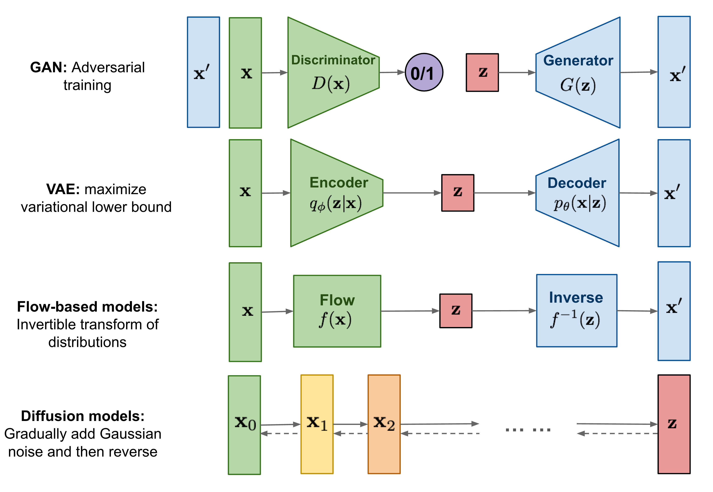

## Table of Contents

## What are Diffusion Models in the context of machine learning?

Diffusion Models are a type of machine learning model that work by gradually adding noise to data and then learning how to reverse this process to generate new data. Imagine you have a clear picture, and you slowly add more and more static until it's completely unrecognizable. A diffusion model learns how to take that noisy mess and turn it back into a clear picture. This process is inspired by non-equilibrium thermodynamics, where systems move from order to disorder and back.

The way diffusion models work is by breaking down the process into many small steps. They start with a simple random noise and, through a series of steps, refine it into something that looks like the data they were trained on. This is done using a neural network that learns the reverse of the diffusion process. Mathematically, if we denote the forward diffusion process as adding noise over time steps $$ t $$, the model learns to predict the reverse process, effectively denoising the data step by step. This makes diffusion models very powerful for tasks like generating images, where they can create realistic and detailed pictures from scratch.

## How do Diffusion Models differ from other generative models like GANs and VAEs?

Diffusion Models work differently from GANs (Generative Adversarial Networks) and VAEs (Variational Autoencoders) in how they create new data. GANs use two neural networks that compete against each other: one tries to generate realistic data, while the other tries to tell if the data is real or fake. This competition helps the generator improve until it can create very realistic data. On the other hand, VAEs work by learning a compressed representation of the data, called a latent space, and then using this space to generate new data. They do this by encoding the data into this space and then decoding it back into something new but similar to the original data.

Diffusion Models, however, take a different approach. They start with random noise and slowly refine it into a realistic image or data point through many small steps. They do this by learning how to reverse the process of adding noise to data. This makes them very good at creating high-quality images because they can control the generation process very carefully. Unlike GANs, which can be hard to train because of the competition between networks, and VAEs, which sometimes struggle with generating very detailed images, Diffusion Models offer a more stable and controlled way to generate data.

In summary, while GANs use a competitive approach and VAEs use a latent space, Diffusion Models focus on a step-by-step denoising process. This fundamental difference in how they work makes Diffusion Models particularly effective for tasks like image generation, where control over the generation process is important.

## What is the basic principle behind the functioning of Diffusion Models?

The basic principle behind Diffusion Models is the idea of adding noise to data and then learning how to remove that noise to create new data. Imagine you have a clear picture, and you slowly add more and more static until it's just a mess of noise. A Diffusion Model learns how to take that noisy mess and turn it back into a clear picture. This process is broken down into many small steps, where the model starts with random noise and gradually refines it into something that looks like the data it was trained on.

This is done using a [neural network](/wiki/neural-network) that learns the reverse of the diffusion process. If we denote the forward diffusion process as adding noise over time steps $$ t $$, the model learns to predict the reverse process, effectively denoising the data step by step. This makes Diffusion Models very powerful for tasks like generating images, because they can create detailed and realistic pictures from scratch by carefully controlling each step of the denoising process.

## Can you explain the concept of forward and reverse diffusion processes?

The forward diffusion process is like slowly turning a clear picture into a blurry mess. Imagine you have a photo, and over time, you keep adding more and more static to it until you can't see the original image anymore. This is what happens in the forward diffusion process: noise is added to the data in small steps until it becomes completely random. If we use $$ x_0 $$ to represent the original data and $$ x_T $$ to represent the data after adding noise for $$ T $$ steps, the forward process can be thought of as transforming $$ x_0 $$ into $$ x_T $$ through a series of intermediate steps.

The reverse diffusion process is the opposite: it's like taking that blurry mess and turning it back into a clear picture. A Diffusion Model learns how to do this by figuring out how to remove the noise step by step. Starting from the completely noisy $$ x_T $$, the model works backwards to $$ x_0 $$, refining the data at each step until it looks like the original data. This reverse process is what allows Diffusion Models to generate new data that looks like the data they were trained on, by starting with random noise and carefully denoising it back into something meaningful.

## What are some common applications of Diffusion Models?

Diffusion Models are used a lot in making images. They can create new pictures that look very real, like photos of people, animals, or landscapes. These models start with random noise and slowly turn it into a clear image. This is helpful in art, where artists might use them to create new pieces, or in design, where they can generate new product images. They're also used in making movies, where they can help create special effects or even whole scenes.

Another big use of Diffusion Models is in improving images. If you have a blurry or noisy photo, these models can clean it up, making it look much better. They do this by learning how to remove noise from images. This is useful in medical imaging, where clear pictures can help doctors see better, or in security, where clearer images from cameras can help identify people or objects. Diffusion Models are also used in science, where they help create models of molecules or other tiny things that are hard to see directly.

In addition to images, Diffusion Models can work with other types of data, like sounds or text. For example, they can generate new music or speech by starting with noise and turning it into clear sounds. In text, they can help create new stories or articles by slowly building up sentences from random words. This shows how flexible Diffusion Models are, as they can be used in many different areas, not just with pictures.

## How does training a Diffusion Model work, and what are the key challenges?

Training a Diffusion Model involves two main parts: the forward process and the reverse process. In the forward process, you start with your data, like pictures, and slowly add noise to it over many steps. This is done until the data turns into pure noise. The model then learns the reverse process, which is about taking that noise and turning it back into clear data. This is done using a neural network that learns to predict how to remove the noise at each step. The model is trained by comparing its predictions to the actual data at each step and adjusting its parameters to get better at denoising.

The key challenges in training Diffusion Models include the need for a lot of computational power and time. Because the model has to learn over many small steps, training can be slow and requires a lot of data. Another challenge is making sure the model can generate good quality data. If the model doesn't learn well, the pictures or other data it creates might look blurry or not realistic. Also, the model needs to balance how much noise it adds in the forward process, as too much or too little can make it hard for the model to learn the reverse process properly. These challenges mean that training Diffusion Models can be complex and requires careful tuning to get the best results.

## What is the role of noise in Diffusion Models, and how is it utilized?

Noise plays a central role in Diffusion Models. It's like the starting point for creating new data. Imagine you have a clear picture, and you slowly add more and more static to it until it's just a mess of noise. This process of adding noise is called the forward diffusion process. In Diffusion Models, this noise is added step by step until the original data, like a picture, becomes completely random. The model learns how this noise is added over time, which is important for the next part.

The next part is the reverse diffusion process, where the model learns to take that noisy mess and turn it back into a clear picture. Starting with random noise, the model uses what it learned about how noise was added to slowly remove the noise step by step. This is done using a neural network that predicts how to denoise the data at each step. By carefully controlling this process, the model can create new, realistic data from scratch. The balance of adding and removing noise is key to how Diffusion Models work and what makes them good at generating high-quality images or other types of data.

## Can you describe the architecture of a typical Diffusion Model?

A typical Diffusion Model consists of a neural network that learns to remove noise from data. Imagine you have a clear picture, and you slowly add more and more static until it's just a mess of noise. The model learns how this noise is added step by step in what's called the forward diffusion process. If we denote the original data as $$ x_0 $$ and the noisy data after adding noise for $$ T $$ steps as $$ x_T $$, the model learns how to transform $$ x_0 $$ into $$ x_T $$. The neural network is usually a type called a U-Net, which is good at understanding and processing images.

The other part of the model is learning the reverse diffusion process. This is where the model takes the noisy data $$ x_T $$ and slowly turns it back into a clear picture $$ x_0 $$. The model does this by predicting how to remove the noise at each step, starting from $$ x_T $$ and working backwards to $$ x_0 $$. The neural network learns to do this by comparing its predictions to the actual data at each step and adjusting its parameters to get better at denoising. This careful step-by-step process allows the model to create new, realistic data from scratch.

## What are Consistency Models and how do they relate to Diffusion Models?

Consistency Models are a type of [machine learning](/wiki/machine-learning) model that aim to generate new data, like images or sounds, more quickly than Diffusion Models. Imagine you have a blurry picture and want to make it clear. Diffusion Models do this by slowly adding noise to a clear picture and then learning how to remove that noise step by step. Consistency Models, on the other hand, try to do the same thing but in fewer steps. They work by directly predicting a clear image from a noisy one, without needing to go through all the small steps that Diffusion Models use.

The main idea behind Consistency Models is to find a shortcut in the process of generating data. While Diffusion Models use a long series of steps to go from noise to a clear image, Consistency Models try to jump straight to the end result. This makes them faster and more efficient. They achieve this by learning a function that can take a noisy image and predict what the clear image should look like, using fewer steps than Diffusion Models. This makes Consistency Models a promising approach for applications where speed is important, like real-time image generation or quick data processing.

## What is LSDM and how does it improve upon traditional Diffusion Models?

LSDM, which stands for Latent Score-based Diffusion Model, is a type of Diffusion Model that works in a special way to make generating data faster and better. Imagine you have a clear picture and you slowly add more and more static until it's just a mess of noise. Traditional Diffusion Models learn how to take that noisy mess and turn it back into a clear picture by going through many small steps. LSDM, however, does this in a space called the "latent space," which is like a simpler version of the data. By working in this simpler space, LSDM can generate new pictures or other data more quickly and with less computer power than traditional Diffusion Models.

The main improvement of LSDM over traditional Diffusion Models is how it uses this latent space. Instead of working directly with the complex data, like the many pixels in a picture, LSDM first turns the data into a simpler form. This makes the process of adding and removing noise much easier and faster. For example, if we denote the original data as $$ x_0 $$ and the noisy data as $$ x_T $$, LSDM works with a simpler version of these, let's call them $$ z_0 $$ and $$ z_T $$. By learning to go from $$ z_T $$ back to $$ z_0 $$ and then turning $$ z_0 $$ back into $$ x_0 $$, LSDM can create high-quality images or other data more efficiently than traditional Diffusion Models.

## How can the performance of Diffusion Models be evaluated and optimized?

The performance of Diffusion Models can be evaluated by looking at how well they create new data, like pictures. One way to do this is by using metrics like the Fréchet Inception Distance (FID), which compares the generated pictures to real ones. A lower FID score means the generated pictures look more like real ones. Another way is to have people look at the generated pictures and rate them on how realistic they seem. This is called a human evaluation. By using these methods, you can tell if the model is doing a good job at creating new data.

To optimize Diffusion Models, you can try different things. One way is to change the model's architecture, like using a different type of neural network or adding more layers. Another way is to adjust the training process, like using more data or training for longer. You can also play with the noise schedule, which is how much noise is added at each step. By carefully tuning these parts, you can make the model better at generating high-quality data. For example, if you find that the model is creating blurry pictures, you might try using a different noise schedule to see if that helps.

## What are the current research trends and future directions for Diffusion Models?

Current research trends in Diffusion Models are focusing on making them faster and better at creating high-quality data. One big trend is using latent spaces, like in LSDM (Latent Score-based Diffusion Model), to speed up the process. By working in a simpler version of the data, these models can generate new pictures or other data more quickly and with less computer power. Another trend is developing new ways to train Diffusion Models more efficiently, like using fewer steps or better noise schedules. Researchers are also looking at how to make Diffusion Models work well with other types of data, like sounds or text, not just pictures.

Future directions for Diffusion Models include making them even more versatile and easier to use. One exciting area is using Diffusion Models for real-time applications, where they need to generate data very quickly. This could be useful in things like video games or live video processing. Another direction is improving the quality of the data they generate, making sure the pictures or sounds are as realistic as possible. Researchers are also exploring ways to combine Diffusion Models with other machine learning techniques, like GANs or VAEs, to create even more powerful models. By continuing to push these boundaries, Diffusion Models could become an even more important tool in many different fields.

## References & Further Reading

[1]: Sohl-Dickstein, J., Weiss, E., Maheswaranathan, N., & Ganguli, S. (2015). ["Deep Unsupervised Learning using Nonequilibrium Thermodynamics."](https://arxiv.org/abs/1503.03585) arXiv:1503.03585.

[2]: Ho, J., Jain, A., & Abbeel, P. (2020). ["Denoising Diffusion Probabilistic Models."](https://arxiv.org/abs/2006.11239) arXiv:2006.11239.

[3]: Song, Y., & Ermon, S. (2019). ["Generative Modeling by Estimating Gradients of the Data Distribution."](https://arxiv.org/abs/1907.05600) arXiv:1907.05600.

[4]: Kingma, D. P., & Welling, M. (2014). ["Auto-Encoding Variational Bayes."](https://arxiv.org/abs/1312.6114) arXiv:1312.6114.

[5]: Goodfellow, I., Pouget-Abadie, J., Mirza, M., Xu, B., Warde-Farley, D., Ozair, S., ... & Bengio, Y. (2014). ["Generative Adversarial Nets."](https://arxiv.org/abs/1406.2661) Advances in Neural Information Processing Systems 27.

[6]: Dhariwal, P., & Nichol, A. (2021). ["Diffusion Models Beat GANs on Image Synthesis."](https://arxiv.org/abs/2105.05233) arXiv:2105.05233.

[7]: Song, Y., Meng, C., & Ermon, S. (2020). ["Score-Based Generative Modeling through Stochastic Differential Equations."](https://arxiv.org/abs/2011.13456) arXiv:2006.09011.