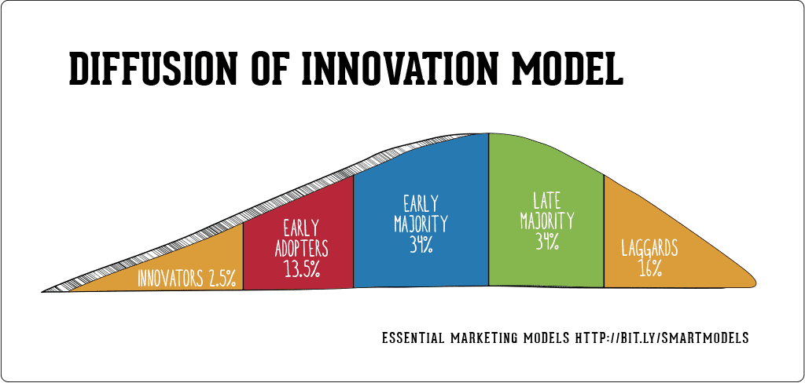

The rapid pace of technological advancements is significantly reshaping various sectors, impacting how innovations are adopted and diffused within societies. One domain experiencing profound transformation is the financial market, particularly through the implementation of algorithmic trading, also known as algo trading. This technology utilizes complex algorithms to automate trading decisions, offering enhanced speed and efficiency over traditional trading methods. The adoption and diffusion of such cutting-edge technologies are critical for understanding their broader societal impacts.

Algorithmic trading serves as a pertinent example to explore these phenomena, highlighting how social change influences the adoption and diffusion processes. Social change can either facilitate or impede the acceptance of new technologies, depending on their alignment with prevailing cultural values and norms. Understanding these dynamics is crucial for innovators aiming to introduce new products and for end-users seeking to optimize their integration into daily workflows.

By examining both theoretical constructs and practical implementations of innovation diffusion, particularly in algo trading, we can gain valuable insights into the elements that contribute to successful technology adoption. These insights enable developers to design innovative solutions that meet user needs while fostering a milieu conducive to technological adoption and integration within various societal sectors.

## Table of Contents

## Understanding the Diffusion of Innovations Theory

The Diffusion of Innovations theory, established by Everett Rogers, is a seminal framework for understanding the mechanisms and patterns through which new ideas and technologies permeate societies. Central to this theory is the categorization of adopters into five distinct groups: innovators, early adopters, the early majority, late majority, and laggards. These groups are distinguished by their openness to new ideas and their relative speed in adopting innovations.

1. **Innovators** are risk-takers and pioneers, often the first to adopt a new technology. They are willing to take risks, are well-educated, and possess access to substantial financial resources. Their adoption often helps test out new products, providing valuable feedback for improvement.

2. **Early Adopters** are opinion leaders within their communities. They adopt innovations after the innovators and are crucial in building momentum for a new technology. They are more selective than innovators but still open to new ideas. Their endorsement is critical for broader market acceptance.

3. **The Early Majority** represents a significant segment of the market, adopting new technologies just before the average person. These adopters are more cautious and require evidence of the innovation’s value and benefits. They tend to rely on recommendations from early adopters.

4. **The Late Majority** is skeptical towards new technologies and typically adopts them due to peer pressure or economic need. They require solid evidence of a technology’s effectiveness and widespread adoption before they commit.

5. **Laggards** are the last to adopt an innovation. Skeptical of change and possessing limited financial resources, this group often waits until an innovation becomes mainstream and the new standard.

Rogers identified several factors that significantly influence the rate of innovation diffusion. These include:

- **Relative Advantage**: The perceived benefits of the new technology over existing alternatives. Innovations offering clear and substantial advantages are more likely to be adopted quickly.

- **Compatibility**: How well the innovation aligns with potential adopters’ existing values, norms, and practices. Innovations compatible with a society's current systems and beliefs face fewer barriers to adoption.

- **Complexity**: The degree to which an innovation is perceived as difficult to understand and use. Simpler innovations tend to be adopted more rapidly.

- **Trialability**: The extent to which an innovation can be experimented with before a commitment is made. Innovations that can be tested on a limited basis are generally adopted more quickly.

- **Observability**: The visibility of an innovation’s results. Innovations where benefits are easily observed and communicated are more likely to gain traction quickly.

Moreover, societal factors such as the level of education, industrialization, and the effectiveness of communication channels play a crucial role in shaping the diffusion process. A well-educated society with advanced communication infrastructure can accelerate the spread of innovations by facilitating awareness and understanding.

In summary, the Diffusion of Innovations theory provides a comprehensive lens through which to examine how new ideas are adopted. Understanding the interplay of different adopter characteristics and societal factors can help innovators and policymakers devise strategies to enhance the adoption of new technologies, ultimately fostering societal and economic progress.

## The Role of Social Change in Innovation Adoption

Social change plays a significant role in the adoption of innovations, influencing whether new technologies will be embraced or resisted by a society. How well these technologies, such as [algorithmic trading](/wiki/algorithmic-trading), align with cultural values and social norms can determine their acceptance or rejection. This alignment is crucial because societies deeply entwine their traditions and established ways of operating, which new innovations must complement to gain traction.

Understanding the social context in which a new technology is introduced is essential for its successful implementation. The social context includes people's values, traditions, and behaviors within a target population. A misalignment between the innovations and these factors can create resistance, while alignment can serve as an [accelerator](/wiki/accelerator). For instance, if a new technology like algorithmic trading is perceived as too complex by a culture that values simplicity, or if it disrupts traditional roles in the job market, its adoption might face significant hurdles.

Addressing potential barriers often requires a nuanced understanding of existing social structures and practices. For example, introducing algorithmic trading to a market traditionally dominated by human brokers may encounter resistance due to perceived threats to employment or expertise. Therefore, implementing new technologies in such environments may necessitate addressing these concerns, perhaps by emphasizing how they can complement rather than replace human skills.

Incorporating social change considerations into marketing strategies can significantly enhance adoption rates of innovative products. Effective marketing does not merely inform potential adopters about the benefits of a technology but also addresses how it fits into their existing social framework. Strategies might include demonstrating compatibility with societal norms, benefitting local communities, or enhancing well-being.

For instance, in the rollout of algorithmic trading, marketing strategies might emphasize how this technology can provide more accurate and faster transaction processing, thus leading to better overall financial health for investors. Messaging can also include testimonials from early adopters within the same social group, thereby leveraging social proof and reducing perceived risks.

In summary, aligning new technologies with the social and cultural fabric of a target population is vital for successful adoption. By addressing these dynamics in their strategies, innovators can effectively navigate the complexities of social change, ultimately leading to greater acceptance and diffusion of their technologies.

## Algorithmic Trading: A Case Study in Innovation Adoption

Algorithmic trading represents a significant application of the diffusion of innovations theory within the financial sector. Initially adopted by institutional traders such as hedge funds and investment banks, algorithmic trading has evolved to become accessible to a wider range of market participants, including retail investors. This transition illustrates the progression through the stages identified in Everett Rogers' diffusion of innovations theory, from innovators and early adopters to the early and late majority.

Several factors have facilitated this broader adoption of algorithmic trading. One of the primary drivers is the perceived advantage of speed and efficiency. Algorithmic trading allows for the execution of financial transactions at speeds and frequencies that are impossible for human traders. By leveraging sophisticated algorithms, traders can analyze vast amounts of market data quickly and execute trades in fractions of a second, which is critical in high-frequency trading scenarios. This speed offers a significant competitive edge, as algorithms can exploit market inefficiencies faster than manual trading methods.

Another [factor](/wiki/factor-investing) influencing adoption is the compatibility of algorithmic trading with existing trading systems. As technology in financial markets has advanced, trading platforms have evolved to integrate seamlessly with algorithmic systems, making it easier for a range of users—from large institutions to individual traders—to adopt and implement these technologies. Compatibility reduces the friction associated with adopting new technologies, as users do not need to overhaul their existing systems to accommodate algorithmic trading.

Despite these advantages, the complexity of understanding and utilizing advanced algorithms remains a barrier to some potential adopters. Algorithmic trading involves sophisticated mathematical models and statistical methodologies, such as mean reversion, statistical [arbitrage](/wiki/arbitrage), and [machine learning](/wiki/machine-learning) techniques, which require a high level of technical expertise. This complexity can be daunting for traders who lack a background in quantitative analysis or coding, slowing the diffusion process among less technically skilled participants.

In sum, the adoption of algorithmic trading aligns with key tenets of the diffusion of innovations theory, characterized by its clear advantages in terms of speed and market efficiency, compatibility with existing trading infrastructures, and the challenge posed by its inherent complexity. Understanding these elements is crucial for anyone aiming to harness algorithmic trading's potential fully.

## Challenges and Barriers in the Diffusion Process

In the context of algorithmic trading, the diffusion of this innovation is met with several challenges and barriers that can impede its widespread adoption. One significant challenge is regulatory concerns. The financial industry is heavily regulated, and algorithmic trading systems must comply with various legal and ethical standards. These regulations can vary significantly across different jurisdictions, posing a challenge for firms that operate internationally. Regulatory bodies are concerned with ensuring market stability, preventing fraudulent activities, and protecting investors, which can lead to stringent guidelines that may slow down the adoption process.

Technological readiness is another barrier. Algorithmic trading requires a robust technical infrastructure, including high-speed internet, advanced computing capabilities, and sophisticated software. Potential users, particularly smaller firms or individual traders, may lack the necessary technological resources or skills to deploy and manage these systems effectively. This technological gap can hinder the adoption of algorithmic trading, particularly among laggards who are typically less inclined to embrace new technologies.

Market [volatility](/wiki/volatility-trading-strategies) also presents a considerable challenge in the diffusion of algorithmic trading. The financial markets are inherently volatile, and the rapid execution speeds of algorithmic trades can exacerbate this volatility, leading to market disruptions. This unpredictability can create caution among potential adopters, who may fear potential financial losses due to increased market risk.

Understanding the psychological and social resistance among laggards is crucial to overcoming these barriers. Laggards may exhibit skepticism towards new technologies, preferring traditional trading methods. This resistance can stem from a lack of trust in automated systems, fear of technological unemployment, or limited understanding of how algorithmic trading works. Effective communication strategies that address these psychological and social concerns are necessary to mitigate resistance. Providing education and clear demonstrations of the benefits and safety of algorithmic trading can help alleviate fear and build trust among these resistant groups.

## Strategies for Enhancing Adoption Rates

Enhancing the adoption rates of innovative financial technologies such as algorithmic trading necessitates a multifaceted approach that considers the characteristics of various adopter categories as outlined in the Diffusion of Innovations theory. Understanding the distinct needs and concerns of innovators, early adopters, the early majority, late majority, and laggards allows for targeted communication strategies that can facilitate wider adoption.

One successful strategy is influencer marketing, which leverages the credibility and reach of individuals who are respected within the target community. By using influencers who have already adopted and benefited from the technology, it is possible to reduce perceived risks and increase trust among potential users. Influencers serve as a bridge between the technology and its audience, aiding in the social validation process, which is crucial for the diffusion of innovations.

Beta testing is another effective method for increasing adoption rates, particularly among the early and late majority. By providing potential users with a hands-on experience, beta testing allows them to see the practical advantages of the technology in action. This approach also offers companies valuable feedback to refine their product before a full public release, ensuring the technology meets user expectations and needs. Engaging real users in beta testing can overcome skepticism and demonstrate tangible benefits, making the technology more relatable and accessible.

Furthermore, providing clear, evidence-based documentation and case studies that highlight the benefits and successes of the technology can significantly persuade potential adopters. These materials should present quantitative data, testimonials, and success stories to address the pragmatic concerns of potential users, particularly the late majority, who may require more convincing due to their cautious nature.

Continuous education and simplification of the technology's usage are vital for reducing complexity, a common barrier to adoption. Offering workshops, webinars, and tutorials tailored to various skill levels can demystify complex algorithms and trading strategies. Educational resources should focus on breaking down the technology into manageable concepts and providing intuitive user interfaces, which can greatly enhance user confidence and competence.

Technical simplification can be aided by developing user-friendly interfaces and automated processes that require minimal manual input. For instance, machine learning models that automate certain trading decisions can be made more accessible to average users through platforms with straightforward navigation and clear instructions.

Lastly, leveraging data analytics can help tailor marketing strategies and educational content to specific adopter groups. By analyzing user behavior and preferences, companies can refine their communication to align with the needs and expectations of different demographics within their target markets, thus enhancing the overall adoption rate of the technology.

## Conclusion

The diffusion of innovations theory provides a crucial framework for understanding the dissemination of technologies such as algorithmic trading. By dissecting the social and psychological dynamics driving adoption, stakeholders—ranging from developers to policymakers—can devise more effective strategies for fostering innovation uptake. This understanding is essential as the success of any new technology hinges on its acceptance and integration within the target population.

Incorporating technological advancements while acknowledging social contexts is fundamental to ensuring a seamless adoption process. Social acceptance can be improved by aligning new technologies with existing cultural values and addressing the concerns of potential users. For instance, algorithmic trading's growth has been influenced not just by its inherent advantages like speed and efficiency but also by its compatibility with current trading practices and the ability to address users' educational needs through training and support.

Ultimately, the successful proliferation of innovations like algo trading relies on a holistic approach that considers not only the technological merits but also the societal frameworks within which these technologies operate. As different sectors continue to experience technological progression, understanding the interplay of these factors can facilitate a smoother integration, ensuring that innovative solutions achieve their full potential impact across diverse domains.

## References & Further Reading

[1]: Rogers, E. M. (2003). ["Diffusion of Innovations, 5th Edition"](https://books.google.com/books/about/Diffusion_of_Innovations_5th_Edition.html?id=9U1K5LjUOwEC). Free Press.

[2]: Chlistalla, M. (2011). "The Future of Trading: The Real Impact of Algorithmic Trading." Deutsche Bank Research.

[3]: Narang, R. K. (2013). ["Inside the Black Box: A Simple Guide to Quantitative and High-Frequency Trading"](https://onlinelibrary.wiley.com/doi/book/10.1002/9781118662717). Wiley Finance.

[4]: MacKenzie, D. (2021). ["Trading at the Speed of Light: How Ultrafast Algorithms are Transforming Financial Markets"](https://ieeexplore.ieee.org/document/9647710). Princeton University Press.

[5]: Schmid, M., & Walter, F. (2018). ["Algorithmic Trading: Impact on Market Structure."](https://academic.oup.com/book/27407) Swiss Finance Institute Research Paper No. 18-24.