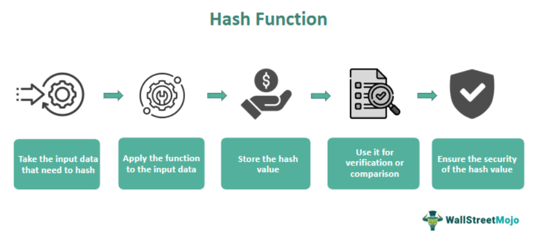

Blockchain technology has fundamentally transformed the way we perceive and engage with currencies and transactions. By introducing innovations such as cryptocurrencies and decentralized applications, blockchain has redefined traditional financial systems and opened up new possibilities for digital interactions. A significant participant in this rapidly evolving landscape is DigiByte, a blockchain platform designed to offer high scalability and security. Launched in 2014, DigiByte has established itself as a noteworthy contender in the blockchain ecosystem by providing a decentralized and secure environment conducive to fast transaction processing.

Simultaneously, as blockchain technology has advanced, algorithmic trading strategies have gained traction in the cryptocurrency markets. These strategies leverage the power of automation to enhance trading efficiency and effectiveness. Algorithmic trading involves the use of sophisticated software to execute trades based on predefined criteria, allowing traders to adapt to market conditions swiftly and accurately. This capability holds particular significance in the volatile landscape of cryptocurrencies, where rapid response times can significantly influence trading success.

This article examines the DigiByte blockchain, exploring its unique attributes that distinguish it within the crowded cryptocurrency market. Additionally, we will address the burgeoning trend of algorithmic trading, highlighting how this technology is reshaping trading landscapes and potentially enhancing both individual and institutional trading strategies. The intersection of DigiByte's technological features with the principles of algorithmic trading presents an intriguing frontier for innovation and application in the cryptocurrency domain.

## Table of Contents

## Understanding DigiByte and Its Blockchain

DigiByte (DGB) is a cryptocurrency and blockchain platform that was launched in 2014 by Jared Tate. It is renowned for its high transaction speeds and secure, decentralized infrastructure. DigiByte distinguishes itself in the cryptocurrency landscape by offering a highly scalable network capable of processing thousands of transactions per second, a feature that underscores its competitiveness in the crowded blockchain space.

The foundation of DigiByte lies in its robust and expansive network, which has undergone numerous iterations since its inception. As an open-source project, DigiByte benefits from continuous improvements and contributions from its community of developers and volunteers. This iterative development process has enabled it to incorporate advanced technological enhancements and address potential vulnerabilities efficiently.

DigiByte was originally forked from Bitcoin's codebase. However, it has made significant improvements over Bitcoin's blockchain, particularly in terms of transaction speed and security. One of the pivotal advancements DigiByte has implemented is the integration of multiple layers that facilitate secure and efficient transaction processing. This layered architecture allows for enhanced scalability, creating a more resilient blockchain.

A critical differentiation between DigiByte and many of its predecessors, such as Litecoin, is its adoption of a multi-algorithm mining process. This process employs five distinct cryptographic algorithms (Sha256, Scrypt, Skein, Qubit, Odocrypt) to secure the network, further distributing computational power and preventing centralization of mining resources. This method enhances not only the security but also the decentralization that is fundamental to the ethos of blockchain technology.

DigiByte's commitment to decentralization is evident in its launch strategy; unlike many newer cryptocurrencies, DigiByte was not initially distributed through an Initial Coin Offering (ICO). Instead, it relies on organic growth driven by its global community. This approach mitigates the risks associated with centralized ownership and control, allowing for a more community-driven evolution of the platform.

In summary, DigiByte presents a technologically advanced blockchain solution characterized by its swift transaction processing, robust security mechanisms, and a commitment to decentralization and open-source development. These features collectively contribute to its standing as a prominent and innovative player in the [cryptocurrency](/wiki/cryptocurrency) industry.

## DigiByte's Unique Features

DigiByte distinguishes itself in the blockchain ecosystem by employing a multi-algorithmic mining process. This innovative approach uses five different cryptographic algorithms: SHA-256, Scrypt, Groestl, Skein, and Qubic, to secure its network. The integration of multiple algorithms is a strategic response to the challenge of centralization, a prevalent issue in blockchain technology. By diversifying the mining process, DigiByte diminishes the likelihood that any single entity can dominate network control, which enhances the decentralization and security of the platform.

To further bolster security, the DigiByte blockchain dynamically adjusts the difficulty of mining each block. This mechanism ensures that mining remains equitable and that no group can consolidate mining power, which is essential in maintaining the integrity and stability of the network. The dynamic difficulty adjustment is crucial, especially in response to the fluctuating computational power presented by miners, allowing the blockchain to adapt in real-time and preventing potential exploitation.

Distinct from numerous cryptocurrencies, DigiByte was not introduced via an Initial Coin Offering (ICO). Instead, it operates with no central ownership or controlling entity. The development and maintenance of the DigiByte platform are driven by a global, decentralized community of volunteers. This grassroots involvement ensures that no single individual or organization has unilateral control over the decision-making processes or the direction in which the platform evolves, aligning with the core principles of decentralization and democratization inherent to blockchain technology.

## Algorithmic Trading in the Cryptocurrency Markets

Algorithmic trading, commonly referred to as algo trading, involves the use of software applications to execute trades by relying on predefined criteria and sophisticated algorithms. This approach capitalizes on its ability to perform high-frequency trading, enabling rapid execution of transactions that would otherwise be unattainable by human traders. As a result, algo trading has become an integral part of modern financial markets, including the rising domain of cryptocurrencies.

In the context of the cryptocurrency market, [algorithmic trading](/wiki/algorithmic-trading) proves especially beneficial due to the market's inherent [volatility](/wiki/volatility-trading-strategies) and 24/7 operation. Cryptocurrencies often experience sharp price fluctuations within short periods, presenting profitable opportunities for traders equipped with strategic algorithms. Algo trading systems can analyze vast arrays of data at lightning speed, discern potential trading signals, and execute trades promptly, minimizing the risks associated with human error and subjective decision-making.

Moreover, the application of algorithmic trading in cryptocurrencies aims to streamline the trading process by leveraging aspects such as [machine learning](/wiki/machine-learning) and statistical analysis. Traders use algorithms to detect patterns and trends that may forecast price movements, capitalizing on these insights to gain a competitive edge. Algorithms can be designed to execute a variety of strategies, such as trend-following, [arbitrage](/wiki/arbitrage), and market-making, which enhance [liquidity](/wiki/liquidity-risk-premium) and contribute to more efficient market conditions.

The rising integration of algorithmic trading in cryptocurrency markets has also democratized trading by offering individual and institutional participants strategic advantages. Individuals with limited resources can access sophisticated trading systems that were previously exclusive to large financial institutions. Meanwhile, institutional traders benefit from enhanced market efficiency and improved price discovery attributed to the presence of algorithmic participants. In summary, the intersection of algorithmic trading with the cryptocurrency markets accelerates execution speeds and enhances market efficiency, equipping traders with powerful tools to navigate the complexities of crypto trading.

## The Intersection of DigiByte and Algo Trading

DigiByte's blockchain is well-suited for algorithmic trading due to its rapid transaction processing and secure environment. This is crucial for executing algorithmic trading strategies, which rely heavily on speed and security to optimize trade execution and minimize risk.

The advanced blockchain architecture of DigiByte, which processes transactions in mere seconds, allows traders to implement algorithms that require quick execution times. For example, high-frequency trading ([HFT](/wiki/high-frequency-trading-strategies)) algorithms can make use of DigiByte's swift transaction speeds to execute trades at optimum prices before market conditions change. Given the mathematical nature of algorithmic trading, where speed and accuracy are paramount, DigiByte's capabilities can enhance overall trading effectiveness.

Security is another vital [factor](/wiki/factor-investing) in algorithmic trading. DigiByte's decentralized network structure provides an added layer of security against potential threats, such as double spending or network attacks. This security is paramount as trading algorithms can be sensitive to such vulnerabilities. The blockchain's use of multiple algorithms for mining further solidifies its robust security posture by preventing any single actor from monopolizing the mining process, which in turn ensures that algorithmic trades are conducted in a secure environment.

Furthermore, DigiByte's decentralization offers traders more control and flexibility over their strategies. Since the blockchain operates without a central authority, traders can tailor their algorithms to suit individual preferences without restrictions imposed by centralized platforms. This independence aligns well with the principles of automated trading, where customized, adaptive strategies can be rapidly developed and deployed.

In conclusion, DigiByte's combination of fast transaction processing, enhanced security, and decentralized architecture offers distinct advantages for algorithmic trading. As the cryptocurrency market continues to evolve, DigiByte provides a reliable platform for traders aiming to refine their strategies and capitalize on the efficiencies brought about by automation.

## Challenges and Future Implications

DigiByte, like many blockchain platforms, navigates a series of challenges that could potentially impact its growth and sustainability. One primary concern is network centralization. Despite DigiByte's multi-algorithmic approach designed to prevent mining centralization, there exists the persistent risk that mining power could become concentrated in the hands of a few. This could undermine the decentralized ethos of the network and heighten vulnerabilities to attacks, such as 51% attacks, where a single entity gains the majority control over the blockchain's hash rate.

Limited user engagement poses another significant hurdle for DigiByte. While the platform boasts a strong community, expanding user base and engagement levels remains crucial for sustaining its ecosystem and ensuring the widespread adoption of its currency (DGB). Increased adoption is integral not only for maintaining security by diversifying the network but also for enhancing utility and establishing DigiByte as a mainstream cryptocurrency.

Looking forward, the future of DigiByte, though promising, is uncertain and influenced by broader cryptocurrency market dynamics. Market volatility, regulatory changes, and technological advancements continually reshape the landscape, presenting both opportunities and challenges. As digital currencies become more mainstream, platforms like DigiByte must adapt to these changing conditions, potentially facing increased scrutiny and competitiveness.

Innovation in algorithmic trading and secure transaction processing offers a pathway to reinforcing DigiByte's standing within the cryptocurrency ecosystem. As algorithmic trading grows, leveraging DigiByte's fast transaction capabilities and secure infrastructure could attract traders seeking efficient and reliable trading platforms. This integration could drive further adoption and liquidity, enhancing the overall market perception of DigiByte.

Continued technological advancements and strategic development could further solidify DigiByte's role as a significant player in digital currencies. By addressing centralization concerns and expanding user engagement, while capitalizing on innovations in algorithmic trading, the DigiByte platform could enhance its security, usability, and market presence.

## Conclusion

DigiByte exemplifies the strengths of blockchain technology, highlighting core attributes such as speed, security, and decentralization. These features make it a compelling option for users seeking a robust and reliable cryptocurrency platform. DigiByte's rapid transaction processing stands out, as it enhances user experience by reducing waiting times and increasing the blockchain's overall throughput. This efficiency is critical in maintaining the competitiveness and scalability of cryptocurrencies in a fast-evolving digital landscape.

The integration of algorithmic trading within the cryptocurrency sphere further amplifies the potential impact of platforms like DigiByte. Algorithmic trading, characterized by its automation and precision, benefits greatly from DigiByte’s reliable infrastructure. As traders increasingly rely on algorithms to execute transactions, the rapid and secure nature of DigiByte ensures that these processes are optimized and effective. The decentralized nature of DigiByte also contributes to its appeal, providing more independence and control to traders and reducing reliance on centralized bodies that could pose potential risks.

As the cryptocurrency market continues to mature, there is a growing recognition of the strategic advantages provided by advanced blockchain platforms like DigiByte. Investors and developers are encouraged to explore DigiByte's capabilities, as understanding and leveraging its unique features can significantly enhance blockchain interactions. By doing so, they can optimize trading strategies, paving the way for future growth and innovation. DigiByte, with its focus on speed, security, and decentralization, is well-positioned to influence and shape the practices of algorithmic trading as these technologies evolve and integrate more fully into the cryptocurrency ecosystem. This comprehensive approach not only stabilizes the trading environment but also fosters further advancements in the digital currency market.

## References & Further Reading

[1]: Antonopoulos, A. M. (2017). ["Mastering Bitcoin: Unlocking Digital Cryptocurrencies."](https://books.google.com/books/about/Mastering_Bitcoin.html?id=IXmrBQAAQBAJ) O'Reilly Media.

[2]: Mougayar, W. (2016). ["The Business Blockchain: Promise, Practice, and Application of the Next Internet Technology."](https://books.google.com/books/about/The_Business_Blockchain.html?id=CEsPDAAAQBAJ) Wiley.

[3]: Narayanan, A., Bonneau, J., Felten, E., Miller, A., & Goldfeder, S. (2016). ["Bitcoin and Cryptocurrency Technologies: A Comprehensive Introduction."](https://press.princeton.edu/books/hardcover/9780691171692/bitcoin-and-cryptocurrency-technologies) Princeton University Press.

[4]: Franco, P. (2014). ["Understanding Bitcoin: Cryptography, Engineering and Economics."](https://onlinelibrary.wiley.com/doi/book/10.1002/9781119019138) Wiley.

[5]: DeFilippi, P., & Wright, A. (2018). ["Blockchain and the Law: The Rule of Code."](https://www.jstor.org/stable/j.ctv2867sp) Harvard University Press.