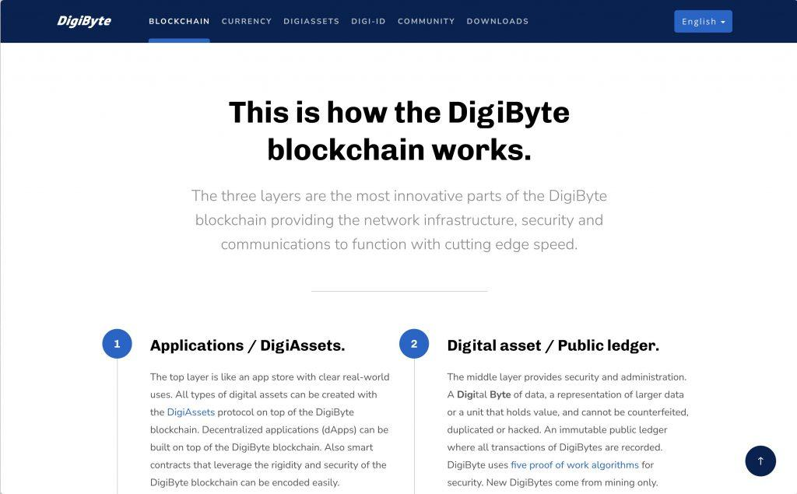

## Table of Contents

## What is Digibyte?

Digibyte is a type of cryptocurrency that was created in 2014. It is similar to Bitcoin but has some differences. Digibyte is designed to be faster and more secure than Bitcoin. It uses a technology called blockchain, which is like a digital ledger that keeps track of all the transactions.

One special thing about Digibyte is that it has five different ways to mine it. Mining is how new Digibyte coins are created and added to the system. This makes it more secure because it is harder for one person to control the whole system. Digibyte is used by people who want to send money quickly and safely over the internet.

## Who created Digibyte and when was it launched?

Digibyte was created by a person named Jared Tate. He wanted to make a cryptocurrency that was better than Bitcoin in some ways. Jared thought that Digibyte could be faster and more secure. He worked hard to make this new kind of money.

Digibyte was launched in January 2014. This means people could start using it and trading it from that time. Since then, many people have started using Digibyte to send money quickly and safely over the internet.

## What are the main features of Digibyte?

Digibyte is a type of digital money that works a lot like Bitcoin but has some special features. One of the main features is that it uses something called a blockchain, which is like a big digital notebook that keeps track of all the money moving around. This makes Digibyte very safe because it's hard for anyone to cheat the system. Another cool thing about Digibyte is that it can process transactions much faster than Bitcoin. This means you can send money to someone else on the internet quickly.

Another important feature of Digibyte is that it has five different ways to mine it. Mining is how new Digibyte coins are made and added to the system. Having five different ways makes it even harder for someone to take control of the whole system because they would need to control all five ways at the same time. This makes Digibyte very secure. Also, Digibyte is designed to be easy for anyone to use, so you don't need to be a computer expert to start using it to send and receive money.

## How does Digibyte differ from Bitcoin?

Digibyte and Bitcoin are both types of digital money, but they have some important differences. One big difference is how fast they can process transactions. Digibyte is designed to be much faster than Bitcoin. This means if you want to send money to someone, it will get there quicker with Digibyte. Another difference is in how they keep their systems safe. Digibyte uses a special way of making new coins called mining, and it has five different ways to do this. This makes it very hard for someone to take over the system because they would need to control all five ways at once. Bitcoin, on the other hand, only uses one way to mine new coins.

Another way Digibyte differs from Bitcoin is in how it's set up to be used by more people. Digibyte is made to be easy for anyone to use, even if you're not good with computers. It's designed to be user-friendly, so more people can start using it without needing to learn a lot of complicated stuff. Bitcoin can be a bit harder to use for some people because it requires more technical knowledge. So, while both are digital currencies, Digibyte focuses on being faster, safer, and easier to use than Bitcoin.

## What are the different types of Digibyte algorithms?

Digibyte uses five different types of algorithms to make new coins. This is called mining, and it's how Digibyte keeps its system safe. The first algorithm is called Scrypt, which is easy to mine with regular computers. The second one is SHA-256, which is good for people who have special mining machines. The third algorithm is Qubit, which is a bit harder to mine but helps keep the system balanced. The fourth one is Skein, which is another type that helps make mining fair for everyone. The last one is Groestl, which is used to make sure the system stays strong and secure.

These different algorithms help Digibyte be more secure than other digital money like Bitcoin. Because there are five ways to mine Digibyte, it's very hard for one person to control the whole system. They would need to be really good at all five types of mining at the same time. This makes Digibyte safer for everyone who uses it. By having these different algorithms, Digibyte can also make sure that more people can join in and mine new coins, not just people with fancy machines.

## How is Digibyte mined?

Digibyte is mined using five different types of algorithms. This is special because most other digital money, like Bitcoin, only uses one type. The five algorithms are Scrypt, SHA-256, Qubit, Skein, and Groestl. Each one is a bit different, so people can use different kinds of computers to mine Digibyte. Scrypt is good for regular computers, while SHA-256 works well with special mining machines. Qubit, Skein, and Groestl help keep the mining fair and balanced for everyone.

When someone mines Digibyte, they use their computer to solve hard math problems. When they solve a problem, they get to add a new block of transactions to the blockchain. This is like adding a new page to a big digital notebook that keeps track of all the money moving around. Each time a new block is added, the person who solved the problem gets some new Digibyte coins as a reward. This is how new Digibyte coins are made and added to the system. By having five different ways to mine, Digibyte makes it harder for one person to control everything, which keeps the system safe and fair for everyone.

## What is the total supply of Digibyte and how is it distributed?

The total supply of Digibyte is 21 billion coins. This is a lot more than Bitcoin, which only has 21 million coins. Digibyte was designed to have a bigger supply so that more people can use it and it can be easier to send small amounts of money.

The way Digibyte is distributed is through mining. When people mine Digibyte, they use their computers to solve hard math problems. Every time someone solves a problem, they get to add a new block of transactions to the blockchain and they earn some new Digibyte coins. This is how new coins are made and added to the system. Because Digibyte uses five different types of mining algorithms, more people can join in and mine, which helps spread the coins out to a lot of different people.

## What are the transaction speeds and fees associated with Digibyte?

Digibyte is designed to be fast when it comes to sending money from one person to another. It can process transactions much quicker than Bitcoin. With Digibyte, a transaction can be confirmed in about 15 seconds. This means if you send Digibyte to someone, they will get it very quickly. This is great for people who need to move money fast over the internet.

The fees for using Digibyte are also very low. When you send Digibyte, you only have to pay a small fee, which is usually much less than what you would pay with Bitcoin. This makes it cheaper to use Digibyte for everyday things like buying stuff online or sending money to friends. The low fees and fast transaction times make Digibyte a good choice for people who want to use digital money without spending a lot of time or money on fees.

## How does Digibyte ensure security and decentralization?

Digibyte keeps its system safe and decentralized by using five different types of mining algorithms. This means there are five different ways to make new Digibyte coins, and each way uses a different kind of math problem. This makes it very hard for one person to control the whole system because they would need to be really good at all five types of mining at the same time. By having these different ways to mine, more people can join in and help keep the system running, which makes it more decentralized and fair for everyone.

Another way Digibyte stays secure is by using a blockchain. A blockchain is like a big digital notebook that keeps track of all the money moving around. Every time someone sends Digibyte, it gets written down in this notebook, and everyone can see it. This makes it very hard for someone to cheat the system because they would need to change the notebook, but everyone else would see that and stop them. By using a blockchain and having many people mine Digibyte, the system stays safe and decentralized, which means no one person can control everything.

## What is DigiAssets and how does it function on the Digibyte platform?

DigiAssets is a special part of the Digibyte platform that lets people create and trade digital things like art, tickets, or even new kinds of money. It's like a tool that makes it easy for anyone to build their own digital stuff and share it with others. All the information about these digital things is kept safe on the Digibyte blockchain, which is like a big digital notebook that everyone can see and trust.

To use DigiAssets, people can make their own digital items and then trade them with others. It works by using smart contracts, which are like digital agreements that make sure everything happens the way it's supposed to. This means that when someone buys or trades a DigiAsset, the deal is safe and fair. DigiAssets helps make the Digibyte platform more useful for lots of different things, not just sending money.

## Can you explain the role of Digibyte in the Internet of Things (IoT)?

Digibyte can play a big role in the Internet of Things (IoT). IoT is when lots of different devices like your phone, your fridge, or even your car can talk to each other over the internet. Digibyte can help these devices send and receive money or other digital things quickly and safely. This is important because in the future, more and more devices will need to do this, and they need a way to do it that is fast and secure.

One way Digibyte helps with IoT is by using something called DigiAssets. DigiAssets let people create and trade digital things on the Digibyte blockchain. This means that devices in the IoT can use Digibyte to trade information or money with each other without needing a middleman. This makes everything faster and cheaper. With Digibyte, the IoT can work better because it has a safe and fast way to handle all the digital stuff that needs to move around.

## What are some of the future developments planned for Digibyte?

Digibyte has some exciting plans for the future. One big thing they want to do is make DigiAssets even better. DigiAssets let people create and trade digital things like art or tickets on the Digibyte blockchain. They want to make it easier for anyone to use DigiAssets, so more people can join in and use them for all sorts of cool stuff. They also want to keep making Digibyte faster and safer, so it can handle even more transactions quickly and securely.

Another thing they are working on is making Digibyte more useful for the Internet of Things (IoT). IoT is when lots of different devices like your phone or your car can talk to each other over the internet. Digibyte wants to help these devices send and receive money or other digital things even better. They want to make sure that as more devices start using the internet, Digibyte can handle all that traffic and keep everything running smoothly. This way, Digibyte can be a big part of how the future of the internet works.

## References & Further Reading

[1]: Antonopoulos, A. M. (2017). ["Mastering Bitcoin: Unlocking Digital Cryptocurrencies."](https://books.google.com/books/about/Mastering_Bitcoin.html?id=IXmrBQAAQBAJ) O'Reilly Media.

[2]: Mougayar, W. (2016). ["The Business Blockchain: Promise, Practice, and Application of the Next Internet Technology."](https://books.google.com/books/about/The_Business_Blockchain.html?id=CEsPDAAAQBAJ) Wiley.

[3]: Narayanan, A., Bonneau, J., Felten, E., Miller, A., & Goldfeder, S. (2016). ["Bitcoin and Cryptocurrency Technologies: A Comprehensive Introduction."](https://press.princeton.edu/books/hardcover/9780691171692/bitcoin-and-cryptocurrency-technologies) Princeton University Press.

[4]: Franco, P. (2014). ["Understanding Bitcoin: Cryptography, Engineering and Economics."](https://onlinelibrary.wiley.com/doi/book/10.1002/9781119019138) Wiley.

[5]: DeFilippi, P., & Wright, A. (2018). ["Blockchain and the Law: The Rule of Code."](https://www.jstor.org/stable/j.ctv2867sp) Harvard University Press.