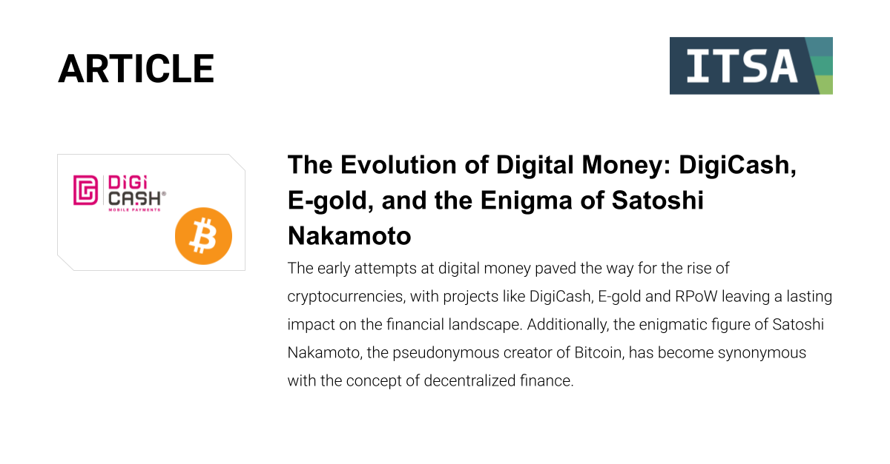

## Table of Contents

## What is DigiCash?

DigiCash was a form of electronic money created by a company called DigiCash, Inc. in the 1990s. It was invented by David Chaum, who is known for his work in cryptography and digital privacy. DigiCash allowed people to make secure and private payments over the internet. It used a special system where the money was turned into a digital form that could be sent from one person to another without anyone else knowing the details of the transaction.

The idea behind DigiCash was to give people more control over their money and protect their privacy. When someone used DigiCash, the details of their purchase, like what they bought and from whom, were kept secret. This was different from using regular credit cards, where banks and other companies could see your spending. Even though DigiCash had a good idea, it faced many challenges and eventually stopped being used because it was hard to get people and businesses to use it.

## Who founded DigiCash and when was it established?

DigiCash was founded by David Chaum. He started the company in 1989. David Chaum is well-known for his work in making the internet safer and more private for people.

DigiCash was created to let people use money online in a new way. It was meant to keep people's spending private. But, it was hard to get a lot of people and stores to use DigiCash, so it did not last long.

## How did DigiCash work as a digital currency system?

DigiCash worked by turning regular money into a special digital form that people could use to buy things online. When someone wanted to use DigiCash, they would first buy some from a bank. The bank would then give them a digital "coin" that they could use to make payments. This digital coin was like a secret code that only the person who bought it could use. When they wanted to buy something, they would send this code to the seller, who could then check with the bank to make sure it was real.

The cool thing about DigiCash was that it kept people's spending private. When someone used DigiCash to buy something, the bank and other people couldn't see what they bought or who they bought it from. This was different from using a credit card, where the bank knows everything about your purchases. DigiCash used special math called cryptography to keep everything secret. Even though DigiCash had a good idea, it was hard to get a lot of people and stores to use it, so it didn't last long.

## What were the main features of DigiCash?

DigiCash was a way to use money online that kept your spending private. When you used DigiCash, you would buy digital "coins" from a bank. These coins were like secret codes that you could use to buy things. When you wanted to buy something, you would send the code to the seller, and they would check with the bank to make sure it was real. This made it easy to buy things online without using a credit card.

One of the best things about DigiCash was that it kept your spending secret. When you used DigiCash to buy something, the bank and other people couldn't see what you bought or who you bought it from. This was different from using a credit card, where the bank knows everything about your purchases. DigiCash used special math called cryptography to keep everything secret. Even though DigiCash had a good idea, it was hard to get a lot of people and stores to use it, so it didn't last long.

## What were the challenges DigiCash faced during its operation?

DigiCash faced many challenges while it was trying to work. One big problem was that not many people and stores wanted to use it. It was hard to get everyone to agree to use DigiCash because it was new and different. People were used to using credit cards and cash, and they were not sure about trying something new. Also, stores had to change their systems to accept DigiCash, which was a lot of work and cost money.

Another challenge was that DigiCash needed a lot of money to keep going. It was expensive to set up and run the special systems that made DigiCash work. The company had to pay for the technology and the people who worked on it. Because not many people were using DigiCash, the company did not make enough money to cover all these costs. In the end, these challenges were too big, and DigiCash had to stop working.

## How did DigiCash influence the development of digital currencies?

DigiCash was important because it was one of the first tries at making digital money. It showed people that you could use money online in a way that kept your spending private. This idea of privacy was new and exciting, and it got other people thinking about how to make digital money that was safe and secret. Even though DigiCash did not last long, it helped start the idea of using special math, called cryptography, to keep money safe online.

The work on DigiCash also helped other people who wanted to make their own digital money. People like the ones who made Bitcoin learned from DigiCash. They saw what worked and what did not work, and they used this to make their own digital money better. So, even though DigiCash stopped, it helped make the way for other digital currencies that we use today.

## What was the role of cryptography in DigiCash's system?

Cryptography was a big part of how DigiCash worked. It helped keep people's money and spending private. When someone used DigiCash, they got a special digital "coin" that was like a secret code. This code was made using cryptography, which is a kind of math that keeps things safe and secret. When someone wanted to buy something, they would send this code to the seller. The seller could check with the bank to make sure the code was real, but they could not see who sent it or what it was for. This way, the buyer's spending stayed private.

The use of cryptography in DigiCash was important because it made sure that only the person who had the digital coin could use it. This stopped other people from stealing or copying the coin. It also meant that the bank could not see what people were buying or who they were buying from. Even though DigiCash did not last long, the way it used cryptography to keep money safe and private helped other people who made digital money after it.

## Can you explain the business model of DigiCash?

DigiCash's business model was to make money by charging fees for using their digital currency system. People would buy DigiCash from banks, and then use it to buy things online. When someone used DigiCash to pay for something, the bank would take a small fee. This fee was how DigiCash made money to keep running their system. The idea was that as more people used DigiCash, the company would make more money from these fees.

The challenge for DigiCash was getting enough people and businesses to use their system. They needed a lot of people to buy DigiCash and a lot of stores to accept it. This was hard because it was new and different. People were used to using credit cards and cash, and they were not sure about trying something new. Also, stores had to change their systems to accept DigiCash, which cost money and took time. If DigiCash could get enough users and businesses, they could make enough money from the fees to keep going. But it was hard to reach that point, and in the end, DigiCash did not make it.

## What led to the eventual decline and bankruptcy of DigiCash?

DigiCash did not last long because it had a hard time getting people and stores to use it. People were used to using credit cards and cash, and they were not sure about trying something new like DigiCash. Stores had to change their systems to accept DigiCash, which was a lot of work and cost money. Because not many people were using DigiCash, the company did not make enough money from the fees they charged to keep going.

Another big problem was that DigiCash needed a lot of money to keep running. It was expensive to set up and run the special systems that made DigiCash work. The company had to pay for the technology and the people who worked on it. Because not enough people were using DigiCash, the company could not make enough money to cover all these costs. In the end, these challenges were too big, and DigiCash went bankrupt in 1998.

## How did DigiCash compare to other early digital currencies?

DigiCash was one of the first digital currencies, and it was different from others because it focused a lot on keeping people's spending private. It used special math called cryptography to make sure that when someone used DigiCash, no one else could see what they bought or who they bought it from. This was not common in other early digital currencies, which often did not care as much about privacy. For example, some other early digital currencies, like e-gold, were more about making it easy to buy things online, but they did not focus as much on keeping things secret.

Even though DigiCash was good at keeping things private, it had a hard time getting people and stores to use it. Other early digital currencies like e-gold and PayPal had an easier time because they worked more like the money people were already used to. E-gold let people use gold to buy things online, and PayPal let people send money to each other easily. These systems were simpler for people to understand and use. DigiCash needed a lot of people to use it to make money from the fees it charged, but it could not get enough users. This was a big reason why DigiCash did not last long, while other early digital currencies were able to keep going.

## What lessons can be learned from the rise and fall of DigiCash?

DigiCash teaches us that new ideas need a lot of people to use them to work well. Even though DigiCash had a good idea about keeping people's spending private, it was hard to get enough people and stores to use it. People were used to using credit cards and cash, and they were not sure about trying something new. Stores had to change their systems to accept DigiCash, which was a lot of work and cost money. If not enough people use a new system, it can be hard to make enough money to keep it going.

Another lesson from DigiCash is that privacy can be important for digital money. DigiCash used special math called cryptography to keep people's spending secret. This was different from other digital currencies that did not focus as much on privacy. Even though DigiCash did not last, the idea of using cryptography to keep money safe and private helped other people who made digital money after it. People who make new digital currencies today can learn from DigiCash and try to make systems that are easy to use and keep people's information private.

## What impact has DigiCash had on modern cryptocurrency and blockchain technology?

DigiCash was one of the first tries at making digital money that kept people's spending private. It used special math called cryptography to make sure that when someone used DigiCash, no one else could see what they bought or who they bought it from. Even though DigiCash did not last long, the idea of using cryptography to keep money safe and secret helped other people who made digital money after it. People like the ones who made Bitcoin learned from DigiCash. They saw what worked and what did not work, and they used this to make their own digital money better.

The way DigiCash worked also helped start the idea of blockchain technology. Blockchain is like a big book that keeps track of all the money people send to each other. It is safe because it uses cryptography, just like DigiCash did. Even though DigiCash did not use a full blockchain, the way it used cryptography to keep money safe helped other people think about how to make a better system. So, even though DigiCash stopped, it helped make the way for other digital currencies and blockchain technology that we use today.

## References & Further Reading

[1]: Chaum, D. (1982). ["Blind Signatures for Untraceable Payments."](https://link.springer.com/chapter/10.1007/978-1-4757-0602-4_18) 

[2]: Narayanan, A., Bonneau, J., Felten, E., Miller, A., & Goldfeder, S. (2016). ["Bitcoin and Cryptocurrency Technologies: A Comprehensive Introduction."](https://press.princeton.edu/books/hardcover/9780691171692/bitcoin-and-cryptocurrency-technologies) Princeton University Press.

[3]: Böhme, R., Christin, N., Edelman, B., & Moore, T. (2015). ["Bitcoin: Economics, Technology, and Governance."](https://www.aeaweb.org/articles?id=10.1257/jep.29.2.213) Journal of Economic Perspectives, 29(2), 213-238.

[4]: Barber, S., Boyen, X., Shi, E., & Uzun, E. (2012). ["Bitter to Better — How to Make Bitcoin a Better Currency."](https://link.springer.com/chapter/10.1007/978-3-642-32946-3_29) International Conference on Financial Cryptography and Data Security.

[5]: Lo, A. W. (2007). ["Efficient Market Hypothesis."](https://web.mit.edu/Alo/www/Papers/EMH_Final.pdf) In The New Palgrave: A Dictionary of Economics.