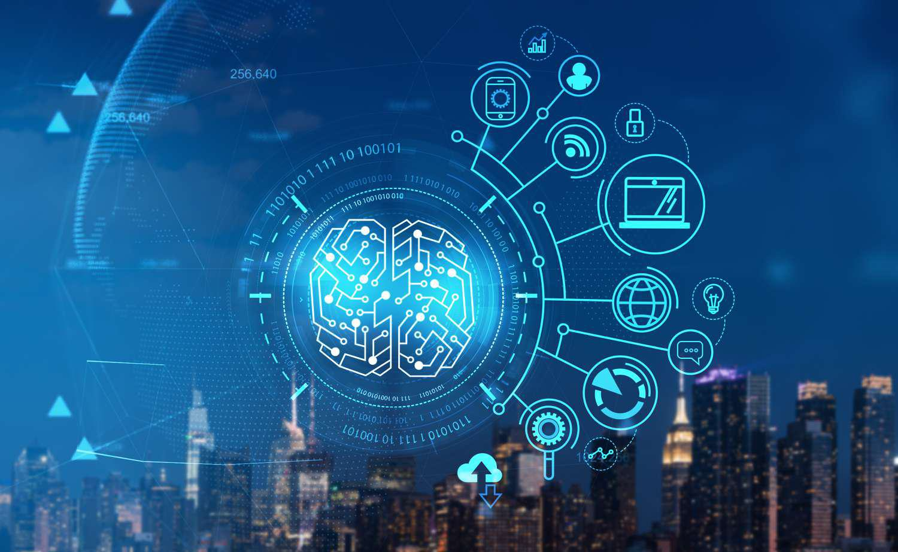

Digital assets represent a fundamental shift in how value and ownership are conceptualized and utilized in the modern digital economy. Unlike physical assets such as real estate or commodities, digital assets are intangible and exist primarily in digital form. They include a wide range of items such as cryptocurrencies, tokens, digital files, and more, each playing a pivotal role in today's financial landscape.

Cryptocurrencies, perhaps the most well-known type of digital asset, serve both as a medium of exchange and a store of value. Bitcoin and Ethereum are leading examples, often used for wide-ranging applications from simple transactions to powering decentralized applications. Tokens, particularly utility and governance tokens, extend the functionality of blockchain networks, facilitating interactions within decentralized ecosystems. Meanwhile, digital files, including music, videos, and documents in the form of Non-Fungible Tokens (NFTs), redefine ownership in the digital space by introducing unique identifiers that grant distinct rights to holders.

The rise of digital assets has notably impacted financial markets and asset trading. They offer innovative avenues for investment and diversification, transcending traditional financial barriers. Market participants can now engage in a global economy that operates continuously, allowing unprecedented access and liquidity. This has democratized investment opportunities, enabling retail investors to participate alongside institutional entities.

Algorithmic trading, or algo trading, is an essential component in the management and exchange of digital assets. By employing algorithms to execute trades, this method optimizes speed, efficiency, and precision, providing a significant advantage in the fast-paced digital asset markets. Algorithms analyze vast datasets to identify trading opportunities, manage risks, and execute transactions at scales and speeds beyond human capability.

This article focuses on types of digital assets and their importance in the domain of algorithmic trading. The interplay between digital assets and algo trading offers a glimpse into the future of financial markets, where technology transcends traditional boundaries, and new asset classes redefine economic landscapes. Understanding digital assets' various forms and their integration into trading strategies will illuminate the path forward in this rapidly evolving sector.

## Table of Contents

## Understanding Digital Assets

Digital assets are intangible assets that exist in digital form, providing value through ownership rights and usage within digital ecosystems. Unlike physical assets, which have a tangible presence, digital assets are represented through digital data and are often stored and transacted via electronic means. This distinct nature allows for seamless transfer and global accessibility, positioning digital assets as pivotal components of the modern economy.

### Categories of Digital Assets

**Cryptocurrencies**: These are decentralized digital currencies employing cryptographic techniques to secure transactions. Bitcoin and Ethereum are prime examples. They operate on blockchain technology, ensuring transparency and immutability in transactions.

**Digital Securities**: Represent digital forms of traditional securities such as stocks or bonds. They are often issued, traded, and maintained through blockchain platforms, allowing greater efficiency and reducing intermediaries.

**Smart Contracts**: Self-executing contracts with terms directly written into code. They automate transactions based on pre-defined conditions, enhancing efficiency and security across various applications.

**Non-Fungible Tokens (NFTs)**: Unique digital assets representing ownership over specific digital or physical items. Unlike cryptocurrencies, NFTs are not interchangeable, making them ideal for certifying authenticity and ownership, particularly in digital art and collectibles.

### Blockchain Technology

Blockchain plays a crucial role in managing and exchanging digital assets. It provides a decentralized, transparent, and secure ledger that records all transactions across a network of computers. This technology underpins most digital assets, offering features like immutability, ensuring that once data is recorded, it cannot be altered retroactively.

The decentralized nature of blockchain reduces reliance on central authorities, thus enabling peer-to-peer transactions and fostering trustless environments where users do not need to rely on third parties.

### Evolution from Fringe to Mainstream

Initially regarded as niche innovations, digital assets have rapidly transitioned into mainstream financial instruments. This shift is driven by several factors, including increased institutional interest, the efficiency of blockchain technology, and the democratization of finance. Financial markets across the globe have started integrating digital assets into their portfolios, fundamentally altering investment landscapes and opening up new avenues for growth and diversification.

### Regulatory Considerations

As digital assets become more pervasive, regulatory frameworks worldwide are evolving to address their unique characteristics and challenges. Governments and regulatory bodies focus on areas like consumer protection, anti-money laundering (AML), and combating the financing of terrorism (CFT). A notable challenge lies in balancing innovation with regulation — ensuring robust growth of the digital asset market while safeguarding investors and maintaining market integrity.

In conclusion, digital assets represent a revolutionary shift in how value is stored, transferred, and utilized globally. Their ongoing evolution necessitates continuous adaptation from both market participants and regulatory bodies to harness their potential while managing their inherent risks.

## Types of Digital Assets

Digital assets have become pivotal in modern finance, encompassing a range of types, each serving distinct purposes and embodying unique characteristics. The primary categories include cryptocurrencies, digital securities, utility and governance tokens, non-fungible tokens (NFTs), and stablecoins.

### Cryptocurrencies

Cryptocurrencies, epitomized by Bitcoin and Ethereum, are decentralized digital currencies built on blockchain technology. Bitcoin, established in 2009, was the first [cryptocurrency](/wiki/cryptocurrency), designed as a peer-to-peer electronic cash system (Nakamoto, S., 2008). It operates independently of central banks and relies on a cryptographic protocol to manage transactions and issuance of coins, which is capped algorithmically at 21 million coins.

Ethereum, launched in 2015, extends the capabilities of blockchain by introducing smart contracts—self-executing contracts with the terms directly written into lines of code (Buterin, V., 2013). These smart contracts enable decentralized applications (dApps) to function on the Ethereum network, facilitating a broader scope of blockchain use beyond currency.

### Digital Securities

Digital securities are blockchain-based representations of traditional financial instruments, such as stocks and bonds. They offer a more efficient and transparent way to issue and trade securities, providing benefits like reduced settlement times and lower costs. Digital securities are subject to regulatory compliance, similar to traditional securities, ensuring investor protection and market integrity.

### Utility and Governance Tokens

Utility tokens are integral to accessing services or functionalities within a particular blockchain ecosystem. They do not confer any ownership rights but are essential for utilizing platform-specific features. For example, Filecoin uses its native token to enable users to buy and sell storage on its decentralized network.

Governance tokens, on the other hand, grant holders voting rights on protocol decisions. They enable decentralized governance, where major protocol changes or updates are determined by token holders voting. An example of this is MakerDAO, which utilizes the MKR token for governance on its platform.

### Non-Fungible Tokens (NFTs)

Non-fungible tokens (NFTs) are unique digital representations of assets, verified through blockchain technology. Unlike cryptocurrencies, which are fungible and divisible, NFTs are indivisible and possess distinct characteristics that affirm their originality. They have gained prominence in digital art and collectibles, enabling artists to tokenize their creations, ensuring provenance and enabling direct sales to consumers without intermediaries.

### Stablecoins

Stablecoins are designed to offer the price stability of traditional currencies while retaining the benefits of blockchain technology. They are pegged to stable assets, such as the US dollar or gold, to mitigate [volatility](/wiki/volatility-trading-strategies). This bridging role is pivotal in trading and transactions, providing a reliable digital currency alternative for transferring value instantly across borders while maintaining relatively stable purchasing power.

Collectively, these digital asset types are reshaping financial markets, offering innovative solutions to existing challenges and democratizing access to financial instruments. Their continued evolution governs the trajectory of the digital economy, enabling new opportunities and raising complex regulatory and technical questions.

## Importance of Digital Assets

Digital assets have increasingly become pivotal to global finance, influencing numerous aspects of the economy. They serve as a bridge to democratize access to investment opportunities, thus facilitating more inclusive participation in financial markets. Unlike traditional financial systems, which often involve significant barriers to entry such as geographic restrictions, high transaction costs, and stringent requirements, digital assets enable broader access. Platforms that support digital assets allow investors worldwide to participate with minimal bureaucracy and reduced costs, making it feasible for individuals to diversify their portfolios in ways previously reserved for institutional investors.

Digital assets also have the capacity to introduce significant innovations to traditional financial systems. For instance, blockchain technology, which underpins many digital assets, offers decentralized and transparent systems that can reduce reliance on intermediaries and increase transaction speed and security. Smart contracts further enhance the potential for automation in the execution of transactions, lowering the risks of human error and fraud. This technological shift challenges the traditional paradigms of banking and investment, fostering a more agile financial environment.

The scalability and speed advantages of digital transactions over traditional methods are considerable. Transactions conducted via digital assets are often settled in a matter of minutes as opposed to the days that can be required for standard banking processes. This efficiency is largely attributable to blockchain technology, which reduces the need for third-party verification and settlement processes. Furthermore, scalability is enhanced as digital infrastructures can accommodate growing numbers of transactions without proportionately increasing costs, unlike traditional financial systems, where scaling can lead to higher complexity and expenses.

However, the use of digital assets is not without its risks, primarily due to the volatility of asset prices. Cryptocurrencies are notorious for their rapid price fluctuations, which can occur due to speculative trading, market sentiment, regulatory announcements, and technological changes. To manage these risks, various financial instruments and strategies are employed, such as hedging through futures and options, portfolio diversification, and the utilization of [algorithmic trading](/wiki/algorithmic-trading) to automate buy and sell decisions based on market conditions. Additionally, stablecoins, pegged to traditional currencies or other assets, provide a method to mitigate some of this volatility.

In conclusion, while digital assets offer remarkable opportunities for financial inclusion and system innovation, they come with inherent risks that require careful management. The evolution of digital finance continues to present challenges and opportunities for investors and regulators alike.

## Algorithmic Trading and Digital Assets

Algorithmic trading, often abbreviated as algo trading, refers to the use of computer programs and sophisticated algorithms to execute a large number of transactions in financial markets at speeds and frequencies that are impossible for human traders. The basic principle of algorithmic trading is to leverage mathematical models and computational power to exploit trading opportunities, optimize execution, and minimize market risks.

Digital assets, being inherently digital, possess characteristics such as divisibility and transferability, making them highly suitable for algorithmic trading. The synergy between algorithmic trading and digital assets is largely due to the speed and efficiency with which trades can be conducted. Algorithms can instantaneously analyze vast amounts of market data and execute trades based on pre-defined conditions, allowing traders to capitalize on price movements and [arbitrage](/wiki/arbitrage) opportunities in milliseconds.

For digital assets, the technical requirements for engaging in algorithmic trading include a robust computational infrastructure, access to real-time market data, and the use of programming languages such as Python. Libraries like Pandas and NumPy are frequently utilized for data manipulation, while specialized frameworks such as Backtrader or PyAlgoTrade facilitate strategy development and [backtesting](/wiki/backtesting). Additionally, APIs from exchanges are essential to access price feeds and execute trades programmatically.

Algorithms play a crucial role in minimizing risks and maximizing returns, particularly in the highly volatile digital asset markets. By implementing strategies like [statistical arbitrage](/wiki/statistical-arbitrage), [momentum](/wiki/momentum) trading, and [market making](/wiki/market-making), traders can capitalize on short-term price inefficiencies. For example, in statistical arbitrage, algorithms identify price discrepancies between correlated assets and execute trades to profit from the convergence of prices.

Real-world examples of algorithmic trading strategies in the digital asset space include high-frequency trading ([HFT](/wiki/high-frequency-trading-strategies)), where algorithms execute a large number of orders at rapid speeds to exploit minor price changes. Another example is the use of [machine learning](/wiki/machine-learning) algorithms to predict price movements based on historical data, sentiment analysis, and other relevant indicators.

In conclusion, algorithmic trading complements the dynamic nature of digital assets by providing a framework for executing high-speed and efficient trades. The synergy enables traders to navigate volatile markets effectively, capitalize on diverse strategies, and manage risks systematically. As the digital asset ecosystem continues to evolve, the integration of advanced algorithms and computational technologies will likely enhance market efficiency and trading opportunities.

## Future Trends and Challenges

The landscape of digital assets is poised for significant transformation, with several future developments likely to impact trading dynamics. Among the most anticipated advancements is the integration of [artificial intelligence](/wiki/ai-artificial-intelligence) (AI) and machine learning (ML) in trading algorithms, enhancing their adaptability and precision. These technologies promise to revolutionize digital asset trading by optimizing decision-making processes and increasing trade execution speed. For instance, sophisticated ML models can analyze vast datasets to predict price movements, offering traders a competitive edge.

Blockchain technology continues to be a cornerstone for digital assets, and its evolution could further influence trading practices. Innovations like decentralized finance (DeFi) and smart contract platforms are expanding the possibilities for digital asset transactions by reducing reliance on intermediaries and offering more transparent and efficient solutions. As blockchain scalability improves, it is likely to facilitate higher transaction volumes without compromising speed or security, thus attracting more participants to the digital asset market.

Regulatory frameworks are crucial in shaping the future of digital asset trading. As governments and international bodies recognize the growing influence of digital assets, regulatory changes are inevitable. These changes could range from establishing comprehensive guidelines for digital asset classification to introducing taxation policies. Regulatory clarity could foster greater trust and stability in the market, encouraging institutional investment. However, stringent regulations may also pose challenges, potentially stifling innovation and limiting market access for smaller participants.

Traders face several challenges as they navigate the digital asset landscape. Market volatility remains a significant concern, with price fluctuations often attributed to speculative trading and external factors such as regulatory news or global economic conditions. Furthermore, the relative lack of historical data compared to traditional markets complicates risk management and strategy development. Traders must remain vigilant and adapt strategies to mitigate volatility risks.

The continuous evolution of trading algorithms is crucial in response to rapidly changing market conditions. Algorithm developers are tasked with ensuring that their algorithms remain robust and flexible, adapting to new data, regulatory changes, and technological advancements. Innovations in data analytics and real-time processing are critical for creating algorithms that can swiftly respond to market shifts. A possible approach is employing [reinforcement learning](/wiki/reinforcement-learning), where algorithms continuously learn and adapt to the environment by optimizing their trading actions based on rewards and penalties.

In conclusion, the future of digital assets and their trading is promising yet fraught with challenges. Technological advancements and regulatory changes will play pivotal roles in shaping the market. Traders who can successfully navigate these developments through adaptive strategies and technologies will likely gain significant advantages in the evolving landscape.

## Conclusion

Digital assets have transformed from niche curiosities to central components of the modern financial landscape. They encompass a wide range of categories, including cryptocurrencies, such as Bitcoin and Ethereum, digital securities, utility and governance tokens, non-fungible tokens (NFTs), and stablecoins. Each type of digital asset serves distinct functions, from facilitating decentralized finance to enabling digital ownership of art, thus significantly influencing global economic systems.

Algorithmic trading plays a pivotal role in managing digital assets by leveraging speed, efficiency, and data-driven insights to navigate the unique challenges of the digital marketplace. Algorithms, designed for precision and robustness, enhance the ability to minimize risk and optimize returns amidst the market's notorious volatility. Real-world use cases of successful algorithmic strategies underscore the importance of these tools in achieving profitable outcomes.

Informed participation in the digital asset market requires continuous learning and adaptation. Staying up-to-date with emerging technologies and market trends is crucial for investors and traders striving to capitalize on potential gains while mitigating risks. The landscape of digital finance is rapidly evolving; hence, a proactive approach toward understanding both opportunities and inherent risks is essential.

In conclusion, ongoing education and the willingness to adapt are indispensable in navigating the complexities of the digital financial landscape. As both the technology and the regulations surrounding digital assets and algorithmic trading continue to advance, those who remain vigilant and informed will be best positioned to thrive in this dynamic sector.

## References & Further Reading

[1]: Nakamoto, S. (2008). ["Bitcoin: A Peer-to-Peer Electronic Cash System."](https://nakamotoinstitute.org/library/bitcoin/)

[2]: Buterin, V. (2013). ["Ethereum Whitepaper."](https://ethereum.org/en/whitepaper/)

[3]: Mougayar, W. (2016). ["The Business Blockchain: Promise, Practice, and Application of the Next Internet Technology"](https://books.google.com/books/about/The_Business_Blockchain.html?id=CEsPDAAAQBAJ) Wiley.

[4]: Narayanan, A., Bonneau, J., Felten, E., Miller, A., & Goldfeder, S. (2016). ["Bitcoin and Cryptocurrency Technologies: A Comprehensive Introduction"](https://press.princeton.edu/books/hardcover/9780691171692/bitcoin-and-cryptocurrency-technologies) Princeton University Press.

[5]: Tapscott, D., & Tapscott, A. (2016). ["Blockchain Revolution: How the Technology Behind Bitcoin and Other Cryptocurrencies is Changing the World"](https://archive.org/details/blockchainrevolu0000taps) Portfolio.

[6]: de Prado, M. L. (2018). ["Advances in Financial Machine Learning"](https://www.amazon.com/Advances-Financial-Machine-Learning-Marcos/dp/1119482089) Wiley.

[7]: Stoll, H. R. (2000). "Friction." The Journal of Finance, 55(4), 1479-1514.

[8]: Susskind, R., & Susskind, D. (2015). ["The Future of the Professions: How Technology Will Transform the Work of Human Experts"](https://academic.oup.com/book/40589) Oxford University Press.

[9]: Athey, S., & Imbens, G. W. (2017). ["The State of Applied Econometrics: Causality and Policy Evaluation."](https://www.aeaweb.org/articles?id=10.1257/jep.31.2.3) Journal of Economic Perspectives, 31(2), 3-32.