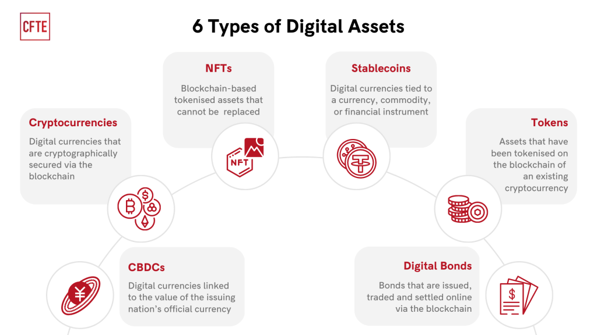

## Table of Contents

## What is a digital asset?

A digital asset is anything that exists in a digital format and has value. This can include things like photos, videos, music, documents, and even cryptocurrencies. Just like physical assets, digital assets can be bought, sold, or traded. They are important in our daily lives because we use them for work, entertainment, and communication.

Digital assets are stored on devices like computers, smartphones, or in the cloud. It's important to keep them safe because they can be lost or stolen. To protect digital assets, people use passwords, encryption, and backup systems. As more of our lives move online, digital assets are becoming more and more important.

## What are the common types of digital assets?

Digital assets come in many forms, but some of the most common ones are photos, videos, and music. These are things we often share with friends and family on social media or keep for our own memories. Another type of digital asset is documents, like school papers or work reports. These are important because they help us keep track of our work and ideas. Emails and text messages are also digital assets because they contain information that can be valuable to us.

Another group of digital assets includes websites and domain names. People and businesses use these to share information and sell things online. Software and apps are also digital assets. They help us do things like play games, plan our day, or connect with others. Lastly, cryptocurrencies like Bitcoin are digital assets too. They are a type of money that exists only online and can be used to buy things or traded like stocks.

Keeping all these digital assets safe is important. We use things like passwords and backups to make sure we don't lose them. As we spend more time online, these digital assets become more important in our lives.

## How do digital assets differ from traditional assets?

Digital assets and traditional assets are different in a few ways. Traditional assets are things you can touch, like a house, a car, or money in your pocket. They have been around for a long time and people know how to use them. On the other hand, digital assets are things that exist online or in a digital format, like photos, videos, or cryptocurrencies. You can't touch them, but they still have value and can be used in many ways.

Another difference is how you keep them safe. For traditional assets, you might use locks or safes to protect them. But for digital assets, you use passwords, encryption, and backups to make sure they don't get lost or stolen. Also, digital assets can be shared easily online, while traditional assets usually need to be moved physically from one place to another. As more of our lives move online, digital assets are becoming more important and common.

## Why are digital assets important in today's economy?

Digital assets are important in today's economy because they help people do things faster and easier. For example, with digital money like cryptocurrencies, people can buy things online without needing to use cash or credit cards. This makes it easier for people all over the world to trade with each other. Also, digital assets like software and apps help businesses run better and make more money. They can use these tools to reach more customers and work more efficiently.

Another reason digital assets are important is that they help create new jobs and industries. For example, the rise of digital art and music has created jobs for artists and musicians who can now share their work online and get paid for it. Also, the need to protect digital assets has led to new jobs in cybersecurity. As more people use digital assets, the economy grows because there are more ways for people to make and spend money. In the end, digital assets make our economy more connected and dynamic.

## What are cryptocurrencies and how do they function as digital assets?

Cryptocurrencies are a type of digital asset that works like money but exists only online. They are not controlled by any government or bank, which makes them different from traditional money. Bitcoin is one of the most well-known cryptocurrencies, but there are many others like Ethereum and Litecoin. People use cryptocurrencies to buy things, trade them like stocks, or even just to store value. To use cryptocurrencies, you need a digital wallet, which is like a bank account but online. You can send and receive cryptocurrencies from this wallet, and it's important to keep it safe with strong passwords and other security measures.

Cryptocurrencies work using something called blockchain technology. This is like a digital ledger that keeps track of all the transactions that happen with the cryptocurrency. Every time someone sends or receives cryptocurrency, it gets recorded on the blockchain, which makes it very hard to cheat or steal. The blockchain is managed by a network of computers around the world, which makes it very secure and reliable. Because cryptocurrencies are digital assets, they can be easily sent anywhere in the world very quickly, which makes them useful for international trade and payments. As more people use cryptocurrencies, they are becoming an important part of our economy.

## How can digital assets be used for investment purposes?

Digital assets can be used for investment in many ways. One way is by buying and selling cryptocurrencies like Bitcoin or Ethereum. People buy these digital currencies when they think the price will go up, and then sell them later for a profit. It's a bit like buying and selling stocks, but with cryptocurrencies, everything happens online. Another way to invest in digital assets is through non-fungible tokens (NFTs). These are unique digital items, like art or music, that can be bought and sold. People buy NFTs hoping their value will increase over time.

Another way to invest in digital assets is by investing in companies that create or use them. For example, you can buy stocks in companies that make software, apps, or even the technology behind cryptocurrencies like blockchain. As these companies grow and become more successful, the value of their stocks can go up. This can be a good way to benefit from the growth of digital assets without directly buying them. Overall, digital assets offer many new opportunities for investment, but it's important to understand the risks and do your research before you start.

## What are non-fungible tokens (NFTs) and their role in the digital asset space?

Non-fungible tokens, or NFTs, are a special type of digital asset. They are unique and can't be replaced by something else, unlike money or cryptocurrencies where one unit is the same as another. NFTs are often used to represent digital art, music, videos, or even virtual real estate. When you buy an NFT, you're buying a one-of-a-kind item that's recorded on a blockchain, which is a secure way to keep track of who owns what.

NFTs play a big role in the digital asset space because they let creators sell their work directly to buyers without needing a middleman like a gallery or a record label. This can help artists and musicians make more money from their work. Also, because NFTs are on a blockchain, it's easy to prove who owns them and they can be traded or sold just like physical items. As more people get interested in digital art and collectibles, NFTs are becoming an important part of the economy.

## What are the security concerns associated with digital assets?

Digital assets can be at risk because they exist online and can be hard to protect. One big worry is hacking. Hackers might try to steal your cryptocurrencies or personal information by breaking into your computer or online accounts. To keep your digital assets safe, you need strong passwords, and you should use two-factor authentication, which adds an extra step to make sure it's really you trying to log in. It's also important to be careful about where you click and what you download because hackers can use fake websites or harmful software to trick you.

Another concern is losing your digital assets. If you forget your password or lose the device where your digital wallet is stored, you might not be able to get your assets back. That's why it's a good idea to back up your important files and keep a record of your passwords in a safe place. Also, some digital assets, like cryptocurrencies, are not protected by banks or governments, so if you lose them, you might not be able to get them back. Being careful and using good security practices can help keep your digital assets safe.

## How does blockchain technology support digital assets?

Blockchain technology is like a digital record book that helps keep digital assets safe and secure. It works by storing information in blocks that are linked together in a chain. Every time someone does something with a digital asset, like sending cryptocurrency or buying an NFT, that action gets recorded in a new block. Because the blockchain is spread out across many computers around the world, it's very hard for anyone to change or cheat the records. This makes it a great way to keep track of who owns what and to make sure digital assets are not lost or stolen.

Blockchain also makes it easier for people to trust each other when they're dealing with digital assets. Since all the transactions are recorded and can't be changed, everyone can see what's happening. This means you don't need a bank or a middleman to help you trade cryptocurrencies or buy NFTs. You can do it directly with someone else, and the blockchain will make sure everything is fair and honest. As more people use digital assets, blockchain technology is becoming more important for keeping everything safe and working smoothly.

## What regulatory considerations should be taken into account with digital assets?

When it comes to digital assets, governments and other groups need to think about rules to keep things fair and safe. One big thing they look at is how to stop people from using digital assets for bad things, like money laundering or fraud. They also want to make sure that people know what they're getting into when they buy or trade digital assets, so they might set rules about what information needs to be shared. Another important part is figuring out how to tax digital assets, since they can be bought, sold, and used just like other kinds of money or property.

Different countries might have different rules about digital assets, which can make things tricky for people who want to use them across borders. Some places might be more strict, while others might be more relaxed. This can affect how easy it is to use digital assets and how safe people feel about them. As digital assets become more common, governments will keep working on these rules to make sure they help the economy grow while also protecting people from risks.

## How can businesses leverage digital assets for operational efficiency?

Businesses can use digital assets to make their work easier and faster. For example, they can use software and apps to help with tasks like keeping track of money, talking to customers, and planning work. These tools can save time and help people work together better, even if they are in different places. By using digital assets like documents and videos, businesses can share information quickly and easily with their team and customers. This can help them make decisions faster and get more done.

Another way businesses can use digital assets is by using cryptocurrencies for payments. This can make it easier and quicker to pay for things, especially if they are buying from or selling to people in other countries. Cryptocurrencies can also help businesses save money on fees that banks might charge for moving money around. By using digital assets smartly, businesses can work more efficiently, reach more customers, and grow faster.

## What are the future trends and potential developments in the digital asset market?

In the future, digital assets are likely to become even more important. One big trend is the growth of decentralized finance, or DeFi. This means using cryptocurrencies and blockchain technology to do things like borrowing, lending, and investing without needing banks or other middlemen. DeFi could make financial services more accessible and cheaper for people all over the world. Another trend is the rise of the metaverse, where people can interact in virtual worlds using digital assets like NFTs for things like art, clothes, and land. As more people spend time in these virtual spaces, the demand for digital assets could grow a lot.

Also, we might see more governments and big companies start using digital assets. Some countries are already thinking about making their own digital currencies, called central bank digital currencies (CBDCs). These could make it easier and faster to move money around. Big companies might use blockchain technology to make their supply chains more efficient and transparent. As technology gets better and more people learn about digital assets, they could become a normal part of our lives, just like using a smartphone or the internet.

## References & Further Reading

[1]: Nakamoto, S. (2008). ["Bitcoin: A Peer-to-Peer Electronic Cash System."](https://nakamotoinstitute.org/library/bitcoin/)

[2]: Buterin, V. (2013). ["Ethereum Whitepaper."](https://ethereum.org/en/whitepaper/)

[3]: Mougayar, W. (2016). ["The Business Blockchain: Promise, Practice, and Application of the Next Internet Technology"](https://books.google.com/books/about/The_Business_Blockchain.html?id=CEsPDAAAQBAJ) Wiley.

[4]: Narayanan, A., Bonneau, J., Felten, E., Miller, A., & Goldfeder, S. (2016). ["Bitcoin and Cryptocurrency Technologies: A Comprehensive Introduction"](https://press.princeton.edu/books/hardcover/9780691171692/bitcoin-and-cryptocurrency-technologies) Princeton University Press.

[5]: Tapscott, D., & Tapscott, A. (2016). ["Blockchain Revolution: How the Technology Behind Bitcoin and Other Cryptocurrencies is Changing the World"](https://archive.org/details/blockchainrevolu0000taps) Portfolio.

[6]: de Prado, M. L. (2018). ["Advances in Financial Machine Learning"](https://www.amazon.com/Advances-Financial-Machine-Learning-Marcos/dp/1119482089) Wiley.

[7]: Stoll, H. R. (2000). "Friction." The Journal of Finance, 55(4), 1479-1514.

[8]: Susskind, R., & Susskind, D. (2015). ["The Future of the Professions: How Technology Will Transform the Work of Human Experts"](https://academic.oup.com/book/40589) Oxford University Press.

[9]: Athey, S., & Imbens, G. W. (2017). ["The State of Applied Econometrics: Causality and Policy Evaluation."](https://www.aeaweb.org/articles?id=10.1257/jep.31.2.3) Journal of Economic Perspectives, 31(2), 3-32.