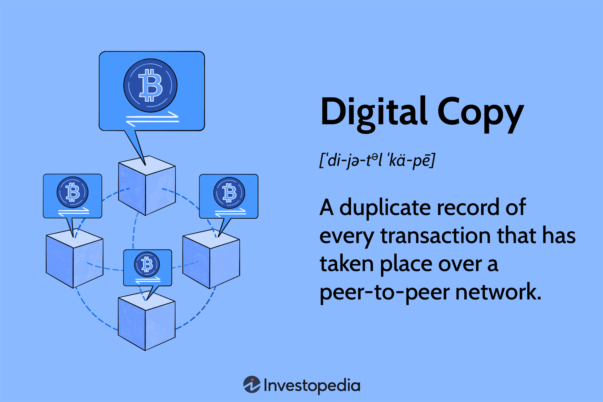

In today's rapidly evolving digital landscape, the integration of technology in trading has fundamentally transformed the financial markets. The convergence of digital content, electronic copy, digital media, and algorithmic trading has created a new paradigm, offering both challenges and opportunities for modern traders. These components are at the core of this transformation, significantly influencing how traders receive, process, and act on information.

Digital content, which encompasses data, analytics, market reports, and trading algorithms, forms the backbone of informed decision-making in trading. Similarly, electronic copies ensure that transaction records are secure and transparent, particularly with the advent of blockchain technology, which promises to prevent fraud and maintain integrity in trading operations.



Digital media has revolutionized the way trading information is disseminated and consumed. With access to real-time data and analytics, traders can make more informed decisions swiftly. Additionally, social media platforms have become crucial forums for discussion and strategy sharing among traders, further impacting trading behaviors.

Algorithmic trading represents a significant leap in market operations, automating trade execution at speeds beyond human capability and enhancing market liquidity and efficiency. However, this technology also introduces new challenges, such as increased market volatility. The role of algorithmic trading in reducing human error and enabling high-frequency trades cannot be overstated, although it requires careful regulation to mitigate associated risks.

The article will also cover the importance of digital copies in ensuring security within trading systems, especially in the cryptocurrency sphere, where they serve as a key feature of blockchain protocols like Bitcoin. These digital records help prevent issues such as double-spending, offering a decentralized approach that eliminates risks associated with data manipulation by a single entity.

Looking ahead, the intersection of these technologies requires traders to continuously update their skills to maintain a competitive edge. As the trading landscape continues to evolve, further integration of AI and blockchain technologies is expected to shape the future of trading. This article aims to provide insights into these advancements, offering perspectives on the current and future state of trading and highlighting the necessity for traders to embrace technology for effective navigation in the digital age.

## Table of Contents

## Understanding Digital Content and Electronic Copy

Digital content encompasses all forms of information stored or transmitted digitally. This includes a wide array of materials crucial for decision-making in trading, such as data, analytics, market reports, and trading algorithms. These elements provide traders with the insights necessary to navigate the financial markets effectively.

In trading, digital data and content form the backbone of information analysis and strategy development. Traders rely on digital market reports and analytics to understand market trends, assess risks, and identify opportunities. Trading algorithms, fundamental to [algorithmic trading](/wiki/algorithmic-trading), use this digital content to execute trades automatically based on pre-set criteria, analyzing vast amounts of data faster than human capability allows.

Electronic copy, within blockchain technology, serves as a secure, immutable record of transactions. Blockchain's decentralized nature ensures that each transaction is verified and stored across multiple network nodes, thereby promoting transparency and reliability. This feature is critical for preventing fraud, such as data tampering and double-spending, by creating timeliness and consensus in transaction recordings.

For example, consider the use of blockchain in maintaining secure records. Transactions in a blockchain are validated and then recorded in a block. Each block contains a cryptographic hash of the previous block, a timestamp, and transaction data, forming a chain. This cryptographic linkage ensures that altering any information within a block requires the modification of all subsequent blocks, which is computationally infeasible. This inherent security fosters trust among trading participants, as they can rely on the integrity of transaction records without the need for a central authority.

Through these digital means, the trading environment is enhanced by efficient data handling, improved transparency, and minimized fraud risk, enabling traders to make informed trades with confidence.

## The Impact of Digital Media on Trading

Digital media has significantly transformed the way trading information is shared and consumed. The availability of real-time data and analytics has made it possible for traders to make more informed decisions, minimizing reliance on outdated data and enhancing trading precision. This shift to immediate information access is largely facilitated by advanced technologies that process and deliver vast amounts of data efficiently.

The integration of digital platforms has enabled traders to harness powerful tools for comprehensive market analysis. Real-time analytics allow traders to monitor market trends, price movements, and trading volumes continuously. This capability not only enhances the decision-making process but also enables traders to develop more agile and adaptive trading strategies. Additionally, algorithmic trading systems rely heavily on this real-time data to function effectively, thereby impacting market operations profoundly.

Social media platforms have emerged as influential channels that shape trading behaviors. These platforms provide traders with forums for discussion, strategy sharing, and information dissemination. The democratization of information through social media means that insights and strategies that were once exclusive to institutional investors are now accessible to retail traders. Platforms like Twitter, Reddit, and specialized trading forums serve as aggregators of investment sentiment and discussions around specific assets or market conditions.

The phenomenon known as "social media-driven trading" illustrates how individual traders can collectively influence market movements. For instance, organized efforts by retail investors on platforms like Reddit's WallStreetBets have been known to significantly impact stock prices and trading volumes. This collective action, facilitated by digital media, has introduced a new dynamic to market behavior that traditional trading methodologies must now account for.

Moreover, the rapid development and dissemination of news through digital media can lead to heightened market [volatility](/wiki/volatility-trading-strategies). Traders leverage this quick access to news and collective sentiment to their advantage but must also manage the risks inherent in such dynamic environments. Companies and traders increasingly use natural language processing (NLP) and sentiment analysis to analyze social media content and gauge market sentiment, providing them with a competitive edge.

In conclusion, digital media has not only transformed the availability and type of information accessed by traders but has also reshaped the dynamics of trading behavior and market responses. Traders are now better equipped to navigate the volatility and opportunities offered in today's fast-paced digital trading environment.

## Algorithmic Trading: Revolutionizing Market Operations

Algorithmic trading employs sophisticated algorithms to perform trades at high speeds, significantly surpassing human capabilities. This approach leverages advanced mathematical models and computational power to analyze market data and execute orders based on predefined criteria. The automation inherent in algorithmic trading allows for the monitoring of multiple markets simultaneously, enabling traders to capitalize on fleeting opportunities that would otherwise be impossible to exploit manually.

One of the primary advantages of algorithmic trading is the improvement in market [liquidity](/wiki/liquidity-risk-premium) and efficiency. With algorithms capable of executing trades in milliseconds, markets become more responsive, leading to narrower bid-ask spreads and reduced transaction costs. This efficiency is vital for maintaining a vibrant financial market ecosystem, where liquidity providers can swiftly adjust their positions in response to market dynamics without significantly impacting price stability.

Despite these benefits, algorithmic trading can contribute to market volatility. High-frequency trading, a subset of algorithmic trading, involves executing a large number of trades in a very short period, sometimes within microseconds. Although this can tighten spreads and support market depth, it also has the potential to exacerbate price swings during periods of market stress. Events like the Flash Crash of May 6, 2010, where the Dow Jones Industrial Average briefly plummeted by about 1,000 points, highlight the potential risks associated with the automated trading systems.

Another significant benefit of algorithmic trading is the minimization of human error. Human decision-making in trading is often influenced by emotions and cognitive biases, leading to suboptimal decisions. By automating the trading process, algorithms can execute orders unemotionally, adhering strictly to the predefined strategic parameters. This rigor ensures that trading strategies are implemented as intended, without deviation due to human factors.

Algorithmic trading can also perform high-frequency trades — executing a vast number of small trades quickly to capture the bid-ask spread. This ability is particularly advantageous for market-making strategies, where the goal is to provide liquidity to the market. By continuously quoting buy and sell prices, algorithmic market makers help stabilize prices and reduce the cost of trading for all participants.

To illustrate the power of algorithmic trading, consider a simple moving average crossover strategy, where a short-term moving average (e.g., 20-day) crosses above a long-term moving average (e.g., 50-day), triggering a buy order. In Python, such a strategy could be implemented as follows:

```python
import numpy as np
import pandas as pd

# Assume we have a DataFrame 'df' with a datetime index and a 'price' column
short_window = 20
long_window = 50

# Calculate moving averages
df['short_mavg'] = df['price'].rolling(window=short_window, min_periods=1).mean()
df['long_mavg'] = df['price'].rolling(window=long_window, min_periods=1).mean()

# Generate trading signals
df['signal'] = 0
df['signal'][short_window:] = np.where(df['short_mavg'][short_window:] > df['long_mavg'][short_window:], 1, 0)

# Generate trading orders
df['orders'] = df['signal'].diff()

print(df[['price', 'short_mavg', 'long_mavg', 'signal', 'orders']].dropna())
```

This simple script exemplifies how algorithms can automate the decision-making process, rapidly responding to market trends. In sum, while algorithmic trading offers significant benefits in terms of speed, efficiency, and reduced human error, it necessitates careful management to mitigate risks such as increased volatility. As technology continues to advance, algorithmic trading will likely become even more integral to the functioning of global financial markets.

## Ensuring Security with Digital Copies in Cryptocurrency

In the [cryptocurrency](/wiki/cryptocurrency) space, digital copies are integral to the security and functionality of blockchain protocols like Bitcoin. The core innovation of cryptocurrencies lies in their ability to maintain a secure, decentralized ledger across multiple nodes in a network. This feature is fundamentally different from traditional centralized systems and offers several advantages in terms of security and trust.

At the heart of this system is the prevention of the "double-spending" problem, a challenge unique to digital currencies that lack physical embodiments. In a traditional fiat system, double-spending is not an issue because physical money can only be used once at a time. However, in digital form, without a central authority, it's theoretically possible to duplicate digital information. Blockchain technology solves this through its decentralized, immutable ledger.

Every transaction in a blockchain network is recorded in a "block." Once a block is filled, it is added to the chain of previous blocks, forming a chain of transactions—hence the name "blockchain". Each node in the network holds a complete record of every transaction ever made on the network, effectively storing a digital copy of the entire blockchain. This distributed nature means that even if a malicious actor attempts to alter a single transaction in one copy of the blockchain, it will be immediately identified and rejected by the consensus mechanism, as all other nodes hold the correct version of the ledger.

The consensus mechanism, often Proof of Work (PoW) in Bitcoin, is a fundamental security feature ensuring that all nodes agree on the current state of the blockchain. This agreement, or consensus, is achieved through a process that requires computational effort, making it expensive and impractical for attackers to tamper with the data. For Bitcoin, this involves solving complex cryptographic puzzles, which act as Proof of Work to validate transactions and create new blocks.

Mathematically, the security of blockchain and its ability to prevent double-spending can be analyzed through its hash functions and encryption protocols. A hash function $H(x)$ produces a fixed-size string of numbers and letters from input data of any size. Blockchain uses cryptographic hash functions, which exhibit properties like determinism, pre-image resistance, and collision resistance, making it virtually impossible to alter a transaction retroactively without altering all subsequent blocks—a task that is computationally unfeasible.

The decentralized architecture also mitigates the risk of data manipulation by a single entity, which is a significant threat in centralized systems where a single point of failure can lead to systemic vulnerabilities. The transparency and security offered by digital copies in a blockchain can be harnessed for more than just cryptocurrencies; they hold potential applications in fields as diverse as supply chain management, digital identity verification, and secure voting systems.

In conclusion, digital copies in cryptocurrency ensure that the network remains secure, transparent, and immune to single points of failure. By leveraging decentralized consensus algorithms, blockchain technology provides a robust solution to the challenges of digital transactions, ensuring trust and integrity in an increasingly digital world.

## Challenges and Future Considerations

As technology continues to reshape the trading landscape, new challenges and considerations are emerging. One significant challenge is regulatory compliance, which becomes more complex as technological innovations such as AI and blockchain are integrated. These technologies, while offering great potential, often operate in grey areas of the current regulatory frameworks. Regulators must adapt quickly to technological advancements to ensure market integrity while fostering innovation.

Technical complexities are another hurdle. As algorithmic and high-frequency trading become standard, the sophistication of trading systems increases exponentially. Innovative technologies such as distributed ledger systems and smart contracts introduce new layers of complexity. Maintaining robust, secure trading platforms requires significant investment in infrastructure and a continuous focus on cybersecurity.

Looking to the future, AI and blockchain technologies are poised to play a more prominent role. AI, with its capability to process vast data sets and generate predictive analytics, enhances decision-making processes. For instance, [machine learning](/wiki/machine-learning) algorithms can analyze historical market data to forecast trends and potential anomalies, optimizing trading strategies. However, the adaptation of AI in trading necessitates a balance between automated decision-making capabilities and human oversight to prevent unintended consequences.

Blockchain, through its inherent transparency and security features, offers solutions to some existing challenges in trading, such as transaction verification and fraud prevention. The decentralization provided by blockchain can reduce the control of single entities over markets, but it requires radical adjustments in market infrastructure and strategy.

For traders, staying competitive in this evolving landscape means continuous learning and skill adaptation. Mastery of the latest trading technologies and understanding of their implications can provide a competitive edge. Furthermore, as AI and machine learning pave new paths, proficiency in these areas will become increasingly important. 

Emerging technologies will continue to transform the trading landscape but will require traders and institutions to overcome regulatory, technical, and skill-based challenges. Innovation must be paired with strategic planning and adherence to evolving regulations to ensure the sustainable development of trading markets.

## Conclusion

The intersection of digital content, electronic copy, digital media, and algorithmic trading plays a pivotal role in modern trading environments. The integration of these elements has not only enhanced the efficiency and accessibility of financial markets but also revolutionized how traders approach market strategies. Digital content and electronic copies provide a robust foundation for data-driven decision-making processes. The transparency and security afforded by these technologies mitigate risks such as fraud and data manipulation.

Algorithmic trading, in particular, has significantly accelerated the pace and precision of trade executions, reducing human error and increasing the potential for profit maximization. However, the benefits of these technologies come with challenges that require careful management. Issues such as market volatility induced by high-frequency trading, the need for stringent cybersecurity measures, and the complexities associated with regulatory compliance underscore the necessity for adequate oversight and strategic planning.

To thrive in these technologically advanced trading environments, traders must embrace continuous learning and adaptability. The ability to understand and leverage emerging technologies is vital in maintaining a competitive edge. Furthermore, collaboration between technologists and traders is essential to address the technical challenges that come with advancements in areas like [artificial intelligence](/wiki/ai-artificial-intelligence) and blockchain technologies.

By fully embracing these technological tools and maintaining a proactive stance toward innovation, traders can navigate the complexities of the digital age with greater precision and confidence, ensuring sustainable success in the evolving landscape of financial markets.

## References & Further Reading

[1]: Bergstra, J., Bardenet, R., Bengio, Y., & Kégl, B. (2011). ["Algorithms for Hyper-Parameter Optimization."](https://dl.acm.org/doi/10.5555/2986459.2986743) Advances in Neural Information Processing Systems 24.

[2]: ["Advances in Financial Machine Learning"](https://www.amazon.com/Advances-Financial-Machine-Learning-Marcos/dp/1119482089) by Marcos Lopez de Prado

[3]: ["Evidence-Based Technical Analysis: Applying the Scientific Method and Statistical Inference to Trading Signals"](https://www.amazon.com/Evidence-Based-Technical-Analysis-Scientific-Statistical/dp/0470008741) by David Aronson

[4]: ["Machine Learning for Algorithmic Trading"](https://github.com/stefan-jansen/machine-learning-for-trading) by Stefan Jansen

[5]: ["Quantitative Trading: How to Build Your Own Algorithmic Trading Business"](https://github.com/LucindaYa/quant-resources/blob/master/Quantitative%20Trading%20How%20to%20Build%20Your%20Own%20Algorithmic%20Trading%20Business.pdf) by Ernest P. Chan