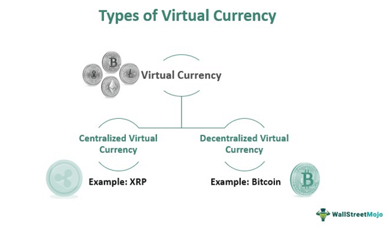

In the rapidly evolving world of finance, electronic money, digital currency, and cryptocurrency have emerged as groundbreaking innovations reshaping how we perceive and engage with money and transactions. These developments have not only introduced new forms of financial assets but also revolutionized trading methods, notably through the integration of algorithmic trading. Algorithmic trading, often referred to as algo trading, harnesses sophisticated technology to efficiently navigate the digital landscapes established by these financial instruments. Through the use of computer algorithms, trading decisions are executed at speeds and precision far beyond human capabilities.

Understanding the distinctions among electronic money, digital currency, and cryptocurrency is crucial for investors, whether they are just beginning to explore the financial markets or have years of experience. Electronic money typically refers to currency that exists in digital form, facilitating everyday transactions through digital systems, yet still tethered to traditional currency. Digital currency broadens this concept to include currencies that are entirely virtual, often designed to address specific transactional inefficiencies. Cryptocurrency, a more recent and revolutionary form of digital money, utilizes decentralized blockchain technology to operate independently of central banks and governments, introducing a whole new dimension of financial innovation.

In this article, we aim to explore the nuanced interplay between these financial forms and their associated trading strategies. By examining the role of algorithmic trading in this dynamic and ever-changing field, we seek to provide a comprehensive overview that highlights both the opportunities and challenges presented by these advancements. In doing so, this exploration will reveal how technological innovation continues to drive the transformation of global financial markets, prompting investors to adapt and leverage these tools to enhance their trading and investment strategies.

## Table of Contents

## Understanding Electronic Money and Digital Currency

Electronic money is a form of currency that exists solely in digital format and is managed through digital systems without any physical manifestation. This concept encompasses traditional fiat currency that is electronically stored and transferred, often associated with systems like online banking, credit cards, or mobile payment platforms. Unlike physical money, electronic money provides the versatility of being quickly transferred across distances with minimal friction, offering a modern solution to currency management in a digitized world.

Digital currency, a broader and more encompassing term, extends to various currency forms that exclusively exist in digital format. This category includes stablecoins, which are digital currencies pegged to traditional assets like the US dollar to mitigate volatility, and central bank digital currencies (CBDCs), which are digital versions of a nation’s currency issued and regulated by the respective central bank. The adoption of digital currencies is progressively transforming global finance by streamlining transactions, reducing costs, and enhancing monetary policy implementation. According to a 2019 survey conducted by the Bank for International Settlements, 80% of central banks were already engaging in some form of digital currency-related work as of that year[^1^].

Key examples of digital currency initiatives include Sweden’s exploratory studies on transitioning to a cashless society through the implementation of the e-Krona and China’s digital renminbi initiative, also known as the Digital Currency Electronic Payment (DCEP) system. Sweden has been at the forefront of reducing cash usage, and the e-Krona project aims to ensure a sustainable and stable monetary system in a progressively cashless world. Similarly, China’s introduction of the digital renminbi aims to enhance the efficiency and reach of the renminbi globally, providing a government-backed alternative to existing private digital payment systems like Alipay and WeChat Pay[^2^].

The transition towards digital currency aids in addressing various challenges, notably inefficiencies in cross-border transactions. Conventional international transfers are often slow and expensive due to intermediary processes and exchange rate discrepancies. Digital currencies, however, provide a mechanism to streamline this process, enabling near-instantaneous transactions across borders with reduced costs. The International Monetary Fund (IMF) has highlighted the potential of digital currencies to resolve these long-standing issues, advocating for careful implementation to avoid exacerbating risks related to cybersecurity and financial stability[^3^].

[^1^]: Barontini, C., & Holden, H. (2019). "Proceeding with caution – a survey on central bank digital currency." Bank for International Settlements. Retrieved from https://www.bis.org
[^2^]: Kiff, J., Alwazir, J., Davidovic, S., Farias, A. M., Khan, A., Khiaonarong, T., Malaika, M., Monroe, H., Sugimoto, N., Tourpe, H., & Zhou, P. (2020). "A Survey of Research on Retail Central Bank Digital Currency." International Monetary Fund. 
[^3^]: Adrian, T., & Mancini-Griffoli, T. (2019). The Rise of Digital Money. International Monetary Fund.

## Cryptocurrency: A Revolution in Digital Money

Cryptocurrency represents a groundbreaking form of digital currency that leverages cryptography and blockchain technology to achieve secure and decentralized transaction processing. Unlike conventional digital currencies, which are typically issued and regulated by central banks or monetary authorities, cryptocurrencies function outside the traditional banking system without government control, allowing for a peer-to-peer decentralized system.

**Security and Decentralization**

Cryptocurrencies employ advanced cryptographic techniques to ensure transaction security and integrity. The blockchain, a distributed ledger technology fundamental to cryptocurrencies, records transactions across multiple computers in a way that the registered transactions cannot be altered retroactively without the consensus of the majority. This decentralized nature prevents single points of failure and reduces the risk of fraud and hacking incidents.

**Comparisons with Traditional Digital Currencies**

Traditional digital currencies are usually digitized forms of fiat money, such as digital representation of the dollar or euro, managed through a centralized system, either by a governmental body or a private entity. Cryptocurrencies, however, are primarily decentralized, acting independently of central banks. As transactions happen on a peer-to-peer network, cryptocurrencies provide a level of anonymity that is hard to achieve with traditional financial systems.

**Notable Cryptocurrencies**

Among the 20,000+ cryptocurrencies in existence, Bitcoin and Ethereum are the most renowned. Bitcoin, the first [cryptocurrency](/wiki/cryptocurrency), is often referred to as digital gold, functioning primarily as a store of value. Ethereum, on the other hand, has pioneered the use of smart contracts — self-executing contracts where the terms are written directly into lines of code. Another class, stablecoins, like Tether (USDT) and USD Coin (USDC), are pegged to traditional fiat currencies to reduce the inherent price [volatility](/wiki/volatility-trading-strategies).

**Market Evolution**

The cryptocurrency market has experienced significant evolution since its inception. After the downturn known as the "crypto winter," where the market saw a considerable decrease in value, recent years have observed a substantial rebound with varying phases of growth. This post-winter expansion is marked by increasing institutional investment and widespread acknowledgment as a legitimate asset class. The market capitalization of the cryptocurrency industry has surged, demonstrating both increased adoption and resilience.

**Innovation and Application Development**

Investors and developers are continually innovating within the cryptocurrency ecosystem, exploring new uses for blockchain technology. Beyond financial transactions, blockchain is being utilized for a variety of applications, including supply chain management, identity verification, and digital voting systems. Technological advancements are steering the evolution of decentralized finance (DeFi), non-fungible tokens (NFTs), and blockchain-as-a-service (BaaS), each serving diverse sectors beyond traditional financial services.

Cryptocurrencies not only represent a transformative shift towards decentralization and security in digital currency but also pave the way for extensive innovations across various industries, fostering a new wave of technological development and financial inclusion.

## The Role of Algorithmic Trading in the Digital Currency Arena

Algorithmic trading, or algo trading, leverages sophisticated computer algorithms to execute trades on financial markets. This automated approach is based on predefined criteria, such as price, timing, or [volume](/wiki/volume-trading-strategy), and incorporates complex statistical models and quantitative analyses. By using advanced software, traders can swiftly capitalize on market opportunities, a significant advantage in the digital currency space, where market conditions can shift rapidly.

Firstly, [algorithmic trading](/wiki/algorithmic-trading) increases the speed at which transactions are conducted. Traditional manual trading is limited by human reaction times and potential delays in decision-making, whereas algorithms can execute trades within milliseconds. This technological edge is particularly beneficial in digital currency markets, known for their volatility and rapid price swings. For example, during sudden market shifts, speed can be the difference between profit and loss.

Accuracy and efficiency are also enhanced through algorithmic trading. By adhering strictly to predefined rules and strategies, algorithms minimize human errors and emotional biases that can affect trading performance. This precision ensures that trades are executed optimally, according to the strategic parameters set by the trader.

Several strategies are pivotal in algorithmic trading. The Volume Weighted Average Price (VWAP) algorithm aims to execute an order as close as possible to the average price throughout a given timeframe, minimizing market impact. The Time Weighted Average Price (TWAP) focuses on executing trades evenly over a certain period, useful in situations where constant market exposure is desired. Momentum algorithms, on the other hand, aim to capitalize on market trends by buying assets that are increasing in price and selling those that are declining, making them suitable for the fluctuating nature of cryptocurrencies.

One of the most notable benefits of algorithmic trading is the removal of human emotions from trading decisions. Emotional trading often leads to impulsive actions that can result in poor investment outcomes. Algorithms, being data-driven, execute trades purely based on logic and statistical evidence, ensuring a more disciplined and systematic approach to trading.

The dynamic and unpredictable environment of cryptocurrency markets significantly benefits from the precision and adaptability provided by algorithmic trading. The ability to respond instantly to news events and market changes, and to execute strategies without physical presence or manual intervention, offers traders a significant advantage. As digital currencies continue to grow in popularity and market depth, the role of algorithmic trading becomes increasingly central to effective market participation. 

This confluence of technology and finance represents a critical shift in the way digital assets are traded, paving the way for more efficient and responsive trading systems. As the landscape evolves, the reliance on sophisticated algorithms will likely expand, making algorithmic trading an integral part of modern financial strategies.

## Advantages and Disadvantages of Digital Currencies and Algo Trading

Digital currencies, also known as virtual currencies, offer several key advantages that are transforming global finance. Firstly, they accelerate global transactions. Traditional financial systems often involve intermediaries, which can slow down transaction times, especially in a cross-border context. Digital currencies facilitate near-instantaneous transactions by eliminating these intermediaries, thereby increasing efficiency and reducing costs. As a result, they promote financial inclusion by providing access to financial services to underserved populations, thereby broadening their economic opportunities.

Moreover, digital currencies eliminate the need for physical money storage and enhance transparency and accountability. By removing physical cash, potential issues related to cash handling and security are minimized. Transactions conducted with digital currencies are often recorded on immutable ledgers such as blockchain, ensuring auditability and reducing the chances of fraud.

Similarly, algorithmic trading revolutionizes the trading process through its speed and precision. By using algorithms to execute trades based on pre-set criteria, it significantly enhances decision-making and allows trading to happen seamlessly across multiple platforms simultaneously. Algorithmic trading systems can analyze vast datasets in real-time, identify trading opportunities, and execute transactions much faster than human traders, thereby capitalizing on short-lived market conditions.

However, both digital currencies and algorithmic trading come with distinct disadvantages. Digital currencies face privacy concerns and potential hacking threats. While digital currencies offer potential benefits of anonymity, this can be a double-edged sword, as it raises issues regarding privacy and the potential for misuse in illegal activities. Additionally, being digital, these currencies are susceptible to cyber-attacks, which have been prominent in various high-profile cases of digital currency exchanges being compromised.

Algorithmic trading also has its set of challenges. It requires significant technical expertise to develop and manage sophisticated trading algorithms. The complexity of these systems can lead to unintended consequences if not properly monitored or if market conditions change unexpectedly. Furthermore, algorithmic trading is susceptible to market volatility and technological failures. Rapid fluctuations can lead to substantial losses if algorithms are not coded to react appropriately, and technological failures such as system outages can disrupt trading activities.

In summary, while digital currencies and algorithmic trading offer transformative advantages in accelerating transactions and enhancing trading efficiency, they also present challenges such as privacy risks and market vulnerabilities that stakeholders must carefully navigate.

## Conclusion

The integration of digital currencies and algorithmic trading epitomizes a notable advancement in the landscape of global finance. These innovations offer undeniable advantages, such as increased transaction speed, improved cost efficiency, enhanced data-driven decision-making, and expanded accessibility to the financial system. However, it's crucial to acknowledge and address the inherent challenges and risks associated with their adoption.

Digital currencies, while streamlining cross-border payments and fostering financial inclusivity, also introduce concerns regarding privacy, cybersecurity, and the potential for unauthorized use. Similarly, algorithmic trading, characterized by rapid execution and systematic strategies, can also lead to unforeseen consequences, such as flash crashes or market manipulation due to technological glitches and the absence of human oversight.

As digital currencies and algorithmic trading continue to proliferate, regulatory frameworks and financial institutions are adapting to ensure both stability and security within the markets. This evolution requires a delicate balance between fostering innovation and implementing measures to safeguard against systemic risks.

For traders and investors, maintaining awareness of technological advancements and shifting market conditions becomes increasingly vital. Staying informed allows market participants to align with new opportunities effectively while navigating the complexities inherent in these technologies. By comprehensively understanding and strategically leveraging these advancements, individuals and institutions can enhance financial strategies, resulting in more informed and resilient investment decisions. 

Ultimately, the continued maturation of digital currencies and algorithmic trading holds the potential to transform financial ecosystems, promoting greater inclusion and efficiency, contingent on responsible adoption and prudent regulatory oversight.

## References & Further Reading

[1]: Barontini, C., & Holden, H. (2019). ["Proceeding with caution – a survey on central bank digital currency."](https://www.bis.org/publ/bppdf/bispap101.htm) Bank for International Settlements. 

[2]: Kiff, J., Alwazir, J., Davidovic, S., Farias, A. M., Khan, A., Khiaonarong, T., Malaika, M., Monroe, H., Sugimoto, N., Tourpe, H., & Zhou, P. (2020). ["A Survey of Research on Retail Central Bank Digital Currency."](https://www.imf.org/en/Publications/WP/Issues/2020/06/26/A-Survey-of-Research-on-Retail-Central-Bank-Digital-Currency-49517) International Monetary Fund. 

[3]: Adrian, T., & Mancini-Griffoli, T. (2019). ["The Rise of Digital Money."](https://www.imf.org/en/Publications/fintech-notes/Issues/2019/07/12/The-Rise-of-Digital-Money-47097) International Monetary Fund. 

[4]: Narayanan, A., Bonneau, J., Felten, E., Miller, A., & Goldfeder, S. (2016). ["Bitcoin and Cryptocurrency Technologies: A Comprehensive Introduction."](https://press.princeton.edu/books/hardcover/9780691171692/bitcoin-and-cryptocurrency-technologies) Princeton University Press.

[5]: Lopez de Prado, M. (2018). ["Advances in Financial Machine Learning."](https://www.amazon.com/Advances-Financial-Machine-Learning-Marcos/dp/1119482089) Wiley. 

[6]: Chan, E. P. (2009). ["Quantitative Trading: How to Build Your Own Algorithmic Trading Business."](https://github.com/ftvision/quant_trading_echan_book) Wiley.