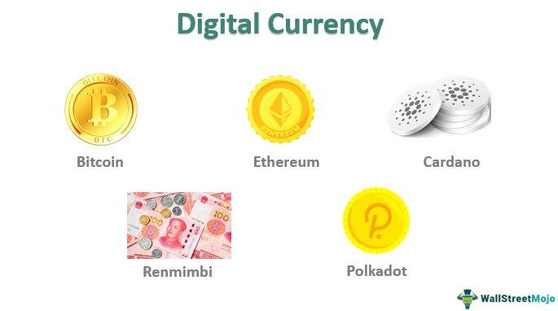

## Table of Contents

## What is digital currency?

Digital currency is money that exists only in electronic form. It is not physical like paper bills or coins. Instead, it is stored and used on computers or smartphones. People use digital currency to buy things online or to send money to others quickly and easily. One popular example of digital currency is Bitcoin.

There are different types of digital currency. Some are called cryptocurrencies, which use special math to keep them secure and private. Others are issued by governments or banks, like digital versions of regular money. Using digital currency can be convenient because you don't need to carry cash or visit a bank. However, it can also be risky because it is not always protected by the same rules as regular money.

## How does digital currency work?

Digital currency works by using the internet and special computer programs. When you use digital currency, you keep it in a digital wallet on your computer or phone. To send digital money to someone else, you use the internet to connect to their wallet. You type in how much you want to send and press send. The computer program then checks everything to make sure it's okay and moves the money from your wallet to theirs. It's a bit like sending an email, but instead of words, you're sending money.

Some digital currencies, like Bitcoin, use something called blockchain to keep track of all the money. Blockchain is like a big notebook that everyone can see, but no one can change what's already written in it. Every time someone sends digital currency, a new page is added to the notebook with details of the transaction. This helps keep the money safe and makes sure no one can spend the same money twice. Other digital currencies might be controlled by a bank or government, which keeps track of the money in a different way.

## What are the main types of digital currency?

There are two main types of digital currency: cryptocurrencies and central bank digital currencies (CBDCs). Cryptocurrencies are digital money that use special computer math to keep them safe and private. They are not controlled by any government or bank. Bitcoin is a famous example of a [cryptocurrency](/wiki/cryptocurrency). People can use cryptocurrencies to buy things online or send money to others without needing a bank.

Central bank digital currencies, or CBDCs, are different. They are digital versions of regular money that are made and controlled by a country's central bank. For example, if the U.S. made a digital dollar, that would be a CBDC. These digital currencies work a lot like regular money but are used on computers and phones. They are usually seen as safer than cryptocurrencies because they are backed by the government.

Both types of digital currency have their own ways of working and their own rules. Cryptocurrencies often use a system called blockchain to keep track of transactions, while CBDCs might use a different system controlled by the central bank. Each type has its own benefits and risks, depending on what you need the digital currency for.

## What are some examples of digital currencies?

Some examples of digital currencies are Bitcoin, Ethereum, and Litecoin. These are all cryptocurrencies, which means they are not controlled by any government or bank. Bitcoin is the most famous one. It was created in 2009 and people use it to buy things online or send money to others. Ethereum is another popular cryptocurrency that also lets people create special computer programs called smart contracts. Litecoin is similar to Bitcoin but it works a bit faster.

Other examples of digital currencies include central bank digital currencies, or CBDCs. These are digital versions of regular money made by a country's central bank. For example, China is working on a digital yuan, and Sweden is testing a digital krona. These digital currencies work like regular money but you use them on your computer or phone. They are usually seen as safer than cryptocurrencies because they are backed by the government. Each country might have its own CBDC if they decide to make one.

## How is digital currency different from traditional currency?

Digital currency is different from traditional currency because it only exists on computers and phones, not as physical money like coins and paper bills. Traditional currency is made by governments and banks, and you can touch it and [carry](/wiki/carry-trading) it in your wallet. Digital currency, on the other hand, is stored in a digital wallet and you use the internet to send it to others. This makes it easy to use online, but it can also be risky because it's not always protected by the same rules as regular money.

Another big difference is how digital currency is controlled. Traditional money is managed by banks and governments, which keep track of who has how much money and make sure everything is safe. Some digital currencies, like Bitcoin, are not controlled by any bank or government. They use special computer math and a system called blockchain to keep track of transactions and make sure the money is safe. Other digital currencies, like central bank digital currencies (CBDCs), are made and controlled by a country's central bank, similar to traditional money but in digital form.

## What are the benefits of using digital currency?

Using digital currency has many benefits. One big benefit is that it's easy to use online. You don't need to go to a bank or carry cash. You can send money to anyone, anywhere in the world, quickly and easily. This is great for buying things online or sending money to family and friends. Another benefit is that digital currency can be more private. Some types of digital currency, like Bitcoin, don't need you to give your name or other personal information. This can help keep your money safe and private.

Another benefit of digital currency is that it can be cheaper to use. When you send traditional money to another country, banks often charge a lot of fees. With digital currency, these fees can be much smaller or even free. This makes it easier and cheaper to move money around the world. Also, digital currency can be more secure. Some digital currencies use special computer math to keep them safe, which can make them harder for bad people to steal. This can give you peace of mind when you're using your money online.

## What are the risks and challenges associated with digital currency?

Using digital currency can be risky. One big risk is that it's not always protected by the same rules as regular money. If something goes wrong, like if someone steals your digital money, it can be hard to get it back. Also, the value of digital currency can go up and down a lot. This means you might lose money if you buy some and then its value goes down. Another challenge is that not everyone accepts digital currency. You might find it hard to use it to buy things in some places, especially if you're trying to use it in stores instead of online.

Another risk is that digital currency can be used for illegal things. Because it can be more private, some people use it to do things they shouldn't, like buying illegal drugs or other bad stuff. This can make governments and banks worried about digital currency. Also, using digital currency can be confusing. You need to learn how to keep your digital wallet safe and how to use the special computer programs that come with it. If you don't understand these things well, you might make mistakes that cost you money.

## How are digital currencies regulated around the world?

Digital currencies are regulated differently around the world. Some countries have strict rules about digital currencies, while others have more relaxed rules. For example, in the United States, digital currencies are treated as property and are subject to taxes. The government also keeps an eye on them to make sure they are not used for illegal things. In China, the government has banned some types of digital currency, like Bitcoin, but is working on its own digital currency called the digital yuan. Each country decides its own rules based on what they think is best for their people and economy.

In Europe, countries are working together to make rules about digital currencies. They want to make sure that digital currencies are safe and fair for everyone to use. Some countries, like Japan, have made digital currencies legal and have rules to protect people who use them. Other countries, like India, are still trying to figure out what to do about digital currencies and have not made up their minds yet. Overall, the rules about digital currencies are changing as more people start using them and governments learn more about them.

## What technologies underpin digital currencies?

Digital currencies rely on several key technologies to work. The most important one is called blockchain. Blockchain is like a big notebook that keeps track of all the money and makes sure no one can spend the same money twice. It's made up of lots of pages, called blocks, that are added one by one. Each block has details about the money being sent and received, and once a block is added, it can't be changed. This makes blockchain very safe and secure.

Another important technology is cryptography. This is special math that helps keep digital currencies private and safe. When you send digital money, cryptography makes sure that only the person you're sending it to can see the details. It also helps keep your digital wallet safe from bad people who might try to steal your money. Together, blockchain and cryptography make digital currencies work well and stay secure.

## How can one acquire and store digital currency?

To get digital currency, you can buy it with regular money. You can use special websites called cryptocurrency exchanges to do this. You sign up on the website, put in some regular money, and then use that money to buy digital currency like Bitcoin or Ethereum. Another way to get digital currency is by [earning](/wiki/earning-announcement) it. Some people get paid in digital currency for their work, or they can earn it by helping to keep the digital currency system running, like by solving special computer puzzles in a process called mining.

Once you have digital currency, you need to store it safely. You do this by using a digital wallet. A digital wallet is like a special app on your computer or phone that keeps your digital money safe. There are different types of digital wallets. Some are kept online, which makes them easy to use but a bit riskier. Others are kept offline, like on a special device that looks like a USB stick, which is safer but a bit harder to use. No matter which type you choose, it's important to keep your digital wallet secure by using strong passwords and keeping your computer or phone safe from bad people.

## What is the future outlook for digital currencies?

The future of digital currencies looks exciting and a bit unpredictable. More and more people are starting to use digital currencies like Bitcoin and Ethereum. This is making them more popular and easier to use. Some countries are even working on their own digital currencies, called central bank digital currencies (CBDCs). These could make digital money safer and more accepted everywhere. As technology gets better, digital currencies might become easier to use and more secure, which could make them a big part of how we use money in the future.

However, there are still challenges to overcome. The value of digital currencies can go up and down a lot, which makes some people worried about using them. Governments and banks are also trying to figure out how to make rules that keep digital currencies safe but still let people use them freely. If these challenges can be solved, digital currencies could change the way we think about and use money. But if not, they might stay a smaller part of the money world. Either way, digital currencies are likely to be important in the years to come.

## How do digital currencies impact global financial systems?

Digital currencies are changing the way money works around the world. They let people send money quickly and easily, without needing a bank. This can be a big help for people who don't have easy access to banks or who live in countries with strict money rules. Digital currencies can also make it cheaper to send money to other countries, which is good for people who work in one country but send money back home to their families. But, because digital currencies are not controlled by any one country, they can make it harder for governments to keep track of money and make sure it's being used in safe ways.

At the same time, digital currencies can also cause problems for global financial systems. Their value can go up and down a lot, which can make it hard for businesses and people to plan for the future. Some people worry that digital currencies could be used for illegal things because they can be more private than regular money. Governments and banks are trying to make rules to keep digital currencies safe and fair, but it's not easy. If they can find a good balance, digital currencies could help make the world's money systems better. But if not, they might cause more problems than they solve.

## References & Further Reading

[1]: Barontini, C., & Holden, H. (2019). ["Proceeding with caution – a survey on central bank digital currency."](https://www.bis.org/publ/bppdf/bispap101.htm) Bank for International Settlements. 

[2]: Kiff, J., Alwazir, J., Davidovic, S., Farias, A. M., Khan, A., Khiaonarong, T., Malaika, M., Monroe, H., Sugimoto, N., Tourpe, H., & Zhou, P. (2020). ["A Survey of Research on Retail Central Bank Digital Currency."](https://www.imf.org/en/Publications/WP/Issues/2020/06/26/A-Survey-of-Research-on-Retail-Central-Bank-Digital-Currency-49517) International Monetary Fund. 

[3]: Adrian, T., & Mancini-Griffoli, T. (2019). ["The Rise of Digital Money."](https://www.imf.org/en/Publications/fintech-notes/Issues/2019/07/12/The-Rise-of-Digital-Money-47097) International Monetary Fund. 

[4]: Narayanan, A., Bonneau, J., Felten, E., Miller, A., & Goldfeder, S. (2016). ["Bitcoin and Cryptocurrency Technologies: A Comprehensive Introduction."](https://press.princeton.edu/books/hardcover/9780691171692/bitcoin-and-cryptocurrency-technologies) Princeton University Press.

[5]: Lopez de Prado, M. (2018). ["Advances in Financial Machine Learning."](https://www.amazon.com/Advances-Financial-Machine-Learning-Marcos/dp/1119482089) Wiley. 

[6]: Chan, E. P. (2009). ["Quantitative Trading: How to Build Your Own Algorithmic Trading Business."](https://github.com/ftvision/quant_trading_echan_book) Wiley.