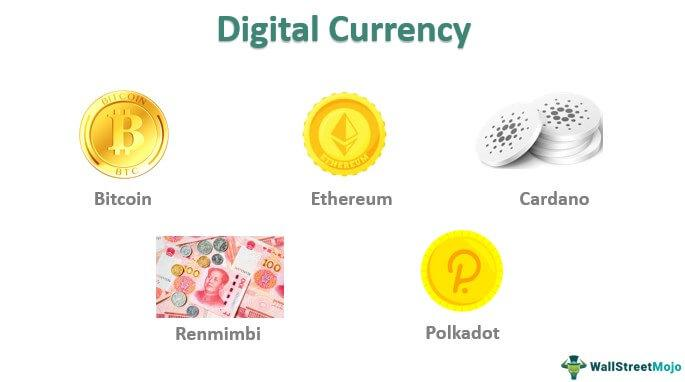

Digital currencies have emerged as a potent force in reshaping the global financial landscape, marking a notable shift from traditional financial mechanisms. These currencies offer a digital alternative to conventional fiat money, providing opportunities for innovation and efficiency in monetary transactions. The advent and proliferation of cryptocurrencies, such as Bitcoin and Ethereum, have exemplified the power of decentralized financial systems, where users can transact without intermediaries like banks. This rise has triggered a remarkable transformation, influencing how individuals and institutions perceive and interact with money.

Cryptocurrencies, a subset of digital currencies, are characterized by their decentralized nature, often underpinned by blockchain technology. This technology ensures transparency and security, using cryptographic techniques to record transactions across a network of computers. Digital currencies, beyond cryptocurrencies, include Central Bank Digital Currencies (CBDCs) and other virtual currencies, each carrying distinct implications for the future of money and finance.



Algorithmic trading complements the digital currency space by leveraging automated trading strategies that utilize data-driven algorithms to analyze market trends and execute trades. This method enhances speed and efficiency, allowing traders to capitalize on market fluctuations with minimal human intervention. The growing integration of artificial intelligence and machine learning optimizes these trading algorithms, predicting market movements with unprecedented accuracy.

This article explores the nuances of digital currencies and algorithmic trading, investigating their distinctive characteristics and potential future impacts. It aims to provide a comprehensive understanding of how these innovations are reshaping financial systems and what the future may hold for these technologies in a rapidly evolving digital world.

## Table of Contents

## Understanding Digital Currencies

Digital currencies, often referred to as electronic money or e-money, represent a form of currency that is entirely digital and does not have a physical counterpart like paper money or coins. These currencies leverage cryptographic techniques for secure transactions and control the creation of new units. Examples include cryptocurrencies such as Bitcoin and Ethereum and Central Bank Digital Currencies (CBDCs), which are government-backed digital versions of traditional currencies.

Key attributes of digital currencies include decentralization, security, and borderless nature. Most digital currencies operate on a decentralized network facilitated by blockchain technology, which serves as a distributed ledger that records all transactions. This decentralization reduces the need for traditional financial intermediaries such as banks and enables peer-to-peer transactions. Security is enhanced through cryptography, which provides a high level of protection against fraud and unauthorized access. The borderless nature of digital currencies allows for instantaneous and low-cost transactions across the globe.

Traditional fiat currencies are physical currencies that are backed by a government authority, such as the US dollar or the euro. They are issued via central banks and are used for everyday transactions, savings, and investments. The primary differences between digital currencies and fiat currencies lie in their form, regulatory oversight, and transactional framework. Fiat currencies are subject to strict governmental regulations and central bank policies, whereas digital currencies are often less regulated and operate on blockchain technology that provides transparency and immutability of transactions. Additionally, digital currencies can be traded globally without the need for currency conversion, unlike fiat currencies which require foreign exchange processing for cross-border transactions.

Digital wallets play an essential role in digital currency transactions. These wallets are software applications or online services that store the encrypted keys used for accessing digital currencies. They enable users to send, receive, and manage their digital currency holdings securely. Digital wallets can be categorized into hot wallets, which are connected to the internet and provide ease of access, and cold wallets, which offer enhanced security by being offline.

An example of a digital wallet can be illustrated using Python. Here's a basic outline of a function to generate a simple digital wallet address using the hashlib library:

```python
import hashlib

def generate_wallet_address(user_input):
    # Simulate a wallet address generation using SHA-256 hash
    address = hashlib.sha256(user_input.encode()).hexdigest()
    return address

# Example usage
user_input = "user_example_123"
wallet_address = generate_wallet_address(user_input)
print(f"Generated Wallet Address: {wallet_address}")
```

This code snippet demonstrates a simplified computation of a digital wallet address using a hash function, showcasing the cryptographic underpinnings crucial to digital currency security.

## Characteristics of Cryptocurrency

Cryptocurrencies are digital assets that operate on decentralized networks, primarily utilizing blockchain technology to ensure security, transparency, and immutability. Unlike traditional fiat currencies, which are typically issued and regulated by central authorities, cryptocurrencies function within a peer-to-peer network where transactions are verified by network participants, known as nodes, rather than a single entity.

One of the most defining characteristics of cryptocurrencies is their decentralization. Operating on a blockchain—a distributed ledger that records all transactions across a network—ensures that no single point of control or failure exists. This decentralized approach enhances resilience against manipulation and fraud, as altering any transaction would require consensus from the majority of the network.

Blockchain technology serves as the backbone of most cryptocurrencies, providing a secure and transparent mechanism for recording transactions. Each block in the blockchain contains a cryptographic hash of the previous block, a timestamp, and transaction data. This chaining of blocks ensures that data, once recorded, cannot be altered retroactively, bolstering the transparency and reliability of the system.

The transparency of blockchain technology is fundamental to building trust among users. Every transaction that has ever occurred in the network is visible and auditable by anyone, although the identities of the parties involved remain anonymous unless linked to real-world identities. This aspect of transparency is crucial for ensuring accountability and detecting fraudulent activities.

Cryptocurrencies are also defined by their cryptographic security features. These include public and private keys that enable secure ownership and transfer of digital assets. The use of cryptographic algorithms provides robust protection against unauthorized access and double-spending, a potential issue where a digital currency is spent more than once.

Another distinguishing feature of cryptocurrencies is their potential for programmability. Some cryptocurrencies, like Ethereum, offer smart contracts—self-executing contracts with terms directly written into code. This capability enables complex transactions and automations that are triggered upon predetermined conditions, fostering a wide range of decentralized applications beyond simple value transfers.

In summary, the characteristics that differentiate cryptocurrencies from other digital forms include their decentralized nature, the employment of blockchain technology for security and transparency, and their cryptographic underpinnings. These features collectively contribute to the unique position of cryptocurrencies as transformative assets within the global financial system.

## Types of Digital Currencies

Digital currencies encompass a broad range of financial instruments that have revolutionized the way financial transactions are conducted. Among the most prominent types of digital currencies are cryptocurrencies, virtual currencies, and Central Bank Digital Currencies (CBDCs), each with distinct attributes and applications.

### Cryptocurrencies

Cryptocurrencies, such as Bitcoin and Ethereum, are decentralized digital assets that utilize cryptographic techniques for securing transactions. Bitcoin, introduced in 2009, was the first [cryptocurrency](/wiki/cryptocurrency) and remains the most recognized. It operates on a peer-to-peer network without the need for a central authority, relying on blockchain technology to maintain a public ledger of transactions. This system ensures transparency and reduces the risk of fraudulent activities.

Ethereum, another significant player in the cryptocurrency landscape, distinguishes itself with its smart contract functionality. Smart contracts are self-executing contracts with terms directly written into code, which run on the Ethereum blockchain, enabling a range of decentralized applications (DApps).

### Virtual Currencies

Virtual currencies, though often used interchangeably with cryptocurrencies, are more broadly defined as digital representations of value that are not issued by any central bank or public authority. These currencies are primarily used within specific environments or platforms, such as online games or social networks. For example, the virtual currency used in a massive multiplayer online game can be earned and spent within the game but typically lacks utility outside its designated network.

### Central Bank Digital Currencies (CBDCs)

Central Bank Digital Currencies (CBDCs) represent the efforts by central banks to digitize their national currencies. Unlike cryptocurrencies, CBDCs are centralized and issued by a nation's monetary authority. The digital yuan, launched by the People's Bank of China, is a notable example of a CBDC currently in development or trial phase. CBDCs aim to combine the efficiency and innovation of digital payments with the traditional trust and stability associated with central banks.

CBDCs have the potential to overhaul the existing financial infrastructure by offering faster transaction times and reduced costs. They also present opportunities for enhancing financial inclusion by providing direct access to digital payment systems for populations with limited access to traditional banking. Additionally, as CBDCs can provide real-time data on economic transactions, they can aid in more effective policy implementation and economic management.

In summary, digital currencies are a diverse group of financial instruments that include cryptocurrencies, virtual currencies, and CBDCs. Each type has unique characteristics that influence their utility and potential impact on global financial systems.

## The Role of Algorithmic Trading in Digital Currencies

Algorithmic trading, a method that employs computer programs to automate trading strategies, has gained prominence in the digital currency market. One of its primary advantages is the ability to execute trades at speeds and frequencies that are unattainable for human traders. This superior speed is beneficial in the volatile cryptocurrency market, where rapid price changes can significantly influence trading outcomes. Algorithmic trading ensures trades are executed with precision, reducing the potential for human error or emotional decision-making.

In the context of digital currencies, [algorithmic trading](/wiki/algorithmic-trading) leverages advanced data analytics for informed decision-making. Algorithms analyze large datasets to identify patterns, optimize trade execution, and implement strategies that maximize returns. Data sources may include historical price data, trading volumes, and market signals, which are processed to identify profitable opportunities. This systematic approach allows traders to back-test strategies against historical data, refining them for current market conditions.

Artificial intelligence (AI) and [machine learning](/wiki/machine-learning) are increasingly integral to optimizing algorithmic trading strategies. These technologies enable the development of sophisticated models that learn from market data and adapt to new patterns. Machine learning algorithms can improve prediction accuracy by continuously updating themselves as new data becomes available. For instance, neural networks and [deep learning](/wiki/deep-learning) models are employed to recognize complex patterns and make informed predictions about market movements.

Python, a popular programming language in the field of algorithmic trading, facilitates these operations through libraries such as NumPy for numerical computations, pandas for data manipulation, and scikit-learn for machine learning. A basic example of a trading strategy in Python might involve calculating moving averages to generate buy or sell signals. Here is a simplified version of such a strategy:

```python
import pandas as pd

def moving_average_strategy(df, short_window=40, long_window=100):
    signals = pd.DataFrame(index=df.index)
    signals['price'] = df['price']
    signals['short_mavg'] = df['price'].rolling(window=short_window, min_periods=1).mean()
    signals['long_mavg'] = df['price'].rolling(window=long_window, min_periods=1).mean()
    signals['signal'] = 0.0
    signals['signal'][short_window:] = np.where(signals['short_mavg'][short_window:] > signals['long_mavg'][short_window:], 1.0, 0.0)   
    signals['positions'] = signals['signal'].diff()
    return signals

# Example usage
# df is a DataFrame containing the column 'price'
signals = moving_average_strategy(df)
```

This trading strategy generates signals based on the crossovers of short-term and long-term moving averages, initiating buy signals when the short-term average exceeds the long-term average, and sell signals in the reverse scenario.

As AI and machine learning evolve, they continue to refine and enhance algorithmic trading strategies, enabling traders to navigate the complex and dynamic landscape of digital currencies efficiently. The integration of these technologies promises increased accuracy, minimized risk, and optimized returns, positioning algorithmic trading as an indispensable tool in the digital currency market.

## The Future of Digital Currencies

The future of digital currencies holds significant promise, driven by the potential growth of cryptocurrencies and Central Bank Digital Currencies (CBDCs). Cryptocurrencies, such as Bitcoin and Ethereum, have demonstrated substantial growth since their inception, capturing the attention of investors, technologists, and governments worldwide. As these digital assets gain broader acceptance, their role in the financial system is likely to expand, enhancing financial inclusion by providing access to banking services for unbanked populations and streamlining cross-border transactions with reduced fees and processing times.

Central Bank Digital Currencies (CBDCs) represent another evolution in the digital currency landscape. These are digital tokens issued by central banks, offering a government-backed alternative to private cryptocurrencies. The adoption of CBDCs could redefine the monetary system by providing secure and efficient payment solutions, improving monetary policy implementation, and minimizing illicit activities through traceable transactions. The People's Bank of China, for instance, has made significant strides with its digital yuan, influencing other central banks to explore similar initiatives.

Technological advancements are pivotal in shaping the future of digital currencies. The rise of blockchain technology has laid the groundwork for secure, transparent, and decentralized digital transactions. Innovations in blockchain, such as advancements in scalability solutions (e.g., sharding and layer-two protocols like the Lightning Network), are essential in addressing the limitations of current systems, enabling faster and more efficient processing of transactions. Moreover, the integration of smart contracts on platforms like Ethereum has automated many financial processes, reducing the need for intermediaries and further enhancing efficiency.

Despite the promising outlook, the future of digital currencies is also shaped by various obstacles and regulatory challenges. One of the main concerns is the high [volatility](/wiki/volatility-trading-strategies) associated with cryptocurrencies, which may deter their use as stable stores of value or units of account. Moreover, the regulatory landscape remains fragmented, with governments around the world adopting different approaches to digital currency oversight. Ensuring consumer protection, maintaining financial stability, and preventing the misuse of digital currencies for illicit activities are critical regulatory objectives that need to be balanced with innovation.

Concerns over energy consumption and environmental impact also present challenges, particularly for cryptocurrencies like Bitcoin that rely on energy-intensive proof-of-work consensus mechanisms. Solutions such as transitioning to proof-of-stake protocols or adopting more energy-efficient technologies are being explored to mitigate these concerns.

In summary, the future of digital currencies is promising, underpinned by significant growth potential in both cryptocurrencies and CBDCs. Technological advancements continue to drive this evolution, while regulatory and environmental challenges need to be carefully managed to ensure these digital assets can be integrated effectively and responsibly into the global financial system.

## Algorithmic Trading: Innovations and Developments

Recent advancements in algorithmic trading, particularly those leveraging deep [reinforcement learning](/wiki/reinforcement-learning), have significantly transformed strategies in trading digital currencies such as Bitcoin. One notable innovation is the application of deep Q-networks (DQNs) in formulating and executing Bitcoin trading strategies. A DQN combines reinforcement learning with deep neural networks to optimize decision-making processes. It learns a policy that maximizes cumulative rewards by approximating the optimal action-value function, commonly referred to as Q-function. This allows traders to evaluate the potential profitability of actions within the complex and volatile cryptocurrency markets.

In a typical DQN implementation, the trading environment, encompassing historical price data and market indicators, serves as input to the deep [neural network](/wiki/neural-network). The network outputs Q-values for each possible trading action, such as buy, sell, or hold, guiding the algorithm to actions yielding the highest expected returns. This method provides a robust framework for developing adaptive trading strategies that adjust to shifting market conditions.

The incorporation of sentiment analysis further enriches algorithmic trading strategies by quantifying public perception and market sentiment from unstructured data sources such as news articles, social media posts, and financial reports. By analyzing sentiment scores, traders can predict potential market movements and adjust strategies accordingly. For example, a surge in positive sentiment around a particular cryptocurrency may suggest bullish market conditions, prompting buy actions within the algorithmic strategy.

Python code snippet for integrating sentiment analysis might look like the following:

```python
from textblob import TextBlob
import pandas as pd

# Sample data: Replace with actual market sentiment data
data = {'texts': ["Bitcoin hits new high!", "Cryptocurrency faces regulation threats."]}

# Convert to DataFrame
df = pd.DataFrame(data)

# Function to calculate sentiment score
def calculate_sentiment(text):
    analysis = TextBlob(text)
    return analysis.sentiment.polarity

# Apply sentiment calculation
df['sentiment_score'] = df['texts'].apply(calculate_sentiment)

print(df)
```

A practical application of these innovative techniques is evident in the case studies of algorithmic trading implementations within the cryptocurrency sector. Firms utilizing DQNs have managed to develop sophisticated trading algorithms that outperform traditional models by adapting strategies based on observed market dynamics and sentiment shifts. These algorithms are particularly successful in volatile environments where rapid decision-making offers a competitive edge.

Moreover, some trading systems incorporate both DQNs and sentiment analysis, creating hybrid models that leverage multiple data dimensions. This dual approach not only enhances predictive accuracy but also mitigates risk by incorporating behavioral economic factors that influence market behavior.

In conclusion, as algorithmic trading technologies evolve, incorporating advanced machine learning techniques and sentiment analysis proves essential for optimizing digital currency trading strategies. These innovations continue to redefine competitive dynamics in financial markets, promising increased profitability and resilience to rapid market changes.

## Pros and Cons of Digital Currencies

Digital currencies have brought numerous advantages to the financial sector, chiefly enhancing efficiency and reducing transactional costs. Unlike traditional fiat currencies which require intermediaries such as banks for transfer, digital currencies enable direct peer-to-peer transactions. This significantly lowers transaction fees and speeds up the process, eliminating delays associated with financial clearinghouses. Additionally, digital currencies facilitate cross-border transactions without the need for currency conversion, providing a seamless global payment solution.

However, digital currencies are not without challenges. One major concern is their inherent volatility. The prices of digital currencies can fluctuate wildly within short periods, posing risks for both short-term traders and long-term investors. This volatility is often driven by market speculation, regulatory news, and technological developments. For investors and users, this means that while there is potential for high returns, there is also a significant risk of losses.

Another critical issue is security. Digital currencies are susceptible to hacking, fraud, and other cyber threats. While the underlying blockchain technology offers a secure ledger system, individual digital wallets and exchanges are frequent targets for cybercriminals. Users must therefore adopt best practices for securing their assets, such as using hardware wallets and implementing strong, multi-[factor](/wiki/factor-investing) authentication.

Digital currencies also have implications for economic policy. Central banks traditionally use monetary policies to control the money supply and influence national economies. With the rise of decentralized digital currencies, such control diminishes, potentially complicating efforts in economic stabilization. For instance, if a significant portion of the economy adopts cryptocurrencies for daily transactions, it reduces the effectiveness of traditional monetary policy levers like [interest rate](/wiki/interest-rate-trading-strategies) adjustments.

In summary, while digital currencies offer better efficiency and cost-effectiveness, they also bring challenges in volatility and security. Moreover, their adoption influences traditional economic policies, forcing policymakers to reconsider their strategies in a digital currency-dominated future.

## Conclusion

The growth trajectory of digital currencies and the advancements in algorithmic trading underscore a transformative era in global finance. Digital currencies, particularly cryptocurrencies like Bitcoin and Ethereum, have introduced an unprecedented level of democratization in financial transactions. Their decentralized nature, coupled with the security afforded by blockchain technology, offers a potential alternative to traditional fiat currencies. Furthermore, the introduction of Central Bank Digital Currencies (CBDCs) indicates a recognition by governmental entities of the benefits brought by digital currencies, such as increased efficiency and transparency in monetary systems.

Algorithmic trading, leveraging data analytics and machine learning, offers substantial promise for optimizing the digital currency market. With automated decision processes, algorithmic trading can efficiently handle the volatility that digital currencies often exhibit. Innovations in deep learning, such as deep Q-networks, and the use of sentiment analysis are setting new benchmarks in predictive market behaviors, thus enhancing the precision of trading strategies.

As digital currencies and algorithmic trading continue to mature, the future landscape of financial transactions will likely be characterized by increased accessibility, efficiency, and transparency. However, this potential is not without challenges. Regulatory frameworks must evolve to address security concerns and volatility, ensuring the safeguarding of assets and the prevention of fraud.

The continued innovation in this space is essential. Encouraging responsible adoption involves not only enhancing technological capabilities but also fostering an environment that supports secure and equitable financial practices. With a collaborative approach among technologists, policymakers, and the financial community, digital currencies and algorithmic trading can contribute significantly to a more resilient and inclusive financial future.

## References & Further Reading

[1]: Narayanan, A., Bonneau, J., Felten, E., Miller, A., & Goldfeder, S. (2016). ["Bitcoin and Cryptocurrency Technologies: A Comprehensive Introduction."](https://press.princeton.edu/books/hardcover/9780691171692/bitcoin-and-cryptocurrency-technologies) Princeton University Press.

[2]: Gomber, P., Koch, J.-A., & Siering, M. (2017). ["Digital Finance and FinTech: Current Research and Future Research Directions."](https://link.springer.com/content/pdf/10.1007/s11573-017-0852-x.pdf) Journal of Business Economics, 87(5), 537–580.

[3]: Biais, B., Bisière, C., Bouvard, M., & Casamatta, C. (2019). ["The Blockchain Folk Theorem."](https://academic.oup.com/rfs/article/32/5/1662/5427771) The Review of Financial Studies, 32(5), 1662–1715.

[4]: Peters, G. W., & Panayi, E. (2016). ["Understanding Modern Banking Ledgers through Blockchain Technologies: Future of Transaction Processing and Smart Contracts on the Internet of Money."](https://link.springer.com/content/pdf/10.1007/978-3-319-42448-4_13.pdf) In Banking Beyond Banks and Money (pp. 239-278). Springer, Cham.

[5]: Easley, D., O'Hara, M., & Basu, S. (2019). ["From Mining to Markets: The Evolution of Bitcoin Transaction Fees."](https://www.sciencedirect.com/science/article/pii/S0304405X19300583) Journal of Financial Economics, 32(11), 3928-3977.