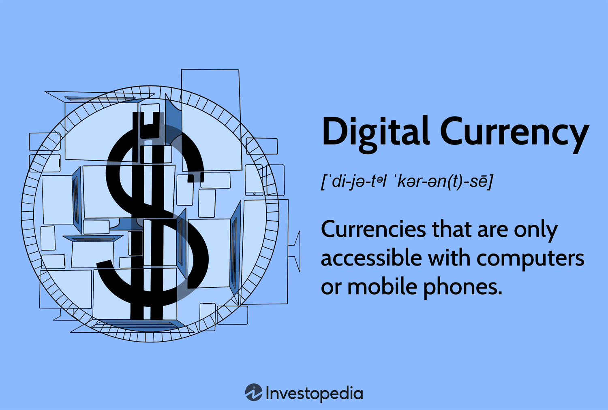

## Table of Contents

## What is a digital currency?

A digital currency is money that exists only in electronic form. It is not like the physical coins and banknotes you can touch. Instead, digital currency is stored and used through computers, smartphones, and the internet. People use it to buy things, send money to others, and do other financial activities without needing to handle cash.

One common type of digital currency is called cryptocurrency. Bitcoin is a popular example of a cryptocurrency. These currencies use special technology called blockchain to keep track of who owns what. This makes them secure and hard to fake. People can use cryptocurrencies to buy things online, invest, or trade them like stocks.

Digital currencies can be used by anyone with internet access, making them very convenient. However, they can also be risky because their value can change a lot, and they are not controlled by governments or banks like regular money. This means users need to be careful and understand how they work before using them.

## How does digital currency differ from traditional currency?

Digital currency is different from traditional currency because it only exists online. Traditional currency, like dollars or euros, is physical money that you can hold, like coins and paper bills. You can also have traditional currency in a bank account, but it's still connected to physical money. Digital currency, on the other hand, doesn't have a physical form at all. It's stored in digital wallets on computers or smartphones and is used through the internet.

Another big difference is how they are controlled. Traditional currency is managed by governments and banks. They decide how much money is printed and they set rules about how it can be used. Digital currencies, especially cryptocurrencies like Bitcoin, are not controlled by any government or bank. They use special technology called blockchain to keep track of transactions and make sure they are secure. This means digital currencies can be more private and harder for governments to control, but it also makes them riskier because their value can change a lot and they are not as protected as traditional money.

## What are the main types of digital currencies?

The main types of digital currencies are cryptocurrencies, central bank digital currencies (CBDCs), and e-wallets or mobile payment systems. Cryptocurrencies, like Bitcoin and Ethereum, are the most well-known type of digital currency. They use a special technology called blockchain to keep transactions safe and secure. People can use them to buy things online, invest, or trade them like stocks. Cryptocurrencies are not controlled by any government or bank, which makes them very different from traditional money.

Central bank digital currencies, or CBDCs, are another type of digital currency. These are created and controlled by a country's central bank, like the Federal Reserve in the United States. CBDCs are like digital versions of a country's regular money, but they are used online. They are meant to be safer and easier to use than physical money. Some countries are already testing CBDCs, but they are not as common as cryptocurrencies yet.

The third type of digital currency includes e-wallets and mobile payment systems. These are not as different from traditional money as cryptocurrencies or CBDCs. E-wallets and mobile payment systems, like PayPal or Apple Pay, let you store money digitally and use it to pay for things online or in stores. They are connected to your bank account and are controlled by companies, not governments. They are very convenient but are more like digital versions of traditional money.

## What is a cryptocurrency and how does it work?

A [cryptocurrency](/wiki/cryptocurrency) is a type of digital currency that uses special technology called blockchain to keep track of who owns what. It's different from regular money because it doesn't have physical coins or bills. Instead, it's all stored on computers and smartphones. People use cryptocurrencies like Bitcoin or Ethereum to buy things online, invest, or trade them like stocks. They are not controlled by any government or bank, which makes them very private but also riskier.

Cryptocurrencies work by using blockchain, which is like a digital record book that everyone can see but no one can change. When someone sends cryptocurrency to another person, the transaction is recorded on the blockchain. This makes it very hard to fake or steal. To use cryptocurrencies, people need a digital wallet, which is like a special app on their phone or computer. They can send and receive money using this wallet. The value of cryptocurrencies can change a lot, so people need to be careful when using them.

## What are some examples of cryptocurrencies?

Some examples of cryptocurrencies are Bitcoin, Ethereum, and Litecoin. Bitcoin is the most famous one. It was created in 2009 by someone using the name Satoshi Nakamoto. People use Bitcoin to buy things online, invest, or trade it like a stock. Ethereum is another popular cryptocurrency. It was created in 2015 by Vitalik Buterin. Ethereum is not just a currency; it also has a special technology called smart contracts that can do more than just send money. Litecoin is similar to Bitcoin but it works faster and is easier to use.

There are many other cryptocurrencies too. For example, Ripple is used by banks to move money quickly around the world. Cardano is another one that focuses on being safe and working well with other systems. Dogecoin started as a joke but became popular because people like it. Each of these cryptocurrencies has its own special features and ways of working, but they all use blockchain technology to keep track of who owns what.

## What are central bank digital currencies (CBDCs) and how do they function?

Central bank digital currencies, or CBDCs, are digital versions of a country's regular money. They are created and controlled by a country's central bank, like the Federal Reserve in the United States. CBDCs are meant to be safer and easier to use than physical money. They are like the money you have in your bank account, but you can use them online to buy things or send money to others. Some countries are already testing CBDCs, but they are not as common as other types of digital money yet.

CBDCs work by being stored in digital wallets, which are like special apps on your phone or computer. When you use a CBDC to buy something, the transaction is recorded by the central bank. This makes it very safe and hard to fake. Unlike cryptocurrencies, CBDCs are controlled by the government, so they are more like the money you are used to. They can help make paying for things easier and faster, and they can also help the government keep track of how money is being used in the economy.

## What are stablecoins and what makes them different from other cryptocurrencies?

Stablecoins are a type of cryptocurrency that tries to keep its value steady. They do this by being tied to something else, like the US dollar, gold, or another stable asset. This makes them different from other cryptocurrencies like Bitcoin, which can go up and down a lot in value. People like stablecoins because they are safer and easier to use for everyday things, like buying things online or sending money to others.

The main difference between stablecoins and other cryptocurrencies is their stability. Other cryptocurrencies can change a lot in value, which can be risky. Stablecoins are designed to stay the same, which makes them more like regular money. They use special ways to keep their value steady, like holding reserves of the asset they are tied to or using smart contracts to control how much of the stablecoin is in use. This makes them a good choice for people who want the benefits of digital money but don't want the big changes in value that can happen with other cryptocurrencies.

## How do utility tokens work and what are their uses?

Utility tokens are a type of cryptocurrency that you can use to get something specific, like a service or a product. They are different from other cryptocurrencies because they are not just for buying and selling. Instead, they are like tickets or vouchers that you can use within a certain system or platform. For example, if you have a utility token for a gaming platform, you can use it to buy in-game items or to play special levels.

People use utility tokens for many different things. In some cases, they can be used to pay for services on a platform, like cloud storage or data processing. In other cases, they might be used to vote on changes to the platform or to reward people for helping to keep the system running. Because utility tokens have a specific use, they can be very useful for people who want to use a particular service or platform. But, like all cryptocurrencies, they can also be risky because their value can change and they are not controlled by governments or banks.

## What are the key characteristics that define a digital currency?

A digital currency is money that only exists online and can't be touched like coins or paper bills. It is stored on computers or smartphones and used through the internet. People use digital currencies to buy things, send money to others, and do other financial activities without needing physical cash. Unlike traditional money, which is controlled by governments and banks, digital currencies can be more private and less regulated. This makes them convenient for many people, but it also means they can be riskier because their value can change a lot.

There are different types of digital currencies, each with its own features. Cryptocurrencies like Bitcoin use blockchain technology to keep transactions safe and secure. They are not controlled by any government or bank, which makes them very different from regular money. Central bank digital currencies (CBDCs) are created and managed by a country's central bank and are meant to be safer and easier to use than physical money. Stablecoins try to keep their value steady by being tied to something like the US dollar or gold. Utility tokens are used to get specific services or products within a certain platform. Each type of digital currency has its own uses and benefits, but they all share the key characteristic of existing only in digital form.

## What are the security features commonly found in digital currencies?

Digital currencies use different ways to keep them safe and secure. One big way is called blockchain technology. It's like a special digital record book that keeps track of all the transactions. Once something is written in the blockchain, it's very hard to change or fake. This makes digital currencies like Bitcoin very secure. Also, digital currencies use special codes called cryptography to protect the information. This means that only the person who owns the digital currency can use it, making it hard for others to steal.

Another way digital currencies stay safe is through digital wallets. These are like special apps on your phone or computer where you keep your digital money. They have passwords and other security measures to make sure no one else can get into your wallet. Some digital currencies also use something called multi-signature, which means more than one person needs to agree before money can be moved. This adds an extra layer of safety. All these features work together to keep digital currencies secure, but it's still important for people to be careful and protect their own information.

## How do digital currencies impact financial privacy and regulation?

Digital currencies can make financial privacy better because they don't need banks or governments to work. When you use a digital currency like Bitcoin, your transactions are recorded on a blockchain, but your personal information is not. This means you can send and receive money without anyone knowing who you are. This can be good for people who want to keep their financial activities private. But it can also be used for bad things, like hiding money from the law. So, while digital currencies can give you more privacy, they also make it harder for governments to stop illegal activities.

On the other hand, digital currencies can make regulation harder for governments. Traditional money is controlled by banks and governments, who can watch and control how it's used. But digital currencies are not controlled by anyone, so it's harder for governments to make rules about them. Some countries have started making laws about digital currencies to try and control them better. But it's still a challenge because digital currencies can be used all over the world, and different countries have different rules. This means that while digital currencies can be good for privacy, they can also make it harder for governments to keep the financial system safe and fair.

## What are the future trends and potential developments in digital currencies?

In the future, digital currencies might become more popular and easier to use. More people and businesses might start using them to buy things and send money. Countries might also start using central bank digital currencies (CBDCs) more, which are like digital versions of their regular money. These CBDCs could make paying for things faster and safer. Also, new technology might make digital currencies even more secure and easier to use. For example, better ways to keep transactions private and safe could be developed, making people feel more comfortable using digital currencies.

Another big trend could be the growth of stablecoins, which are digital currencies that try to keep their value steady. More people might use stablecoins because they are less risky than other cryptocurrencies like Bitcoin, which can change a lot in value. Stablecoins could be used more for everyday things, like buying groceries or paying bills. Also, new types of digital currencies, like utility tokens, might become more common. These tokens can be used to get specific services or products, and they could make it easier for people to use different platforms and services online.

## References & Further Reading

[1]: Narayanan, A., Bonneau, J., Felten, E., Miller, A., & Goldfeder, S. (2016). ["Bitcoin and Cryptocurrency Technologies: A Comprehensive Introduction."](https://press.princeton.edu/books/hardcover/9780691171692/bitcoin-and-cryptocurrency-technologies) Princeton University Press.

[2]: Gomber, P., Koch, J.-A., & Siering, M. (2017). ["Digital Finance and FinTech: Current Research and Future Research Directions."](https://link.springer.com/content/pdf/10.1007/s11573-017-0852-x.pdf) Journal of Business Economics, 87(5), 537–580.

[3]: Biais, B., Bisière, C., Bouvard, M., & Casamatta, C. (2019). ["The Blockchain Folk Theorem."](https://academic.oup.com/rfs/article/32/5/1662/5427771) The Review of Financial Studies, 32(5), 1662–1715.

[4]: Peters, G. W., & Panayi, E. (2016). ["Understanding Modern Banking Ledgers through Blockchain Technologies: Future of Transaction Processing and Smart Contracts on the Internet of Money."](https://link.springer.com/content/pdf/10.1007/978-3-319-42448-4_13.pdf) In Banking Beyond Banks and Money (pp. 239-278). Springer, Cham.

[5]: Easley, D., O'Hara, M., & Basu, S. (2019). ["From Mining to Markets: The Evolution of Bitcoin Transaction Fees."](https://www.sciencedirect.com/science/article/pii/S0304405X19300583) Journal of Financial Economics, 32(11), 3928-3977.