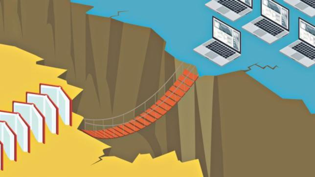

## Table of Contents

## What is the digital divide?

The digital divide is the gap between people who have easy access to the internet and technology, and those who don't. This gap can be seen in different parts of the world, between rich and poor countries, or even within the same country. It's not just about having a computer or a phone; it's also about being able to use them well and having good internet.

This divide matters because the internet is important for many things like learning, working, and staying connected with others. If some people can't use the internet easily, they might miss out on important opportunities. Governments and organizations are trying to close this gap by making internet and technology more available and easier to use for everyone.

## How does the digital divide affect different communities?

The digital divide impacts different communities in many ways. In places where people don't have good internet or computers, it's hard for them to learn new things online, find jobs, or even get medical help through the internet. For example, students in these areas might not be able to do their homework or join online classes, which puts them behind others who have better access to technology.

Also, older people or those who don't speak the main language might find it hard to use the internet. They might not know how to use computers or smartphones, or the websites might not be in a language they understand. This makes it tough for them to stay connected with family, friends, or to get important information.

In some rural areas, the digital divide can make life even harder. Farms and small businesses might not be able to use new technology to help them grow or sell their products online. This can slow down their progress and make it harder for them to compete with others who have better internet and technology.

## What are the main causes of the digital divide?

One big reason for the digital divide is money. Not everyone can afford computers, smartphones, or good internet service. In poor areas, people might have to choose between buying food or paying for internet, so they often go without. This makes it hard for them to keep up with the rest of the world, which is using more and more technology every day.

Another reason is where people live. In big cities, there are usually lots of choices for internet and technology. But in the countryside, it can be hard to get good internet because the companies that provide it might not want to spend the money to set it up in places where fewer people live. This leaves rural areas behind, even if the people there could afford the technology.

Also, education and skills play a big role. If someone doesn't know how to use a computer or the internet, it doesn't matter if they have it. Older people, or those who didn't go to school for long, might find technology confusing. And if websites and apps are only in one language, people who speak other languages might feel left out. This lack of know-how and language support adds to the digital divide.

## What are some basic initiatives to bridge the digital divide?

One way to help close the digital divide is by making technology cheaper and easier to get. Governments and companies can give out free or low-cost computers and internet to people who need them. They can also build more internet towers in rural areas so more people can get online. By doing this, more people can start using the internet and not miss out on important things like school and work.

Another important step is teaching people how to use technology. Schools and community centers can offer classes that show people how to use computers and the internet. These classes can be in different languages so more people can learn. Also, making websites and apps easier to use and available in more languages can help people who are new to technology feel more comfortable using it.

Lastly, working together is key. Governments, businesses, and community groups need to join forces to make sure everyone can use the internet. They can share resources and ideas to help more people get online. By working as a team, we can make the internet a place for everyone, no matter where they live or how much money they have.

## How do governments contribute to reducing the digital divide?

Governments play a big role in helping to close the digital divide. They can do this by making sure that more people have access to the internet and technology. One way they do this is by building more internet towers in rural areas where it's hard to get online. They can also give out free or low-cost computers and internet to people who can't afford them. By doing these things, governments make it easier for everyone to use the internet and not miss out on important opportunities.

Another way governments help is by making sure people know how to use technology. They can set up classes in schools and community centers to teach people about computers and the internet. These classes can be in different languages so everyone can learn, no matter what language they speak. Governments can also make rules that say websites and apps need to be easy to use and available in many languages. This helps people who are new to technology feel more comfortable using it.

Working together is also important. Governments can team up with businesses and community groups to share ideas and resources. This teamwork can help more people get online and use technology. By working together, governments can make sure that the internet is a place for everyone, no matter where they live or how much money they have.

## What role do non-profit organizations play in addressing the digital divide?

Non-profit organizations play a big role in helping to close the digital divide. They often work in areas where people don't have much money or good internet. These groups can give out free computers and help pay for internet so more people can get online. They also set up places in the community where people can come and use the internet for free. By doing this, non-profits make sure that even people who can't afford technology can still use it and learn new things.

Non-profits also focus on teaching people how to use technology. They run classes and workshops to show people how to use computers and the internet. These classes are often in different languages so everyone can understand. This is important because knowing how to use technology is just as important as having it. Non-profits help people learn these skills so they can find jobs, do schoolwork, and stay connected with others.

Working together is another way non-profits help. They often team up with governments, schools, and businesses to share ideas and resources. This teamwork helps them reach more people and make a bigger difference. By working together, non-profits make sure that everyone, no matter where they live or how much money they have, can use the internet and technology.

## How have technological advancements helped in narrowing the digital divide?

Technological advancements have helped a lot in making the digital divide smaller. One way is by making devices like smartphones and tablets cheaper. This means more people can afford to buy them and get online. Also, new technology like satellite internet can reach places where it was hard to get internet before. This helps people in rural areas get connected and use the internet for school, work, and staying in touch with others.

Another way technology has helped is by making things easier to use. New apps and websites are designed to be simple, so even people who are new to technology can use them. There are also more tools now that can translate websites and apps into different languages. This makes it easier for people who speak different languages to use the internet and learn new things. By making technology cheaper and easier to use, more people can join the digital world and not miss out on important opportunities.

## What are the challenges faced in implementing digital inclusion programs?

One big challenge in implementing digital inclusion programs is money. It costs a lot to give out free computers and internet, and to build more internet towers in rural areas. Governments and non-profits need to find enough money to pay for these things. If they can't, the programs might not reach as many people as they need to. Also, some people might not trust these programs or might not know about them, so they don't sign up even if they could use the help.

Another challenge is teaching people how to use technology. It's not enough to just give someone a computer; they need to know how to use it. This means setting up classes and workshops, which takes time and more money. Some people might not have the time to go to these classes, or they might feel shy about learning something new. Plus, making websites and apps easy to use for everyone can be hard, especially if they need to be in many different languages.

Working together can also be tricky. Governments, businesses, and non-profits all need to work as a team to make these programs work well. But sometimes, they might not agree on the best way to do things, or they might not share their resources well. If they can't work together smoothly, it can slow down the progress of digital inclusion programs and make it harder to help everyone who needs it.

## Can you discuss a case study of a successful digital divide initiative?

One successful digital divide initiative is the "One Laptop per Child" (OLPC) program. This program started in 2005 with the goal of giving low-cost laptops to children in poor countries. The idea was to help kids learn and get online even if they didn't have much money. The laptops were made to be tough and easy to use, so they could work well in places where there might not be a lot of electricity or internet. By giving kids their own computers, OLPC helped them learn new things and connect with the world around them.

In Uruguay, the OLPC program was a big success. The government there decided to give a laptop to every child in primary school. They called it "Plan Ceibal." Because of this program, almost all kids in Uruguay got their own computer and could use the internet at home and at school. Teachers used the laptops to teach new subjects and help kids learn better. Parents also learned how to use the computers, which helped them find jobs and do more online. Plan Ceibal showed that giving kids their own computers can make a big difference in closing the digital divide.

## How do educational institutions contribute to bridging the digital divide?

Educational institutions play an important role in helping to close the digital divide. Schools and colleges can give students access to computers and the internet, even if they don't have these things at home. By setting up computer labs and providing free internet, schools make sure that all students can learn and do their homework online. This is especially important for students in poor areas or rural places, where it might be hard to get good internet.

Schools also teach students how to use technology. They offer classes that show students how to use computers, the internet, and different apps and software. These classes help students feel more comfortable with technology and learn important skills they need for school and future jobs. By making sure all students know how to use technology, educational institutions help them stay connected and keep up with the rest of the world.

## What are the future trends in combating the digital divide?

In the future, one big trend in fighting the digital divide will be making technology even cheaper and easier to get. Companies are working on new ways to make smartphones and computers cost less, so more people can afford them. Also, new kinds of internet like satellite internet are getting better and cheaper. This will help people in far-away places get online more easily. By making technology more affordable and available, more people can join the digital world and use it to learn, work, and connect with others.

Another trend is using new technology to teach people better. Virtual reality and online learning platforms are becoming more popular. These tools can help people learn how to use technology in fun and easy ways. Schools and community centers can use these tools to teach more people, even if they live far away. This will help close the gap between people who know how to use technology and those who don't. By making learning more fun and accessible, more people can gain the skills they need to use the internet and technology well.

## How can international cooperation enhance efforts to bridge the digital divide?

International cooperation can really help in closing the digital divide. When countries work together, they can share money, ideas, and technology to help more people get online. Rich countries can give money and technology to poorer countries, which helps them build internet towers and give out computers. This teamwork means that more people around the world can use the internet for school, work, and staying in touch with others. By working together, countries can make sure that everyone, no matter where they live, has a chance to use technology and learn new things.

Another way international cooperation helps is by sharing knowledge and best practices. Different countries can learn from each other about what works well in their digital inclusion programs. For example, a successful program in one country can be used as a model in another. This sharing of ideas helps everyone do a better job at getting more people online. By working together and learning from each other, countries can make the internet a place for everyone, no matter where they live or how much money they have.

## References & Further Reading

[1]: United Nations Educational, Scientific and Cultural Organization (UNESCO), "Global Education Monitoring Report 2018," UNESCO Publishing, 2018.

[2]: World Economic Forum, "The Future of Jobs Report 2018," World Economic Forum, 2018.

[3]: McKinsey Global Institute, "Digital Globalization: The New Era of Global Flows," McKinsey & Company, 2016.

[4]: Alliance for Affordable Internet (A4AI), "The Affordability Report 2019," A4AI, 2019.

[5]: ["Advances in Financial Machine Learning"](https://www.amazon.com/Advances-Financial-Machine-Learning-Marcos/dp/1119482089) by Marcos Lopez de Prado

[6]: ["Machine Learning for Algorithmic Trading"](https://github.com/stefan-jansen/machine-learning-for-trading) by Stefan Jansen

[7]: ["Quantitative Trading: How to Build Your Own Algorithmic Trading Business"](https://books.google.com/books/about/Quantitative_Trading.html?id=j70yEAAAQBAJ) by Ernest P. Chan

[8]: ["Evidence-Based Technical Analysis: Applying the Scientific Method and Statistical Inference to Trading Signals"](https://www.amazon.com/Evidence-Based-Technical-Analysis-Scientific-Statistical/dp/0470008741) by David Aronson