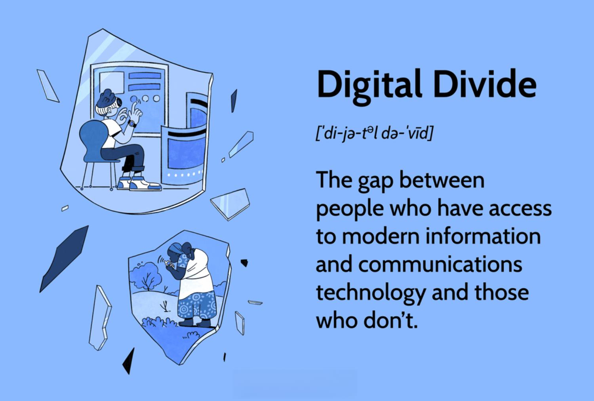

The digital divide is a pressing global issue, manifesting as significant disparities in access to the Internet and technology across different nations, cultures, and societies. This divide delineates not only those with and without Internet access but also highlights the varying degrees of quality, speed, and affordability of technology available to different populations. The ramifications of this divide are profound, impacting various sectors including education, healthcare, and particularly financial services, where modern innovations heavily rely on technological access. 

In financial services, technology is reshaping the landscape through innovations such as Algorithmic Trading (Algo Trading). Algo Trading, an automated form of trading, utilizes complex algorithms to make high-frequency and large-scale market transactions. It has revolutionized financial markets by enhancing efficiency and liquidity, but also demands significant technological resources, including fast and stable internet connections and access to real-time data. For regions plagued by internet inequality, participation in Algo Trading and other digital financial services remains largely inaccessible. Thus, internet inequality directly affects the ability of individuals and institutions in these regions to engage with contemporary financial systems and benefit from digital advancements.

This article aims to explore the critical interconnections between internet inequality and access to digital trading platforms. By examining how disparities in technology access hinder participation in sectors such as Algo Trading, the article seeks to underscore the importance of addressing these inequalities. Bridging the digital divide is essential not only to democratize access to technological innovation but also to work towards a more inclusive and equitable digital future where all individuals have equal opportunities to participate in and benefit from advancements in technology.

Understanding this divide is crucial for policymakers, technologists, and communities to collaboratively forge pathways toward reducing digital inequality. By recognizing the role of equitable access in fostering innovation, economic growth, and social inclusion, efforts can be optimized to cultivate an environment where access to technology becomes an established norm worldwide.

## Table of Contents

## Understanding the Digital Divide

The digital divide represents a significant global issue characterized by the gap between individuals who have access to modern information and communication technology (ICT) and those who do not. This divide is particularly pronounced when considering Internet access, which serves as a cornerstone for digital connectivity and societal progress. Understanding the digital divide involves recognizing its multifaceted nature, which includes disparities in access, usage, and skills related to technology across different countries and demographics.

Statistics on global internet access reveal stark inequalities. As of data gathered in 2022, approximately 63% of the world's population was using the Internet, leaving an estimated 2.9 billion people without access. These disparities are especially pronounced between high-income and low-income countries. For instance, Internet penetration rates in North America are around 90%, whereas in Africa, they remain below 40%. These figures underscore the significant digital chasm that persists globally, influencing various aspects of development and opportunity.

Socio-economic factors significantly impact technology access and digital literacy. Individuals in higher income brackets are more likely to have both access to the Internet and the devices necessary to utilize it effectively. Conversely, lower-income populations often face barriers due to cost, resulting in a lack of digital literacy—a critical skill set in today's technology-driven world. The absence of affordable and reliable Internet further exacerbates these challenges, perpetuating cycles of poverty and limiting access to education and economic opportunities.

Certain communities and regions face considerable barriers to technology. Rural areas, in particular, often suffer from inadequate infrastructure, making it difficult for residents to gain online connectivity. Additionally, marginalized groups such as minorities, the elderly, and people with disabilities can encounter obstacles that hinder their digital participation. For example, Indigenous populations and communities in remote areas frequently have limited or no Internet access, restricting their ability to engage with ICT.

Efforts to bridge the digital divide are being made at both policy and grassroots levels. Governments and international organizations are implementing policies aimed at enhancing digital infrastructure, such as broadband expansion projects and subsidies for low-cost Internet services. Grassroots initiatives also play a crucial role, focusing on community-based solutions that promote digital literacy and offer training programs. Non-profit organizations and private enterprises are collaborating to provide technology access in underserved areas, recognizing that public-private partnerships hold substantial potential in overcoming technological disparities.

In conclusion, while the digital divide remains a daunting challenge, efforts to address it are increasingly gaining [momentum](/wiki/momentum). Bridging this gap requires a concerted effort that combines policy interventions with community-driven approaches, ensuring that technology access becomes a universal reality rather than a privilege for the few. Understanding and addressing the digital divide is essential for fostering digital equality and enabling all individuals to participate fully in the modern digital economy.

## Internet Inequality and Its Implications

Internet inequality, defined as unequal access to the internet, profoundly affects both personal and professional opportunities across the globe. The disparity in internet access influences various aspects of life, from educational outcomes to economic stability, thereby perpetuating socio-economic disparities.

### Broadband Access and Educational Outcomes

Broadband access is increasingly pivotal in determining educational outcomes. Students with high-speed internet connections have improved access to digital learning resources, online courses, and virtual collaboration tools. According to a 2018 UNESCO report, students in countries with broad internet connectivity consistently outperform those without [1]. Furthermore, broadband connectivity facilitates remote learning, which became particularly significant during the COVID-19 pandemic. Lack of internet access has led to educational disruptions, placing students without reliable connections at a distinct disadvantage.

### Economic Mobility and Digital Skills

The ability to access information and develop digital skills is crucial for economic mobility. The digital economy demands proficiency in digital tools, coding, data analysis, and other tech-related skills. Individuals lacking internet access or necessary digital skills are often confined to lower-paying, non-digital jobs. Studies by the World Economic Forum highlight a correlation between internet access and job prospects, noting that jobs requiring digital skills are growing faster than those that do not [2]. The inability to acquire or improve digital skills due to internet inequality thus limits economic advancement.

### Effect on Innovation and Tech Economy Participation

The digital divide restricts participation in the tech-driven economy. Regions with poor internet access struggle to participate in innovation, which is increasingly reliant on digital platforms for collaboration, research, and development. This inequality hampers local technological advancements and reduces competitiveness on a global scale. Internet inequality acts as a barrier to local startups, which could otherwise contribute to technological innovation and economic growth. The McKinsey Global Institute reports that internet inclusivity could significantly boost innovation and productivity worldwide [3].

### Case Studies

Several case studies illustrate the tangible consequences of internet inequality. For instance, rural areas in Sub-Saharan Africa face significant access barriers, impacting education and local economies. In 2019, the Alliance for Affordable Internet found that only 30% of the population had internet access, limiting educational and professional opportunities [4].

In contrast, countries like South Korea have aggressively expanded internet infrastructure, resulting in one of the highest connectivity rates globally. The widespread internet access has catalyzed educational attainment, innovation, and economic prosperity.

### Conclusion

The implications of internet inequality are extensive, affecting personal development and professional opportunities. By addressing these disparities, societies can unlock a wealth of untapped potential, driving economic growth and fostering more equitable innovation. Emerging technologies and concerted global efforts are essential to bridging this divide, ensuring that internet access is no longer a privilege but a fundamental right.

---

**References:**
1. United Nations Educational, Scientific and Cultural Organization (UNESCO), "Global Education Monitoring Report 2018," UNESCO Publishing, 2018.
2. World Economic Forum, "The Future of Jobs Report 2018," World Economic Forum, 2018.
3. McKinsey Global Institute, "Digital Globalization: The New Era of Global Flows," McKinsey & Company, 2016.
4. Alliance for Affordable Internet (A4AI), "The Affordability Report 2019," A4AI, 2019.

## Technology Access as a Gateway to Modern Opportunities

Technology access plays a crucial role in shaping the modern job market. As businesses increasingly rely on digital tools and platforms, individuals with technological proficiency find themselves at an advantage. According to the International Labour Organization, digital skills are becoming essential for 90% of future jobs. The demand for skills like data analysis, digital marketing, and software development highlights the importance of technology access in equipping the workforce to meet these needs.

Technology also serves as a catalyst for entrepreneurial initiatives and small business growth. Digital platforms provide low-cost entry points for entrepreneurs, reducing barriers to starting businesses. E-commerce sites, social media, and digital marketing tools enable small businesses to reach global audiences, enhancing their competitiveness regardless of location. For example, platforms like Shopify and Etsy have empowered countless entrepreneurs to start and scale their businesses online without the need for substantial upfront investments.

The technology gap significantly impacts global competitiveness. Countries with high internet penetration and robust digital infrastructure tend to perform better economically. The World Economic Forum's Global Competitiveness Report emphasizes the role of technology in enhancing efficiency, reducing costs, and driving innovation. As nations strive to maintain competitiveness, investing in technology access becomes a strategic necessity.

Access to technology can lead to personal empowerment and community development. On an individual level, digital literacy fosters self-sufficiency, opening doors to educational and employment opportunities. Communities with improved technology access can leverage digital tools for social initiatives, health services, and educational programs, thereby enhancing overall quality of life. For instance, telehealth services have become increasingly accessible in remote areas, significantly improving healthcare delivery.

Numerous initiatives aim to improve technology access in underserved areas. Public and private sector collaborations are crucial in this endeavor. For example, organizations like the Alliance for Affordable Internet work with governments to create policies that lower internet costs and expand broadband infrastructure. Community-driven projects, such as local tech hubs and digital literacy workshops, also play a vital role in bridging the technology gap, ensuring that more people can participate in the digital economy. These efforts highlight the potential for collective action to overcome existing disparities and foster inclusive growth.

## Algorithmic Trading: A Technology-Driven Sector

Algorithmic trading, often termed "algo trading," has become an essential facet of modern financial markets. It leverages complex algorithms and automated systems to execute trades at speeds and frequencies impractical for human traders. The rise of [algorithmic trading](/wiki/algorithmic-trading) can be largely attributed to advancements in technology, which have significantly transformed the landscape of financial exchanges.

To effectively participate in algorithmic trading, several technological prerequisites must be met. At the core of algo trading is the need for high-speed internet connectivity and advanced computing power, which enable the rapid analysis of market data and the execution of trades. Traders often deploy sophisticated trading algorithms that rely on historical data and real-time feeds, necessitating robust data infrastructure and computational capabilities. Additionally, low latency is critical; even millisecond delays can affect the profitability of trades, especially in high-frequency trading environments.

Internet inequality poses significant barriers to accessing algo trading opportunities. In regions where broadband internet is sparse or unreliable, individuals and institutions face considerable challenges in participating in this domain. The lack of sufficient bandwidth and latency can hinder the execution speed required for effective algo trading. Furthermore, inadequate access to computer hardware and software limits the ability to develop and deploy advanced trading algorithms, thereby restricting participation to those with better technological resources.

Data, speed, and infrastructure play pivotal roles in the success of algorithmic trading. The vast volumes of data generated in financial markets must be processed and analyzed in real-time. This requires not only high-speed internet but also powerful data analytics platforms and cloud computing resources. Efficient data processing enables traders to detect patterns, predict market movements, and execute trades based on algorithmic strategies. Speed, whether in data relay or trade execution, provides a competitive edge, helping traders capitalize on micro-opportunities that arise in dynamic market conditions.

Traders operating from regions with limited technological access face unique challenges. The absence of reliable internet and insufficient computing resources constrains the ability to compete on an equal footing with those having advanced technological setups. These traders often have to rely on less efficient means of executing trades, resulting in missed opportunities and suboptimal economic outcomes. Furthermore, the cost of acquiring necessary technology upgrades can be prohibitive, exacerbating the digital divide.

In conclusion, while algorithmic trading offers lucrative opportunities in financial markets, its accessibility remains heavily skewed by technological disparities. Addressing these gaps is crucial for enabling broader participation and ensuring that algo trading does not become an exclusive domain limited to technologically privileged regions.

## Bridging the Gap: Opportunities and Challenges

Improving internet infrastructure in underserved regions is vital to addressing internet inequality and supporting equitable access to technology. A multifaceted approach involving public-private partnerships, local investments, and community-based initiatives is essential for progress.

Public-private partnerships (PPPs) play a significant role in enhancing technology distribution. Governments and private companies can collaborate to develop infrastructure, offer affordable internet services, and ensure that remote or underserved areas receive necessary technological advancements. For instance, partnerships involving tech giants like Google and Microsoft with local governments have already experimented with satellite and White Space technology to expand broadband reach in rural areas (Source: World Economic Forum).

Local investments and community-based approaches are equally crucial. Encouraging local entrepreneurs and businesses to take part in building internet infrastructure fosters a sense of ownership and customization suitable for specific community needs. Local initiatives, such as Mesh networks, allow communities to create their own internet solutions using existing technologies at a fraction of the cost (Source: Community Networks Africa).

However, ensuring that digital initiatives are inclusive and sustainable presents a challenge. Projects must be designed to be adaptable and accessible to diverse populations, considering language, cultural context, and varying levels of digital literacy. Sustainability concerns necessitate ongoing maintenance and upgradation, requiring consistent funding and expertise development within communities. Ensuring inclusivity often requires tailored solutions to address specific barriers faced by women, minorities, and disadvantaged groups.

Emerging technologies offer promising prospects for overcoming internet inequality. Innovations such as Low Earth Orbit (LEO) satellites and 5G technology could potentially provide high-speed internet access to remote and rural areas worldwide. These technologies promise broader coverage and more reliable connectivity, though challenges like cost, regulatory hurdles, and infrastructure compatibility need addressing.

In conclusion, bridging the internet access gap requires targeted strategies involving strategic partnerships, local engagement, and an embracing of emerging technologies. By addressing these challenges thoughtfully, progress towards global digital equality is attainable.

## Conclusion

Addressing internet inequality is crucial to ensuring equitable access to technology, a fundamental driver of societal advancement. The digital divide, if left unchecked, continues to perpetuate economic and social disparities, limiting opportunities for education, financial inclusion, and economic mobility. Bridging this gap has the transformative potential to enhance the quality of life for individuals, boost productivity for businesses, and foster inclusive growth within societies. As technology increasingly dictates the landscape of global interaction and commerce, ensuring that everyone has access to these tools is a matter of urgency.

To achieve digital equality, it is essential to encourage ongoing conversations and proactive measures. This involves not only raising awareness about the pervasive nature of internet inequality but also advocating for policies and initiatives that prioritize access to technology and digital literacy. Comprehensive strategies must consider the diverse challenges faced by different regions and demographics to offer tailored solutions that effectively address their unique needs.

Holistic approaches, supported by global cooperation, are needed to tackle the multifaceted issue of internet inequality. Collaborations between governments, private sectors, non-profits, and communities can lead to innovations in connectivity solutions, infrastructure investments, and educational programs that empower underserved populations. These efforts should be sustainable and adaptable to technological advancements, ensuring long-term impact and resilience.

Moving towards a future where technology access is a fundamental right requires a collective commitment to inclusivity and equity. By prioritizing digital equality, we pave the way for a world in which technology serves as a universal bridge to opportunity, enabling every individual to participate fully in the digital age. This vision is not just aspirational but necessary to address the challenges of the 21st century and create a more just and equitable global society.

## References & Further Reading

[1]: United Nations Educational, Scientific and Cultural Organization (UNESCO), "Global Education Monitoring Report 2018," UNESCO Publishing, 2018.

[2]: World Economic Forum, "The Future of Jobs Report 2018," World Economic Forum, 2018.

[3]: McKinsey Global Institute, "Digital Globalization: The New Era of Global Flows," McKinsey & Company, 2016.

[4]: Alliance for Affordable Internet (A4AI), "The Affordability Report 2019," A4AI, 2019.

[5]: ["Advances in Financial Machine Learning"](https://www.amazon.com/Advances-Financial-Machine-Learning-Marcos/dp/1119482089) by Marcos Lopez de Prado

[6]: ["Machine Learning for Algorithmic Trading"](https://github.com/stefan-jansen/machine-learning-for-trading) by Stefan Jansen

[7]: ["Quantitative Trading: How to Build Your Own Algorithmic Trading Business"](https://books.google.com/books/about/Quantitative_Trading.html?id=j70yEAAAQBAJ) by Ernest P. Chan

[8]: ["Evidence-Based Technical Analysis: Applying the Scientific Method and Statistical Inference to Trading Signals"](https://www.amazon.com/Evidence-Based-Technical-Analysis-Scientific-Statistical/dp/0470008741) by David Aronson