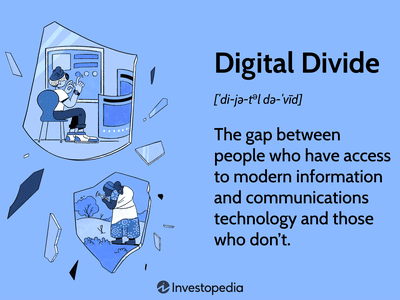

The digital era has led to a significant divide in technology adoption between generations, commonly categorized as digital natives and digital immigrants. Digital natives, born into a world where technology is an integral part of life, exhibit a natural affinity for digital tools and platforms. In contrast, digital immigrants, who encountered these technologies later in life, face the challenge of adapting to rapid technological changes at a different pace. This generational divide is particularly pronounced in sectors such as financial markets, where technology plays a crucial role in operations and strategy.

Algorithmic trading, a modern phenomenon within financial markets, exemplifies this technological influence. It involves the use of computer algorithms to automate trading decisions at high speeds, leveraging complex mathematical models and big data analytics to gain market advantages. As financial technology evolves, the generational differences in technology adoption present both challenges and opportunities. Digital natives, with their proficiency in digital tools, often drive innovation and explore new technological frontiers. Meanwhile, digital immigrants offer vital perspectives based on their experience and strategic insights, fostering a balance of creativity and caution.



Understanding the implications of these generational differences is essential for fostering innovation and efficient collaboration in technology-driven environments. By acknowledging the unique strengths of both digital natives and immigrants, it is possible to create synergies that enhance the development and deployment of technological solutions. This article explores how these generational differences impact algorithmic trading practices and highlights strategies to effectively integrate technology across diverse age groups. Recognizing and addressing these differences can lead to more cohesive and innovative financial markets, leveraging the full potential of digital advancements.

## Table of Contents

## Understanding Digital Natives and Digital Immigrants

Digital natives, a term popularized by Marc Prensky, refers to individuals born during or after the widespread adoption of digital technology. This group has been continuously exposed to computers, the internet, mobile devices, and other digital tools from an early age, making digital technology an intrinsic part of their lives. Their skills in navigating and utilizing these technologies are characterized by intuitiveness, efficiency, and often a creative approach to problem-solving. Digital natives tend to prefer quick and easily accessible information, resulting in a preference for digital communication methods such as social media, instant messaging, and other online platforms. 

On the other hand, digital immigrants are individuals who encountered digital technology later in their lives. This group had to transition from traditional means of communication and information gathering to navigating new digital landscapes, which requires adaptation and a learning curve. Their approach to technology use can differ significantly from that of digital natives, with a tendency to rely on existing frameworks and a more cautious adaptation of new tools. This generational divide manifests in varied communication styles; digital immigrants might prefer face-to-face meetings, phone calls, or emails over digital natives' choice of chats and social media interactions. 

These differences extend beyond communication to how each group approaches professional tasks and learning. Digital natives often favor interactive learning environments, leveraging multimedia resources and collaborative platforms. In contrast, digital immigrants might lean towards traditional learning formats and step-by-step instruction-based approaches. 

Understanding the nuances of digital natives and immigrants is crucial for recognizing their influence across various cultural and professional domains. By examining these characteristics, organizations and individuals can better appreciate the diverse strengths that each group brings. This awareness can help foster environments that utilize the adaptability of digital immigrants with the innovative potential of digital natives, leading to enriched tech culture and more effective technology-driven solutions. 

### Key Points:
- Digital natives possess inherent proficiency with digital tools and prioritize efficiency and accessibility in communication and learning.
- Digital immigrants bring adaptability and established strategies from pre-digital contexts, often enriching technological adaptation processes.
- These generational traits reflect broader technological cultural influences, indicating potential strengths in collaborative technology engagement.

## Technology Culture Across Generations

The interaction of generations with technology has given rise to distinct cultural landscapes across various sectors, highlighting the contrast between digital natives and digital immigrants. Digital natives, typically younger individuals who have grown up with digital tools, tend to excel in environments that leverage interactive technologies. Their comfort with digital interfaces and propensity for multitasking enhance their ability to adapt to rapidly changing technological environments. This group is characterized by a preference for dynamic, collaborative, and technology-enhanced approaches, which are evident in education, communication, and professional practices. 

Conversely, digital immigrants, often older individuals who have had to adapt to digital technology later in life, may exhibit a preference for traditional methods. This group relies on established practices and may experience a steeper learning curve when it comes to adopting new technological tools. This preference can manifest in various ways, from favoring face-to-face communication over digital means to relying on paper-based documentation rather than digital alternatives. Their experience, however, provides valuable insights into the potential pitfalls of technology adoption, emphasizing a cautious approach that can mitigate risks associated with rapid technological advancement.

The differences between these groups extend to educational settings, where digital natives may thrive in e-learning environments that offer interactive and immersive experiences. Digital immigrants, however, might prefer structured, instructor-led lessons that provide clear expectations and direct feedback. This divergence influences pedagogical strategies, necessitating a blend of traditional and modern teaching techniques to cater to diverse learning preferences.

Similarly, in professional environments, digital natives are often more inclined to adopt collaborative tools like Slack or Trello, which facilitate instant communication and project management. Digital immigrants, meanwhile, may opt for email or in-person meetings to ensure clear and direct communication. These preferences can influence organizational culture, affecting everything from workflow efficiency to decision-making processes.

Recognizing these cultural dynamics is crucial for creating inclusive environments that harness the strengths of both digital natives and immigrants. By understanding and appreciating the unique contributions of each group, organizations can foster a more dynamic and innovative atmosphere. This involves implementing strategies that bridge generational divides, such as offering tailored training programs that accommodate varying levels of technological proficiency and encouraging mentorship opportunities that leverage the experience of digital immigrants alongside the technological fluency of digital natives. 

Ultimately, this holistic approach not only minimizes friction in technology adoption but also promotes an environment where the strengths of both generations are utilized in tandem, driving progress and fostering collaboration in technology-driven sectors.

## Algorithmic Trading: A Modern Financial Phenomenon

Algorithmic trading, often referred to as algo trading, denotes a profound transformation in financial markets, enabled by the deployment of algorithms capable of executing trades at high speeds with precision. This paradigm shift reflects the intersection of financial practices and advanced technology, altering traditional trading methodologies that once relied heavily on human input and decision-making.

Initially, the domain of [algorithmic trading](/wiki/algorithmic-trading) was largely inhabited by digital immigrants—individuals adapting to technological advancements later in their careers. These traders combined their extensive financial market experience with burgeoning computational tools to automate and refine trading processes. The introduction of algorithms allowed for systematic trading strategies, which improved execution speed and reduced human error, contributing to enhanced market efficiency.

However, the growing presence of digital natives—those immersed in digital technologies from a young age—has significantly accelerated the evolution of algorithmic trading strategies. Digital natives, with their inherent comfort in navigating complex software environments and data analytic tools, have introduced innovative approaches that leverage [machine learning](/wiki/machine-learning) and data science. Their contributions facilitate deeper market analysis and the development of sophisticated trading models that predict market movements with greater accuracy.

At the core of algorithmic trading is its reliance on data analytics. The capacity to analyze large datasets in near real-time has empowered traders to identify patterns and correlations that would be imperceptible through traditional analysis. This reliance on data has spurred the adoption of quantitative models, which employ statistical techniques to forecast future prices and [volatility](/wiki/volatility-trading-strategies), guiding trading decisions based on empirical evidence.

Technological fluency remains a critical [factor](/wiki/factor-investing) in algorithmic trading, where programming languages like Python and R are frequently used to implement trading algorithms. For instance, a simple trading strategy might involve the moving average crossover, where an algorithm executes a buy signal when a short-term moving average crosses above a long-term moving average:

```python
import numpy as np
import pandas as pd

def moving_average_crossover(data):
    short_window = 40
    long_window = 100

    signals = pd.DataFrame(index=data.index)
    signals['signal'] = 0.0

    # Create short and long simple moving averages
    signals['short_mavg'] = data['close'].rolling(window=short_window, min_periods=1).mean()
    signals['long_mavg'] = data['close'].rolling(window=long_window, min_periods=1).mean()

    # Generate buy/sell signals
    signals['signal'][short_window:] = np.where(signals['short_mavg'][short_window:] > signals['long_mavg'][short_window:], 1.0, 0.0)

    # Create positions
    signals['positions'] = signals['signal'].diff()

    return signals
```

This convergence of financial acumen and technological expertise underscores the broader impact of technology culture on finance, illustrating a dynamic where innovative digital techniques coexist and enhance traditional methodologies. As algorithmic trading continues to reshape financial landscapes, its role in modern finance exemplifies the ongoing integration of emergent technologies into established sectors.

## The Impact of Tech Culture on Algorithmic Trading

Generational perspectives play a crucial role in shaping the adoption and development of algorithmic trading strategies. Digital natives, having grown up immersed in technology, are naturally fluent in using digital tools. This fluency allows them to navigate complex software, utilize advanced data analytics, and implement innovations that enhance algorithmic trading systems. They are adept at employing machine learning and [artificial intelligence](/wiki/ai-artificial-intelligence) techniques to refine trading algorithms, increasing efficiency and accuracy in market predictions.

On the other hand, digital immigrants possess vast market experience and strategic thinking capabilities. Their profound understanding of market dynamics, honed over years of active participation, provides invaluable insights that can guide the strategic direction of algorithmic models. This experience is essential for risk management and for identifying market anomalies that might be overlooked by purely data-driven approaches.

Collaboration between digital natives and digital immigrants is paramount. By combining the innovative prowess of digital natives with the seasoned wisdom of digital immigrants, teams can develop more sophisticated trading algorithms. This collaboration enhances not only the design and implementation of algorithms but also fosters a culture of mutual learning and respect for diverse skill sets.

The intersection of these generational talents is evident in the creation of algorithms that are both technically advanced and strategically sound. Digital natives are often responsible for the coding and technical adaptation, while digital immigrants provide input on strategic imperatives and risk assessments. Such synergy ensures that the algorithms are robust and capable of adapting to market changes.

For example, a digital native might use Python to develop an algorithm employing machine learning techniques such as Random Forest or Gradient Boosting to predict stock prices. They could implement the following Python code:

```python
from sklearn.ensemble import RandomForestRegressor
import numpy as np

# Sample training data
X_train = np.array([[5], [10], [15]])
y_train = np.array([1500, 3000, 4500])

# Create a RandomForest Regressor
model = RandomForestRegressor(n_estimators=10, random_state=42)

# Train the model
model.fit(X_train, y_train)

# Predicting new data
X_test = np.array([[12]])
prediction = model.predict(X_test)

print("Predicted value:", prediction[0])
```

In this code, the digital native constructs a predictive model that might, for instance, forecast stock prices based on historical data. With input from a digital immigrant, the model's parameters and external market factors can be adjusted, ensuring the algorithm is both innovative and strategically sound.

Ultimately, generational diversity in algorithmic trading leads to economic efficiencies and innovation. Teams that harness the strengths of both digital natives and immigrants drive advancement in trading practices. This generational collaboration not only propels financial firms towards greater competitiveness but also contributes to a more dynamic and adaptable technological landscape. The mutual exchange of ideas ensures continuous growth and adaptation, benefiting the entire financial sector.

## Strategies for Bridging the Generational Gap

Bridging the generational gap in technology-focused environments requires strategic efforts that prioritize effective communication and collaboration between digital natives and digital immigrants. Understanding the unique perspectives and abilities each group brings can enhance the innovation potential of any team.

Educational programs and technology training are essential tools that cater to the distinct learning speeds and preferences of these groups. Digital immigrants, who may not be as naturally accustomed to digital technology as digital natives, benefit from tailored training sessions that gradually introduce complex tools and software. This can be achieved by implementing modular learning paths, allowing individuals to progress at a comfortable pace and reinforcing knowledge through practical application. For example, workshops employing interactive technologies or gamified elements can enhance engagement for both groups, ensuring that digital immigrants build confidence in tech-centric roles.

Furthermore, assembling diverse teams that leverage the complementary strengths of digital natives and immigrants can foster a creative and innovative environment. Digital natives excel in utilizing contemporary digital tools, offering fresh perspectives on problem-solving and efficiency improvements. In contrast, digital immigrants provide depth with their extensive experience and strategic acumen. Encouraging cross-generational mentorship and pairing younger employees with experienced colleagues allows for a productive exchange of digital fluency and market wisdom, promoting holistic growth within the organization.

To cultivate a harmonious and sustainable development environment in technology-driven sectors, organizations can prioritize inclusive initiatives. These might include:

1. **Cross-generational Hackathons**: Organize events where teams made up of mixed-age groups collaborate to develop solutions to real-world problems, thus allowing each generation to contribute its unique strengths.

2. **Collaborative Platforms**: Deploy collaborative digital platforms that enable seamless communication across age groups, mitigating potential barriers due to differing technology proficiencies.

3. **Cultural Awareness Programs**: Develop programs that raise awareness about generational differences in technology use, fostering mutual respect and understanding.

4. **Ongoing Feedback Mechanisms**: Implement channels for regular feedback, allowing team members to discuss challenges and opportunities related to generational technology integration openly.

Efforts to bridge the generational divide leverage the collective intelligence of both digital natives and digital immigrants, driving technological advancement while maintaining organizational synergy. By embracing these strategies, it is possible to create an inclusive atmosphere that not only accommodates the present workforce's diverse needs but also fosters innovation for future generations.

## Conclusion

The dynamic interaction between digital natives and digital immigrants significantly shapes the technological and financial landscapes. Acknowledging and leveraging these generational differences can lead to substantial innovation and enhanced efficiency, especially within the domain of algorithmic trading. The digital proficiency of natives, combined with the strategic insight of immigrants, creates a unique synergy that can be harnessed to refine and advance trading strategies.

As technology continues to evolve at a rapid pace, mutual learning and adaptability are crucial for maintaining a competitive edge. Digital natives can offer their intuitive grasp of new technologies and data analytics, while digital immigrants can provide depth in market understanding and a strategic approach to risk. This blend of skills and perspectives fosters a fertile ground for pioneering solutions and methodologies.

The collaboration between diverse generational perspectives is not just beneficial but necessary for driving progressive advancements that can benefit both technology and broader society. By fostering an environment that encourages dialogue and shared learning, organizations can ensure they are well-positioned to capitalize on the strengths of each group. This collaboration can lead to innovations that not only enhance the efficiency of financial markets but also contribute to societal growth and development.

## References & Further Reading

- Tapscott, D. (2008). *Grown Up Digital: How the Net Generation is Changing Your World.* McGraw-Hill. This book provides insights into how the digital generation is reshaping various sectors, emphasizing the unique characteristics and potential of digital natives.

- Prensky, M. (2001). *Digital Natives, Digital Immigrants.* On the Horizon, 9(5). Prensky's article introduces the concepts of digital natives and immigrants, exploring the implications of their interaction with technology.

- Lopez de Prado, M. (2018). *Advances in Financial Machine Learning.* Wiley. This work investigates into the use of machine learning techniques in finance, providing relevant frameworks and methodologies crucial for modern algorithmic trading.

- Jansen, S. (2018). *Machine Learning for Algorithmic Trading: Predictive Models to Extract Signals from Market and Alternative Data for Systematic Trading Strategies with Python.* Packt Publishing. The book offers practical guidance on applying machine learning to develop algorithmic trading strategies, with a focus on predictive models and data analytics.

- Chan, E. P. (2008). *Quantitative Trading: How to Build Your Own Algorithmic Trading Business.* Wiley. Chan's book delivers comprehensive insights into setting up an algorithmic trading business, covering the necessary quantitative strategies and risk management practices.

These sources provide a foundational understanding of the generational differences in technology adoption and their influence on algorithmic trading, aiding readers in grasping the complexities and opportunities presented by these dynamics.

