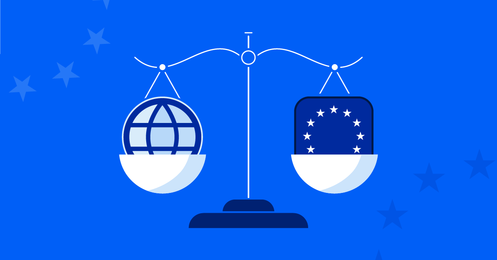

## Table of Contents

## What is the Digital Markets Act (DMA)?

The Digital Markets Act (DMA) is a new law in the European Union that aims to make big tech companies play fair. It focuses on companies that have a lot of power in the digital market, like big search engines, social media platforms, and online marketplaces. The goal is to stop these companies from using their power to block out smaller competitors and to make sure everyone has a fair chance.

The DMA sets clear rules for these big companies, called "gatekeepers." These rules include not favoring their own services over others, allowing users to easily switch between different services, and making sure that other businesses can work with the gatekeeper's platforms. By doing this, the DMA hopes to create a more open and competitive digital market, which can lead to better choices and services for consumers.

## What are the main objectives of the DMA?

The main goal of the Digital Markets Act (DMA) is to make sure big tech companies play fair in the digital world. These companies, called gatekeepers, have a lot of power over the internet and can make it hard for smaller businesses to compete. The DMA wants to stop gatekeepers from using their power to block out others and to create a more level playing field. This means everyone, no matter how big or small, should have a fair chance to succeed.

Another important objective of the DMA is to give users more choices and better services. By setting clear rules for gatekeepers, the DMA ensures that they cannot favor their own services over others. This means users can easily switch between different services and find the best options for them. The DMA also wants to make sure that other businesses can work well with the gatekeeper's platforms, which can lead to more innovation and better products for everyone.

## Which companies are targeted by the DMA?

The Digital Markets Act (DMA) targets big tech companies that have a lot of power in the digital world. These companies are called "gatekeepers" because they control important parts of the internet, like search engines, social media platforms, and online marketplaces. The DMA focuses on companies that have a lot of users and make a lot of money, which means they can influence how the internet works.

Some examples of companies that might be considered gatekeepers under the DMA are Google, Amazon, Apple, and Facebook. These companies have huge numbers of users and a lot of control over what people see and do online. The DMA wants to make sure these big companies don't use their power to stop smaller businesses from competing fairly. By setting rules for gatekeepers, the DMA hopes to create a more open and fair internet for everyone.

## What are the key obligations for gatekeepers under the DMA?

The Digital Markets Act (DMA) sets clear rules for big tech companies called gatekeepers. These rules are meant to stop gatekeepers from using their power to block out smaller businesses. One main rule is that gatekeepers cannot favor their own services over others. For example, if a gatekeeper runs a search engine, it can't show its own services at the top of search results just because they belong to the gatekeeper. This helps make sure everyone gets a fair chance to be seen and used by customers.

Another important rule is that gatekeepers must let users easily switch between different services. This means if a user wants to move from one messaging app to another, the gatekeeper has to make it easy for them to take their data with them. Also, gatekeepers have to allow other businesses to work well with their platforms. This means smaller companies should be able to connect their services to the gatekeeper's platform without facing unfair barriers. By following these rules, gatekeepers help create a more open and competitive digital market, which is good for everyone.

## How does the DMA aim to enhance competition in digital markets?

The Digital Markets Act (DMA) wants to make the digital world fairer by setting rules for big tech companies, called gatekeepers. These rules stop gatekeepers from using their power to block out smaller businesses. For example, gatekeepers can't favor their own services over others. This means if a gatekeeper has a search engine, it can't put its own services at the top of search results just because they belong to the gatekeeper. By not letting gatekeepers do this, the DMA helps make sure everyone gets a fair chance to be seen and used by customers.

Another way the DMA helps is by making it easy for users to switch between different services. If someone wants to move from one messaging app to another, the gatekeeper has to help them take their data with them. The DMA also says gatekeepers must let other businesses connect to their platforms without facing unfair barriers. This means smaller companies can work well with the gatekeeper's platform. By doing these things, the DMA creates a more open and competitive digital market, which is good for everyone because it leads to more choices and better services.

## What is the process for designating a company as a gatekeeper under the DMA?

The process for designating a company as a gatekeeper under the Digital Markets Act (DMA) starts with looking at how big and powerful the company is. The European Commission checks if a company has a lot of users and makes a lot of money. They also see if the company controls important parts of the internet, like search engines, social media, or online stores. If a company meets these criteria, it might be called a gatekeeper.

Once the European Commission thinks a company could be a gatekeeper, they start a formal process. They tell the company they are being looked at and give them a chance to explain their side. The Commission then decides if the company really is a gatekeeper. If they say yes, the company has to follow the DMA rules to make sure they play fair and don't block out smaller businesses. This helps keep the internet open and competitive for everyone.

## How will the DMA be enforced and what are the potential penalties for non-compliance?

The Digital Markets Act (DMA) will be enforced by the European Commission. They will watch over the big tech companies called gatekeepers to make sure they follow the rules. If a gatekeeper breaks the rules, the Commission can start an investigation. They will look at the evidence and talk to the company. If they find the company did something wrong, they can make the company fix it. The Commission can also fine the company a lot of money if they keep breaking the rules.

The penalties for not following the DMA can be very big. If a gatekeeper does not follow the rules, they can be fined up to 10% of their total worldwide money made in a year. If they break the rules again, the fine can go up to 20%. These big fines are meant to make sure gatekeepers take the rules seriously and play fair. By enforcing the DMA and giving out big penalties, the European Commission wants to keep the internet open and competitive for everyone.

## What are the expected impacts of the DMA on consumers and businesses?

The Digital Markets Act (DMA) is expected to have a big impact on consumers. It will give them more choices and better services. Because big tech companies, called gatekeepers, will have to play fair, consumers can switch between different services more easily. This means if someone wants to try a new messaging app or online store, they can do it without losing their data. Also, because gatekeepers can't favor their own services, consumers might find new and better options that they didn't know about before. This can lead to more competition, which often means better quality and lower prices for everyone.

For businesses, the DMA can make a big difference too. Smaller companies will have a better chance to compete with big tech companies. The rules will stop gatekeepers from blocking out smaller businesses, so they can connect to big platforms more easily. This can lead to more innovation because smaller companies can bring new ideas to the market. Also, businesses that follow the rules might avoid big fines, which can help them stay healthy and grow. Overall, the DMA aims to create a fairer and more open digital market, which can be good for both consumers and businesses.

## How does the DMA interact with existing EU and national regulations?

The Digital Markets Act (DMA) works together with other rules in the European Union and in each country. It doesn't replace these rules but adds to them. The DMA focuses on big tech companies, called gatekeepers, to make sure they play fair in the digital world. Other EU laws, like the General Data Protection Regulation (GDPR), which protects people's data, and the Platform-to-Business Regulation, which helps businesses work with online platforms, still apply. National laws in each country also continue to be important. The DMA helps fill in gaps where these other laws might not cover everything, especially when it comes to making the digital market more competitive.

Sometimes, the DMA might overlap with other rules. When this happens, the European Commission makes sure that everything works together smoothly. They check to see if any actions taken under the DMA might affect other laws. For example, if a gatekeeper is fined under the DMA for not following the rules, the Commission will make sure this doesn't go against any other laws or regulations. By working together, the DMA and other EU and national rules aim to create a fair and open digital market for everyone.

## What are the challenges and criticisms associated with implementing the DMA?

Implementing the Digital Markets Act (DMA) can be tricky. One big challenge is figuring out which companies are gatekeepers. The European Commission has to look at how big and powerful a company is, and this can be hard to do. Also, keeping an eye on these big tech companies to make sure they follow the rules takes a lot of work and resources. The Commission has to do investigations and might need to take companies to court if they don't follow the rules. This can be slow and might not stop problems right away.

There are also some criticisms of the DMA. Some people worry that the rules might be too hard on big tech companies and could stop them from growing or innovating. They think that the fines, which can be up to 10% or even 20% of a company's total money made in a year, might be too much. Others are concerned that the DMA might not be fair to all companies. They think that some smaller companies that are growing fast might also act like gatekeepers but won't be watched as closely. These criticisms show that finding the right balance between fairness and growth can be tough.

## What are the anticipated timelines for the full implementation of the DMA?

The Digital Markets Act (DMA) started to be put into action in May 2023. This is when the European Commission began the process of figuring out which companies are gatekeepers. They had to look at how big and powerful these companies are. The companies that were named as gatekeepers had to start following the DMA rules by March 2024. This gave them time to change how they work to meet the new rules.

After March 2024, the European Commission will keep watching the gatekeepers to make sure they follow the rules. If a company doesn't follow the rules, the Commission can start an investigation and might fine them. The full impact of the DMA on the digital market will take some time to see. It might take a few years for everyone to really feel the changes, as businesses and consumers get used to the new way of doing things.

## How can companies prepare for compliance with the DMA?

Companies can get ready for the Digital Markets Act (DMA) by first figuring out if they might be called a gatekeeper. They need to look at how big they are, how much money they make, and if they control important parts of the internet like search engines or social media. If they think they might be a gatekeeper, they should start changing how they work to follow the DMA rules. This means they can't favor their own services over others and need to make it easy for users to switch between different services. They also need to let other businesses connect to their platforms without unfair barriers.

Getting ready for the DMA also means setting up good ways to keep track of what they do and making sure everyone in the company knows about the new rules. Companies might need to change their technology and business practices to make sure they follow the DMA. They should also talk to lawyers and experts who know about the DMA to make sure they understand everything correctly. By doing these things, companies can avoid big fines and help make the internet a fairer place for everyone.

## References & Further Reading

[1]: European Commission. (2022). ["The Digital Markets Act: ensuring fair and open digital markets."](https://commission.europa.eu/strategy-and-policy/priorities-2019-2024/europe-fit-digital-age/digital-markets-act-ensuring-fair-and-open-digital-markets_en) 

[2]: Crémer, J., de Montjoye, Y.-A., & Schweitzer, H. (2019). ["Competition Policy for the Digital Era."](https://op.europa.eu/en/publication-detail/-/publication/21dc175c-7b76-11e9-9f05-01aa75ed71a1/language-en) European Commission.

[3]: Khan, L. M. (2017). ["Amazon’s Antitrust Paradox."](https://www.yalelawjournal.org/pdf/e.710.Khan.805_zuvfyyeh.pdf) Yale Law Journal, 126(3), 710-805.

[4]: Lopez de Prado, M. (2018). ["Advances in Financial Machine Learning"](https://books.google.com/books/about/Advances_in_Financial_Machine_Learning.html?id=oU9KDwAAQBAJ). Wiley.

[5]: Stucke, M. E., & Grunes, A. P. (2016). ["Big Data and Competition Policy."](https://papers.ssrn.com/sol3/papers.cfm?abstract_id=2849074) Oxford University Press.

[6]: Taplin, J. (2017). ["Move Fast and Break Things: How Facebook, Google, and Amazon Cornered Culture and Undermined Democracy."](https://books.google.com/books/about/Move_Fast_and_Break_Things.html?id=XrYDDQAAQBAJ) Little, Brown and Company.

[7]: Jansen, S. (2020). ["Machine Learning for Algorithmic Trading – Second Edition: Predictive models to extract signals from market and alternative data for systematic trading strategies with Python."](https://thuvienso.hoasen.edu.vn/bitstream/handle/123456789/12260/Contents.pdf?sequence=1) Packt Publishing.