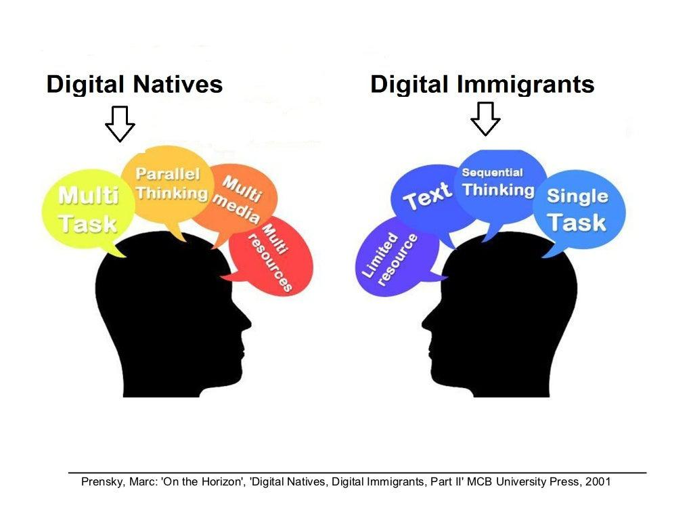

The advent of technology has transformed how different generations engage with digital tools, leading to significant shifts in communication, learning, and professional practices. As technology becomes an integral part of daily life, the terms "digital natives" and "digital immigrants" have emerged to describe generational differences in technological fluency and usage. Digital natives, typically younger individuals who have grown up with digital technology, see it as a seamless extension of their lives. In contrast, digital immigrants, who encountered digital tools later in life, may approach technology with more caution and require more adaptation.

These distinctions extend beyond personal use to impact broader technology culture, encompassing how society integrates, reacts to, and evolves with technology. One area where these generational perspectives play a critical role is algorithmic trading. Algorithmic trading, characterized by the use of algorithms to execute high-speed trading decisions, represents a significant shift from traditional human-centered trading methods, a domain historically dominated by digital immigrants. The rise of digital natives within the financial sector has accelerated the adoption of technology-driven trading strategies, reshaping the landscape of modern financial markets.



The intersection between generational perspectives and algorithmic trading practices reveals insights into the evolution of technology culture within the financial industry. By examining how digital natives and immigrants differently engage with algorithmic trading, we can understand how these groups contribute to innovation and efficiency in trading strategies. This investigation will also shed light on how generational diversity can be harnessed to drive future advancements in the field. The aim here is to explore these interactions to see how differing technological experiences influence contemporary trading practices and highlight the importance of fostering integration and collaboration between generations in technology-driven environments.

## Table of Contents

## Understanding Digital Natives and Digital Immigrants

Digital natives are individuals who have grown up immersed in digital technologies such as computers, the internet, and mobile devices. This immersion has shaped their cognitive processes, social interactions, and learning styles, allowing them to perceive and use technology seamlessly as an integral part of their daily lives. They often utilize digital channels for communication, relying on social media, messaging apps, and virtual platforms to interact with peers and access information. This familiarity with digital tools from a young age generally results in an innate agility in navigating complex technological environments and adapting to new innovations.

In contrast, digital immigrants are individuals who were not born into the digital world but have had to adapt to it as it emerged throughout their lifetime. For digital immigrants, technology may be viewed as a tool requiring learning and adaptation. This can result in differing comfort levels with technology compared to digital natives, with immigrants often exhibiting a preference for traditional modes of communication and processes. The necessity to adapt can create challenges in efficiently utilizing digital tools, although it may also endow digital immigrants with unique perspectives and problem-solving skills derived from pre-digital experiences.

These cultural differences manifest in various domains, influencing approaches to technology, communication, and learning. In education, digital natives may prefer interactive and multimedia-rich learning environments, while digital immigrants may lean toward conventional pedagogical methods. In business, digital natives might advocate for leveraging data analytics and automation, whereas digital immigrants may emphasize face-to-face interactions and incremental technology integration. Understanding these cultural distinctions is crucial in fostering environments that leverage the strengths of both groups, allowing for a more cohesive and productive integration of technology in society.

## Technology Culture Across Generations

Technology culture across generations varies significantly, primarily due to the distinct ways in which digital natives and digital immigrants engage with technological advancements. Digital natives, individuals who have grown up with technology such as the internet and smartphones, perceive these tools as integral to their daily activities. Their interactions with technology are seamless, as the digital environment has always been a part of their upbringing. For them, digital platforms facilitate communication, learning, and professional tasks effortlessly. This cultural immersion fosters a propensity for multitasking, rapid information processing, and embracing new technologies without hesitation.

Conversely, digital immigrants—those who experienced the influx of digital technologies later in life—often approach technology with the mindset of it being a tool that requires adaptation. Their initial exposure to technology was likely through traditional means, such as newspapers, face-to-face communication, or personal computers introduced during adulthood. Consequently, incorporating digital tools into their personal and professional lives involves a learning curve, often marked by deliberate effort and adaptation. This dichotomy can lead to variations in how these two groups participate in technological endeavors, including online learning environments, social media platforms, and workplace technology integration.

In educational contexts, digital natives tend to thrive in online learning environments that leverage multimedia and interactive content, allowing for self-paced learning. They are adept at using various educational technologies, from virtual classrooms to digital collaboration tools. In contrast, digital immigrants may require additional support and training to navigate these environments effectively, potentially preferring structured settings with clear guidance and support for technological tools.

Social media usage also underscores generational technology culture differences. Digital natives are more likely to engage across multiple social media platforms, utilizing them for building personal brands, networking, and accessing news and information. Their ease with digital communication facilitates broader connectivity and engagement in online communities. Digital immigrants, while increasingly active on social media, may focus on fewer platforms and use them primarily for maintaining existing relationships or consuming content rather than producing or sharing it extensively.

In professional settings, the integration of technology manifests differently for each group. Digital natives are often at the forefront of adopting new digital tools and methodologies, bringing innovative approaches to workplace challenges. Their comfort with technology can lead to exploring automation, data analytics, and other cutting-edge solutions to enhance productivity. Digital immigrants may exhibit a cautious approach, valuing conventional methods while gradually integrating technological solutions into their workflows. Their extensive experience can bring valuable insights into technology's role in achieving organizational goals, providing a balanced perspective when combined with the digital fluency of younger colleagues.

Overall, these cultural dynamics highlight the importance of understanding the distinct approaches digital natives and immigrants bring to technology use. Acknowledging these differences allows for creating more inclusive and effective environments in education, social interactions, and professional settings, ensuring that both groups can contribute their strengths to the evolving technological landscape. The broader implications are vast, influencing not only individual interactions with technology but also the development of policies and practices that accommodate diverse technological competencies and preferences.

## Algorithmic Trading: A Modern Financial Phenomenon

Algorithmic trading, commonly referred to as algo trading, involves the use of computer programs and complex algorithms to execute trading decisions at speeds and frequencies that are impossible for human traders to achieve. This practice has become a fundamental component of modern financial markets, driven by the need for efficiency, speed, and accuracy.

At its core, [algorithmic trading](/wiki/algorithmic-trading) leverages predefined criteria based on timing, price, quantity, or any mathematical model to execute trades. These algorithms can process a vast amount of data in milliseconds to make trading decisions, capitalizing on market conditions that humans may not recognize or react to as quickly. High-frequency trading ([HFT](/wiki/high-frequency-trading-strategies)), a subset of algorithmic trading, utilizes these systems to execute a large number of orders at extremely fast speeds.

Traditionally, financial trading relied heavily on human analysis and decision-making, a domain primarily dominated by digital immigrants—those who adapted to digital technologies later in life. These traders often depended on manual processes, intuition, and experience acquired over decades within the industry. However, the advent of digital natives—individuals who have grown up with digital technology—has transformed the financial industry landscape. This demographic is more inclined towards automation and harnessing technology, leading to a growing emphasis on efficiency and data-driven strategies.

In the current market environment, algorithmic trading is relevant due to its ability to reduce transaction costs through decreased market impact and enhanced execution. It also offers improved accuracy and the capability to backtest strategies using historical data to evaluate their potential performance without risking actual capital. Such advantages make algorithmic trading attractive to institutions seeking to maximize their trading opportunities and operational efficiency.

The implementation of algorithmic trading strategies often involves programming in languages such as Python, which is prevalent for its extensive libraries and simple syntax. Below is an example illustrating how Python can be used to calculate a technical indicator like the Moving Average Convergence Divergence (MACD), often used in algorithmic trading strategies:

```python
import pandas as pd

def MACD(data, short_window=12, long_window=26, signal_window=9):
    # Calculate the short and long EMA
    short_ema = data['Close'].ewm(span=short_window, adjust=False).mean()
    long_ema = data['Close'].ewm(span=long_window, adjust=False).mean()
    # Calculate the MACD line
    macd = short_ema - long_ema
    # Calculate the signal line
    signal_line = macd.ewm(span=signal_window, adjust=False).mean()
    return macd, signal_line

# Example usage
data = pd.DataFrame({'Close': [120, 121, 122, 121, 120, 119, 120, 121, 122]})
macd_line, signal_line = MACD(data)
print(macd_line, signal_line)
```

In conclusion, the shift in the financial industry towards algorithmic trading encapsulates a broader technological evolution driven by digital natives. As this trend continues, the balance of automation and the intrinsic value of human oversight will fundamentally shape future trading strategies and market operations.

## The Impact of Tech Culture on Algorithmic Trading

Digital natives frequently drive innovation in algorithmic trading due to their fluency with digital tools and proficiency in data analytics. This generation has grown up in an ecosystem where digital platforms are second nature, allowing them to intuitively understand and manipulate complex algorithmic systems. The seamless integration of technology into their day-to-day lives equips them with an innate ability to leverage big data and [machine learning](/wiki/machine-learning)—key components of algorithmic trading. 

Digital immigrants, on the other hand, may face a learning curve when adapting to these emerging technologies. They tend to possess extensive experience and a deep understanding of traditional trading practices, which can be invaluable. Their approach often hinges on intuition and the insights garnered through years of market experience. While digital tools may initially present a challenge, the combination of this experiential knowledge with new technological skills can lead to innovative trading strategies that are both methodically grounded and technologically advanced.

Collaboration between digital natives and immigrants can foster dynamic advancements in trading strategies and market innovations. The strength of digital immigrants in strategic thinking and risk management complements the digital natives' prowess in technology and rapid data processing. Together, these diverse skill sets enhance the ability to develop sophisticated algorithmic models that can predict market movements with greater accuracy.

However, friction may arise as digital immigrants adjust to a culture dominated by technology and algorithms. This transition often requires significant training and cultural shifts within organizations. Digital immigrants might encounter frustration due to the fast-paced evolution of technology and the need for continuous learning. Organizations can ease this transition by implementing comprehensive training programs and encouraging knowledge exchange between generations, thereby creating an environment that values both technological expertise and seasoned market intuition.

By bridging the gap between digital cultures, financial institutions can harness the collective strengths of both digital natives and immigrants. This synergy not only promotes more effective trading strategies but also paves the way for economic efficiencies and innovations that would have been challenging to achieve through unilateral approaches. As technology continues to evolve, fostering a culture of adaptability and collaboration will be essential to remain competitive in the increasingly automated landscape of financial markets.

## Strategies for Bridging the Generational Gap

Recognizing the strengths and weaknesses of both digital natives and digital immigrants is critical for fostering a collaborative environment, particularly in sectors experiencing rapid technological change, such as financial services. Bridging the generational gap requires targeted strategies to enhance communication and collaboration between these two groups.

**Educational Programs and Technology Training**

Educational programs and technology training are essential for easing the integration of digital immigrants into tech-centric roles. Tailored training that considers the specific learning paces and styles of digital immigrants can significantly enhance their technological competencies. Workshops and online courses focusing on emerging technologies like machine learning and data analytics can provide them with the necessary skills to thrive in a digitized workplace. In addition, mentorship programs pairing digital immigrants with digital natives can promote knowledge sharing, where digital immigrants can learn digital tools while sharing their domain expertise.

**Leveraging Team Diversity**

Organizations can benefit from building diverse teams that capitalize on the fresh perspectives of digital natives and the experience of digital immigrants. Diversity in teams fosters creativity and innovation, as varying viewpoints can lead to more efficient problem-solving tactics. To achieve this, companies can encourage intergenerational projects, where mixed-age teams work collaboratively, thus blending new-age digital proficiency with seasoned professional insights. Such strategies not only bridge the generational gap but also drive competitive advantage and organizational growth.

**Initiatives and Strategies in Financial Services**

In financial services, bridging the digital cultural gap is pivotal due to the industry's fast-paced evolution towards algorithmic systems. One strategy is the implementation of joint workshops where financial theoreticians and algorithm developers come together to create robust trading strategies. These workshops can encourage the integration of intuitive decision-making from digital immigrants and the data-driven approach of digital natives, leading to enhanced algorithmic models.

Furthermore, promoting a culture of continuous learning within organizations ensures that both digital natives and immigrants keep up to date with technological advancements. Initiatives such as hackathons or innovation labs can provide platforms for both groups to collaboratively explore new ideas and solutions in a dynamic setting.

By implementing these strategies, organizations can create a harmonious environment that leverages the strengths of both digital natives and immigrants, leading to sustainable innovation and development within the technological landscape.

## Conclusion

The dynamic interaction between digital natives and digital immigrants is pivotal in shaping the technological and financial landscapes today. This interplay influences how technologies, like algorithmic trading, are developed and implemented. As digital natives bring an innate familiarity with digital tools and a propensity for innovation, they often lead advancements in areas demanding high computational efficiency and adaptation, such as algo trading. Meanwhile, digital immigrants contribute invaluable experience and nuanced understanding, providing a broader perspective that is crucial for complex strategy development.

The synergy between these diverse tech cultures fosters an environment where innovation and efficiency are heightened, particularly in algorithmic trading. Here, the integration of diverse skill sets results in robust algorithmic strategies that optimize market opportunities. For instance, digital natives' expertise in emerging technologies and data analytics, combined with digital immigrants' strategic decision-making abilities, can lead to significant breakthroughs in trading methodologies.

As technology continues to evolve, it necessitates an ongoing adaptability from both digital natives and immigrants, compelling each group to learn from the other. Digital natives must appreciate the seasoned insights provided by their counterparts, while digital immigrants need to embrace new technological tools actively. This mutual learning ensures that both groups remain proficient and competitive in a rapidly changing technical environment.

Ultimately, recognizing and embracing these cultural and generational differences not only fosters a cooperative approach to advancing technology but also catalyzes further innovations beyond algorithmic trading. The collaborative understanding between digital natives and immigrants will continue to drive progressive advancements, ensuring that technology remains intertwined with and responsive to the evolving needs of society.

## References & Further Reading

[1]: Tapscott, D. (2008). ["Grown Up Digital: How the Net Generation is Changing Your World."](https://books.google.com/books/about/Grown_Up_Digital_How_the_Net_Generation.html?id=DWlIY1PxkyYC) McGraw-Hill.

[2]: Prensky, M. (2001). ["Digital Natives, Digital Immigrants."](https://marcprensky.com/writing/Prensky%20-%20Digital%20Natives,%20Digital%20Immigrants%20-%20Part1.pdf) On the Horizon, 9(5).

[3]: Lopez de Prado, M. (2018). ["Advances in Financial Machine Learning."](https://www.amazon.com/Advances-Financial-Machine-Learning-Marcos/dp/1119482089) Wiley.

[4]: Jansen, S. (2018). ["Machine Learning for Algorithmic Trading: Predictive Models to Extract Signals from Market and Alternative Data for Systematic Trading Strategies with Python."](https://www.amazon.com/Machine-Learning-Algorithmic-Trading-alternative/dp/1839217715) Packt Publishing.

[5]: Chan, E. P. (2008). ["Quantitative Trading: How to Build Your Own Algorithmic Trading Business."](https://github.com/ftvision/quant_trading_echan_book) Wiley.