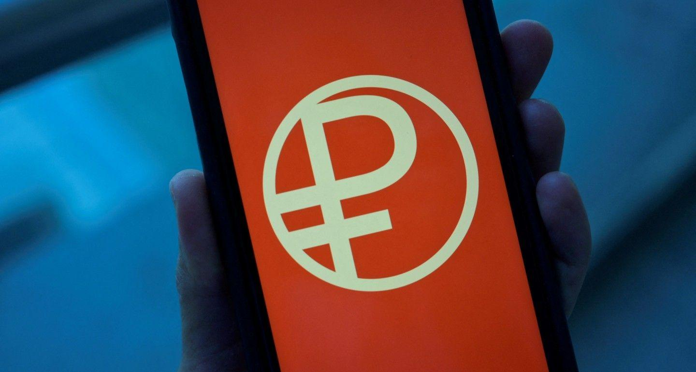

## Table of Contents

## What is the Digital Ruble?

The Digital Ruble is a new form of money being developed by the Central Bank of Russia. It's like the regular Russian Ruble, but it exists only in digital form, not as physical cash. The idea is to make payments easier and faster, especially as more people use smartphones and the internet for shopping and banking.

Just like how you can use cash or a bank card to buy things, you'll be able to use the Digital Ruble. It will be issued and backed by the Central Bank, so it will be safe and reliable. The goal is to make it simple for everyone to use, whether you're buying something online or in a store, and to help the Russian economy grow by making money transactions smoother and more efficient.

## How does the Digital Ruble function as a currency?

The Digital Ruble works just like regular money, but it's all digital. You can use it to buy things, pay bills, or send money to friends, but you won't have physical coins or notes. Instead, you'll use a digital wallet on your phone or computer. When you want to spend your Digital Rubles, you can do it online or even in stores by scanning a code or using an app. The Central Bank of Russia keeps track of all the Digital Rubles, so it's safe and secure.

Like regular money, the Digital Ruble can be used by everyone, from individuals to businesses. You can get Digital Rubles by converting your regular Rubles at a bank or through special apps. Once you have them, you can spend them just like cash, but they're much faster and easier to use, especially for online shopping. The Digital Ruble aims to make money transactions smoother and help the economy by making it easier for people to buy and sell things.

## What is the history behind the development of the Digital Ruble?

The idea of the Digital Ruble started a few years ago when the Central Bank of Russia began looking into new ways to make money easier to use. They saw that more and more people were using smartphones and the internet for shopping and banking, so they thought a digital version of the Ruble could help. In 2020, the Central Bank officially announced they were working on the Digital Ruble. They wanted to create a new form of money that would be safe, fast, and easy for everyone to use.

Since the announcement, the Central Bank has been working hard to develop the Digital Ruble. They've been testing it with banks and other businesses to make sure it works well. They've also been talking to people in Russia to see what they think and to make sure the Digital Ruble meets everyone's needs. The goal is to have the Digital Ruble ready to use by the public soon, so people can start using it for buying things and paying bills in a new, digital way.

## What are the primary objectives of introducing the Digital Ruble?

The main goal of the Digital Ruble is to make money easier and faster to use. The Central Bank of Russia wants to help people buy things and pay bills more easily, especially since more people are using smartphones and the internet. By having a digital version of the Ruble, people won't need to [carry](/wiki/carry-trading) cash or wait for bank transfers. This can make shopping online or in stores quicker and simpler.

Another important aim is to make the Russian economy stronger. When money moves quickly and easily, it can help businesses grow and create more jobs. The Digital Ruble will be safe and reliable because it's backed by the Central Bank. This means people can trust it and use it without worrying about losing their money. By making money transactions smoother, the Digital Ruble can help the whole country's economy do better.

## How does the Digital Ruble compare to other digital currencies like Bitcoin?

The Digital Ruble is different from Bitcoin in some big ways. The Digital Ruble is made by the Central Bank of Russia, so it's like regular money but in digital form. It's safe and backed by the government, which means you can trust it just like you trust cash or money in your bank account. Bitcoin, on the other hand, is not made by any government or bank. It's a kind of money that anyone can use, but it's not controlled by any one person or group, which can make it feel less safe and more unpredictable.

Another difference is how you can use them. The Digital Ruble is meant to be used just like regular money, for buying things in stores or online, paying bills, and sending money to friends. It's designed to work smoothly with the existing money system in Russia. Bitcoin, though, is often used for different reasons. Some people use it to buy things, but others use it more like an investment, hoping its value will go up. Also, not every store or business accepts Bitcoin, while the Digital Ruble is planned to be used everywhere regular Rubles are accepted.

## What are the technological components that support the Digital Ruble?

The Digital Ruble uses a special kind of technology called a "distributed ledger" to keep track of all the money. This is like a big, shared notebook where every transaction is written down and can't be changed. It helps make sure that the money is safe and that no one can cheat or steal. The Central Bank of Russia uses this technology to manage the Digital Ruble, making sure it works well and is secure for everyone to use.

Another important part is the digital wallet. This is an app on your phone or computer where you keep your Digital Rubles. When you want to spend them, you can use this app to send money to someone else or pay for things. The wallet connects to the Central Bank's system, so it can check that you have enough money and that the transaction goes through smoothly. This makes using the Digital Ruble easy and fast, just like using a bank card or cash.

## What are the potential economic impacts of the Digital Ruble on Russia's economy?

The Digital Ruble could help Russia's economy by making it easier for people to buy and sell things. When money moves quickly and easily, businesses can grow faster. This can create more jobs and help the economy get stronger. The Digital Ruble is backed by the Central Bank, so people will trust it and use it more, which means more money will be spent and more goods and services will be bought. This can make the whole country's economy do better.

Another way the Digital Ruble can help is by making banking cheaper and easier. Right now, it can cost money to send money or use a bank. But with the Digital Ruble, these costs might go down because everything is digital. This can help more people and businesses use banking services, which can bring more people into the economy. Overall, the Digital Ruble could make money work better for everyone in Russia, helping the economy grow in new ways.

## How is the security and privacy of the Digital Ruble ensured?

The Digital Ruble is kept safe and private in a few important ways. The Central Bank of Russia uses a special kind of technology called a distributed ledger to keep track of all the money. This is like a big, shared notebook where every transaction is written down and can't be changed. It helps make sure that no one can cheat or steal your money. Also, the Central Bank has strong rules and checks to make sure the system is safe and that only you can use your Digital Rubles.

For privacy, the Digital Ruble is designed to keep your information private. When you use the Digital Ruble, the Central Bank can see the transactions, but they don't share your personal information with others. They follow strict rules to protect your privacy, so you can feel safe knowing that your money and your details are kept private. This way, you can use the Digital Ruble without worrying about your information being used in the wrong way.

## What are the legal and regulatory frameworks governing the Digital Ruble?

The Digital Ruble is governed by laws and rules made by the Central Bank of Russia. These rules say how the Digital Ruble can be used, how it's kept safe, and how people's privacy is protected. The Central Bank makes sure that everyone follows these rules, so the Digital Ruble works well and stays safe for everyone to use. They also check that banks and other businesses use the Digital Ruble the right way.

The laws also cover how the Digital Ruble can be turned into regular money and back again. This makes sure that people can easily switch between using Digital Rubles and regular Rubles. The Central Bank works with the government to make sure these rules fit with other money laws in Russia, so everything works together smoothly. This helps keep the whole money system strong and trustworthy.

## How can individuals and businesses start using the Digital Ruble?

To start using the Digital Ruble, individuals and businesses will need to set up a digital wallet. This is an app on your phone or computer where you can keep your Digital Rubles. You can get this app from a bank or through a special service provided by the Central Bank of Russia. Once you have the app, you can convert your regular Rubles into Digital Rubles. This is easy to do and can be done at a bank or through the app itself. After you have Digital Rubles in your wallet, you can start using them to buy things, pay bills, or send money to others.

For businesses, using the Digital Ruble means they can accept payments from customers in a new, digital way. They'll need to set up their own digital wallet and connect it to their payment systems. This way, when customers pay with Digital Rubles, the money goes straight into the business's wallet. Businesses will also need to follow the rules set by the Central Bank to make sure everything is done correctly. By using the Digital Ruble, businesses can make their payments faster and easier, which can help them grow and serve their customers better.

## What are the current challenges and limitations of the Digital Ruble?

One of the main challenges of the Digital Ruble is making sure everyone can use it easily. Not everyone in Russia has a smartphone or knows how to use digital wallets. The Central Bank needs to find ways to help these people, like setting up special places where they can use the Digital Ruble without a smartphone. Another challenge is keeping the system safe from hackers. Even though the Central Bank uses strong technology, there's always a risk that someone might try to steal money or mess with the system. They need to keep working on making it safer and safer.

Another limitation is that the Digital Ruble is new, so some people might not trust it yet. They might be used to using regular money and feel safer with cash or bank cards. The Central Bank needs to show people that the Digital Ruble is just as safe and useful. Also, businesses need to set up their systems to accept Digital Rubles, which can take time and money. If not enough businesses accept it, people won't want to use it. The Central Bank has to work with businesses to make sure they can use the Digital Ruble smoothly and see the benefits of doing so.

## What are the future prospects and developments expected for the Digital Ruble?

The future of the Digital Ruble looks promising as the Central Bank of Russia continues to work on making it better and easier to use. They plan to keep improving the technology to make sure it's safe and fast. They also want to make sure more and more people can use it, even if they don't have a smartphone. This might mean setting up special places where people can use the Digital Ruble without needing a digital wallet. The Central Bank is also thinking about new ways to use the Digital Ruble, like making it easier for people to save money or invest it.

In the coming years, we might see the Digital Ruble being used for more things, like paying taxes or getting government help. The Central Bank will keep working with businesses to make sure they can use the Digital Ruble smoothly. This could help the economy grow by making money move faster and easier. As more people start using the Digital Ruble and see how helpful it is, it could become a big part of how people in Russia use money every day.

## References & Further Reading

[1]: Narula, N. (2018). ["Central Bank Digital Currencies: A Framework for Assessing Why and How."](https://www.researchgate.net/publication/311322997_Central_Bank_Digital_Currencies_A_Framework_for_Assessing_Why_and_How) Federal Reserve Bank of Boston.

[2]: Auer, R., Cornelli, G., & Frost, J. (2020). ["Rise of the Central Bank Digital Currencies: Drivers, Approaches and Technologies."](https://www.bis.org/publ/work880.htm) Bank for International Settlements Bulletin.

[3]: Campiglio, E. (2016). ["Central Banks and Climate Change."](https://www.semanticscholar.org/paper/Climate-change-challenges-for-central-banks-and-Campiglio-Dafermos/8002f9bc23e8afce655c7428a8c2b18b40e19a8c) Environmental Innovation and Societal Transitions, Volume 26, Pages 1-16.

[4]: Prasad, E. (2021). ["The Future of Money: How the Digital Revolution is Transforming Currencies and Finance."](https://www.jstor.org/stable/j.ctv33wwv60) Harvard University Press.

[5]: Narayanan, A., Bonneau, J., Felten, E., Miller, A., & Goldfeder, S. (2016). ["Bitcoin and Cryptocurrency Technologies: A Comprehensive Introduction."](https://press.princeton.edu/books/hardcover/9780691171692/bitcoin-and-cryptocurrency-technologies) Princeton University Press.

[6]: Broby, D. (2021). ["Essays on Algorithmic Trading."](https://www.researchgate.net/publication/352521408_Financial_technology_and_the_future_of_banking) ResearchGate.