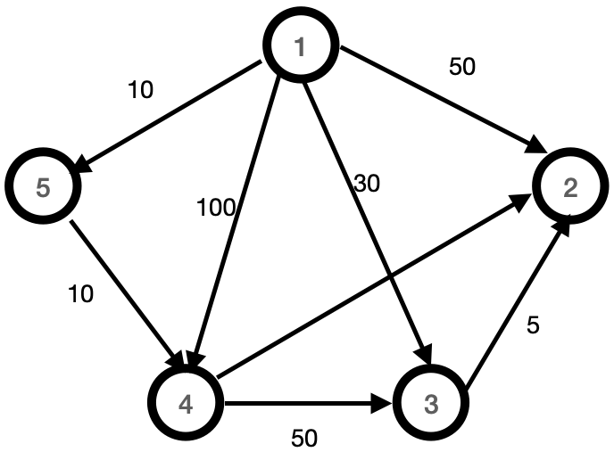

Algorithmic trading, a rapidly evolving area in finance, utilizes complex algorithms to make trading decisions at speeds and frequencies unachievable by human traders. An integral part of this process is the application of efficient and effective algorithms to predict market movements and execute trades optimally. Among the vast array of algorithms employed in computational finance, Prim's Algorithm and Dijkstra's Algorithm stand out as foundational graph-based methods with varied applications.

Prim's Algorithm is designed to find the Minimum Spanning Tree (MST) of a weighted, undirected graph. It constructs a tree connecting all vertices with the minimum total edge weight and without any cycles. This property makes Prim’s Algorithm particularly useful for optimizing network design, such as configuring low-cost trading infrastructures or communication networks, where reducing operational costs is a priority.



On the other hand, Dijkstra's Algorithm is primarily used to determine the shortest path from a single source vertex to all other vertices in a graph with non-negative weights. It efficiently finds routes and is commonly employed in network routing and navigation systems. This makes it advantageous in algorithmic trading for tasks like minimizing transaction latency and optimizing data routing paths, which are crucial for high-frequency trading activities.

This article will examine the key differences between Prim's and Dijkstra’s Algorithms, assessing their implications in the context of algo trading. A firm grasp of these algorithms enables traders to enhance their strategies for improved performance. By focusing on their unique features and suitable use cases, traders can apply these algorithms to optimize trading processes and infrastructure, ultimately leading to better trading outcomes.

## Table of Contents

## Overview of Prim's Algorithm

Prim's Algorithm is a fundamental greedy algorithm designed to compute the Minimum Spanning Tree (MST) of a weighted, undirected graph. The MST is critical in representing a subset of edges that connect all vertices in the graph while ensuring there are no cycles and that the cumulative weight of these edges is the smallest possible.

The algorithm's process begins by selecting an arbitrary vertex as the starting point. From there, the algorithm incrementally constructs the MST by adding edges one at a time. At each step, it selects the edge with the smallest weight that connects a vertex that is already part of the MST to a vertex that is not yet included. This process continues until all vertices are incorporated into the MST.

To implement Prim's Algorithm, a common approach is to use a priority queue. This data structure helps efficiently determine the next edge of minimal weight to add to the growing tree. Initially, all vertices are added to the queue with infinite weight, except for the initial vertex, which starts with a weight of zero. As the algorithm progresses, the queue continually provides the next vertex with the smallest edge weight for inclusion in the MST.

Python code implementing Prim's Algorithm can illustrate its practical application:

```python
import heapq

def prim_mst(graph, start_vertex):
    mst = []
    visited = set()
    min_heap = [(0, start_vertex, None)]  # (weight, vertex, parent)

    while min_heap:
        weight, current_vertex, parent = heapq.heappop(min_heap)

        if current_vertex not in visited:
            visited.add(current_vertex)
            if parent is not None:
                mst.append((parent, current_vertex, weight))

            for neighbor, edge_weight in graph[current_vertex]:
                if neighbor not in visited:
                    heapq.heappush(min_heap, (edge_weight, neighbor, current_vertex))

    return mst

# Example graph represented as an adjacency list
graph = {
    0: [(1, 10), (2, 1), (3, 4)],
    1: [(0, 10), (2, 3), (4, 0)],
    2: [(0, 1), (1, 3), (3, 2), (4, 8)],
    3: [(0, 4), (2, 2), (4, 2)],
    4: [(1, 0), (2, 8), (3, 2)]
}

mst_result = prim_mst(graph, 0)
print("Edges in the MST:", mst_result)
```

Prim's Algorithm finds extensive applications in network design. For instance, it helps design cost-efficient communication networks, pipelines, and circuits by establishing the most economical way to ensure connectivity. By minimizing infrastructure costs while still maintaining necessary connections, Prim's Algorithm enables efficient utilization of resources in various fields.

## Overview of Dijkstra's Algorithm

Dijkstra's Algorithm, developed by Edsger Dijkstra in 1956, is a foundational greedy algorithm instrumental in solving the shortest path problem within graphs. It specifically operates on graphs with non-negative edge weights, aiming to determine the shortest path from a designated source vertex to all other vertices. 

The algorithm's efficiency is significantly bolstered by its use of a priority queue, which systematically selects the node with the smallest tentative distance from the set of vertices not yet processed. This selection is crucial as it iteratively refines the shortest path estimates across the graph. The algorithm's hallmark is its assurance that once a vertex's shortest path is calculated, any future paths to that vertex will not present a shorter alternative. This property ensures the robustness of its solution in the context of optimization tasks.

Mathematically, the algorithm maintains an array `dist[]` such that `dist[v]` is the shortest known distance from the source vertex to vertex `v`. Initially, all distances are set to infinity, except for the source vertex which is set to zero. The algorithm proceeds by extracting the vertex with the smallest distance estimate—initially the source vertex—and updating the distances of its adjacent vertices. If a shorter path is found, the distance estimate and parent reference for that vertex are updated accordingly.

Here is a simple Python implementation of Dijkstra's algorithm using a priority queue from the `heapq` library:

```python
import heapq

def dijkstra(graph, start_vertex):
    # Distance dictionary with all distances set to infinity, except the start vertex
    distances = {vertex: float('infinity') for vertex in graph}
    distances[start_vertex] = 0

    # Priority queue to determine the next vertex to process
    priority_queue = [(0, start_vertex)]

    while priority_queue:
        current_distance, current_vertex = heapq.heappop(priority_queue)

        # If a vertex has been processed, skip it
        if current_distance > distances[current_vertex]:
            continue

        # Explore the neighbors of the current vertex
        for neighbor, weight in graph[current_vertex].items():
            distance = current_distance + weight

            # Only consider new paths that are shorter
            if distance < distances[neighbor]:
                distances[neighbor] = distance
                heapq.heappush(priority_queue, (distance, neighbor))

    return distances
```

Dijkstra's Algorithm is optimal for applications such as route planning or network routing protocols exemplified by GPS navigation systems, where accurate and efficient path finding is paramount. However, it is crucial to note its limitations: it is not suitable for graphs containing negative weight edges, which can lead to incorrect calculations of shortest paths because the algorithm assumes that once a path is finalized, no better path will emerge.

The algorithm's combination of simplicity and power has made it a staple in computer science and operations research, underpinning many modern technologies that require efficient graph traversal and pathfinding solutions.

## Differences in Algo Trading Context

In [algorithmic trading](/wiki/algorithmic-trading), choosing the suitable algorithm is contingent on the specific problem that needs addressing. Prim's Algorithm is particularly beneficial for scenarios where the goal is to optimize the cost of network infrastructure. This is crucial in trading systems where reducing overheads associated with communication networks can significantly impact the bottom line. For instance, in a trading ecosystem where multiple servers and data centers need to communicate efficiently without excessive cost, Prim's can construct a Minimum Spanning Tree (MST) to ensure minimal wiring or cabling expenses while maintaining connectivity.

Conversely, Dijkstra's Algorithm is instrumental when the focus is on minimizing transaction costs or latency. This algorithm excels in identifying the shortest and most efficient paths in networks, which is vital when the speed of data transmission can directly influence trade execution outcomes. In high-frequency trading environments, where milliseconds can equate to significant financial gain or loss, Dijkstra's Algorithm can effectively determine the fastest routes for data packets, thereby ensuring quicker decision-making processes.

The core distinction between the two algorithms lies in their objectives. Prim's is centered on reducing network cost by creating an MST, which is optimal for infrastructure applications. In contrast, Dijkstra's is designed for route optimization, making it suitable for applications where time efficiency is paramount. Recognizing these nuances empowers traders to devise algorithms that are not only adaptive to market conditions but also aligned with strategic trade execution priorities, whether it's cost minimization or speed optimization. Understanding these considerations is crucial for developing trading algorithms that are robust and efficient amidst fluctuating market dynamics.

## Practical Applications in Algo Trading

Algorithmic traders can leverage Prim's Algorithm for designing cost-efficient network infrastructures that are critical for reducing communication expenses. Prim's is particularly useful in constructing a Minimum Spanning Tree (MST), which aids in optimizing the layout of a trading system's network, ensuring that necessary data and instructions are transmitted at minimal cost. This approach is crucial in environments where excessive latency can incur significant financial penalties, making efficient network designs imperative.

On the other hand, Dijkstra's Algorithm serves a different purpose by optimizing data flow paths within trading networks to enhance trading speed. This is particularly advantageous for high-frequency trading ([HFT](/wiki/high-frequency-trading-strategies)) platforms where milliseconds can determine the difference between profit and loss. By determining the shortest paths for data packets, Dijkstra's ensures that information is relayed in the fastest manner possible, reducing delays and improving the overall responsiveness of the system.

Both algorithms can be integrated into trading platforms to bolster decision-making processes. Incorporating these algorithms enables the platform to quickly adapt to changing market conditions by either minimizing operational costs or optimizing execution speeds. For instance, during peak trading hours when network congestion might occur, deploying Dijkstra's can help reroute data to avoid bottlenecks, ensuring that trading decisions are executed without unnecessary delay.

By employing these algorithms, traders gain better risk management capabilities and can construct a robust trading infrastructure. Prim's and Dijkstra's not only optimize operations but also contribute to the overall reliability and stability of trading systems. This strategic application of graph-based algorithms aids traders in maintaining a competitive edge by providing enhanced capabilities in risk assessment, cost management, and execution efficiency.

Exploring algorithmic strategies that incorporate Prim's and Dijkstra's Algorithms can yield significant competitive advantages. As traders face increasingly complex market dynamics, leveraging these computational techniques allows for more informed and agile strategies. The ability to swiftly process large volumes of data and execute trades with minimal lag can directly translate into improved performance metrics and better financial outcomes.

## Conclusion

Both Prim's and Dijkstra's Algorithms offer valuable tools for enhancing algorithmic trading operations. Their application hinges on accurately identifying the trading system's specific needs, such as minimizing infrastructure costs or optimizing data paths for speed. The ability to select and implement the appropriate algorithm allows traders to maximize performance and efficiency. 

Prim's Algorithm is particularly useful for scenarios where minimizing network costs is paramount. It constructs a minimum spanning tree for cost-efficient resource allocation, ensuring that all components of a trading network are connected with the minimal total edge weight. This approach is beneficial for designing robust trading infrastructure where communication costs are a significant concern.

On the other hand, Dijkstra's Algorithm excels in optimizing paths to reduce latency, crucial for high-frequency trading environments. By focusing on calculating the shortest path from a source vertex to all other vertices, it helps traders achieve faster transaction speeds by optimizing data flow paths, which is vital in rapidly moving markets.

As technology evolves, the role of these algorithms in trading strategies is likely to expand. Advances in computational power and algorithmic design will enhance their integration into trading platforms, providing traders with advanced tools to adapt to dynamic financial markets. Understanding the fundamental principles and differences of these algorithms ensures traders can leverage them to address challenges and seize opportunities presented by fast-evolving market conditions, thus maintaining competitive edges in algorithmic trading.

## References & Further Reading

[1]: Dijkstra, E. W. (1959). ["A note on two problems in connexion with graphs."](https://link.springer.com/article/10.1007/BF01386390) Numerische Mathematik, 1, 269-271.

[2]: Cormen, T. H., Leiserson, C. E., Rivest, R. L., & Stein, C. (2009). ["Introduction to Algorithms,"](https://books.google.com/books/about/Introduction_to_Algorithms_third_edition.html?id=i-bUBQAAQBAJ) 3rd Edition. The MIT Press.

[3]: Prim, R. C. (1957). ["Shortest connection networks and some generalizations."](https://onlinelibrary.wiley.com/doi/full/10.1002/j.1538-7305.1957.tb01515.x) Bell System Technical Journal, 36(6), 1389–1401.

[4]: Mitchell, J. E. (2004). ["Real-time trading systems and their use in financial markets,"](https://www.researchgate.net/publication/225566633_Financial_Literacy_and_Retirement_Preparedness_Evidence_and_Implications_for_Financial_Education) Journal of Computational Finance, 8(1), 1-20.

[5]: Neapolitan, R. E., & Jiang, X. (2018). ["Artificial Intelligence: With an Introduction to Machine Learning,"](https://www.taylorfrancis.com/books/mono/10.1201/b22400/artificial-intelligence-xia-jiang-richard-neapolitan) 2nd Edition. CRC Press.

[6]: Narang, R. K. (2013). ["Inside the Black Box: A Simple Guide to Quantitative and High Frequency Trading."](https://onlinelibrary.wiley.com/doi/book/10.1002/9781118662717) Wiley.