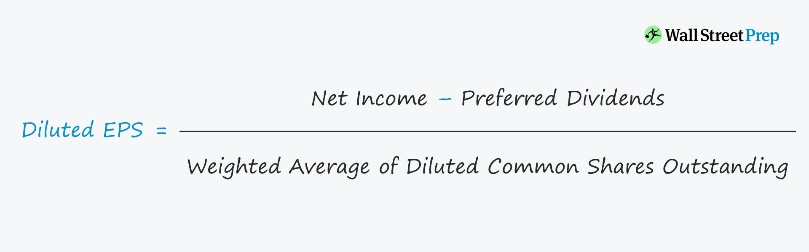

In today's fast-paced financial markets, the ability to interpret and leverage key financial indicators is critical for investors and traders. One such important metric is Diluted Earnings Per Share (Diluted EPS), which plays a pivotal role in assessing a company's profitability potential, especially when convertible securities are involved. Diluted EPS provides a more nuanced view of earnings by considering the impact of convertible securities such as stock options, warrants, and convertible bonds on the ownership structure of a company.

This article examines the concept of Diluted EPS, highlighting its significance in financial analysis and its implications in algorithmic trading. Diluted EPS is not just a number; it is a foundational element for understanding the financial health of a company and making informed investment decisions. By examining the differences between regular Earnings Per Share (EPS) and Diluted EPS, one can appreciate why Diluted EPS is often perceived as a more conservative and comprehensive measure of a company's earning capacity. 



Further, we will discuss the formula for calculating Diluted EPS, which incorporates potential share dilution, providing investors with a worst-case scenario evaluation of a company's financial performance. This depth of analysis is essential for accurately assessing companies with varied capital structures, allowing for a more level comparison across investment opportunities.

Investors and traders can leverage Diluted EPS when developing and refining trading strategies, especially in algorithmic trading, where precise metrics are crucial for decision-making. Understanding Diluted EPS can lead to enhanced investment strategies and improved trading outcomes, underscoring its invaluable role in today's financial markets.

## Table of Contents

## What is Diluted EPS?

Diluted Earnings Per Share (Diluted EPS) is a key financial metric utilized to assess a company's earnings per share, factoring in the potential impact of convertible securities. It provides a conservative estimate of a company's profitability by accounting for the maximum possible increase in the number of shares outstanding. This metric is designed to offer a more comprehensive picture of a company's earnings by considering securities that, while not yet converted into common stock, could potentially dilute earnings per share if exercised.

Convertible securities represent financial instruments that can be converted into common stock under certain conditions. These include stock options, which are contracts allowing the holder to buy or sell stock at a predetermined price within a specific period; warrants, which provide the right to purchase stock at a set price, usually at a future date; convertible bonds, which are bonds that can be converted into a stipulated number of shares; and preferred shares with conversion options to common stock. Each of these instruments increases the potential shares available, thus impacting the calculation of Diluted EPS.

The inclusion of potential shares in the Diluted EPS calculation offers a more cautious perspective of a company's earnings per share than basic EPS, which only considers currently outstanding shares. This foresight into possible share dilutions helps analysts and investors anticipate scenarios where a company's reported earnings might decrease if all convertible securities are exercised. This foresight is instrumental in understanding the implications for shareholder value, especially if a company's stock is significantly impacted by the conversion of these securities.

By acknowledging and integrating all potential shares from convertible securities, Diluted EPS enables investors to identify the worst-case scenario regarding earnings per share, thereby supporting more informed decision-making in investment and trading contexts.

## EPS vs. Diluted EPS

Earnings Per Share (EPS) and Diluted Earnings Per Share (Diluted EPS) are essential metrics for assessing a company's profitability. While both provide insights into a company's earnings relative to its outstanding shares, they differ in the scope of share count considered in the calculations.

Basic EPS is calculated using the formula:

$$
\text{EPS} = \frac{\text{Net Income} - \text{Preferred Dividends}}{\text{Weighted Average Number of Common Shares Outstanding}}
$$

This measurement considers only the shares currently outstanding, providing a snapshot of earnings allocated to each share without contemplating potential share dilution from convertible instruments.

Conversely, Diluted EPS takes into consideration all possible shares that could be created through the conversion of convertible securities. These convertible instruments include stock options, warrants, convertible bonds, and preferred shares, which can be converted into common stock. The formula for Diluted EPS is:

$$
\text{Diluted EPS} = \frac{\text{Net Income} - \text{Preferred Dividends}}{\text{Weighted Average Number of Shares Outstanding + All Convertible Securities}}
$$

Diluted EPS offers a more conservative and comprehensive measure because it assumes a worst-case scenario where all convertible securities are exercised, potentially reducing the earnings attributed to each share. This pessimistic view is preferred by investors seeking to understand the consequences of various dilution scenarios on their investments.

Understanding these differences is crucial for investors aiming to accurately gauge a company's [earning](/wiki/earning-announcement) potential. Basic EPS may provide an initial impression of profitability, but Diluted EPS reveals the potential impact of all convertible securities, offering a realistic view of earnings per share under the assumption that every possible conversion occurs. This insight is invaluable for making informed decisions, especially when comparing companies with varying capital structures. By incorporating potential share dilution, investors can better grasp the risk of earnings per share being diminished due to future conversions, ultimately guiding more secure investment strategies.

## Formula and Calculation of Diluted EPS

Diluted Earnings Per Share (Diluted EPS) is calculated by adjusting the basic Earnings Per Share (EPS) to account for the effect of all potential dilutive securities. The formula for diluted EPS is:

$$
\text{Diluted EPS} = \frac{\text{Net Income} - \text{Preferred Dividends}}{\text{Weighted Average Shares Outstanding} + \text{Convertible Securities}}
$$

In this calculation, "Net Income" represents the total earnings of a company after all expenses and taxes have been deducted. "Preferred Dividends" are subtracted from the net income when calculating EPS to focus on earnings available to common shareholders. The "Weighted Average Shares Outstanding" considers the time period shares have been outstanding during the reporting period, ensuring a more accurate EPS figure. Finally, "Convertible Securities" account for potential shares that could be issued from instruments like stock options, convertible bonds, and warrants, which may dilute the earnings per share.

To illustrate this with an example, consider a company with a net income of $1,000,000, preferred dividends of $100,000, weighted average shares outstanding of 500,000, and potential additional shares of 100,000 from convertible securities. The calculation would be:

$$
\text{Basic EPS} = \frac{1,000,000 - 100,000}{500,000} = 1.8
$$

$$
\text{Diluted EPS} = \frac{1,000,000 - 100,000}{500,000 + 100,000} = \frac{900,000}{600,000} = 1.5
$$

This example shows how the potential issuance of additional shares reduces the EPS from 1.8 to 1.5, highlighting the dilutive effect of convertible securities.

For investors and analysts, understanding the calculation of diluted EPS is crucial, as it provides a more conservative measure of a company’s earnings and takes into account all potential future claims on its earnings. The use of diluted EPS helps paint a realistic picture of the earnings attributable to each share, should all dilutive securities be converted to equity, thereby guiding more informed investment decisions.

## Importance of Diluted EPS in Financial Analysis

Diluted Earnings Per Share (Diluted EPS) is an essential metric in financial analysis, providing investors and analysts with a comprehensive understanding of a company's profitability potential. It adjusts the basic earnings per share (EPS) to consider the impact of convertible securities, such as stock options, warrants, and convertible bonds, which could be converted into additional common shares. By incorporating these potential shares, Diluted EPS portrays a company's worst-case profitability scenario, enhancing the accuracy of financial assessments.

The impact of potential share dilution on EPS is vital in assessing a company's financial health. When convertible securities are exercised, the outstanding shares increase, which can dilute the earnings attributable to each share. This dilution can significantly affect the net income allocated per share, hence the emphasis on Diluted EPS as a conservative measure of profitability.

Consider the formula for Diluted EPS:

$$
\text{Diluted EPS} = \frac{\text{Net Income} - \text{Preferred Dividends}}{\text{Weighted Average Shares} + \text{Convertible Securities}}
$$

In this formula, the net income is reduced by preferred dividends if applicable, and the denominator includes both the weighted average shares outstanding and potential shares from convertible securities. This adjustment is crucial for understanding how earnings could be impacted by future conversions, offering a realistic picture of a company's earning capacity.

The significance of Diluted EPS grows when comparing companies with different capital structures. Companies with numerous convertible securities may present a robust basic EPS, but their Diluted EPS could reveal a more constrained profitability picture due to potential dilution. This insight is invaluable for investors making decisions on investments, particularly when evaluating companies with varying levels of debt, equity, and convertible options.

Additionally, Diluted EPS assists in identifying potential risks associated with earnings projections. Companies often use stock options and convertible bonds to incentivize stakeholders or finance operations. While these instruments can fuel growth, they also [carry](/wiki/carry-trading) the risk of earnings dilution. By factoring in the possible conversion of these securities, Diluted EPS allows analysts to assess the extent to which earnings could be diluted, thus enabling more informed investment decisions.

For financial analysts, Diluted EPS is a tool to compare equity securities on a consistent basis. It levels the playing field by recognizing the potential impact of different capital strategies on earnings, making it easier to gauge the true earning potential of investments across diverse firms. It's an anchor for projecting future earnings scenarios, helping analysts to model varying outcomes based on potential stock dilution events.

In summary, Diluted EPS provides critical insight into financial viability and stability. By accounting for potential dilution, it ensures a more accurate measure of a company’s earnings, supporting informed investment choices and offering a clearer view of financial health across different capital structures. This metric's conservative nature aligns closely with prudent investment strategies, highlighting its importance in comprehensive financial analysis.

## Using Diluted EPS in Algorithmic Trading

Algorithmic trading, characterized by the use of automated systems for making trade decisions, integrates a range of financial indicators to optimize strategies. Diluted Earnings Per Share (Diluted EPS) is one such indicator that traders can incorporate into their algorithms to enhance decision-making processes. By considering the potential dilution of shares, Diluted EPS offers a more holistic view of a company's earnings potential, aiding traders in developing robust strategies.

### Incorporating Diluted EPS in Algorithms

In [algorithmic trading](/wiki/algorithmic-trading), Diluted EPS can be used to evaluate a company's profitability when designing algorithms aimed at identifying under- or overvalued stocks. Given its ability to account for the conversion of securities into shares, Diluted EPS provides a conservative estimate of earnings per share, offering a cautionary perspective on stock valuation.

Here is a basic example of how Diluted EPS might be incorporated into a Python-based trading algorithm:

```python
import pandas as pd

def fetch_financial_data(ticker):
    # Hypothetical function to fetch financial data.
    return pd.DataFrame({
        'Date': ['2023-01-01', '2023-02-01', '2023-03-01'],
        'Diluted_EPS': [5.0, 5.2, 5.1],
        'Stock_Price': [150, 152, 151]
    })

def diluted_eps_strategy(ticker):
    # Fetch financial data
    data = fetch_financial_data(ticker)

    # Define threshold for EPS
    eps_threshold = 5.1

    # Generate buy/sell signals
    signals = data['Diluted_EPS'].apply(lambda eps: 'Buy' if eps > eps_threshold else 'Sell')

    # Pair with stock price for context
    trades = pd.DataFrame({'Date': data['Date'], 'Signal': signals, 'Stock_Price': data['Stock_Price']})

    return trades

# Example usage
ticker = "XYZ"
trade_signals = diluted_eps_strategy(ticker)
print(trade_signals)
```

### Algorithm Development Strategies Utilizing Diluted EPS

1. **Value Investing Approach**: Algorithms can leverage Diluted EPS to identify stocks that are priced attractively relative to their earnings potential. By setting criteria for minimum Diluted EPS values, traders can filter for companies demonstrating strong profit potential while accounting for dilution.

2. **Comparative Analysis Across Sectors**: Diluted EPS can facilitate comparative analysis between companies within the same sector. By normalizing earnings estimates for potential dilution, traders can identify stocks within the same industry that may be undervalued or overvalued relative to peers, utilizing this information to calibrate market positions.

3. **Risk Management**: Incorporating Diluted EPS in risk assessment frameworks reinforces a more comprehensive evaluation, especially for companies with complex capital structures. Algorithms can adjust risk-weighted positions based on Diluted EPS to avoid stocks with volatile or uncertain future profit scenarios.

By integrating Diluted EPS into algorithmic frameworks, traders can create more nuanced and responsive models that accommodate the complexities of convertible securities. This integration enhances the ability to make informed trading decisions and optimize investment performance. Keeping abreast of developments and continuously fine-tuning models with reliable financial metrics like Diluted EPS is crucial for succeeding in dynamic financial markets.

## Conclusion

Diluted EPS is a valuable tool for both investors and traders, providing a more comprehensive view of a company's earnings potential by accounting for all possible sources of share dilution. By understanding both current earnings and the impact of convertible securities, investors can make more informed decisions that reflect a company's true financial health. This metric enables a conservative assessment, factoring in potential dilution to present a worst-case earnings scenario.

Accurate application of Diluted EPS can greatly enhance investment strategies by enabling investors to compare companies with varying capital structures, ultimately leading to more prudent portfolio choices. Additionally, in the context of algorithmic trading, professional traders and data scientists can incorporate Diluted EPS into trading algorithms to refine trade execution strategies based on quantitative analysis. For example, algorithms could be designed to trigger buy or sell signals when a company's Diluted EPS metric deviates significantly from its historical average or industry benchmarks.

As financial markets continue to evolve, staying updated with how financial metrics like Diluted EPS are utilized in trading scenarios is crucial for achieving market success. Embracing technological advancements and integrating comprehensive metrics into trading strategies can provide a competitive edge and optimize overall trading performance.

## References & Further Reading

[1]: Fishman, M. J., & Hagerty, K. M. (1996). [Earnings, Dilution, and Per Share Measures: Understanding the Incentives.](https://www.bauer.uh.edu/nlangberg/papers_shiva/Fishmand%20Hagerty%201992%20RAND.pdf) The Accounting Review, 71(1), 43-68.

[2]: ["Financial Statement Analysis and Security Valuation"](https://www.mheducation.com/highered/product/financial-statement-analysis-security-valuation-penman/M9780078025310.html) by Stephen H. Penman

[3]: ["Valuation: Measuring and Managing the Value of Companies"](https://www.amazon.com/Valuation-Measuring-Managing-Companies-Finance/dp/1119610885) by McKinsey & Company Inc. and Tim Koller

[4]: ["Financial Modeling"](https://www.investopedia.com/terms/f/financialmodeling.asp) by Simon Benninga

[5]: ["Algorithmic Trading: Winning Strategies and Their Rationale"](https://github.com/prabakar2610/TradingBooks/blob/master/Algorithmic%20Trading%20-%20Winning%20Strategies%20and%20Their%20Rationale%202013.pdf) by Ernest P. Chan