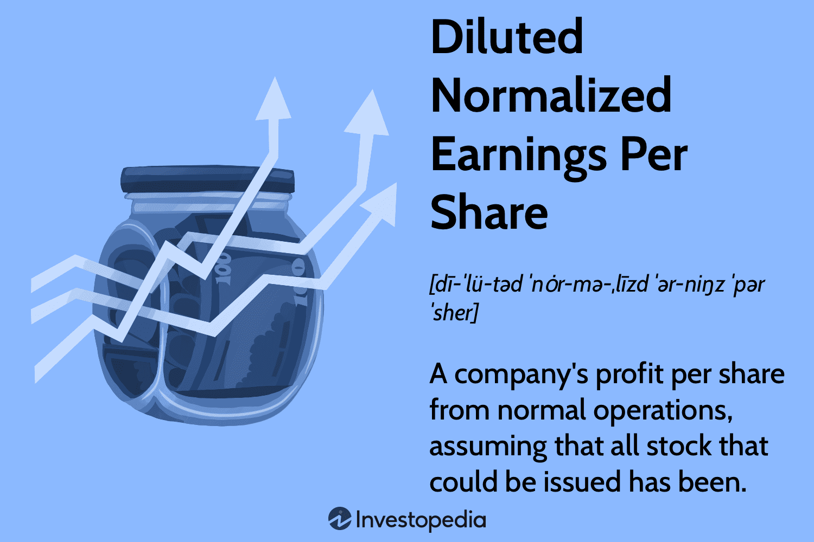

## Table of Contents

## What is Diluted Normalized Earnings Per Share (DNEPS)?

Diluted Normalized Earnings Per Share (DNEPS) is a financial metric that shows how much money a company makes for each of its shares, after making some adjustments. It takes into account all the possible shares that could be created from things like stock options or convertible bonds, which might dilute the value of existing shares. This gives a more realistic picture of the company's earnings per share, as if all those extra shares were already out there.

To calculate DNEPS, you start with the company's normalized earnings, which means you adjust the reported earnings to remove any one-time gains or losses that aren't part of the company's regular business. Then, you divide these normalized earnings by the total number of shares that would be outstanding if all dilutive securities were converted into common stock. This helps investors see a clearer, more consistent view of the company's performance, making it easier to compare with other companies or over different time periods.

## How is DNEPS different from basic earnings per share?

DNEPS, or Diluted Normalized Earnings Per Share, is different from basic earnings per share because it considers more factors. Basic earnings per share is calculated by taking the company's net income and dividing it by the number of shares that are currently out there. It's a straightforward way to see how much profit the company made per share. But, it doesn't account for things that could change the number of shares in the future, like stock options or convertible bonds.

On the other hand, DNEPS looks at what would happen if all those extra shares from options or bonds were actually created. This is called dilution, and it can lower the value of each share. So, DNEPS gives a more cautious view of the company's earnings by using a bigger number of shares in its calculation. Also, DNEPS uses normalized earnings, which means it adjusts the company's profits to remove any unusual one-time events that don't reflect the company's regular performance. This makes DNEPS a more stable and comparable measure over time and across different companies.

## Why is it important to consider dilution in earnings per share?

Considering dilution in earnings per share is important because it gives a more accurate picture of what each share is really worth. If a company has stock options or convertible bonds, these can turn into more shares in the future. This means the value of the existing shares could go down because there would be more shares to share the same amount of profit. By looking at dilution, investors can see what the earnings per share might be if all those extra shares were created, helping them understand the true value of their investment.

Also, dilution helps investors make better decisions by showing them the potential impact on their ownership. If a company issues more shares, each existing share represents a smaller piece of the company. This is important for investors to know because it can affect how much control they have and how much they might earn from dividends. By considering dilution, investors can plan better and avoid surprises that could affect their investment's value.

## What are the key components used to calculate DNEPS?

To calculate Diluted Normalized Earnings Per Share (DNEPS), you need two main pieces of information: the company's normalized earnings and the total number of shares that would be out there if all possible extra shares were created. Normalized earnings are what the company earns after you take out any unusual one-time gains or losses. These adjustments help show the company's regular business performance more clearly.

The other part is figuring out the total number of shares, which includes not just the shares that exist now but also all the shares that could come from things like stock options or convertible bonds. This is called the diluted share count. When you divide the normalized earnings by this bigger number of shares, you get the DNEPS. This gives investors a more realistic idea of what each share is worth, taking into account all the possible shares that might be created in the future.

## How do you calculate DNEPS?

To calculate Diluted Normalized Earnings Per Share (DNEPS), you start with the company's normalized earnings. Normalized earnings are the company's profits after you take away any one-time gains or losses that don't show the regular business performance. This helps give a clearer picture of how much money the company is making from its normal operations.

Next, you figure out the total number of shares that would exist if all possible extra shares were created. This includes the shares that are out there now, plus any more shares that could come from things like stock options or convertible bonds. This bigger number of shares is called the diluted share count. To find the DNEPS, you divide the normalized earnings by this diluted share count. This shows investors a more realistic value of each share, considering all the shares that might be created in the future.

## What adjustments are made to normalize earnings for DNEPS?

To normalize earnings for DNEPS, you take out any one-time gains or losses that don't show the company's regular business performance. This means you look at the company's profit and remove any unusual events, like selling a big piece of property or facing a large lawsuit settlement. By doing this, you get a clearer picture of how much money the company is making from its normal operations.

These adjustments help investors see a more stable and consistent view of the company's earnings. Without normalizing, the earnings might look very different from one year to the next just because of these one-time events. By removing them, you can better compare the company's performance over time and with other companies, making it easier to understand how well the business is really doing.

## Can you provide an example of how DNEPS is calculated in a real-world scenario?

Let's say there's a company called ABC Corp. ABC Corp made a profit of $10 million last year, but included in that profit was a one-time gain of $2 million from selling a piece of land. To find the normalized earnings, you subtract that $2 million one-time gain from the total profit. So, the normalized earnings for ABC Corp would be $10 million - $2 million = $8 million.

Now, ABC Corp has 1 million shares out there right now, but they also have stock options that could turn into another 200,000 shares and convertible bonds that could become another 100,000 shares. Adding these up, the total number of shares if all these were converted would be 1 million + 200,000 + 100,000 = 1.3 million shares. To calculate the Diluted Normalized Earnings Per Share (DNEPS), you divide the normalized earnings by the total number of shares that could exist. So, DNEPS for ABC Corp would be $8 million divided by 1.3 million shares, which comes out to about $6.15 per share.

## How does DNEPS impact financial analysis and investment decisions?

DNEPS helps investors understand how much money a company is really making for each share, even if more shares could be made later. By using DNEPS, investors can see a clearer picture of the company's earnings without being surprised by things like stock options or bonds turning into more shares. This makes it easier to compare how well the company is doing over time or against other companies. When investors know what the earnings per share might look like if all those extra shares were created, they can make smarter choices about whether to buy, hold, or sell the stock.

Using DNEPS also helps investors look at the company's performance in a more stable way. Since DNEPS takes out one-time gains or losses, it shows what the company earns from its regular business. This is important because it helps investors see if the company is growing its profits in a steady way. By focusing on normalized earnings and considering all possible shares, investors can get a better idea of the company's true value and potential for future growth, which can guide their investment decisions.

## What are the limitations and potential pitfalls of using DNEPS?

DNEPS can be a useful tool, but it has some limitations. One big problem is that figuring out how many extra shares might be made from things like stock options or bonds can be tricky. Companies might guess wrong, which means the DNEPS number could be off. Also, DNEPS doesn't tell the whole story about a company's health. It's just one number and doesn't show things like how much debt the company has or if they're spending too much money.

Another issue is that normalizing earnings can be a bit of a guessing game too. Deciding what counts as a one-time event and what doesn't can be different from one company to another. This means that DNEPS can be hard to compare across different companies because each one might do the math a little differently. Investors need to be careful and look at other information too, not just DNEPS, to get a full picture of how a company is doing.

## How do regulatory standards affect the calculation and reporting of DNEPS?

Regulatory standards play a big role in how companies calculate and report DNEPS. In the United States, the Financial Accounting Standards Board (FASB) sets rules that companies have to follow. These rules say how to figure out the number of shares that could be made from things like stock options or bonds, and how to adjust earnings to make them "normalized." This helps make sure that all companies are doing the math the same way, so investors can trust the numbers they see.

But, even with these rules, there can still be some differences in how companies report DNEPS. This is because the rules can be a bit open to interpretation, especially when it comes to deciding what counts as a one-time event that should be taken out of earnings. Also, different countries might have their own rules, which can make it hard to compare DNEPS numbers from companies in different places. So, while regulatory standards help a lot, investors still need to be careful and look at other information too.

## In what ways can companies manipulate DNEPS, and how can investors detect such manipulations?

Companies can manipulate DNEPS by playing around with what they count as one-time events when they normalize their earnings. For example, they might call something a one-time cost even if it happens a lot, to make their normalized earnings look better. They can also change how they guess the number of extra shares that might come from stock options or bonds. If they think fewer shares will be made, the DNEPS will look higher than it should.

Investors can spot these tricks by looking at the company's financial reports carefully. They should check if the same kinds of costs keep being called one-time events, which could mean the company is trying to make its earnings look better. Also, investors can compare the company's DNEPS with other similar companies to see if it looks too high or too low. If something seems off, they can dig deeper into the details to find out why.

## How does DNEPS vary across different industries, and what industry-specific factors should be considered?

DNEPS can be different across industries because each industry has its own way of making money and dealing with costs. For example, tech companies often give out a lot of stock options to their workers. This means they might have a lot more shares that could be made later, which can make their DNEPS lower than companies in other industries. On the other hand, companies in stable industries like utilities might not have as many stock options or one-time costs, so their DNEPS might look higher and more steady.

When looking at DNEPS, it's important to think about what's normal for each industry. For instance, in the energy sector, companies might have big one-time costs from drilling new wells or fixing old ones. These costs should be taken out to see the real earnings from selling energy. In the retail industry, companies might have a lot of one-time costs from opening new stores or closing old ones. Investors need to know these industry-specific things to understand if a company's DNEPS number is good or not.

## What are the key concepts of Diluted Normalized EPS?

Diluted normalized EPS is an essential metric for investors as it reflects a company's earnings per share (EPS) after accounting for all potential shares that could be created through the conversion of convertible securities such as bonds, stock options, and warrants. This adjustment provides a more realistic picture of a company's earnings potential by considering the effect of possible dilution.

In contrast to regular EPS, which simply divides net income by the weighted average number of common shares outstanding, diluted EPS incorporates the impact of potential common shares. This can be critical for understanding a company's full income potential per share and for assessing potential earnings dilution. For example, if a company has issued convertible bonds, these could potentially be converted to a significant number of shares, thereby reducing the eventual EPS if these conversions do occur.

The formula for calculating diluted normalized EPS is as follows:

$$

\text{Diluted EPS} = \frac{\text{Net Income} - \text{Preferred Dividends}}{\text{Weighted Average Shares} + \text{Convertible Securities}}
$$

To arrive at the normalized EPS, one must strip away one-off items such as extraordinary revenues or expenses that do not reflect the company's regular operations, providing a clearer view of the sustainable earnings. 

A significant discrepancy between the normalized and diluted EPS could indicate potential risks. For example, if the diluted EPS is significantly lower than the normalized EPS, this could indicate that the company has a large number of convertible securities that, if converted, could substantially dilute earnings and might signal potential risk regarding future earnings per share for current investors. This situation requires careful scrutiny to assess whether the company's underlying earnings are at risk due to potential dilution. 

Therefore, diluted normalized EPS serves as a crucial indicator, allowing investors to gauge the potential impact of dilution on earnings and make more informed decisions regarding the genuine profitability of a company.

## References & Further Reading

[1]: ["Advances in Financial Machine Learning"](https://www.amazon.com/Advances-Financial-Machine-Learning-Marcos/dp/1119482089) by Marcos Lopez de Prado

[2]: ["Evidence-Based Technical Analysis: Applying the Scientific Method and Statistical Inference to Trading Signals"](https://www.amazon.com/Evidence-Based-Technical-Analysis-Scientific-Statistical/dp/0470008741) by David Aronson

[3]: ["Machine Learning for Algorithmic Trading"](https://github.com/stefan-jansen/machine-learning-for-trading) by Stefan Jansen

[4]: ["Quantitative Trading: How to Build Your Own Algorithmic Trading Business"](https://www.amazon.com/Quantitative-Trading-Build-Algorithmic-Business/dp/1119800064) by Ernest P. Chan