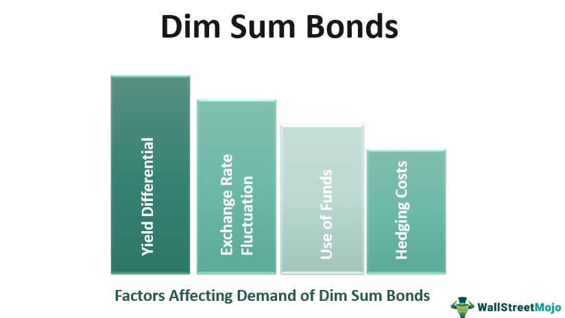

## Table of Contents

## What are Dim Sum Bonds?

Dim Sum Bonds are bonds that are issued in Chinese yuan but outside of mainland China, usually in Hong Kong. They are named after a popular Chinese cuisine, dim sum, because they are meant to be small and easy to digest, just like the food. These bonds allow investors from around the world to invest in Chinese currency without having to go through the complicated process of investing directly in China.

The main reason for issuing Dim Sum Bonds is to raise funds in Chinese yuan. This can be attractive to companies and governments that want to tap into the growing Chinese market without being exposed to the risks of investing directly in China. For investors, Dim Sum Bonds offer a way to diversify their portfolios and gain exposure to the Chinese currency, which can be beneficial if the yuan appreciates in value.

## What are Panda Bonds?

Panda Bonds are bonds that are issued in Chinese yuan but inside mainland China by foreign entities. They are called Panda Bonds because they are issued in China, just like how pandas are native to China. These bonds let foreign companies and governments borrow money in China using the Chinese currency, the yuan.

Panda Bonds are useful for foreign entities that want to raise money in China. They can attract Chinese investors who want to invest in their own currency. For the issuers, it's a way to get funds without changing their money into another currency, which can save them money and reduce risk.

## How do Dim Sum Bonds differ from Panda Bonds?

Dim Sum Bonds and Panda Bonds are both bonds that are issued in Chinese yuan, but they are different in where they are issued and who can issue them. Dim Sum Bonds are issued outside of mainland China, usually in Hong Kong. They can be issued by any company or government, not just Chinese ones. This means that investors from around the world can buy them and invest in Chinese currency without going directly into China.

On the other hand, Panda Bonds are issued inside mainland China, but only by foreign companies or governments. This lets them borrow money in China using the yuan. Chinese investors can buy these bonds and invest in their own currency. So, while Dim Sum Bonds are for global investors and issued outside China, Panda Bonds are for Chinese investors and issued inside China by foreigners.

In summary, the main differences are the location of issuance and who can issue the bonds. Dim Sum Bonds are more accessible to a global audience and issued in places like Hong Kong, whereas Panda Bonds are issued in China and are specifically for foreign entities wanting to tap into the Chinese market.

## Why are they called Dim Sum Bonds and Panda Bonds?

Dim Sum Bonds are called that because they are like the small Chinese dishes known as dim sum. These bonds are meant to be easy to buy and understand, just like the food is easy to eat. They are issued in Chinese yuan but outside of China, usually in Hong Kong. The name "Dim Sum Bonds" helps people remember that these bonds are small and accessible, like the food they are named after.

Panda Bonds got their name because they are issued inside China, just like how pandas are native to China. These bonds are for foreign companies or governments that want to borrow money in China using the yuan. The name "Panda Bonds" makes it clear that they are connected to China, where pandas come from. It's a simple way to remember that these bonds are issued in China by foreigners.

## Who typically issues Dim Sum Bonds?

Dim Sum Bonds are usually issued by big companies and governments. These can be from China or other countries. They want to raise money in Chinese yuan but outside of China, often in Hong Kong. This helps them reach investors from around the world who want to invest in Chinese currency without going directly into China.

These bonds are popular because they let issuers tap into the growing Chinese market without the risks of investing directly in China. For example, a big company from Europe might issue Dim Sum Bonds to raise money in yuan. This way, they can attract investors who like the idea of investing in China but prefer to do it in a place like Hong Kong.

## Who typically issues Panda Bonds?

Panda Bonds are usually issued by foreign companies and governments. They want to borrow money in China using the Chinese yuan. This helps them reach Chinese investors who want to invest in their own currency. For example, a big company from Japan might issue Panda Bonds to raise money in China.

These bonds are useful because they let foreign entities tap into the Chinese market directly. They can attract Chinese investors who are interested in investing in foreign companies or governments but want to do it in yuan. This can be a good way for foreign issuers to get funds without changing their money into another currency, which saves them money and reduces risk.

## What are the benefits of issuing Dim Sum Bonds?

Issuing Dim Sum Bonds has many benefits for companies and governments. They can raise money in Chinese yuan without going directly into China. This is good because it lets them reach investors from around the world who want to invest in the Chinese currency but prefer to do it outside of China. It's also easier and less risky than investing directly in China.

Another benefit is that Dim Sum Bonds can attract a lot of investors. Since they are issued in places like Hong Kong, they are easy for global investors to buy. This helps companies and governments get more money from different places. Plus, it's a way to tap into the growing Chinese market without the risks of investing directly in China.

## What are the benefits of issuing Panda Bonds?

Issuing Panda Bonds has big benefits for foreign companies and governments. They can raise money in Chinese yuan right inside China. This is good because it lets them reach Chinese investors who want to invest in their own currency. It's a way for foreign entities to get funds without changing their money into another currency, which can save them money and reduce risk.

Plus, Panda Bonds help foreign companies and governments tap into the huge Chinese market. By issuing these bonds, they can attract a lot of Chinese investors who are interested in investing in foreign companies or governments but want to do it in yuan. This can be a big advantage because it lets them get money directly from China without the complications of investing in other ways.

## What are the risks associated with investing in Dim Sum Bonds?

Investing in Dim Sum Bonds comes with some risks. One big risk is that the Chinese yuan can change in value. If the yuan goes down compared to other money, like the US dollar, then the money you get back from the bond might be worth less. This can be a problem if you need to change the yuan back into your own country's money. Also, there can be risks with the company or government that issued the bond. If they have money problems, they might not be able to pay you back.

Another risk is that the rules for these bonds can change. Since Dim Sum Bonds are issued outside of China, usually in Hong Kong, the rules there can change. This might affect how easy it is to buy or sell the bonds. Also, since these bonds are in Chinese yuan, there can be risks from changes in China's economy or rules about money. If something big happens in China, it could affect the value of the bonds.

## What are the risks associated with investing in Panda Bonds?

Investing in Panda Bonds can be risky because the Chinese yuan can change in value. If the yuan goes down compared to other money, like the US dollar, the money you get back from the bond might be worth less. This can be a big problem if you need to change the yuan back into your own country's money. Also, there's a risk with the foreign company or government that issued the bond. If they have money problems, they might not be able to pay you back.

Another risk is that China's rules about money can change. Since Panda Bonds are issued inside China, changes in rules can affect how easy it is to buy or sell the bonds. If something big happens in China's economy, it could affect the value of the bonds. This means that investing in Panda Bonds can be tricky because you have to think about both the risks from the bond issuer and the risks from changes in China's economy and rules.

## How have Dim Sum Bonds and Panda Bonds impacted the global financial market?

Dim Sum Bonds and Panda Bonds have helped make the Chinese yuan more important in the world's money markets. By letting companies and governments from different countries borrow money in yuan, these bonds have made the Chinese currency more popular. This means more people and businesses around the world can invest in China without going there directly. It has also helped China share its money more with other countries, making the yuan a bigger part of the world's money system.

These bonds have also brought more investors to China's money markets. Dim Sum Bonds are easy for people from all over the world to buy because they are sold in places like Hong Kong. Panda Bonds let Chinese people invest in foreign companies and governments using their own money. This has made China's money markets bigger and more interesting to people everywhere. It has also helped China become a bigger player in the world's money markets, giving more choices to investors and helping businesses grow.

## What future trends can we expect for Dim Sum Bonds and Panda Bonds?

In the future, we might see more companies and governments using Dim Sum Bonds and Panda Bonds to raise money in Chinese yuan. As more people around the world want to invest in China, these bonds will become even more popular. This could make the Chinese yuan a bigger part of the world's money system. Also, as China's economy keeps growing, more foreign companies might want to borrow money in China using Panda Bonds. This will help bring more money into China's markets and make them even stronger.

Another trend could be more rules and changes from China that affect these bonds. As China wants to control its money better, it might change the rules for Dim Sum and Panda Bonds. This could make it easier or harder for people to buy and sell these bonds. But if the rules are clear and fair, it could help more investors feel safe about putting their money into these bonds. Overall, these bonds will keep playing a big role in connecting China's money markets with the rest of the world.

## References & Further Reading

[1]: McCauley, R. N., & Yeaple, S. R. (2014). ["How does developing local bond markets affect dollar dependence?"](https://scholarblogs.emory.edu/robertnmccauley/publications/articles-and-chapters/) BIS Quarterly Review. Bank for International Settlements.

[2]: Cai, K. N. (2013). ["The Renminbi’s Ascendance & Dim Sum Bonds"](https://www.jegs.com/tech-articles/cold-air-intakes-how-much-horsepower-it-can-add-to-your-vehicle/) Investopedia.

[3]: Li, T., & Thin, L. (2019). ["The Development of China's Onshore and Offshore RMB Markets"](https://pubs.acs.org/doi/10.1021/acs.jpcc.4c06906) Centre for International Governance Innovation.

[4]: Chen, L., & Zhu, Z. (2015). ["Overview of China's bond market and unique characteristics of Panda Bonds."](https://www.researchgate.net/publication/274013050_Social_Media_and_Human_Need_Satisfaction_Implications_for_Social_Media_Marketing) ChinaBond.

[5]: Gao, H., & Yu, Y. (2013). ["Internationalization of the renminbi and its implications for monetary policy"](https://link.springer.com/content/pdf/10.1057/9780230245785_9.pdf) VOX, CEPR Policy Portal.