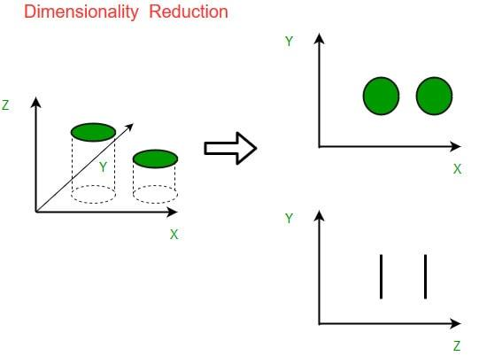

## Table of Contents

## What is dimension reduction in machine learning?

Dimension reduction in machine learning is a technique used to reduce the number of input variables in a dataset. This is important because when you have a lot of variables, it can make your models complicated and slow to train. By reducing the number of variables, you can make your models simpler and faster, while still keeping the important information in the data.

One common method for dimension reduction is called Principal Component Analysis (PCA). PCA works by finding new variables, called principal components, which are combinations of the original variables. These new variables capture the most important information in the data. For example, if you have data about people's height and weight, PCA might find a new variable that is a combination of height and weight, which explains most of the variation in the data. This way, you can use fewer variables without losing much information.

Another method is t-SNE (t-Distributed Stochastic Neighbor Embedding), which is often used for visualizing high-dimensional data. t-SNE tries to keep similar data points close together in a lower-dimensional space. This can help you see patterns in the data that might be hard to see when you have a lot of variables. Both PCA and t-SNE are useful tools for making your data easier to work with and understand.

## Why is dimension reduction important in data analysis?

Dimension reduction is important in data analysis because it helps to simplify complex datasets. When you have a lot of variables, it can be hard to understand what's going on in your data. By reducing the number of variables, you can focus on the most important information and make your analysis easier to understand. For example, if you have data about different fruits, like their color, size, weight, and sweetness, dimension reduction can help you find the key factors that matter most, like size and sweetness, and ignore less important ones like color.

Another reason dimension reduction is important is that it can make your models run faster and perform better. When you have fewer variables, your models don't have to work as hard to find patterns in the data. This can save time and computing power, which is especially helpful when you're working with big datasets. For instance, if you're trying to predict house prices based on many features like the number of rooms, the size of the yard, and the age of the house, using dimension reduction can help you focus on the most predictive features and make your model more efficient.

In addition, dimension reduction can help with data visualization. When you have a lot of variables, it's hard to plot them all on a graph. By reducing the dimensions, you can create clearer and more meaningful visualizations. For example, techniques like t-SNE can help you see clusters in your data that you might not notice otherwise. This can lead to new insights and a better understanding of your data.

## What are the common techniques used for dimension reduction?

Dimension reduction is often done using techniques like Principal Component Analysis (PCA) and t-Distributed Stochastic Neighbor Embedding (t-SNE). PCA is a popular method that helps you find new variables, called principal components, which are combinations of the original variables. These principal components capture the most important information in the data. For example, if you have data about people's height and weight, PCA might find a new variable that is a combination of height and weight, which explains most of the variation in the data. This way, you can use fewer variables without losing much information. To use PCA, you can use libraries like scikit-learn in Python with code like ```from sklearn.decomposition import PCA; pca = PCA(n_components=2); X_pca = pca.fit_transform(X)```.

Another common technique is t-SNE, which is often used for visualizing high-dimensional data. t-SNE tries to keep similar data points close together in a lower-dimensional space. This can help you see patterns in the data that might be hard to see when you have a lot of variables. For example, if you have data about different types of flowers, t-SNE can help you see clusters of similar flowers in a 2D plot. To use t-SNE, you can use libraries like scikit-learn in Python with code like ```from sklearn.manifold import TSNE; tsne = TSNE(n_components=2); X_tsne = tsne.fit_transform(X)```.

Other methods for dimension reduction include Linear Discriminant Analysis (LDA) and Independent Component Analysis (ICA). LDA is often used in classification problems and tries to find new variables that best separate different classes. ICA, on the other hand, is used to separate mixed signals into their original components. These techniques, along with PCA and t-SNE, are powerful tools that help simplify data and make it easier to analyze and understand.

## How does Principal Component Analysis (PCA) work?

Principal Component Analysis (PCA) is a way to reduce the number of variables in your data while keeping the most important information. It does this by finding new variables, called principal components, which are combinations of the original variables. The first principal component is the direction in the data that explains the most variation. The second principal component is the direction that explains the most of the remaining variation, and so on. PCA is like finding the best way to draw a line, or a plane, through your data so that it captures the most important patterns.

To use PCA, you can use a library like scikit-learn in Python. Here's how you might do it: ```from sklearn.decomposition import PCA; pca = PCA(n_components=2); X_pca = pca.fit_transform(X)```. In this code, you're telling PCA to find two new variables (principal components) that capture the most important information in your original data `X`. After running this code, `X_pca` will be a new dataset with fewer variables but still containing the key patterns from the original data. This makes your data easier to work with and can help you understand it better.

## What is the difference between PCA and t-SNE?

Principal Component Analysis (PCA) and t-Distributed Stochastic Neighbor Embedding (t-SNE) are both used for dimension reduction, but they work in different ways. PCA finds new variables, called principal components, which are combinations of the original variables. These principal components capture the most important information in the data. For example, if you have data about people's height and weight, PCA might find a new variable that is a combination of height and weight, which explains most of the variation in the data. This way, you can use fewer variables without losing much information. To use PCA, you can use a library like scikit-learn in Python with code like ```from sklearn.decomposition import PCA; pca = PCA(n_components=2); X_pca = pca.fit_transform(X)```.

t-SNE, on the other hand, focuses on keeping similar data points close together in a lower-dimensional space. It's often used for visualizing high-dimensional data because it helps you see patterns that might be hard to see otherwise. For example, if you have data about different types of flowers, t-SNE can help you see clusters of similar flowers in a 2D plot. To use t-SNE, you can use a library like scikit-learn in Python with code like ```from sklearn.manifold import TSNE; tsne = TSNE(n_components=2); X_tsne = tsne.fit_transform(X)```. While PCA is good for understanding the overall structure of the data, t-SNE is better at showing local relationships and clusters.

## Can you explain Linear Discriminant Analysis (LDA) as a dimension reduction technique?

Linear Discriminant Analysis (LDA) is a way to reduce the number of variables in your data while also trying to separate different classes or groups. Imagine you have data about different types of fruits, like apples and oranges, and you want to find the best way to tell them apart using fewer variables. LDA does this by finding new variables that make the differences between the groups as clear as possible. For example, if apples tend to be rounder and oranges tend to be more oval, LDA might find a new variable that captures this difference, making it easier to separate apples from oranges.

To use LDA, you can use a library like scikit-learn in Python. Here's how you might do it: ```from sklearn.discriminant_analysis import LinearDiscriminantAnalysis; lda = LinearDiscriminantAnalysis(n_components=1); X_lda = lda.fit_transform(X, y)```. In this code, you're telling LDA to find one new variable (or more if you change `n_components`) that best separates the different classes in your original data `X` and labels `y`. After running this code, `X_lda` will be a new dataset with fewer variables but still containing the key information needed to tell the groups apart. This can be helpful for understanding your data better and making your models simpler and faster.

## What are the advantages and disadvantages of using Autoencoders for dimension reduction?

Autoencoders are a type of [neural network](/wiki/neural-network) that can be used for dimension reduction. They work by learning how to compress data into a smaller space and then reconstruct it back to its original form. The advantage of using autoencoders is that they can capture complex, non-linear relationships in the data, which methods like PCA might miss. This makes them very useful when you have a lot of data with complicated patterns. Another advantage is that autoencoders can be easily adapted to different types of data, like images or text, by changing the network's architecture. For example, you can use a library like TensorFlow in Python to create an autoencoder with code like ```from [tensorflow](/wiki/tensorflow).keras.layers import Input, Dense; from tensorflow.keras.models import Model; input_dim = 784; encoding_dim = 32; input_layer = Input(shape=(input_dim,)); encoded = Dense(encoding_dim, activation='relu')(input_layer); decoded = Dense(input_dim, activation='sigmoid')(encoded); autoencoder = Model(input_layer, decoded);```.

However, there are some disadvantages to using autoencoders for dimension reduction. One big disadvantage is that they can be hard to train and might need a lot of data to work well. If you don't have enough data, the autoencoder might not learn the right patterns and could give you bad results. Another disadvantage is that autoencoders can be more complicated to set up and understand compared to simpler methods like PCA. You need to choose the right number of layers and neurons, and sometimes it can be tricky to get the best performance. For example, if you want to reduce the dimensions of an image dataset, you might need to experiment with different network architectures to find the one that works best.

## How do you choose the right number of dimensions to reduce to?

Choosing the right number of dimensions to reduce to depends on what you want to do with your data. If you're trying to make your data easier to understand or visualize, you might want to reduce it to just two or three dimensions. This way, you can plot the data on a graph and see patterns more easily. For example, if you're looking at data about different types of flowers, reducing to two dimensions might help you see clusters of similar flowers. To decide how many dimensions to use, you can try different numbers and see which one gives you the clearest picture of your data.

Another way to choose the number of dimensions is by looking at how much of the original information you want to keep. In Principal Component Analysis (PCA), you can use something called the cumulative explained variance ratio to help you decide. This tells you how much of the total variation in the data is captured by each principal component. You might choose to keep enough dimensions so that you capture, say, 95% of the variation. For example, if you use PCA in Python, you can check the explained variance ratio with code like ```from sklearn.decomposition import PCA; pca = PCA(); X_pca = pca.fit_transform(X); print(pca.explained_variance_ratio_.cumsum())```. This way, you can balance between keeping enough information and reducing the number of dimensions as much as possible.

## What are some practical applications of dimension reduction in real-world scenarios?

Dimension reduction is used a lot in real life to make big data easier to work with. For example, in healthcare, doctors and scientists use it to look at patient data. They might have information about a patient's age, weight, blood pressure, and many other things. By using dimension reduction, they can find the most important pieces of information that help them understand a patient's health better. This can make it easier to find patterns and make better decisions about treatments. For instance, they might use PCA to reduce the number of variables they need to look at, making it simpler to see what really matters for a patient's health.

Another place where dimension reduction is helpful is in finance. People who work with stock market data have to deal with lots of numbers, like stock prices, trading volumes, and economic indicators. By reducing the dimensions, they can focus on the key factors that affect stock prices. This can help them make better predictions about how the market will move. For example, they might use t-SNE to visualize the data in a way that shows different groups of stocks, helping them understand how different stocks behave compared to each other. This can lead to smarter investment choices and better ways to manage risk.

## How can dimension reduction help in improving model performance and reducing overfitting?

Dimension reduction helps improve model performance by making the data simpler. When you have a lot of variables, it can be hard for a model to find the important patterns. By reducing the number of variables, you help the model focus on what really matters. This can make the model run faster and work better. For example, if you're trying to predict house prices, you might have data about the number of rooms, the size of the yard, and the age of the house. By using dimension reduction, like PCA, you can find the most important factors that affect the price, like size and age, and ignore less important ones. This makes the model easier to train and can lead to better predictions.

Dimension reduction also helps reduce overfitting. Overfitting happens when a model learns the details of the training data too well, including the noise and random errors. This can make the model perform badly on new data. By reducing the number of variables, you make it harder for the model to overfit because it has less chance to learn the noise. For example, if you use t-SNE to reduce the dimensions of your data, you can see the main patterns more clearly and avoid getting caught up in the small details. This can help your model generalize better to new data, making it more reliable and useful in real-world situations.

## What are the challenges faced when applying dimension reduction techniques to high-dimensional data?

When you use dimension reduction techniques on high-dimensional data, you might run into some challenges. One big challenge is the "curse of dimensionality." This means that when you have a lot of variables, it can be hard to find the right patterns because there's so much space to search. Imagine trying to find a small object in a huge room - it's a lot harder than finding it in a small box. This can make dimension reduction techniques like PCA or t-SNE struggle to capture the important information because they have to deal with so many variables at once.

Another challenge is choosing the right number of dimensions to reduce to. If you reduce too much, you might lose important information, and if you don't reduce enough, you might not simplify the data enough to help your models. For example, if you use PCA, you need to decide how many principal components to keep. You can use the cumulative explained variance ratio to help you decide, like this: ```from sklearn.decomposition import PCA; pca = PCA(); X_pca = pca.fit_transform(X); print(pca.explained_variance_ratio_.cumsum())```. But even with this tool, it can still be tricky to find the right balance.

Lastly, high-dimensional data can also be noisy, which means it might have a lot of random errors or unimportant details. Dimension reduction techniques can sometimes have trouble telling the difference between the important patterns and the noise. This can lead to results that don't really help you understand the data better. For instance, t-SNE is good at showing local patterns but might not capture the overall structure of the data as well as PCA. So, you need to be careful and maybe try different techniques to see which one works best for your specific data.

## How do advanced techniques like UMAP and t-SNE compare in terms of preserving local and global structures?

UMAP (Uniform Manifold Approximation and Projection) and t-SNE (t-Distributed Stochastic Neighbor Embedding) are both used to reduce the dimensions of data, but they handle local and global structures differently. t-SNE is really good at keeping similar data points close together in the new, lower-dimensional space. This means it's great for showing local patterns, like clusters of data. For example, if you have data about different types of flowers, t-SNE can help you see groups of similar flowers clearly. However, t-SNE can sometimes miss the bigger picture, or the global structure of the data, because it focuses so much on the local details. To use t-SNE, you can use a library like scikit-learn in Python with code like ```from sklearn.manifold import TSNE; tsne = TSNE(n_components=2); X_tsne = tsne.fit_transform(X)```.

On the other hand, UMAP is designed to balance both local and global structures. It tries to keep similar points close together like t-SNE, but it also works to preserve the overall shape of the data. This makes UMAP useful when you want to understand both the small details and the big picture. For instance, if you're looking at data about different cities, UMAP can help you see both the neighborhoods within cities and how the cities relate to each other across the country. To use UMAP, you can use a library like umap-learn in Python with code like ```import umap; reducer = umap.UMAP(n_components=2); X_umap = reducer.fit_transform(X)```. So, while t-SNE is better for seeing local patterns, UMAP is often a better choice when you need to understand both local and global structures in your data.

## References & Further Reading

[1]: Jolliffe, I. T. (2002). ["Principal Component Analysis"](https://link.springer.com/book/10.1007/b98835). Springer.

[2]: van der Maaten, L., & Hinton, G. (2008). ["Visualizing Data using t-SNE"](https://jmlr.org/papers/v9/vandermaaten08a.html). Journal of Machine Learning Research, 9(Nov), 2579-2605.

[3]: Pedregosa, F., Varoquaux, G., Gramfort, A., Michel, V., Thirion, B., Grisel, O., ... & Duchesnay, É. (2011). ["Scikit-learn: Machine Learning in Python"](https://dl.acm.org/doi/10.5555/1953048.2078195). Journal of Machine Learning Research, 12(Oct), 2825-2830.

[4]: McInnes, L., Healy, J., & Melville, J. (2018). ["UMAP: Uniform Manifold Approximation and Projection for Dimension Reduction"](https://arxiv.org/abs/1802.03426). arXiv preprint arXiv:1802.03426.

[5]: Murphy, K. P. (2012). ["Machine Learning: A Probabilistic Perspective"](https://www.cs.ubc.ca/~murphyk/MLbook/pml-toc-1may12.pdf). MIT Press.