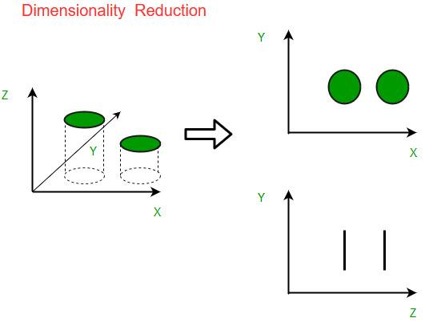

## Table of Contents

## What is dimensionality reduction and why is it important in machine learning?

Dimensionality reduction is a technique used in machine learning to reduce the number of features, or dimensions, in a dataset. Imagine you have a lot of information about something, but not all of it is useful or important. By using dimensionality reduction, you can focus on the most important parts of the data, making it easier to understand and work with. This process helps to simplify the data without losing the essential information that helps in making predictions or understanding patterns.

This technique is important in machine learning for several reasons. First, it helps to speed up the learning process because there is less data to process. When you have fewer features, the algorithms can work faster and more efficiently. Second, it can improve the performance of the models. Sometimes, having too many features can make it harder for the model to find the right patterns, a problem known as the curse of dimensionality. By reducing the dimensions, you can help the model focus on the most relevant features, leading to better results. Overall, dimensionality reduction makes machine learning more manageable and effective.

## What are the main types of dimensionality reduction techniques?

There are two main types of dimensionality reduction techniques: feature selection and feature extraction. Feature selection involves choosing a subset of the original features that are most relevant to the task at hand. This means you keep the most important pieces of information and throw away the rest. For example, if you're trying to predict house prices, you might choose to keep features like the number of bedrooms and the location, but ignore less relevant features like the color of the front door. Feature selection is straightforward because it keeps the original meaning of the data intact.

On the other hand, feature extraction involves creating new features from the original ones. This method transforms the data into a new set of dimensions that capture the most important information. A popular technique for feature extraction is Principal Component Analysis (PCA). PCA finds new dimensions, called principal components, that explain the most variance in the data. If you have data points in a high-dimensional space, PCA helps you find a lower-dimensional space where the data points are still well-represented. For example, if you have data in three dimensions, PCA might help you represent it effectively in just two dimensions. This is useful because it can simplify the data while still keeping the important patterns.

Both feature selection and feature extraction have their uses, and the choice between them depends on the specific problem you're trying to solve. Feature selection is great when you want to keep the original features and their meanings, while feature extraction is helpful when you need to transform the data into a more manageable form. Understanding these techniques can help you make your machine learning models more efficient and effective.

## How does Principal Component Analysis (PCA) work and what are its applications?

Principal Component Analysis (PCA) works by finding new dimensions, called principal components, that capture the most variation in your data. Imagine you have a bunch of points in a high-dimensional space. PCA helps you find a new way to look at these points by drawing new lines (the principal components) where the points spread out the most. The first principal component is the line that explains the most variance in the data. The second principal component is the next best line that explains the remaining variance, and so on. By using these new lines, you can represent your data in a lower-dimensional space while still keeping the important information. Mathematically, PCA involves finding the eigenvectors and eigenvalues of the data's covariance matrix, and the principal components are the eigenvectors corresponding to the largest eigenvalues.

PCA has many applications in different fields. In image processing, PCA can be used to compress images by reducing the number of dimensions needed to represent them, which is helpful for storing and transmitting images more efficiently. In finance, PCA helps in analyzing and reducing the number of variables when dealing with stock prices or other financial data, making it easier to understand market trends. In biology, PCA can be used to analyze genetic data, helping researchers find patterns and relationships between different genes or species. Overall, PCA is a powerful tool for simplifying complex data, making it easier to analyze and understand in various practical scenarios.

## Can you explain the concept of Variational Inference in the context of dimensionality reduction?

Variational Inference is a method used in machine learning to approximate complex probability distributions, and it can be applied to dimensionality reduction. Imagine you have a lot of data, and you want to understand it better by reducing its dimensions. Variational Inference helps by finding a simpler distribution that is close to the true, complex distribution of your data. It does this by optimizing a simpler model, called the variational distribution, to be as similar as possible to the true distribution. This process involves minimizing a measure called the Kullback-Leibler divergence, which tells us how different two distributions are.

In the context of dimensionality reduction, Variational Inference can be used in techniques like Variational Autoencoders (VAEs). VAEs are a type of neural network that not only reduce the dimensions of data but also learn to generate new data that looks similar to the original. They do this by learning a lower-dimensional representation of the data, called the latent space, and then using Variational Inference to approximate the distribution of this latent space. By doing so, VAEs can effectively compress data while still capturing its important features, making them useful for tasks like image generation and data denoising.

## What is Linear Discriminant Analysis (LDA) and how does it differ from PCA?

Linear Discriminant Analysis (LDA) is another technique for reducing the dimensions of data, but it works differently from PCA. LDA focuses on finding a new set of dimensions that best separate different classes or groups within the data. Imagine you have data points from different categories, like different types of flowers. LDA helps you find new lines where these different types of flowers are spread out the most, making it easier to tell them apart. This is useful when you want to classify data into different groups.

The main difference between LDA and PCA lies in their goals. PCA is about finding new dimensions that capture the most variance in the data, regardless of any class labels. It's like drawing new lines where the data points are spread out the most. On the other hand, LDA is all about finding new dimensions that maximize the separation between different classes. So, while PCA is great for simplifying data without considering class labels, LDA is perfect when you want to reduce dimensions and also make it easier to classify data into different groups.

## How do Latent Diffusion Models contribute to dimensionality reduction?

Latent Diffusion Models are a type of machine learning model that can help with dimensionality reduction. They work by learning a simpler version of the data, called the latent space, where the important features are captured in fewer dimensions. Imagine you have a lot of pictures, and you want to understand what's in them without looking at every single detail. Latent Diffusion Models can take these pictures and find a way to represent them using fewer numbers, making it easier to work with the data. They do this by slowly changing the data into this simpler form, step by step, like diffusing ink in water until it spreads out evenly.

These models are especially useful in tasks like image generation and data compression. By reducing the dimensions of the data, Latent Diffusion Models can help create new images that look similar to the original ones or compress data so it takes up less space. For example, if you have a bunch of photos, a Latent Diffusion Model can find a way to describe them using fewer numbers, and then you can use those numbers to create new photos that look like the originals. This makes them a powerful tool for understanding and working with complex data in a simpler way.

## What are Autoencoders (AE) and how do they perform dimensionality reduction?

Autoencoders (AE) are a type of neural network that can help with dimensionality reduction. They work by taking in data, like pictures or numbers, and learning to represent it in a simpler way. Imagine you have a big picture, and you want to describe it using fewer numbers. An Autoencoder does this by first squeezing the picture into a smaller form, called the latent space, and then trying to rebuild the original picture from this smaller form. By doing this, the Autoencoder learns what's most important about the data and how to capture it in fewer dimensions.

In more detail, an Autoencoder has two main parts: an encoder and a decoder. The encoder takes the original data and compresses it into the latent space, which has fewer dimensions. For example, if you start with a picture that's described by a lot of numbers, the encoder will turn it into a smaller set of numbers. The decoder then takes these smaller numbers and tries to rebuild the original picture as closely as possible. By training the Autoencoder to make the rebuilt picture as similar to the original as it can, it learns to keep the most important features of the data in the latent space. This way, Autoencoders can effectively reduce the dimensions of data while still capturing what's essential about it.

## Can you describe Independent Component Analysis (ICA) and its use cases?

Independent Component Analysis (ICA) is a technique used to separate mixed signals into their original sources. Imagine you're at a party and you hear a mix of music, people talking, and other sounds. ICA helps you figure out what each individual sound is, like separating the music from the conversations. It does this by finding components that are as statistically independent from each other as possible. In simpler terms, it looks for parts of the data that don't rely on each other, helping you understand the data better.

ICA is used in many fields. In signal processing, it's great for separating audio tracks, like pulling out different instruments from a recorded song. It's also used in neuroscience to analyze brain signals, helping researchers understand how different parts of the brain work together. For example, if you have data from multiple sensors on the brain, ICA can help you figure out which signals come from which brain activities. Overall, ICA is a powerful tool for understanding complex data by breaking it down into simpler, independent parts.

## How does Parametric UMAP differ from traditional UMAP in reducing dimensions?

Parametric UMAP (Uniform Manifold Approximation and Projection) is a version of the traditional UMAP method that adds a neural network to the process. Traditional UMAP is a way to reduce the dimensions of data by finding a new way to represent it in a lower-dimensional space, while keeping the important patterns. It does this by calculating distances between data points and trying to keep similar points close together in the new space. Parametric UMAP takes this a step further by using a neural network to learn how to make these transformations. This means it can be faster and more flexible, especially when dealing with big sets of data.

The main difference between Parametric UMAP and traditional UMAP is how they handle the transformation of data. Traditional UMAP uses a non-parametric approach, which means it doesn't use a fixed model to transform the data. Instead, it calculates the new positions of the data points directly. On the other hand, Parametric UMAP uses a neural network to learn a function that can map the high-dimensional data to a lower-dimensional space. This learned function can be applied to new data quickly, making Parametric UMAP more efficient for large datasets or when you need to process data in real-time.

## What is POLCANET and how does it approach dimensionality reduction?

POLCANET is a method for reducing the dimensions of data by using something called polynomial canonical correlation analysis. Imagine you have a lot of information, and you want to simplify it without losing what's important. POLCANET helps by finding new ways to look at your data, using polynomials to capture the relationships between different parts of the data. It's like finding a simpler way to describe a complex picture using fewer numbers.

In simple terms, POLCANET works by taking the original data and transforming it into a new set of dimensions. It does this by looking for the strongest connections between the data points, using polynomials to describe these connections. This helps to keep the most important information while making the data easier to understand and work with. By using polynomials, POLCANET can find more complex patterns in the data than some other methods, making it a powerful tool for dimensionality reduction.

## What are the challenges and limitations of using dimensionality reduction techniques?

Dimensionality reduction techniques can make data easier to work with, but they also come with challenges. One big challenge is losing important information. When you reduce the number of dimensions, you might throw away some details that are actually important for understanding the data. This can make it harder to make good predictions or find the right patterns. Another challenge is choosing the right method. There are many different ways to reduce dimensions, like PCA, LDA, or Autoencoders, and picking the best one can be tricky. It depends on what you're trying to do with your data and what kind of data you have.

Another limitation is the risk of overfitting. When you use techniques like Autoencoders or neural networks for dimensionality reduction, they might learn to represent the data too well, including the noise or random parts. This can make the model work great on the data it was trained on but not so well on new data. Also, some methods can be hard to understand. For example, when you use PCA, the new dimensions (principal components) might not have a clear meaning, making it tough to explain what they represent. Overall, while dimensionality reduction is a powerful tool, it's important to be careful and think about these challenges when using it.

## How can one evaluate the effectiveness of different dimensionality reduction methods in a machine learning pipeline?

Evaluating the effectiveness of different dimensionality reduction methods in a machine learning pipeline involves looking at how well the reduced data helps the model perform. One way to do this is by using a performance metric, like accuracy or mean squared error, to see if the model works better with the reduced data. For example, you might start with a dataset and use a method like PCA to reduce its dimensions. Then, you train your model on this reduced data and compare its performance to when it was trained on the original data. If the model performs better or at least as well with fewer dimensions, the dimensionality reduction method is effective.

Another important aspect to consider is how much information is lost during the reduction process. You can measure this using metrics like the explained variance ratio in PCA, which tells you how much of the original data's variance is captured by the new dimensions. If you're using a method like an Autoencoder, you might look at the reconstruction error, which shows how well the reduced data can be used to rebuild the original data. By comparing these metrics across different methods, you can choose the one that best balances reducing dimensions and keeping important information. This helps ensure that your machine learning pipeline is as efficient and effective as possible.