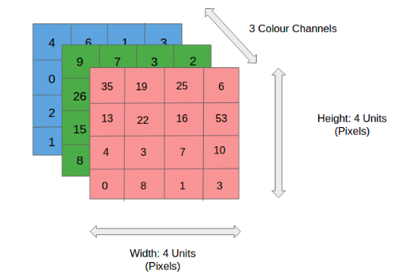

## Table of Contents

## What are dimensions in the context of machine learning?

In machine learning, dimensions refer to the number of features or variables used to describe the data. Think of each dimension as a different piece of information about an item, like the height, weight, and age of a person. When you have a lot of dimensions, you're dealing with high-dimensional data. This can make things more complicated because it's harder to see patterns and relationships in the data, but it can also give you more detailed information to work with.

For example, if you're trying to predict house prices, you might use dimensions like the number of bedrooms, the size of the house, and its location. Each of these is a dimension that helps you understand the house better. In machine learning, we often use techniques like dimensionality reduction to simplify the data and make it easier to work with, without losing too much important information. This can help improve the performance of our models and make them easier to understand.

## How do dimensions affect the performance of a machine learning model?

Dimensions, or features, in a dataset can greatly impact how well a machine learning model performs. When you have more dimensions, you're giving the model more information to work with, which can be good because it might help the model make better predictions. But, having too many dimensions can also make things harder for the model. This is because the model has to figure out which dimensions are important and which ones are not. If there are too many dimensions, the model might start to see patterns that aren't really there, a problem known as overfitting. This means the model might work well on the data it was trained on but not on new data.

To deal with this, people often use something called dimensionality reduction. This is a way to cut down the number of dimensions while keeping the most important information. Techniques like Principal Component Analysis (PCA) can help with this. By reducing the dimensions, you make the data simpler and easier for the model to understand. This can lead to better performance because the model is less likely to overfit and can focus on the most important features. So, finding the right balance of dimensions is key to making sure your machine learning model works well.

## What is the curse of dimensionality and how does it impact machine learning?

The curse of dimensionality is a problem in [machine learning](/wiki/machine-learning) where having too many dimensions, or features, makes things harder. Imagine you're trying to find a friend in a crowd. In a small group, it's easy, but in a huge crowd, it's much harder. The same thing happens with data. When you have a lot of dimensions, the data spreads out more, and it becomes harder to find patterns and relationships. This can make your machine learning model less accurate because it has to search through a much larger space to find the right answers.

This problem impacts machine learning in several ways. First, it can make your model overfit, which means it might work well on the data it was trained on but not on new data. This happens because the model starts to see patterns that aren't really there. Second, it can make your model slower because it has to deal with more data. And third, it can make it harder to understand what your model is doing because there are so many dimensions to keep track of. To deal with this, people often use techniques like dimensionality reduction, which helps to cut down the number of dimensions while keeping the most important information. This can make your model work better and be easier to understand.

## How can dimensionality reduction techniques improve machine learning models?

Dimensionality reduction techniques can make machine learning models work better by simplifying the data they use. When you have a lot of dimensions, or features, it can be hard for a model to find the important patterns because there's so much information to look through. By reducing the number of dimensions, you make it easier for the model to focus on what really matters. This can help the model learn faster and make better predictions. For example, techniques like Principal Component Analysis (PCA) can take a bunch of dimensions and turn them into a smaller set of new dimensions that capture the most important parts of the data.

Another way dimensionality reduction helps is by preventing overfitting. Overfitting happens when a model pays too much attention to the details in the training data and doesn't do well on new data. With fewer dimensions, the model is less likely to get distracted by unimportant details and more likely to find the general patterns that work for all data. This makes the model more reliable and useful in real situations. So, by using dimensionality reduction, you can make your machine learning models simpler, faster, and more accurate.

## What are some common dimensionality reduction algorithms used in machine learning?

One common dimensionality reduction algorithm is Principal Component Analysis (PCA). PCA works by finding the directions in the data where the variation is largest. These directions are called principal components. By using just a few of these principal components, you can keep most of the important information in the data but with fewer dimensions. This makes it easier for machine learning models to work with the data. For example, if you have data about people's height, weight, and age, PCA can help you find new dimensions that capture the most important parts of this information.

Another popular method is t-distributed Stochastic Neighbor Embedding (t-SNE). This algorithm is great for visualizing high-dimensional data in two or three dimensions. It works by trying to keep similar data points close together in the lower-dimensional space. t-SNE is often used to see if there are any natural groups or clusters in the data. For example, if you have data about different types of flowers, t-SNE can help you see if the flowers naturally group together based on their features.

A third method is Linear Discriminant Analysis (LDA). LDA is similar to PCA but focuses on finding dimensions that best separate different classes in the data. It's often used in classification problems where you want to tell different groups apart. For example, if you're trying to tell the difference between pictures of cats and dogs, LDA can help find the dimensions that make it easiest to separate the two groups. By using LDA, you can reduce the number of dimensions while keeping the ones that are most useful for telling the groups apart.

## How does the choice of dimensions influence feature selection in machine learning?

The choice of dimensions plays a big role in feature selection for machine learning. When you're deciding which features to use in your model, you're basically choosing which dimensions of the data are important. If you pick too many dimensions, your model might get confused and start seeing patterns that aren't really there, which can lead to overfitting. On the other hand, if you pick too few dimensions, your model might miss out on important information and not work as well as it could. So, finding the right balance of dimensions is key to making sure your model performs well.

Feature selection methods help you figure out which dimensions are the most useful. Techniques like forward selection, backward elimination, and recursive feature elimination can help you choose the best set of dimensions for your model. These methods work by testing different combinations of dimensions to see which ones give the best results. By carefully selecting the right dimensions, you can make your model simpler, faster, and more accurate. This way, you're making sure your model focuses on the most important parts of the data and ignores the rest.

## What is the role of dimensions in unsupervised learning versus supervised learning?

In supervised learning, dimensions, or features, play a crucial role in helping the model make accurate predictions. The model uses these dimensions to learn the relationship between the input data and the output labels. For example, if you're trying to predict house prices, the dimensions might include the number of bedrooms, the size of the house, and its location. The more relevant and informative the dimensions are, the better the model can learn to predict the outcome. However, having too many dimensions can lead to overfitting, where the model becomes too focused on the training data and doesn't generalize well to new data. So, choosing the right dimensions and using techniques like feature selection and dimensionality reduction is important to make sure the model performs well.

In unsupervised learning, dimensions are used to find patterns and relationships within the data without any labeled outcomes. For instance, in clustering, the model groups similar data points together based on their dimensions. If you're trying to group customers into different categories, the dimensions might include their age, income, and shopping habits. The quality and relevance of these dimensions can greatly affect how well the model can identify these groups. Techniques like Principal Component Analysis (PCA) can be used to reduce the number of dimensions while keeping the most important information, helping the model to better understand the underlying structure of the data. So, just like in supervised learning, the choice and management of dimensions are key to making unsupervised learning effective.

## How do high-dimensional spaces challenge traditional machine learning algorithms?

High-dimensional spaces can make things really hard for traditional machine learning algorithms. When you have a lot of dimensions, the data spreads out more, and it becomes harder for the algorithms to find the important patterns. This problem is called the curse of dimensionality. Imagine you're trying to find a friend in a crowd. In a small group, it's easy, but in a huge crowd, it's much harder. The same thing happens with data. When you have many dimensions, the algorithms have to search through a much larger space to find the right answers, which can make them slower and less accurate. This can lead to overfitting, where the model starts to see patterns that aren't really there, making it work well on the training data but not on new data.

To deal with these challenges, people often use techniques like dimensionality reduction to cut down the number of dimensions while keeping the most important information. Methods like Principal Component Analysis (PCA) can help with this. PCA finds the directions in the data where the variation is largest and uses these to create new, fewer dimensions that still capture the key parts of the data. By doing this, the algorithms can work with simpler data, which makes them faster and more accurate. So, managing the dimensions carefully is really important to make sure traditional machine learning algorithms can handle high-dimensional spaces well.

## What are the implications of working with high-dimensional data in terms of computational complexity?

Working with high-dimensional data can make things a lot harder for computers. When you have many dimensions, the data takes up more space in memory, and the algorithms have to do more calculations to find patterns. This can make the algorithms slower because they have to search through a much bigger space to find the right answers. For example, if you're trying to find the nearest neighbors in a dataset, the time it takes to do this can grow a lot as the number of dimensions goes up. This is because the distance between points in high-dimensional space can be harder to calculate, making the algorithms less efficient.

To deal with these problems, people often use techniques like dimensionality reduction to make the data simpler. Methods like Principal Component Analysis (PCA) can help by finding the most important parts of the data and keeping only those. This can make the algorithms faster and easier to use because they're working with fewer dimensions. For example, if you start with a dataset that has 100 dimensions but use PCA to reduce it to 10, the algorithms can run much faster and use less memory. So, managing the dimensions carefully is really important to make sure that working with high-dimensional data doesn't become too hard for computers.

## How can one evaluate the effectiveness of dimensionality reduction in a machine learning model?

To evaluate how well dimensionality reduction works in a machine learning model, you need to look at how it affects the model's performance. One way to do this is by comparing the model's accuracy before and after reducing the dimensions. If the model still makes good predictions with fewer dimensions, then the dimensionality reduction was effective. You can also use something called cross-validation to test the model on different parts of the data. If the model's performance stays about the same or gets better after reducing the dimensions, it means you've kept the most important information and made the model simpler without losing much.

Another way to check the effectiveness of dimensionality reduction is by looking at how much time and memory the model uses. If the model runs faster and uses less memory after reducing the dimensions, it's a sign that the dimensionality reduction was successful. You can also use techniques like explained variance ratio in Principal Component Analysis (PCA) to see how much of the original data's information is kept in the new dimensions. For example, if you use PCA and find that the first few principal components explain most of the variance, like $$ \text{explained variance ratio} > 0.9 $$, it means you've captured a lot of the important information with fewer dimensions. By looking at these different measures, you can get a good idea of how well dimensionality reduction has helped your machine learning model.

## What advanced techniques exist for handling high-dimensional data in deep learning?

In [deep learning](/wiki/deep-learning), one advanced technique for handling high-dimensional data is using autoencoders. Autoencoders are neural networks that learn how to efficiently compress and encode data, then decode it to reproduce the original input as closely as possible. They work by finding a smaller set of dimensions that can still capture the most important parts of the data. This helps reduce the number of dimensions while keeping the useful information. For example, if you have images with thousands of pixels, an autoencoder can learn to represent these images using fewer dimensions, making it easier for other deep learning models to work with them.

Another technique is using convolutional neural networks (CNNs) for data like images or time series. CNNs are good at handling high-dimensional data because they can automatically learn to focus on the most important features. They do this by using something called convolutional layers, which look for patterns in small parts of the data and then combine these patterns to understand the whole thing. This helps reduce the number of dimensions the model has to deal with, making it faster and more accurate. For example, if you're trying to recognize objects in pictures, a CNN can learn to pick out the key features like edges and shapes, which helps it work well even with high-dimensional image data.

## How do dimensions and manifold learning relate in the context of machine learning?

In machine learning, dimensions refer to the number of features or variables that describe the data. When you have a lot of dimensions, the data can be hard to work with because it spreads out in a high-dimensional space. This is where manifold learning comes in. Manifold learning is a type of dimensionality reduction that tries to find the underlying structure of the data, which is often thought of as a lower-dimensional manifold within the high-dimensional space. By understanding this structure, manifold learning can help reduce the number of dimensions while keeping the most important information.

One popular manifold learning technique is t-distributed Stochastic Neighbor Embedding (t-SNE). t-SNE works by trying to keep similar data points close together in a lower-dimensional space, which makes it easier to see patterns and relationships in the data. For example, if you have a dataset with many dimensions describing different types of flowers, t-SNE can help you see if the flowers naturally group together based on their features. By using manifold learning techniques like t-SNE, you can make high-dimensional data easier to work with and improve the performance of your machine learning models.

## References & Further Reading

[1]: Jolliffe, I. T. (2002). ["Principal Component Analysis."](https://link.springer.com/book/10.1007/b98835) Springer Series in Statistics.

[2]: van der Maaten, L., & Hinton, G. (2008). ["Visualizing Data using t-SNE."](https://jmlr.org/papers/v9/vandermaaten08a.html) Journal of Machine Learning Research, 9(Nov):2579-2605.

[3]: Izenman, A. J. (2008). ["Modern Multivariate Statistical Techniques: Regression, Classification, and Manifold Learning."](https://link.springer.com/book/10.1007/978-0-387-78189-1) Springer Texts in Statistics.

[4]: Bishop, C. M. (2006). ["Pattern Recognition and Machine Learning."](https://link.springer.com/book/9780387310732) Springer, New York.

[5]: Goodfellow, I., Bengio, Y., & Courville, A. (2016). ["Deep Learning."](https://link.springer.com/article/10.1007/s10710-017-9314-z) MIT Press.